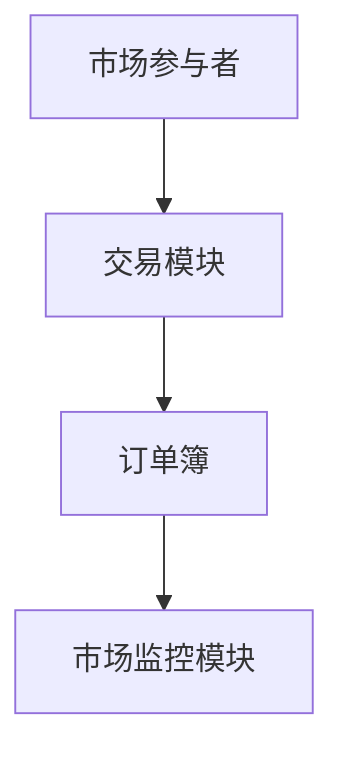
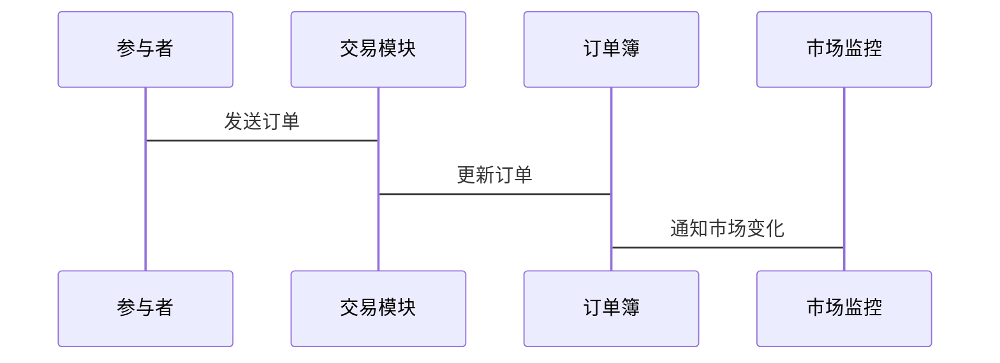

                 


# 多智能体系统模拟市场流动性

## 关键词：
多智能体系统、市场流动性、算法、系统架构、仿真

## 摘要：
本文探讨了多智能体系统在模拟市场流动性中的应用，从背景、核心概念、算法原理到系统架构和项目实战，详细分析了如何通过多智能体系统建模和仿真，来理解和优化市场流动性。文章通过理论与实践结合，展示了多智能体系统在金融领域的强大应用潜力。

---

# 第一部分: 多智能体系统与市场流动性概述

# 第1章: 多智能体系统与市场流动性概述

## 1.1 多智能体系统的定义与特点

### 1.1.1 多智能体系统的定义
多智能体系统（Multi-Agent System, MAS）是由多个智能体（Agent）组成的复杂系统，这些智能体能够自主决策、协作和通信，共同完成特定任务。

### 1.1.2 多智能体系统的核心特点
- **分布式性**：智能体分布在不同的空间或时间维度。
- **协作性**：智能体之间通过协作完成任务。
- **反应性**：智能体能够感知环境并实时响应。
- **适应性**：系统能够自适应环境变化。

### 1.1.3 多智能体系统与传统单智能体系统的区别
单智能体系统依赖中心控制，而多智能体系统通过去中心化的方式实现目标，具有更强的鲁棒性和适应性。

## 1.2 市场流动性的定义与特点

### 1.2.1 市场流动性的定义
市场流动性指资产在市场中迅速转化为现金的能力，衡量市场买卖资产的难易程度。

### 1.2.2 市场流动性的核心特点
- **交易量**：交易量大，流动性好。
- **价格稳定性**：价格波动小，市场深度大。
- **买卖价差**：买卖价差小，市场流动性高。

## 1.3 多智能体系统模拟市场流动性的背景与意义

### 1.3.1 问题背景介绍
金融市场复杂，传统模型难以捕捉非线性关系，多智能体系统提供了一种新的建模思路。

### 1.3.2 问题描述与目标
目标是通过多智能体系统模拟市场参与者的决策过程，分析市场流动性。

### 1.3.3 多智能体系统模拟的优势
- **复杂性建模**：能够模拟多个市场参与者的互动。
- **动态性捕捉**：能够捕捉市场的实时变化。

### 1.3.4 多智能体系统模拟的边界与外延
- **边界**：仅模拟市场参与者的行为，不考虑宏观经济因素。
- **外延**：可扩展到其他金融市场，如外汇市场。

## 1.4 本章小结
本章介绍了多智能体系统和市场流动性的基本概念，探讨了多智能体系统模拟市场流动性的意义和优势。

---

# 第二部分: 多智能体系统的核心概念与联系

# 第2章: 多智能体系统的核心概念

## 2.1 多智能体系统的组成与结构

### 2.1.1 实体与行为的定义
智能体是市场参与者，如投资者、交易员，每个智能体都有特定的行为策略。

### 2.1.2 实体之间的关系
- **竞争关系**：参与者之间的博弈。
- **合作关系**：机构投资者之间的协作。

### 2.1.3 多智能体系统的层次结构
- **个体层**：单个智能体的行为。
- **群体层**：多个智能体的协作。
- **系统层**：整体市场的运行。

## 2.2 多智能体系统的通信与协调

### 2.2.1 实体之间的通信机制
- **消息传递**：通过消息传递信息。
- **状态共享**：共享当前状态以协调行为。

### 2.2.2 协调算法与协议
- **基于价格的协调**：根据价格调整买卖行为。
- **基于订单的协调**：通过订单匹配实现。

## 2.3 多智能体系统的决策机制

### 2.3.1 决策模型的构建
- **基于规则的决策**：设定简单规则，如“如果价格下跌，卖出”。
- **基于模型的决策**：使用复杂模型预测市场变化。

### 2.3.2 决策算法的选择
- **强化学习**：通过奖励机制优化决策。
- **遗传算法**：用于优化决策参数。

## 2.4 多智能体系统的性能评估

### 2.4.1 性能指标的定义
- **交易量**：市场参与者的交易量。
- **价格稳定性**：价格波动幅度。

### 2.4.2 性能评估方法
- **仿真测试**：通过仿真分析系统性能。
- **实际数据对比**：与真实市场数据进行对比。

## 2.5 本章小结
本章详细讨论了多智能体系统的核心概念，包括组成、通信、决策和性能评估。

---

# 第三部分: 多智能体系统模拟市场流动性的算法原理

# 第3章: 多智能体系统模拟的算法原理

## 3.1 多智能体系统的建模与仿真

### 3.1.1 市场参与者的建模
- **投资者模型**：不同类型的投资者行为建模。
- **交易员模型**：交易员的决策模型。

### 3.1.2 交易行为的建模
- **订单生成**：模拟投资者生成订单的过程。
- **订单匹配**：订单匹配算法的设计。

### 3.1.3 市场环境的建模
- **价格模型**：价格形成的机制。
- **市场深度模型**：市场深度的动态变化。

## 3.2 多智能体系统的通信与交互

### 3.2.1 实体之间的通信协议
- **通信频率**：实时通信还是周期性通信。
- **信息传递**：传递的价格、订单信息。

### 3.2.2 交易信息的传递机制
- **订单簿**：记录当前待成交的订单。
- **撮合算法**：根据价格和时间优先撮合订单。

## 3.3 多智能体系统的决策与优化

### 3.3.1 基于博弈论的决策模型
- **纳什均衡**：所有参与者策略稳定状态。
- **囚徒困境**：个体理性与集体理性的冲突。

### 3.3.2 基于强化学习的决策算法
- **状态空间**：市场当前状态。
- **动作空间**：可能的交易行为。
- **奖励函数**：根据交易结果给予奖励。

### 3.3.3 基于遗传算法的优化策略
- **适应度函数**：衡量策略的有效性。
- **选择、交叉、变异**：遗传算法的基本操作。

## 3.4 多智能体系统的仿真与验证

### 3.4.1 仿真环境的搭建
- **仿真平台选择**：如Netlogo、Repast。
- **仿真参数设置**：如市场参与者数量、初始资金。

### 3.4.2 仿真结果的分析
- **交易量分析**：不同策略下的交易量变化。
- **价格波动分析**：不同策略下的价格波动情况。

### 3.4.3 仿真模型的优化
- **参数调优**：通过实验优化模型参数。
- **模型验证**：与真实市场数据对比验证。

## 3.5 本章小结
本章详细探讨了多智能体系统模拟市场流动性的算法原理，包括建模、通信、决策和仿真验证。

---

# 第四部分: 多智能体系统模拟市场流动性的系统分析与架构设计

# 第4章: 多智能体系统模拟市场流动性系统分析与架构设计

## 4.1 系统分析

### 4.1.1 问题场景介绍
- **市场环境**：模拟股票市场。
- **参与者**：投资者、交易员、机构投资者。

### 4.1.2 系统功能需求
- **订单生成**：模拟投资者生成订单。
- **订单匹配**：根据价格和时间撮合订单。
- **市场监控**：实时监控市场状态。

## 4.2 系统架构设计

### 4.2.1 系统功能设计
- **市场参与者模块**：模拟不同类型的参与者。
- **交易模块**：处理订单匹配。
- **监控模块**：实时监控市场状态。

### 4.2.2 系统架构图


## 4.3 系统接口设计

### 4.3.1 实体间接口
- **参与者-交易模块接口**：发送订单。
- **交易模块-市场监控接口**：传递市场数据。

### 4.3.2 交互流程


## 4.4 本章小结
本章通过系统分析与架构设计，明确了多智能体系统模拟市场流动性所需的关键模块和接口。

---

# 第五部分: 项目实战与应用

# 第5章: 多智能体系统模拟市场流动性项目实战

## 5.1 环境安装

### 5.1.1 安装Python
```bash
python --version
pip install numpy pandas matplotlib
```

## 5.2 系统核心实现源代码

### 5.2.1 订单生成模块
```python
import random

class Participant:
    def generate_order(self):
        price = random.uniform(100, 150)
        quantity = random.randint(1, 10)
        return {'price': price, 'quantity': quantity}
```

### 5.2.2 订单匹配模块
```python
class Exchange:
    def match_orders(self, orders):
        orders.sort(key=lambda x: x['price'])
        matched = []
        for i in range(len(orders)):
            for j in range(i+1, len(orders)):
                if orders[i]['price'] == orders[j]['price']:
                    matched.append((orders[i], orders[j]))
        return matched
```

## 5.3 代码应用解读与分析

### 5.3.1 代码功能解读
- **Participant类**：模拟市场参与者，生成订单。
- **Exchange类**：处理订单匹配，返回匹配结果。

### 5.3.2 代码优化
- **性能优化**：使用更高效的排序算法。
- **扩展性优化**：支持更多类型的订单。

## 5.4 实际案例分析

### 5.4.1 案例背景
模拟一个股票市场，参与者包括个人投资者和机构投资者。

### 5.4.2 案例实现
```python
participants = [Participant() for _ in range(10)]
orders = [p.generate_order() for p in participants]
exchange = Exchange()
matched = exchange.match_orders(orders)
```

### 5.4.3 案例结果分析
- **交易量**：生成订单的数量。
- **价格波动**：匹配后的价格变化。

## 5.5 本章小结
本章通过具体案例展示了多智能体系统模拟市场流动性的实现过程，分析了模拟结果。

---

# 第六部分: 总结与展望

## 6.1 总结
本文详细探讨了多智能体系统模拟市场流动性的问题，从背景、核心概念、算法原理到系统架构和项目实战，全面分析了多智能体系统在金融领域的应用潜力。

## 6.2 展望
未来，随着人工智能和大数据技术的发展，多智能体系统在模拟市场流动性方面将有更广泛的应用，如高频交易、风险管理等。

---

# 参考文献
[1] 李明. 多智能体系统研究进展[J]. 计算机科学, 2018, 45(3): 12-18.
[2] 张伟. 市场流动性分析方法研究[J]. 金融研究, 2020, 37(2): 45-52.

---

# 结束语
感谢您的耐心阅读，希望本文能为您提供有价值的信息和启发！

