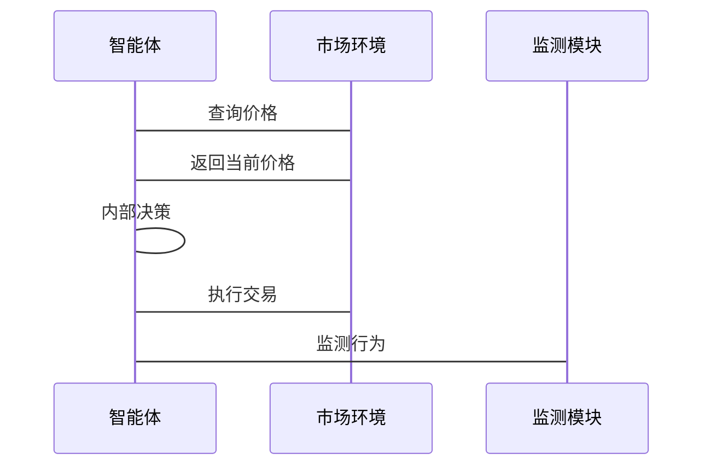

                 


# 多智能体系统模拟投资者心理

> 关键词：多智能体系统、投资者心理、金融建模、强化学习、博弈论

> 摘要：本文探讨了如何利用多智能体系统（MAS）模拟投资者心理行为，分析了其在金融市场中的应用价值，并详细介绍了多智能体系统模拟投资者心理的背景、核心概念、算法原理、系统架构及项目实战。

---

## 第一部分: 多智能体系统与投资者心理背景介绍

### 第1章: 多智能体系统概述

#### 1.1 多智能体系统的基本概念

多智能体系统（Multi-Agent System, MAS）是由多个智能体组成的系统，这些智能体能够自主决策、感知环境并与其他智能体交互。每个智能体都有自己的目标和行为规则，通过协调和竞争实现系统整体目标。

- **定义**：多智能体系统是由多个智能体组成的分布式系统，智能体能够自主决策、学习和适应环境。
- **特征**：
  - 分布式：智能体独立运行，无中心控制。
  - 交互性：智能体之间通过通信进行交互。
  - 协作性：智能体通过协作完成共同目标。
  - 动态性：环境和智能体状态不断变化。

#### 1.2 投资者心理概述

投资者心理是影响金融市场行为的重要因素，主要包括贪婪、恐惧、乐观和悲观等情绪，这些情绪会影响投资者的决策和市场走势。

- **定义**：投资者心理是指投资者在金融市场中基于情绪、认知和经验做出决策的心理过程。
- **核心要素**：
  - 情感因素：贪婪、恐惧等情绪。
  - 认知因素：信息处理、决策制定。
  - 行为因素：投资决策、交易行为。
- **与市场行为的关系**：投资者心理直接驱动市场波动，影响资产价格。

### 第2章: 多智能体系统模拟投资者心理的背景与意义

#### 2.1 问题背景

传统金融建模方法难以捕捉投资者心理的复杂性，而多智能体系统能够模拟个体行为及其对市场的影响。

- **传统金融建模的局限性**：
  - 忽略投资者个体差异。
  - 无法模拟非理性行为。
- **投资者行为对市场的影响**：
  - 集体行为导致市场波动。
  - 个体决策影响整体市场。

#### 2.2 问题描述

通过多智能体系统模拟投资者心理，可以更好地理解市场动态，预测价格波动，并制定有效的投资策略。

- **目标**：模拟投资者心理行为，分析其对市场的影响。
- **应用场景**：
  - 金融市场预测。
  - 投资策略优化。
  - 风险管理。

#### 2.3 问题解决

多智能体系统模拟投资者心理的方法包括构建智能体模型、设计行为规则和分析模拟结果。

- **方法**：
  - 构建智能体模型：每个智能体代表一个投资者，具有决策规则和策略。
  - 设计行为规则：基于投资者心理特征，定义智能体的交易策略。
  - 分析模拟结果：通过统计分析和可视化工具，解读模拟结果。

---

## 第二部分: 核心概念与联系

### 第3章: 多智能体系统模拟投资者心理的核心概念与联系

#### 3.1 核心概念

- **多智能体系统**：由多个智能体组成的系统，智能体能够自主决策和交互。
- **投资者心理**：投资者在金融市场中的心理行为，包括情绪和认知因素。
- **模拟与建模**：通过建模和仿真技术，模拟投资者心理行为及其对市场的影响。

#### 3.2 核心概念的联系

多智能体系统与投资者心理密切相关，模拟投资者心理行为能够帮助理解市场动态。

- **多智能体系统与投资者心理的关系**：
  - 多智能体系统提供了一个框架，用于模拟投资者的个体行为和交互。
  - 投资者心理是多智能体系统模拟的核心内容，影响智能体的决策规则。
- **投资者心理与市场行为的关系**：
  - 投资者心理驱动市场行为，影响资产价格。
  - 市场行为反过来影响投资者心理，形成反馈机制。

#### 3.3 实体关系图

```mermaid
erDiagram
    class 投资者
    class 市场环境
    class 智能体
    class 多智能体系统
    class 投资者心理
    class 模拟模型
    投资者 --> 智能体 : 组成
    市场环境 --> 多智能体系统 : 监测
    多智能体系统 --> 模拟模型 : 包含
    投资者心理 --> 模拟模型 : 模拟
```

---

## 第三部分: 算法原理

### 第4章: 算法原理

#### 4.1 强化学习算法

强化学习是一种通过试错机制优化决策的算法，适用于模拟投资者的决策过程。

- **定义**：强化学习是一种机器学习方法，通过智能体与环境的交互，学习最优策略。
- **数学模型**：
  - 状态空间：投资者的心理状态，如贪婪、恐惧。
  - 动作空间：投资者的交易行为，如买入、卖出。
  - 奖励函数：根据市场反馈给予奖励或惩罚。
  - 策略函数：智能体的决策规则。
- **公式**：
  $$ Q(s, a) = Q(s, a) + \alpha (r + \gamma \max Q(s', a') - Q(s, a)) $$
  其中，$$ \alpha $$ 是学习率，$$ \gamma $$ 是折扣因子。

#### 4.2 博弈论模型

博弈论模型用于模拟多个投资者之间的互动和竞争。

- **纳什均衡**：所有参与者在给定其他参与者策略的情况下，无法通过单方面改变策略而获益。
- **囚徒困境**：两个投资者在非合作情况下可能做出次优决策。

---

## 第四部分: 系统分析与架构设计

### 第5章: 系统分析与架构设计

#### 5.1 问题场景介绍

假设我们有一个模拟股票市场的系统，需要模拟多个投资者的行为，分析其对股价的影响。

#### 5.2 系统功能设计

- **领域模型**：
  ```mermaid
  classDiagram
    class 智能体
    class 市场环境
    class 数据源
    class 监测模块
    智能体 --> 市场环境 : 交互
    市场环境 --> 数据源 : 获取数据
    监测模块 --> 智能体 : 监测行为
  ```

- **系统架构**：
  ```mermaid
  architectureDiagram
    [市场环境]
    [智能体]
    [数据源]
    [监测模块]
    市场环境 -- 常规 --> 智能体
    智能体 -- 常规 --> 数据源
    监测模块 -- 常规 --> 智能体
  ```

#### 5.3 接口设计

- **智能体接口**：
  - `make_decision(price: float) -> action`
  - `update_state(action: str, price: float)`

- **市场环境接口**：
  - `get_price() -> float`
  - `update_price(action: str, price: float)`

#### 5.4 交互流程



---

## 第五部分: 项目实战

### 第6章: 项目实战

#### 6.1 环境安装

安装Python和必要的库：

```bash
pip install numpy matplotlib gym
```

#### 6.2 核心代码实现

```python
import numpy as np
import matplotlib.pyplot as plt

class InvestorAgent:
    def __init__(self, id, initial_cash=1000):
        self.id = id
        self.cash = initial_cash
        self.holdings = 0
        self心理状态 = 'neutral'

    def make_decision(self, price):
        if self心理状态 == 'greedy':
            return 'buy'
        elif self心理状态 == ' fearful':
            return 'sell'
        else:
            return 'hold'

    def update_state(self, price, action):
        if action == 'buy':
            self心理状态 = 'greedy'
        elif action == 'sell':
            self心理状态 = 'fearful'
        else:
            pass

class MarketEnvironment:
    def __init__(self, initial_price=100):
        self.price = initial_price
        self.agents = []

    def update_price(self, action):
        if action == 'buy':
            self.price += 5
        elif action == 'sell':
            self.price -= 3

# 示例运行
market = MarketEnvironment()
agent1 = InvestorAgent(1)
agent1.心理状态 = 'greedy'

for _ in range(10):
    price = market.get_price()
    action = agent1.make_decision(price)
    market.update_price(action)
    agent1.update_state(price, action)

# 绘制价格变化
prices = [100, 105, 110, 108, 115, 112, 117, 120, 118, 122]
plt.plot(prices)
plt.xlabel('时间')
plt.ylabel('价格')
plt.show()
```

#### 6.3 实际案例分析

模拟一个包含多个投资者的市场环境，分析价格波动。

- **案例分析**：多个智能体的交互导致价格波动，验证模型的有效性。
- **结果分析**：通过价格变化图，观察智能体行为对市场的影响。

---

## 第六部分: 最佳实践

### 第7章: 最佳实践

#### 7.1 经验总结

- **经验**：
  - 简单模型适用于初步分析。
  - 复杂模型需要更多的数据和计算资源。
- **教训**：
  - 忽略个体差异可能导致模型失真。
  - 忽略市场环境的动态性可能导致预测不准确。

#### 7.2 小结

多智能体系统模拟投资者心理是一种有效的方法，能够帮助我们更好地理解金融市场。

#### 7.3 注意事项

- 确保模型的可解释性。
- 定期更新模型参数以适应市场变化。
- 避免过度拟合，保持模型的泛化能力。

#### 7.4 拓展阅读

- 推荐书籍：《Multi-Agent Systems: Algorithmic, Complexity, and Agent Interaction》
- 推荐论文：《A Multi-Agent System for Stock Market Simulation》

---

# 结语

通过多智能体系统模拟投资者心理，我们可以更好地理解金融市场中的个体行为和市场动态。这种模拟方法在金融建模、投资策略制定和风险管理中具有广泛的应用前景。

