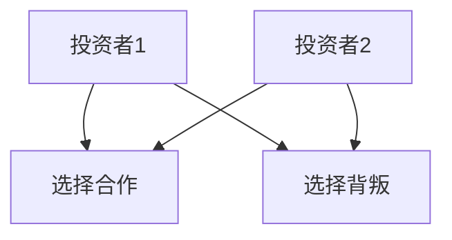
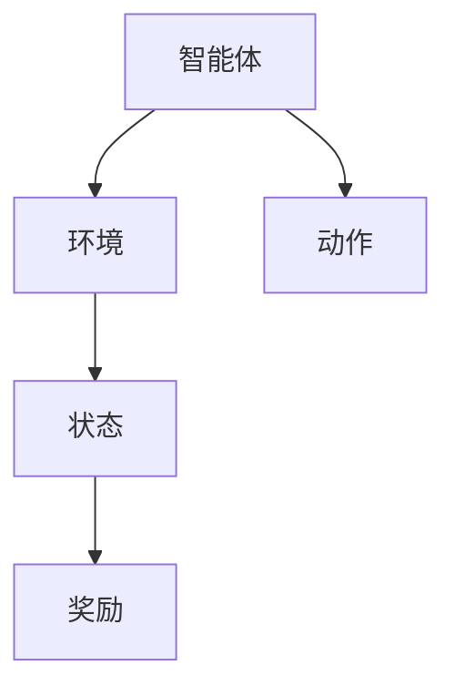
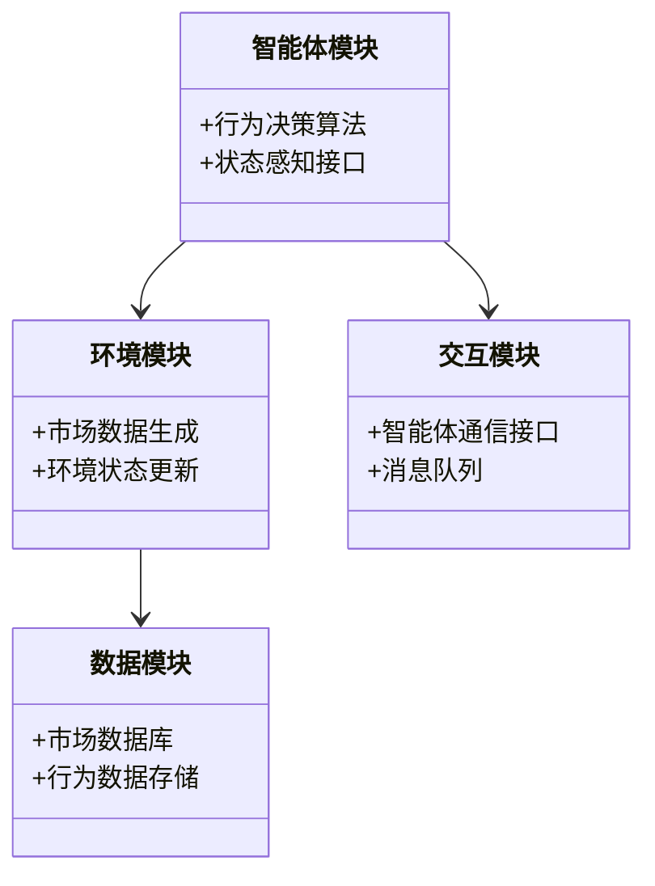

                 


# 多智能体系统模拟投资者行为

---

## 关键词  
多智能体系统, 投资者行为模拟, 强化学习, 系统架构设计, 金融建模

---

## 摘要  
在金融市场中，投资者行为的复杂性和多样性使得传统的单智能体模型难以有效模拟和分析。多智能体系统（Multi-Agent System, MAS）通过模拟多个智能体之间的交互，能够更贴近真实市场环境，为金融建模和投资决策提供更强大的支持。本文从多智能体系统的基本概念出发，结合投资者行为建模的数学模型和算法实现，详细探讨如何利用多智能体系统模拟投资者行为，并通过实际案例展示其在金融分析中的应用。本文还提供了一个完整的系统架构设计和代码实现，帮助读者从理论到实践全面掌握多智能体系统模拟投资者行为的核心技术。

---

## 正文

### 第一章：多智能体系统与投资者行为模拟概述

#### 1.1 多智能体系统的基本概念  
多智能体系统（MAS）由多个智能体（Agent）组成，这些智能体通过交互完成任务或达成目标。智能体具有以下核心特征：  
1. **自主性**：智能体能够自主决策，无需外部干预。  
2. **反应性**：智能体能够感知环境并做出实时反应。  
3. **社会性**：智能体之间可以通过通信和协作完成复杂任务。  

#### 1.2 投资者行为模拟的背景与意义  
投资者行为模拟旨在通过数学模型和算法，捕捉投资者在金融市场中的决策过程。传统的单智能体模型难以捕捉市场中的复杂互动，而多智能体系统能够模拟多个投资者之间的交互，从而更真实地反映市场动态。  

#### 1.3 多智能体系统在投资者行为模拟中的优势  
1. **复杂性建模**：能够模拟多个投资者的决策过程及其相互影响。  
2. **动态性分析**：可以实时更新市场环境，捕捉市场的瞬息万变。  
3. **多样性支持**：支持不同类型的投资者行为模式，例如基于情绪化决策或理性决策。  

---

### 第二章：投资者行为建模的核心概念  

#### 2.1 基于博弈论的投资者行为建模  
博弈论是投资者行为建模的重要工具。投资者在市场中的决策可以看作是一个博弈过程，其中每个投资者都在试图最大化自己的收益。  

**囚徒困境模型**：  
在囚徒困境中，两个投资者在面对市场波动时可能会选择合作或背叛。通过模拟这种博弈，可以分析投资者之间的信任与合作机制。  



#### 2.2 基于强化学习的行为建模  
强化学习是一种通过试错机制来优化决策的算法。投资者在市场中通过不断尝试不同的策略，逐步优化自己的决策过程。  

**强化学习模型的数学表达**：  
$$ Q(s, a) = r + \gamma \max Q(s', a') $$
其中，$Q$表示状态-动作值函数，$s$是当前状态，$a$是当前动作，$r$是奖励，$\gamma$是折扣因子。  

#### 2.3 投资者行为的分类与特征  
投资者行为可以分为以下几类：  
1. **理性投资者**：基于理性决策，追求最大收益。  
2. **情绪化投资者**：受情绪影响，可能做出非理性决策。  
3. **技术型投资者**：依赖技术分析工具进行决策。  

---

### 第三章：多智能体系统中的算法实现  

#### 3.1 基于强化学习的投资者行为模拟  
强化学习算法通过不断试错来优化投资者的决策过程。例如，可以使用Q-learning算法来模拟投资者在不同市场环境下的决策行为。  

**Q-learning算法的实现步骤**：  
1. 初始化Q表。  
2. 与环境交互，获取状态和奖励。  
3. 更新Q值：$$ Q(s, a) = Q(s, a) + \alpha (r + \gamma \max Q(s', a')) $$
4. 重复上述步骤，直到收敛。  



#### 3.2 基于遗传算法的策略优化  
遗传算法通过模拟自然选择的过程，优化投资者的策略。例如，可以将投资者的策略表示为基因序列，通过交叉和变异操作生成新的策略。  

**遗传算法的数学模型**：  
1. 初始化种群。  
2. 计算适应度：$$ f(x) = \sum_{i=1}^{n} x_i $$
3. 选择和变异。  
4. 重复迭代，直到收敛。  

---

### 第四章：系统架构与设计  

#### 4.1 系统模块划分  
多智能体系统的模块划分如下：  
1. **智能体模块**：实现投资者的行为模拟。  
2. **环境模块**：模拟金融市场环境。  
3. **交互模块**：实现智能体之间的通信与协作。  
4. **数据模块**：存储和处理市场数据。  

#### 4.2 系统架构设计  
系统架构设计采用分层架构：  
1. **数据层**：存储市场数据和投资者行为数据。  
2. **业务逻辑层**：实现投资者行为模拟的核心逻辑。  
3. **用户界面层**：提供可视化界面，展示模拟结果。  



---

### 第五章：项目实战  

#### 5.1 环境安装与配置  
1. 安装Python和相关库：numpy、pandas、matplotlib、keras。  
2. 配置金融市场数据源，例如使用Yahoo Finance API。  

#### 5.2 核心代码实现  
以下是一个基于强化学习的投资者行为模拟代码示例：  

```python
import numpy as np
import gym
from gym import spaces
from gym.utils import seeding

class TradingEnv(gym.Env):
    def __init__(self, data):
        self.data = data
        self.state = 0
        self.n_actions = 3  # 0: 买入, 1: 持有, 2: 卖出
        self.observation_space = spaces.Discrete(3)  # 当前状态：0, 1, 2
        self.action_space = spaces.Discrete(3)
        self.seed()

    def seed(self, seed=None):
        self.np_random, seed = seeding.np_random(seed)
        return seed

    def reset(self):
        self.state = 0
        return self.state

    def step(self, action):
        # 状态转换逻辑
        if action == 0:
            # 买入
            self.state = 1
        elif action == 1:
            # 持有
            self.state = 2
        else:
            # 卖出
            self.state = 0
        # 返回新的状态、奖励和终止标志
        return self.state, 0, False, {}
```

#### 5.3 案例分析与结果解读  
通过模拟不同投资者行为策略，可以分析其在不同市场环境下的表现。例如，理性投资者在稳定市场中表现优异，而情绪化投资者在市场波动中可能表现不佳。  

---

### 第六章：总结与展望  

#### 6.1 本章小结  
本文详细探讨了多智能体系统在投资者行为模拟中的应用，从理论到实践全面分析了其核心技术和实现方法。通过实际案例展示了如何利用多智能体系统模拟投资者行为，并为后续研究提供了参考。  

#### 6.2 未来展望  
未来的研究方向可以包括：  
1. 引入深度学习技术，提升投资者行为建模的精度。  
2. 研究多智能体系统在高频交易中的应用。  
3. 探讨多智能体系统的实时性和分布式计算问题。  

---

通过本文的学习，读者可以全面掌握多智能体系统模拟投资者行为的核心技术，并将其应用到实际的金融建模和投资决策中。

