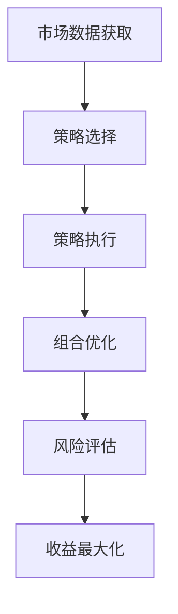
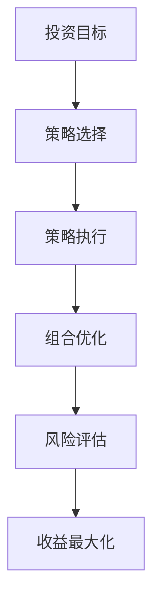

                 


# 多策略投资组合：综合运用不同投资方法

## 关键词：
多策略投资、投资组合、风险管理、收益最大化、资产配置

## 摘要：
本文详细探讨了多策略投资组合的构建方法，结合背景介绍、核心概念、算法原理、数学模型、系统架构、项目实战和最佳实践，帮助读者全面理解多策略投资的优势和实现方式。通过动量策略的案例分析，展示了如何利用Python代码实现投资组合的优化，并结合CAPM模型进行风险评估，最终实现收益最大化。

---

# {{此处是文章标题}}

## 关键词：{{此处列出文章的5-7个核心关键词}}

## 摘要：{{此处给出文章的核心内容和主题思想}}

---

## 第一部分: 多策略投资组合的背景与概念

### 第1章: 多策略投资组合的背景介绍

#### 1.1 多策略投资的基本概念
##### 1.1.1 什么是多策略投资
多策略投资是指通过组合多种不同的投资策略，利用各自的优势和互补性，优化投资组合的收益与风险比。这种方式能够有效分散风险，同时捕捉不同市场环境下的收益机会。

##### 1.1.2 多策略投资的核心要素
- **多样性**：组合多种策略以分散风险。
- **互补性**：不同策略在不同市场条件下表现各异。
- **动态调整**：根据市场变化及时优化策略组合。

##### 1.1.3 多策略投资的必要性
传统的单一策略在市场波动较大时表现不稳定，而多策略投资通过组合不同策略，能够在不同市场环境下保持较优的收益和风险表现。

#### 1.2 多策略投资的历史与发展
##### 1.2.1 投资策略的演变
从早期的单一策略到现代的多策略投资，反映了市场参与者对风险控制和收益优化的不断追求。

##### 1.2.2 多策略投资的兴起
随着金融市场的复杂化和投资者对收益稳定性的需求增加，多策略投资逐渐成为主流。

##### 1.2.3 多策略投资的现状
当前，多策略投资在机构和个人投资者中广泛应用，尤其在量化投资和算法交易领域表现突出。

#### 1.3 多策略投资的边界与外延
##### 1.3.1 多策略投资的适用场景
- 稳定的长期收益追求。
- 复杂多变的市场环境。

##### 1.3.2 多策略投资的局限性
- 策略之间的相互影响可能导致收益不稳定。
- 策略过多可能导致管理复杂性增加。

##### 1.3.3 多策略投资与其他投资方式的区别
与单一策略投资相比，多策略投资更注重策略的多样性和组合优化。

### 第2章: 多策略投资的核心概念与联系

#### 2.1 多策略投资的核心原理
##### 2.1.1 不同投资策略的特点
- **动量策略**：利用价格动量效应，选择近期表现良好的资产。
- **价值策略**：寻找被市场低估的资产，进行长期投资。

##### 2.1.2 多策略投资的组合优化
通过数学优化方法（如均值-方差优化）构建最优投资组合。

##### 2.1.3 多策略投资的风险分散机制
通过组合不同类型的策略，降低单一策略的风险敞口。

#### 2.2 多策略投资策略的对比分析
##### 2.2.1 不同投资策略的对比表格
| 策略类型 | 核心思想 | 适用场景 | 优缺点 |
|----------|----------|----------|--------|
| 动量策略 | 价格动量效应 | 牛市 | 收益高，波动大 |
| 价值策略 | 价值回归 | 熊市 | 收益稳定，波动小 |

##### 2.2.2 策略之间的相互关系
策略之间可能存在正相关或负相关关系，需通过协方差矩阵进行分析。

##### 2.2.3 策略组合的优化方法
使用现代投资组合理论（MPT）优化策略权重。

### 第3章: 多策略投资的算法原理

#### 3.1 多策略投资的算法流程
##### 3.1.1 算法流程图（Mermaid）


##### 3.1.2 动量策略的Python实现
```python
def momentum_strategy(prices, window=20):
    # 计算动量指标
    momentum = prices.shift(1).rolling(window).mean() / prices
    return momentum
```

##### 3.1.3 动量策略的数学模型
$$ \text{动量指标} = \frac{\text{过去n天的平均价格}}{\text{当前价格}} $$

---

## 第二部分: 多策略投资组合的数学模型与系统架构

### 第4章: 多策略投资的数学模型

#### 4.1 投资组合的数学公式
$$ \text{收益} = \sum_{i=1}^{n} w_i \times r_i $$
其中，\( w_i \) 是策略 \( i \) 的权重，\( r_i \) 是策略 \( i \) 的收益。

#### 4.2 现代投资组合理论（MPT）
使用均值-方差优化方法构建最优投资组合。

### 第5章: 多策略投资的系统架构设计

#### 5.1 系统架构图（Mermaid）


---

## 第三部分: 多策略投资的项目实战

### 第6章: 项目实战

#### 6.1 环境安装
安装必要的Python库，如Pandas、NumPy、Scipy等。

#### 6.2 核心代码实现
```python
import pandas as pd
import numpy as np

def calculate_sharpe_ratio(returns, risk_free_rate):
    # 计算夏普比率
    excess_returns = returns - risk_free_rate
    sharpe_ratio = excess_returns.mean() / excess_returns.std()
    return sharpe_ratio

# 示例数据
prices = pd.read_csv('stock_prices.csv')
returns = prices.pct_change().dropna()

# 计算夏普比率
sharpe = calculate_sharpe_ratio(returns, 0.01)
print(f"夏普比率: {sharpe}")
```

#### 6.3 代码解读与分析
解释代码的功能和实现逻辑，展示如何通过代码实现投资组合的优化和风险评估。

#### 6.4 实际案例分析
以动量策略为例，分析其在实际投资中的表现，并结合CAPM模型进行风险调整。

---

## 第四部分: 总结与展望

### 第7章: 总结与展望

#### 7.1 小结
多策略投资通过组合不同策略，能够在不同市场环境下实现收益与风险的优化。

#### 7.2 注意事项
- 策略选择需谨慎，避免策略之间的过度相关。
- 定期优化投资组合，适应市场变化。

#### 7.3 拓展阅读
推荐相关书籍和文献，供读者深入学习。

---

通过本文的详细讲解，读者可以全面理解多策略投资组合的构建方法，并能够在实际投资中灵活运用。

