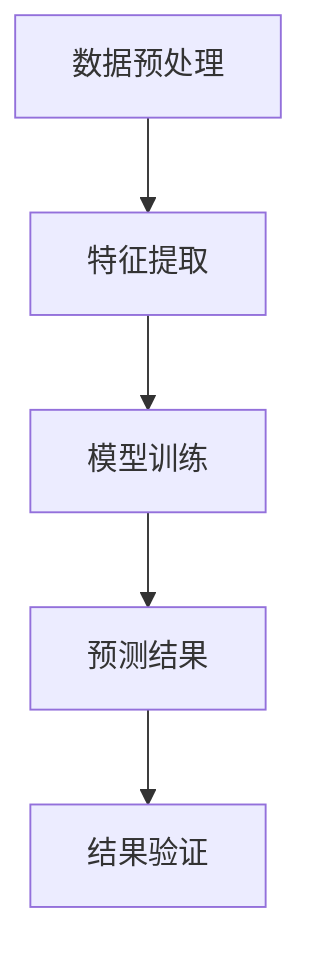
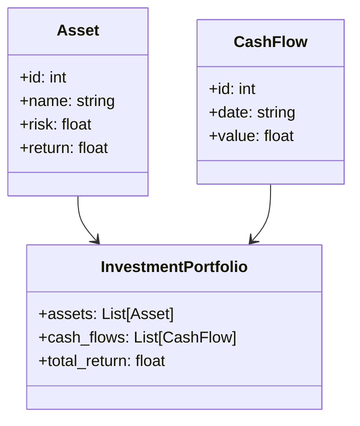
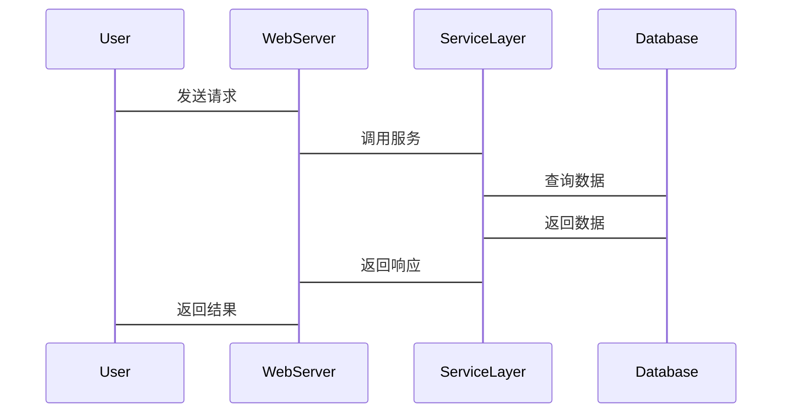

                 


# 多资产收益策略：构建稳定现金流的投资组合

## 关键词：多资产配置、现金流预测、投资组合优化、风险管理、资产分散化

## 摘要：本文详细探讨了如何通过多资产收益策略构建稳定现金流的投资组合。从多资产配置的基本原理到现金流预测的数学模型，从投资组合优化的算法实现到系统架构设计，再到项目实战案例分析，层层深入，为读者提供全面的指导。本文旨在帮助投资者在复杂多变的金融市场中，通过科学的资产配置和优化策略，实现稳定且可持续的现金流收益。

---

# 第一部分: 多资产收益策略的背景与基础

# 第1章: 多资产收益策略概述

## 1.1 多资产投资的基本概念

### 1.1.1 多资产投资的定义

多资产投资是一种通过将资金分配到多种不同资产类别（如股票、债券、房地产、 commodities 等）来实现投资目标的投资方式。与单一资产投资相比，多资产投资通过分散化来降低风险，同时追求更高的收益稳定性。

$$\text{多资产投资的核心目标是平衡风险与收益，通过分散化降低整体投资组合的波动性。}$$

### 1.1.2 多资产投资的核心目标

- **风险控制**：通过分散化投资，降低单一资产价格波动对整体投资组合的影响。
- **收益增强**：通过配置不同资产类别，捕捉不同市场的收益机会。
- **稳定性增强**：通过构建稳定现金流，确保投资组合在不同经济周期中的表现。

### 1.1.3 稳定现金流的重要性

现金流是投资收益的最终体现。稳定的现金流意味着投资组合在不同市场环境下都能提供稳定的回报，从而增强投资者的信心和投资的可持续性。

---

## 1.2 多资产收益策略的背景

### 1.2.1 传统投资方式的局限性

- **单一资产风险高**：将所有资金投入单一资产（如股票）可能导致收益波动大，风险集中。
- **市场周期性影响**：单一资产在经济周期波动中表现不稳定，难以应对不同市场环境。
- **缺乏分散化**：无法通过不同资产类别分散风险，容易受到某一市场的冲击。

### 1.2.2 多资产配置的优势

- **分散化降低风险**：通过配置不同资产类别，降低单一资产价格波动的影响。
- **捕捉多元收益机会**：在不同市场环境下，不同资产类别可能有不同的收益表现。
- **增强收益稳定性**：通过多元配置，平滑投资组合的收益波动，实现更稳定的现金流。

### 1.2.3 现代金融市场的复杂性

现代金融市场环境复杂多变，单一资产难以应对各种市场波动。通过多资产配置，投资者可以更好地应对经济周期变化、通货膨胀、市场波动等多重挑战。

---

## 1.3 现金流与投资组合的关系

### 1.3.1 现金流的定义与特征

现金流是指企业在一定时期内通过经营活动、投资活动和筹资活动所获得的现金流入和流出。在投资组合中，现金流是投资收益的直接体现，稳定的现金流意味着投资组合具有较强的收益能力和风险承受能力。

### 1.3.2 现金流在投资组合中的作用

- **收益来源**：现金流是投资组合收益的主要来源。
- **风险管理**：稳定的现金流有助于降低投资组合的整体风险。
- **投资决策依据**：现金流预测是资产配置和投资组合优化的重要依据。

### 1.3.3 稳定现金流的构建原则

- **分散化原则**：通过配置不同资产类别，降低现金流波动性。
- **风险收益平衡原则**：在追求收益的同时，注重风险控制。
- **动态调整原则**：根据市场变化和投资目标，定期调整资产配置。

---

## 1.4 本章小结

本章主要介绍了多资产收益策略的基本概念、核心目标以及稳定现金流的重要性。通过多资产配置，投资者可以降低风险、增强收益稳定性，并更好地应对复杂多变的金融市场环境。

---

# 第二部分: 多资产配置的理论与方法

# 第2章: 多资产配置的原理

## 2.1 多资产配置的核心要素

### 2.1.1 资产类别划分

资产类别是多资产配置的基础。常见的资产类别包括：

- **股票**：包括国内股票和国际股票。
- **债券**：包括政府债券和公司债券。
- **房地产**：包括商业地产和住宅地产。
- **commodities**：包括黄金、原油等大宗商品。

### 2.1.2 资产风险收益特征

每种资产类别都有其独特的风险收益特征。例如，股票的风险较高，但长期收益潜力大；债券的风险较低，但收益相对稳定。

| 资产类别 | 风险 | 收益 |
|----------|------|------|
| 股票     | 高   | 高   |
| 债券     | 中   | 稳定 |
| 房地产   | 中   | 较高 |
| 大宗商品 | 高   | 较高 |

### 2.1.3 资产配置比例

资产配置比例是根据投资者的风险承受能力、收益目标和市场环境来确定的。例如，一个保守型投资者可能会选择更多的债券和现金，而一个激进型投资者可能会选择更多的股票和房地产。

---

## 2.2 现金流预测与资产选择

### 2.2.1 现金流预测的步骤

现金流预测是多资产配置的重要环节。以下是现金流预测的主要步骤：

1. **数据收集**：收集历史现金流数据和市场数据。
2. **模型选择**：选择适合的现金流预测模型，如时间序列分析或机器学习模型。
3. **参数估计**：根据历史数据估计模型参数。
4. **预测与验证**：进行预测并验证模型的准确性。

### 2.2.2 资产选择的数学模型

现金流预测的数学模型可以通过回归分析来实现。例如，使用线性回归模型预测股票的现金流：

$$ \text{CashFlow}_t = \beta_0 + \beta_1 \times \text{MarketReturn}_t + \epsilon_t $$

其中，$\beta_0$ 是截距，$\beta_1$ 是市场回报的回归系数，$\epsilon_t$ 是误差项。

### 2.2.3 现金流波动性分析

现金流的波动性可以通过标准差或波动率来衡量。波动率越高，现金流的不确定性越大。

---

## 2.3 资产配置的分散化原理

### 2.3.1 分散化的基本概念

分散化是指通过配置不同资产类别来降低投资组合的整体风险。分散化的效果可以通过减少资产之间的相关性来实现。

### 2.3.2 分散化对现金流稳定性的影响

分散化可以降低投资组合的波动性，从而提高现金流的稳定性。例如，将资金分配到股票和债券，可以平滑市场波动对现金流的影响。

### 2.3.3 分散化与风险收益平衡

通过分散化，投资者可以在承受一定风险的同时，获得更高的收益。例如，配置股票和债券可以在市场波动时提供更稳定的现金流。

---

## 2.4 本章小结

本章详细介绍了多资产配置的核心要素、现金流预测的步骤以及分散化原理。通过科学的资产配置，投资者可以实现风险与收益的平衡，构建稳定的现金流。

---

# 第三部分: 多资产收益策略的数学模型与算法

# 第3章: 现金流预测的数学模型

## 3.1 现金流预测的基本方法

### 3.1.1 时间序列分析

时间序列分析是一种常用的现金流预测方法。以下是时间序列分析的主要步骤：

1. **数据预处理**：对历史数据进行清洗和变换。
2. **模型选择**：选择适合的时间序列模型，如ARIMA或Prophet。
3. **模型训练**：根据历史数据训练模型。
4. **预测与验证**：进行预测并验证模型的准确性。

### 3.1.2 预测模型的选择

预测模型的选择取决于数据特征和预测目标。例如，对于非平稳数据，可以使用ARIMA模型；对于复杂数据，可以使用机器学习模型。

### 3.1.3 数据特征提取

数据特征提取是提高预测准确性的重要步骤。例如，可以提取历史平均值、标准差等特征。

---

## 3.2 现金流预测的数学公式

### 3.2.1 线性回归模型

线性回归模型是常用的现金流预测模型。公式如下：

$$ y = \beta_0 + \beta_1 x + \epsilon $$

其中，$y$ 是目标变量（现金流），$x$ 是自变量（市场回报），$\beta_0$ 和 $\beta_1$ 是回归系数，$\epsilon$ 是误差项。

### 3.2.2 自回归模型

自回归模型（AR模型）适用于时间序列数据。公式如下：

$$ y_t = \beta_0 + \beta_1 y_{t-1} + \epsilon_t $$

### 3.2.3 考虑外部因素的预测模型

考虑外部因素的预测模型可以通过引入额外的变量来提高预测准确性。例如，可以引入宏观经济指标（如GDP增长率、通货膨胀率）进行预测。

---

## 3.3 现金流预测的算法实现

### 3.3.1 算法流程图

以下是现金流预测的算法流程图：



### 3.3.2 代码实现

以下是Python代码示例：

```python
import pandas as pd
from sklearn.linear_model import LinearRegression

# 数据预处理
data = pd.read_csv('cash_flow.csv')
X = data[['market_return', 'gdp_growth']]
y = data['cash_flow']

# 模型训练
model = LinearRegression()
model.fit(X, y)

# 预测结果
predicted_cash_flow = model.predict(X)
```

---

## 3.4 本章小结

本章详细介绍了现金流预测的基本方法、数学公式和算法实现。通过科学的预测模型，投资者可以更好地进行资产配置和投资组合优化。

---

# 第四部分: 系统分析与架构设计

# 第4章: 投资组合优化的系统架构

## 4.1 问题场景介绍

投资组合优化是一个复杂的系统工程。以下是系统设计的主要步骤：

1. **问题场景分析**：明确投资目标和约束条件。
2. **系统功能设计**：设计系统的主要功能模块。
3. **系统架构设计**：设计系统的整体架构。
4. **系统接口设计**：设计系统与其他系统的接口。
5. **系统交互设计**：设计系统与用户的交互流程。

---

## 4.2 系统功能设计

### 4.2.1 领域模型设计

以下是领域模型的类图：



### 4.2.2 系统架构设计

以下是系统的整体架构图：


### 4.2.3 系统交互设计

以下是系统的交互流程图：



---

## 4.3 本章小结

本章详细介绍了投资组合优化的系统架构设计，包括领域模型、系统架构和系统交互设计。通过科学的系统设计，投资者可以更好地实现投资目标。

---

# 第五部分: 项目实战

# 第5章: 多资产收益策略的项目实战

## 5.1 环境安装

以下是项目实战所需的环境安装步骤：

1. **安装Python**：建议使用Python 3.8及以上版本。
2. **安装依赖库**：运行以下命令安装所需库：

```bash
pip install pandas numpy scikit-learn
```

## 5.2 核心代码实现

### 5.2.1 数据预处理

```python
import pandas as pd

# 读取数据
data = pd.read_csv('assets.csv')

# 数据清洗
data = data.dropna()

# 数据标准化
data = (data - data.mean()) / data.std()
```

### 5.2.2 投资组合优化

```python
from sklearn.linear_model import LinearRegression

# 训练模型
model = LinearRegression()
model.fit(X, y)

# 预测结果
predicted_return = model.predict(X)
```

### 5.2.3 系统交互设计

以下是系统的交互流程图：


---

## 5.3 案例分析

### 5.3.1 案例背景

假设我们有三个资产：股票、债券和房地产。我们需要通过多资产配置实现稳定的现金流。

### 5.3.2 案例分析

以下是资产配置比例的优化过程：

1. **确定资产类别**：股票、债券、房地产。
2. **计算风险收益特征**：股票风险高，收益潜力大；债券风险低，收益稳定；房地产风险中等，收益潜力中等。
3. **确定配置比例**：根据投资者风险承受能力和收益目标，确定股票30%、债券40%、房地产30%。

### 5.3.3 案例小结

通过科学的资产配置，投资者可以在承受一定风险的同时，获得更稳定的现金流。

---

## 5.4 本章小结

本章通过项目实战，详细介绍了多资产收益策略的实现过程，包括环境安装、核心代码实现和案例分析。通过实际操作，读者可以更好地理解多资产收益策略的核心思想。

---

# 第六部分: 总结与展望

## 6.1 本章总结

本文详细探讨了多资产收益策略的构建方法，从理论到实践，为读者提供了全面的指导。通过科学的资产配置和优化策略，投资者可以实现稳定且可持续的现金流收益。

## 6.2 未来展望

未来，随着人工智能和大数据技术的不断发展，多资产收益策略将更加智能化和个性化。投资者可以通过机器学习模型实现更精准的现金流预测和资产配置，从而更好地应对复杂多变的金融市场环境。

---

# 结语

通过本文的详细介绍，读者可以全面了解多资产收益策略的核心思想和实现方法。希望本文能够为投资者提供有价值的参考，帮助他们在复杂的金融市场中实现稳定收益。

