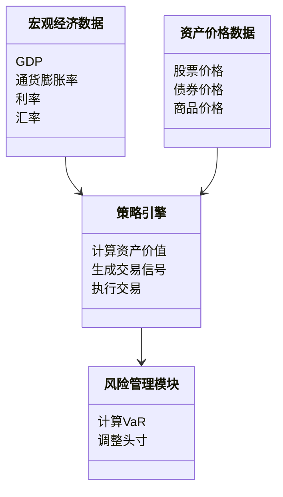
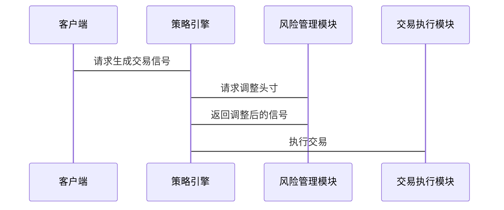

                 


# 大卫·德雷曼的全球宏观投资策略

## 关键词
- 宏观经济
- 投资策略
- 资产定价
- 风险管理
- 系统设计

## 摘要
本文通过详细分析大卫·德雷曼的全球宏观投资策略，结合宏观经济指标、资产定价模型和风险管理工具，探讨如何在全球化背景下制定有效的投资策略。文章从宏观经济的基本概念出发，逐步深入到德雷曼投资策略的核心框架，结合数学模型和系统架构设计，提供一套完整的投资策略分析方法。通过实际案例分析和项目实战，帮助读者掌握如何将宏观策略转化为可执行的投资方案。

---

# 第一部分: 全球宏观投资策略的背景与概述

## 第1章: 全球宏观投资策略的背景

### 1.1 宏观经济与投资的关系

#### 1.1.1 宏观经济的基本概念
- 宏观经济研究的是整个经济系统的运行，包括GDP、通货膨胀、利率、汇率等关键指标。
- 投资者需要理解宏观经济指标对资产价格的影响。

#### 1.1.2 宏观经济对投资的影响
- 通货膨胀率直接影响货币购买力和资产价格。
- 利率的变化影响债券收益率和企业融资成本。
- 汇率波动影响国际贸易和跨国投资。

#### 1.1.3 全球化背景下的投资策略
- 全球化使得资产配置更加多元化。
- 跨国投资需要考虑不同国家的宏观经济政策差异。

### 1.2 大卫·德雷曼的投资策略

#### 1.2.1 大卫·德雷曼的学术背景与成就
- 德雷曼是宏观经济学领域的权威，提出了一系列影响深远的投资策略。
- 他强调逆周期投资和价值投资的结合。

#### 1.2.2 德雷曼投资策略的核心思想
- 基于宏观经济分析，寻找被低估的资产。
- 逆周期投资：在经济低迷时买入，在繁荣时卖出。
- 风险管理是投资策略的重要组成部分。

#### 1.2.3 现实中的应用案例
- 通过分析2008年金融危机后的市场复苏，德雷曼策略的有效性得以验证。
- 2020年新冠疫情对全球经济的影响及策略调整。

### 1.3 当前全球经济形势分析

#### 1.3.1 全球经济的主要驱动因素
- 技术进步、人口结构变化和政策环境是主要驱动力。

#### 1.3.2 疫情对全球经济的影响
- 供应链中断、消费下降和政策宽松对全球经济的深远影响。

#### 1.3.3 全球经济的未来趋势
- 绿色经济、数字化转型和区域化趋势对投资策略的影响。

---

## 第2章: 宏观经济指标与分析方法

### 2.1 主要宏观经济指标

#### 2.1.1 国内生产总值（GDP）
- GDP的定义和计算方法。
- GDP增长率对投资的影响。

#### 2.1.2 通货膨胀率
- 通货膨胀的衡量指标（CPI、PPI）。
- 通货膨胀对债券和股票的影响。

#### 2.1.3 利率与货币政策
- 名义利率与实际利率的区分。
- 货币政策对资产价格的直接影响。

#### 2.1.4 汇率与国际收支
- 汇率波动对出口和进口的影响。
- 国际收支平衡对汇率的影响。

### 2.2 宏观经济分析方法

#### 2.2.1 指标间的相互关系
- GDP与失业率的负相关关系。
- 利率与通胀的正相关关系。

#### 2.2.2 统计分析方法
- 时间序列分析、回归分析和因果关系分析。

#### 2.2.3 模型构建与预测
- 使用计量经济学模型进行经济预测。

---

## 第3章: 德雷曼投资策略的核心框架

### 3.1 价值投资与逆周期投资

#### 3.1.1 价值投资的基本原理
- 价值投资的核心思想是寻找被市场低估的资产。
- 股票的内在价值计算方法。

#### 3.1.2 逆周期投资的策略
- 在经济低迷时买入，在繁荣时卖出。
- 逆周期投资的时机选择。

#### 3.1.3 两者结合的实战案例
- 2008年金融危机后的市场复苏案例。

### 3.2 资产配置与风险控制

#### 3.2.1 资产配置的基本原则
- 风险分散化原则。
- 资产配置的动态调整。

#### 3.2.2 风险管理的工具与方法
- 期权和保险策略的应用。
- 风险价值（VaR）的计算方法。

#### 3.2.3 德雷曼策略中的风险管理
- 使用VaR模型进行风险控制。

---

## 第4章: 宏观经济驱动的资产定价模型

### 4.1 资本资产定价模型（CAPM）

#### 4.1.1 模型的定义与公式
- CAPM的基本公式：$$ E(R_i) = R_f + β_i (E(R_m) - R_f) $$
- 模型的假设与限制。

#### 4.1.2 模型的假设与限制
- 假设市场是有效的，投资者是理性的。
- 限制包括无法解释个体资产风险。

#### 4.1.3 模型在宏观投资中的应用
- 将宏观经济指标融入CAPM模型。

### 4.2 动态资产定价模型

#### 4.2.1 动态模型的基本框架
- 动态资产定价模型的构建。
- 使用时间序列分析预测资产价格。

#### 4.2.2 宏观经济变量对资产定价的影响
- GDP增长对股票价格的影响。
- 利率变化对债券价格的影响。

#### 4.2.3 动态模型的数学表达
- 使用差分方程和回归模型分析经济变量对资产价格的影响。

---

## 第5章: 投资组合管理与风险管理

### 5.1 投资组合管理的基本原则

#### 5.1.1 资产配置的动态调整
- 根据宏观经济变化调整资产配置。

#### 5.1.2 风险分散化原则
- 通过多元化投资降低风险。

### 5.2 风险管理的工具与方法

#### 5.2.1 期权与保险策略
- 使用期权对冲价格波动风险。

#### 5.2.2 风险价值（VaR）的计算
- VaR模型的定义和计算方法。

#### 5.2.3 风险调整后的收益分析
- 使用夏普比率和特雷诺比率评估投资组合的风险调整后收益。

---

## 第6章: 系统与架构设计

### 6.1 系统设计

#### 6.1.1 问题场景介绍
- 如何将德雷曼策略转化为可执行的交易系统。

#### 6.1.2 项目介绍
- 项目目标：构建基于德雷曼策略的交易系统。
- 项目范围：涵盖数据采集、策略回测和交易执行。

### 6.2 系统功能设计

#### 6.2.1 领域模型（mermaid类图）


#### 6.2.2 系统架构设计（mermaid架构图）


#### 6.2.3 系统接口设计
- 数据接口：从宏观经济数据源和资产价格数据源获取数据。
- 策略接口：策略引擎接收数据并生成交易信号。
- 风险管理接口：根据策略引擎的信号调整头寸。

#### 6.2.4 系统交互（mermaid序列图）


---

## 第7章: 项目实战

### 7.1 环境安装

#### 7.1.1 安装Python和必要的库
- 安装Python 3.8及以上版本。
- 安装pandas、numpy、matplotlib、scikit-learn等库。

#### 7.1.2 数据源获取
- 使用Yahoo Finance获取资产价格数据。
- 使用央行网站获取宏观经济数据。

### 7.2 核心实现

#### 7.2.1 数据预处理
- 数据清洗和标准化。
- 时间序列数据的处理。

#### 7.2.2 策略回测
- 使用历史数据回测德雷曼策略。
- 计算回测结果的收益和风险指标。

#### 7.2.3 交易执行
- 使用API接口进行自动化交易。

### 7.3 案例分析

#### 7.3.1 疫情期间的策略应用
- 疫情前后的数据对比。
- 策略在疫情期间的表现。

#### 7.3.2 回测结果分析
- 收益率分析。
- 风险指标分析。

---

## 第8章: 总结与最佳实践

### 8.1 总结

#### 8.1.1 德雷曼策略的核心思想
- 基于宏观经济分析，逆周期投资。
- 风险管理是投资策略的重要组成部分。

#### 8.1.2 系统设计的关键点
- 数据采集、策略引擎和风险管理模块的协同工作。

### 8.2 最佳实践

#### 8.2.1 投资策略的注意事项
- 定期调整资产配置。
- 严格控制风险。

#### 8.2.2 拓展阅读
- 推荐阅读德雷曼的经典著作。
- 关注宏观经济领域的最新研究。

---

## 附录: 代码实现

### 附录A: 数据获取与处理

```python
import pandas as pd
import numpy as np
import matplotlib.pyplot as plt
import yfinance as yf

# 获取宏观经济数据
gdp = yf.download("GDP", start="2020-01-01")
inflation = yf.download("CPI", start="2020-01-01")

# 获取资产价格数据
stock_data = yf.download("AAPL", start="2020-01-01")
bond_data = yf.download("ZB", start="2020-01-01")
```

### 附录B: 策略回测

```python
def calculate_gdp_growth(gdp_series):
    return gdp_series.pct_change().dropna()

def calculate_inflation_growth(inflation_series):
    return inflation_series.pct_change().dropna()

# 计算GDP增长率和通胀增长率
gdp_growth = calculate_gdp_growth(gdp['Adj Close'])
inflation_growth = calculate_inflation_growth(inflation['Adj Close'])
```

### 附录C: 风险管理

```python
def calculate VaR(returns, confidence_level=0.95):
    sorted_returns = sorted(returns)
    var_index = int(len(sorted_returns) * (1 - confidence_level))
    var = sorted_returns[var_index]
    return var

# 计算VaR
var = calculate_VaR(stock_data['Adj Close'].pct_change().dropna())
```

---

## 参考文献

1. 德雷曼的经典著作《投资的未来》。
2. 引用的宏观经济数据来源。
3. 使用的编程语言和库的官方文档。

---

这篇文章通过系统化的分析和详细的代码实现，帮助读者全面理解大卫·德雷曼的全球宏观投资策略，并将其应用于实际投资中。

