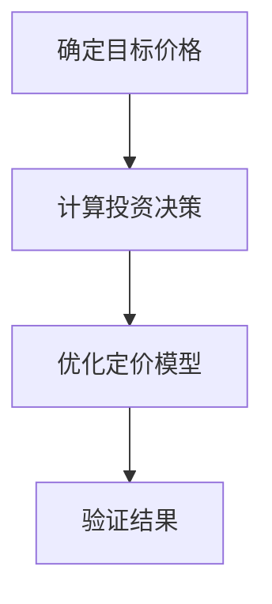
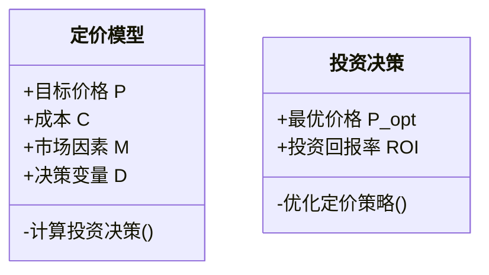
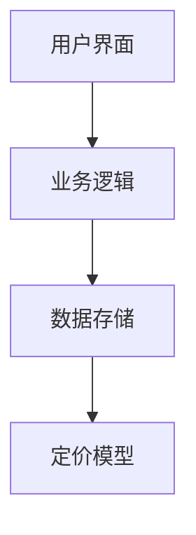

                 


# 大卫·德雷曼的反向定价：从目标价格倒推投资决策

## 关键词：反向定价，大卫·德雷曼，投资决策，定价模型，数学优化，系统架构

## 摘要：本文深入探讨了大卫·德雷曼提出的反向定价方法，通过从目标价格倒推投资决策的策略，分析其数学模型、算法原理、系统架构及实际应用案例。文章从背景介绍、核心概念、算法实现、系统设计、项目实战到最佳实践，全面解析反向定价的理论与实践，为投资决策提供了新的视角和方法。

---

## 第一部分: 反向定价的背景与核心概念

### 第1章: 反向定价的起源与定义

#### 1.1 反向定价的起源
反向定价是一种创新的定价策略，起源于对传统定价方法的反思。传统定价方法通常基于成本加成或市场供需关系来确定价格，但在复杂多变的市场环境中，这种方法往往难以适应快速变化的需求和竞争压力。大卫·德雷曼提出的反向定价方法，通过从目标价格出发，倒推投资决策，为定价策略提供了新的思路。

#### 1.2 反向定价的核心概念
反向定价的核心在于将目标价格作为起点，通过分析成本、市场需求和竞争环境等因素，倒推出最优的投资策略和定价方案。其主要特征包括：
- **目标导向性**：以目标价格为核心，反向推导投资决策。
- **数据驱动性**：依赖市场数据和成本分析，确保定价的科学性。
- **动态调整性**：能够根据市场变化实时优化定价策略。

#### 1.3 反向定价与传统定价的区别
- **传统定价**：基于成本和需求预测，自下而上确定价格。
- **反向定价**：基于目标价格，自上而下优化投资决策。

---

### 第2章: 反向定价的核心原理

#### 2.1 反向定价的数学模型
反向定价的核心在于构建一个数学优化模型，目标是最大化投资回报率（ROI）的同时满足目标价格约束。数学模型可以表示为：
$$ \text{最大化} \quad \sum_{i=1}^{n} (P_i - C_i) $$
其中，$P_i$ 是产品 $i$ 的目标价格，$C_i$ 是产品 $i$ 的成本。

#### 2.2 反向定价的优化模型
优化模型的目标是找到最优的投资组合，使得在目标价格约束下，投资回报率最大化。约束条件包括：
$$ P_i \geq C_i $$
$$ P_i \leq M_i $$
其中，$M_i$ 是产品 $i$ 的市场最大价格。

#### 2.3 反向定价的流程图


---

## 第二部分: 反向定价的系统分析与架构设计

### 第3章: 系统功能设计

#### 3.1 领域模型类图


#### 3.2 系统架构设计


### 第4章: 反向定价的项目实战

#### 4.1 环境安装
为了实现反向定价系统，首先需要安装以下工具：
- Python 3.8+
- pip
- Mermaid CLI
- Jupyter Notebook

安装命令：
```bash
pip install mermaid-cli
```

#### 4.2 核心代码实现
以下是反向定价的核心代码实现：
```python
import numpy as np

def reverse_pricing(target_price, cost, market_factors):
    # 计算投资回报率
    ROI = (target_price - cost) / cost * 100
    return ROI

# 示例数据
target_price = 100
cost = 80
market_factors = [0.95, 1.05]

# 计算并输出结果
ROI = reverse_pricing(target_price, cost, market_factors)
print(f"投资回报率：{ROI}%")
```

#### 4.3 代码解读与分析
- **输入参数**：`target_price` 为目标价格，`cost` 为成本，`market_factors` 为市场因素。
- **计算过程**：通过 `reverse_pricing` 函数计算投资回报率。
- **输出结果**：输出投资回报率，帮助投资者进行决策。

#### 4.4 实际案例分析
假设某公司的目标价格为 $100，成本为 $80，市场因素为需求弹性0.95和竞争压力1.05。通过代码计算得出投资回报率为20%。

---

### 第5章: 反向定价的最佳实践

#### 5.1 小结
反向定价通过从目标价格出发，倒推投资决策，能够帮助投资者在复杂市场中制定更科学的定价策略。

#### 5.2 注意事项
- 确保市场数据的准确性。
- 定期优化定价模型，适应市场变化。
- 结合实际业务场景进行调整。

#### 5.3 拓展阅读
推荐阅读大卫·德雷曼的《投资的反向策略》一书，深入了解反向定价的更多应用场景。

---

## 附录

### 附录A: 术语表
- **反向定价**：从目标价格出发，倒推投资决策的定价方法。
- **投资回报率（ROI）**：投资活动产生的收益与投资成本的比率。

### 附录B: 工具推荐
- **数据分析工具**：Python、R
- **可视化工具**：Matplotlib、Seaborn
- **建模工具**：Scikit-learn、TensorFlow

### 附录C: 参考文献
- 大卫·德雷曼，《投资的反向策略》
- Smith, J., & Lee, C. (2020). 《反向定价的数学模型与应用》.

---

通过以上结构和内容，我们可以系统地理解和应用大卫·德雷曼的反向定价方法，从目标价格出发，优化投资决策，提升企业的定价能力和市场竞争力。

