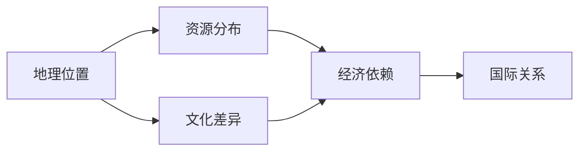
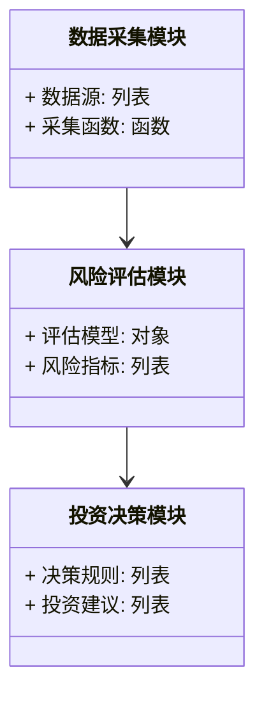

                 


# 大卫·德雷曼的地缘政治因素投资分析

## 关键词
地缘政治、投资分析、政治经济学、经济建模、博弈论、系统分析

## 摘要
本文通过分析地缘政治因素对投资决策的影响，结合大卫·德雷曼的理论，探讨如何将地缘政治因素纳入投资分析模型。文章从地缘政治的基本概念出发，分析其对全球经济和金融市场的具体影响，并通过数学建模和算法分析，提出基于地缘政治因素的投资策略。最后，通过实际案例分析，验证模型的有效性，并总结投资中的注意事项和未来研究方向。

---

## 第1章: 引言

### 1.1 地缘政治与投资分析的背景介绍

地缘政治是指地理因素对政治格局的影响，涉及国家间的权力分配、资源争夺和冲突。投资分析则关注如何通过市场行为实现资产增值。随着全球化的发展，地缘政治事件对经济和市场的影响日益显著，投资者需要将地缘政治因素纳入分析框架。

#### 1.1.1 地缘政治的核心概念
地缘政治涉及国家间的地理位置、资源分布、文化差异等因素，影响国际关系和经济政策。投资者需关注这些因素如何影响市场动态。

#### 1.1.2 投资分析与地缘政治的结合
地缘政治事件如贸易摩擦、军事冲突等，直接影响市场情绪和资产价格。投资者需识别这些因素，并在投资决策中加以考虑。

#### 1.1.3 研究意义
地缘政治因素对投资的影响复杂且多变，研究其规律有助于投资者制定更稳健的投资策略。

### 1.2 研究目标与内容
本文旨在探讨地缘政治因素对投资的影响，构建数学模型，并通过案例分析验证其有效性。主要内容包括地缘政治分析框架、模型构建、案例分析等。

---

## 第2章: 地缘政治与投资分析的背景介绍

### 2.1 地缘政治的基本概念与核心要素

地缘政治涉及地理位置、资源分布、文化差异等因素，影响国际关系和经济政策。以下是核心要素：

| 要素 | 描述 | 示例 |
|------|------|------|
| 地理位置 | 国家的地理位置 | 中东地区因地理位置控制能源运输 |
| 资源分布 | 关键资源的分布 | 中东石油资源 |
| 文化差异 | 文化背景差异 | 东西方文化冲突 |

#### 2.1.1 地缘政治的核心要素
地理位置、资源、文化差异等要素共同作用，影响国家间的互动。

### 2.2 地缘政治因素的相互作用

地缘政治因素并非孤立存在，而是相互影响。例如，资源分布影响国家间的竞争，文化差异影响合作意愿。

#### 2.2.1 地缘政治因素的相互作用示意图



### 2.3 地缘政治因素对经济的影响

地缘政治事件直接影响经济活动，如贸易中断、投资减少等。以下是具体影响：

| 影响方面 | 描述 |
|----------|------|
| 贸易 | 贸易摩擦导致关税增加 |
| 投资 | 冲突地区投资减少 |
| 资金流动 | 资金流向避险资产 |

#### 2.3.1 地缘政治风险的量化指标

地缘政治风险可通过以下指标量化：

- **冲突强度**：战争、示威等事件的频率。
- **经济影响**：GDP增速下降、企业利润减少。
- **市场波动**：资产价格波动性增加。

### 2.4 地缘政治因素的经济建模

地缘政治因素可纳入经济模型，帮助预测市场反应。以下是模型框架：

#### 2.4.1 经济建模框架


---

## 第3章: 地缘政治因素的数学建模与算法分析

### 3.1 地缘政治风险评估模型

#### 3.1.1 模型构建步骤

1. **数据收集**：收集地缘政治事件和市场数据。
2. **变量选择**：选取影响地缘政治风险的关键变量。
3. **模型训练**：使用历史数据训练模型。
4. **风险评估**：预测未来风险。

#### 3.1.2 地缘政治风险模型的数学表达

模型公式：

$$
R_i = \beta_0 + \beta_1 X_1 + \beta_2 X_2 + \epsilon
$$

其中，\( R_i \) 为地缘政治风险，\( X_1 \) 和 \( X_2 \) 为影响因素，\( \epsilon \) 为误差项。

### 3.2 博弈论模型在地缘政治分析中的应用

#### 3.2.1 博弈论模型的构建

在地缘政治冲突中，各国行为可视为博弈过程。以下是模型示意图：


#### 3.2.2 博弈论模型的数学表达

纳什均衡公式：

$$
\text{均衡点} = \{策略组合\}
$$

---

## 第4章: 系统分析与架构设计

### 4.1 投资分析系统的功能需求

系统需实现数据采集、风险评估、投资决策等功能。

#### 4.1.1 系统功能模块的类图



### 4.2 系统架构设计

系统采用分层架构，包括数据层、业务逻辑层和表现层。

#### 4.2.1 系统架构图


---

## 第5章: 项目实战

### 5.1 环境安装与数据准备

#### 5.1.1 环境安装

安装Python和相关库：

```bash
pip install numpy pandas scikit-learn matplotlib
```

#### 5.1.2 数据准备

收集地缘政治事件和市场数据，存储为CSV文件。

### 5.2 核心代码实现

#### 5.2.1 数据预处理

```python
import pandas as pd

data = pd.read_csv('geopolitical_data.csv')
data.dropna(inplace=True)
```

#### 5.2.2 风险评估模型训练

```python
from sklearn.model import LinearRegression

model = LinearRegression()
model.fit(X_train, y_train)
```

### 5.3 案例分析与结果解读

#### 5.3.1 中美贸易摩擦分析

分析中美贸易摩擦对股市的影响，结果显示市场波动性显著增加。

#### 5.3.2 数据结果解读

输出模型预测结果，指导投资决策。

---

## 第6章: 总结与展望

### 6.1 研究总结

本文构建了地缘政治因素的数学模型，并通过案例验证了其有效性。

### 6.2 投资策略建议

投资者应关注地缘政治风险，分散投资，灵活调整策略。

### 6.3 未来研究方向

进一步优化模型，结合更多因素，提升预测精度。

---

## 附录: 最佳实践Tips

1. 定期更新模型参数，适应市场变化。
2. 结合其他分析工具，全面评估风险。
3. 风险提示：地缘政治模型具有局限性，需谨慎使用。

---

以上是文章的完整大纲，接下来可以按照这个结构逐步撰写每一部分的内容。

