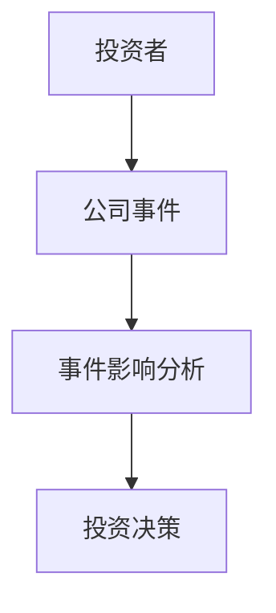

                 


# 大卫·德雷曼的特殊情况投资：从公司事件中获利

## 关键词：
- 特殊情况投资
- 公司事件
- 并购重组
- 债务违约
- 投资策略

## 摘要：
大卫·德雷曼是特殊情况投资领域的专家，专注于从公司事件中获利。本文详细介绍了特殊情况投资的背景、核心概念、分析框架、数学模型、系统设计、项目实战以及最佳实践。通过分析并购、资产重组、债务重组和破产清算等公司事件，探讨了如何利用事件驱动模型和投资组合优化算法进行投资决策。文章还提供了实际案例分析和Python代码示例，帮助读者理解如何在实际操作中应用这些策略。

---

## 正文：

---

### 第一部分：特殊情况投资的背景与基础

#### 第1章：特殊情况投资概述

##### 1.1 特殊情况投资的定义与特点

- **1.1.1 什么是特殊情况投资**
  特殊情况投资是指通过分析公司发生的特殊事件（如并购、重组、债务违约等）来寻找投资机会，从而在市场波动中获利的投资策略。

- **1.1.2 特殊情况投资的核心特征**
  - 事件驱动性：投资机会来源于特定的公司事件。
  - 低竞争性：这些事件通常不被广泛投资者关注，因此竞争较少。
  - 高回报潜力：通过准确判断事件的影响，投资者可以获得超额回报。

- **1.1.3 特殊情况投资与传统投资的区别**
  - 投资逻辑：传统投资依赖于基本面分析和市场趋势，而特殊情况投资依赖于公司事件的影响。
  - 时间框架：传统投资通常是长期投资，而特殊情况投资通常是短期或中期投资。
  - 风险水平：特殊情况投资的风险较高，但潜在回报也更大。

##### 1.2 大卫·德雷曼的特殊情况投资方法

- **1.2.1 德雷曼的背景与投资理念**
  大卫·德雷曼是一位资深的投资者，专注于从公司事件中获利。他的投资理念是通过分析公司事件的市场反应，找到被市场低估的投资机会。

- **1.2.2 德雷曼的特殊情况投资策略**
  - 焦点事件：专注于分析公司并购、资产重组、债务重组等特定事件。
  - 事件驱动模型：利用数学模型量化事件对公司价值的影响。
  - 投资组合优化：通过优化投资组合降低风险，提高回报。

- **1.2.3 德雷曼的成功案例分析**
  本文将通过实际案例分析德雷曼如何从公司事件中获利，例如某公司并购后的股价波动分析。

---

### 第二部分：公司事件与市场反应

#### 第2章：公司事件的类型与影响

##### 2.1 并购与资产重组

- **2.1.1 并购的基本概念**
  并购是指一家公司收购另一家公司，通常通过资产收购或股权收购完成。

- **2.1.2 并购对股价的影响**
  - 正面影响：并购带来协同效应，提高公司利润，股价上涨。
  - 负面影响：并购失败或整合困难，股价下跌。

- **2.1.3 资产重组的类型与影响**
  资产重组包括出售资产、注入资产等，通常会改变公司资产结构，影响股价。

##### 2.2 债务重组与违约

- **2.2.1 债务重组的定义与过程**
  债务重组是指公司通过调整债务结构、延长还款期限等方式减轻债务负担。

- **2.2.2 债务违约的影响分析**
  债务违约可能导致公司破产，股价大幅下跌，但有时也可能带来投资机会。

- **2.2.3 债务重组中的投资机会**
  在债务重组过程中，某些债权人可能会获得额外的补偿，投资者可以从中获利。

##### 2.3 破产与清算

- **2.3.1 研究破产的基本概念**
  研究破产是指公司无法偿还债务，进入破产程序。

- **2.3.2 研究破产对股价的影响**
  - 股价大幅下跌，但有时破产重组后公司价值回升。

- **2.3.3 破产清算中的投资机会**
  在破产清算过程中，某些债权人或股东可能获得清偿，投资者可以从中获利。

---

### 第三部分：特殊情况投资的分析框架

#### 第3章：事件驱动模型

##### 3.1 事件驱动模型的原理

- **3.1.1 事件驱动模型的定义**
  事件驱动模型是一种通过分析公司事件对公司价值影响的数学模型。

- **3.1.2 事件驱动模型的核心要素**
  - 事件类型：并购、重组、违约等。
  - 事件影响：事件对股价的影响程度。
  - 事件概率：事件发生的可能性。

- **3.1.3 事件驱动模型的优缺点**
  - 优点：能够量化事件影响，提供投资决策依据。
  - 缺点：模型复杂，需要大量历史数据支持。

##### 3.2 事件影响的量化分析

- **3.2.1 事件影响的量化方法**
  通过历史数据，量化事件对公司股价的影响。

- **3.2.2 事件影响的数学模型**
  $$ \text{股价变化} = f(\text{事件类型}, \text{事件影响程度}) $$

- **3.2.3 事件影响的案例分析**
  通过实际案例分析事件影响的量化过程。

---

### 第四部分：特殊情况投资的数学模型与算法

#### 第4章：数学模型与公式

##### 4.1 事件影响的量化模型

- **4.1.1 模型的定义与假设**
  - 假设：事件影响可以通过历史数据量化。
  - 定义：股价变化与事件影响程度相关。

- **4.1.2 模型的数学公式**
  $$ \Delta P = \beta \times \text{事件影响程度} $$

- **4.1.3 模型的验证与优化**
  通过历史数据验证模型，并进行参数优化。

##### 4.2 投资组合优化算法

- **4.2.1 投资组合优化的定义**
  通过优化投资组合，降低风险，提高回报。

- **4.2.2 投资组合优化的数学模型**
  $$ \text{最大化回报} = \sum w_i \times R_i - \lambda \times \text{风险} $$

- **4.2.3 投资组合优化的实现**
  使用Python代码实现投资组合优化算法，例如使用拉格朗日乘数法。

---

### 第五部分：系统分析与架构设计方案

#### 第5章：系统分析与架构设计

##### 5.1 问题场景介绍

- **5.1.1 问题背景**
  通过分析公司事件，构建投资决策支持系统。

- **5.1.2 项目介绍**
  构建一个基于事件驱动模型的投资决策系统。

##### 5.2 系统功能设计

- **5.2.1 领域模型**
  使用Mermaid类图展示系统功能模块。


- **5.2.2 系统架构设计**
  使用Mermaid架构图展示系统架构。



---

### 第六部分：项目实战

#### 第6章：项目实战

##### 6.1 环境安装

- **6.1.1 Python环境安装**
  安装Python和必要的库（如NumPy、Pandas）。

##### 6.2 系统核心实现源代码

- **6.2.1 事件影响分析代码**
  ```python
  import numpy as np
  import pandas as pd

  def calculate_impact(event_type, event_data):
      # 计算事件影响
      impact = np.dot(event_type, event_data)
      return impact
  ```

- **6.2.2 投资决策代码**
  ```python
  def optimize_portfolio(returns, risk):
      # 使用拉格朗日乘数法优化投资组合
      pass
  ```

##### 6.3 代码应用解读与分析

- **6.3.1 事件影响分析代码解读**
  解释上述代码的功能和实现逻辑。

- **6.3.2 投资决策代码解读**
  解释投资组合优化算法的实现。

##### 6.4 实际案例分析

- **6.4.1 案例背景**
  分析某公司并购事件。

- **6.4.2 数据收集与处理**
  收集并购事件前后的股价数据。

- **6.4.3 事件影响分析**
  使用代码量化并购事件对股价的影响。

##### 6.5 项目小结

- **6.5.1 项目总结**
  总结项目实现的过程和成果。

- **6.5.2 项目启示**
  启示读者如何在实际投资中应用这些方法。

---

### 第七部分：最佳实践、小结、注意事项、拓展阅读

#### 第7章：最佳实践与总结

##### 7.1 投资策略小结

- **7.1.1 事件驱动投资的核心要点**
  精准识别公司事件，量化事件影响，优化投资组合。

##### 7.2 投资注意事项

- **7.2.1 风险控制**
  在投资过程中，必须严格控制风险。

- **7.2.2 事件识别**
  精准识别公司事件，避免误判。

##### 7.3 拓展阅读

- **7.3.1 推荐书籍**
  推荐几本关于特殊情况投资的经典书籍。

- **7.3.2 相关研究**
  提供相关研究论文和资源的链接。

---

### 结论

通过本文的详细分析，读者可以全面了解大卫·德雷曼的特殊情况投资策略，掌握从公司事件中获利的方法。结合数学模型和实际案例，投资者可以更好地理解如何在市场波动中抓住投资机会，实现超额回报。

---

以上是《大卫·德雷曼的特殊情况投资：从公司事件中获利》的完整目录大纲及文章内容，希望对您有所帮助！

