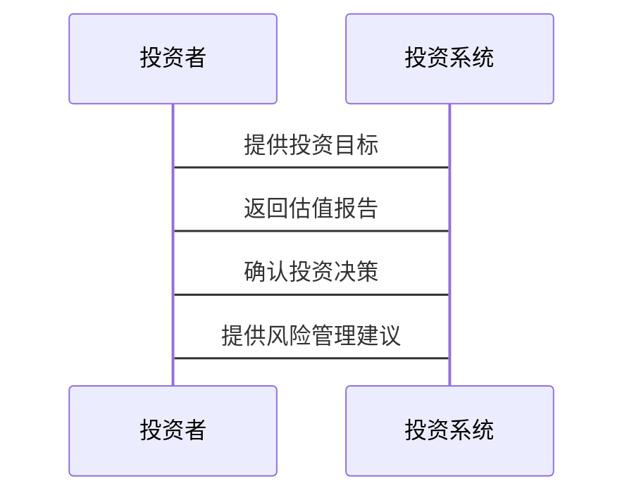

                 


# 大卫·斯文森的耐心资本：机构投资者的长期价值主义

## 关键词：耐心资本、长期价值主义、大卫·斯文森、投资策略、价值投资、风险管理、系统架构

## 摘要：  
大卫·斯文森作为耶鲁大学首席投资官，提出了耐心资本的理论，强调通过长期价值主义实现投资目标。本文从耐心资本的核心概念出发，分析其算法原理，构建系统架构，并通过实际案例展示其应用，最后总结最佳实践，为机构投资者提供深度见解。

---

## 第1章：耐心资本的起源与核心理念

### 1.1 大卫·斯文森与耐心资本的起源

#### 1.1.1 大卫·斯文森的生平简介
大卫·斯文森是耶鲁大学首席投资官，以其长期价值投资策略闻名。他通过耐心资本理论，帮助耶鲁大学实现了卓越的投资回报。

#### 1.1.2 耐心资本的定义与核心理念
耐心资本是指长期持有的投资策略，关注企业的内在价值，而非短期市场波动。其核心理念是通过深入研究，选择具备竞争优势的企业进行投资。

#### 1.1.3 耐心资本在机构投资中的应用
耐心资本适用于机构投资者，通过长期持有优质资产，降低交易成本，实现稳健回报。

### 1.2 长期价值主义的背景与意义

#### 1.2.1 经济周期与市场波动的分析
经济周期波动和市场情绪影响投资结果，长期价值主义强调忽略短期波动，关注企业长期价值。

#### 1.2.2 投资者行为与市场情绪的影响
投资者情绪可能导致非理性决策，长期价值主义倡导理性分析，避免情绪化投资。

#### 1.2.3 长期价值主义的核心目标
通过长期持有优质资产，实现财富的稳定增长，注重企业的基本面和竞争优势。

---

## 第2章：耐心资本的核心概念与联系

### 2.1 耐心资本的原理与特征

#### 2.1.1 耐心资本的原理分析
耐心资本基于基本面分析，选择具有竞争优势的企业，长期持有，等待其内在价值实现。

#### 2.1.2 耐心资本与传统投资策略的对比

| 投资策略 | 主动投资 | 被动投资 | 价值投资 |
|----------|----------|----------|----------|
| 理论基础 | 管理层选股 | 指数跟踪 | 低估值企业 |
| 风险 | 高 | 低 | 中 |

#### 2.1.3 耐心资本的核心特征
- 长期持有
- 价值导向
- 风险控制

### 2.2 长期价值主义的实体关系图


---

## 第3章：耐心资本的算法原理与数学模型

### 3.1 耐心资本的定性分析方法

#### 3.1.1 企业基本面分析
分析企业的收入、利润、负债等财务指标，评估其经营状况。

#### 3.1.2 行业分析与竞争环境评估
研究行业趋势，评估企业的竞争优势。

#### 3.1.3 财务指标的综合评估
通过市盈率（P/E）、市净率（P/B）等指标，判断企业价值。

### 3.2 耐心资本的定量分析方法

#### 3.2.1 市盈率与市净率的计算
$$P/E = \frac{\text{股价}}{\text{每股收益}}$$
$$P/B = \frac{\text{股价}}{\text{每股净资产}}$$

#### 3.2.2 内在价值的数学模型
$$\text{内在价值} = \sum_{t=1}^{n} \frac{\text{现金流}_t}{(1+r)^t}$$

#### 3.2.3 投资组合优化的数学公式
$$\text{收益最大化} = \max \sum w_i r_i$$
$$\text{风险最小化} = \min w^T \Sigma w$$

---

## 第4章：耐心资本的系统分析与架构设计

### 4.1 投资决策系统的构建

#### 4.1.1 系统功能模块划分
- 数据获取
- 估值模型
- 投资决策
- 风险管理

#### 4.1.2 系统架构设计


#### 4.1.3 系统接口设计
- 数据接口：获取企业财务数据
- 分析接口：计算估值指标
- 决策接口：生成投资建议

### 4.2 系统交互流程图



---

## 第5章：耐心资本的项目实战

### 5.1 环境安装与数据获取

#### 5.1.1 投资分析工具的安装
安装Python、Pandas、Matplotlib等工具。

#### 5.1.2 数据源的选择与获取
使用Yahoo Finance获取历史数据。

#### 5.1.3 数据清洗与预处理
去除缺失值，处理异常值。

### 5.2 核心代码实现与分析

#### 5.2.1 财务指标计算代码

```python
import pandas as pd
import yfinance as yf

# 下载数据
data = yf.download('AAPL', start='2020-01-01', end='2023-01-01')

# 计算财务指标
data['SMA'] = data['Close'].rolling(5).mean()
data['STD'] = data['Close'].rolling(5).std()
```

#### 5.2.2 投资组合优化代码

```python
import numpy as np

# 定义优化函数
def optimize(w, returns):
    return (w.T @ returns @ w) - 0.5 * np.sum(w**2)

# 使用遗传算法优化
from skopt import gp_minimize

result = gp_minimize(optimize, dimensions=len(returns.columns), n_calls=100)
```

#### 5.2.3 系统交互代码

```python
from flask import Flask, request, jsonify

app = Flask(__name__)

@app.route('/api/valuation', methods=['POST'])
def valuation():
    data = request.json
    # 处理数据并返回估值结果
    return jsonify(result)
```

### 5.3 实际案例分析与代码解读

#### 5.3.1 案例分析：投资亚马逊

通过基本面分析，选择亚马逊作为长期投资标的，计算其市盈率和市净率，评估其内在价值。

#### 5.3.2 代码解读：亚马逊的估值

```python
# 下载亚马逊数据
data_amz = yf.download('AMZN', start='2020-01-01', end='2023-01-01')

# 计算市盈率
data_amz['P/E'] = data_amz['Close'] / data_amz['Earnings/Share']
```

---

## 第6章：耐心资本的最佳实践与小结

### 6.1 最佳实践总结

#### 6.1.1 长期投资的纪律性
坚持长期投资，避免频繁交易。

#### 6.1.2 风险管理的重要性
分散投资，控制风险敞口。

#### 6.1.3 定性与定量分析的结合
综合运用基本面分析和数学模型，提高决策的准确性。

### 6.2 项目小结与未来展望

通过耐心资本的理论与实践，我们可以实现稳健的投资回报。未来，随着技术进步，耐心资本将更加智能化和数据驱动。

---

## 参考文献
1. 大卫·斯文森：《机构投资的创新实践》
2. 哈里·马科维茨：《投资学杂志》
3. 约翰·博格尔：《投资的革命》

---

通过以上章节，我们全面探讨了大卫·斯文森的耐心资本理论，从理论到实践，为机构投资者提供了深度的指导和启示。

