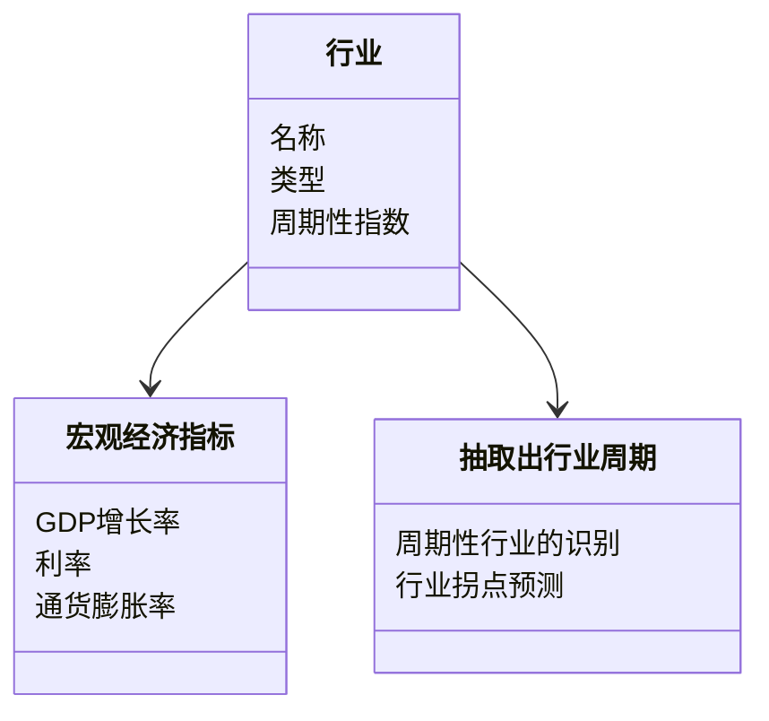
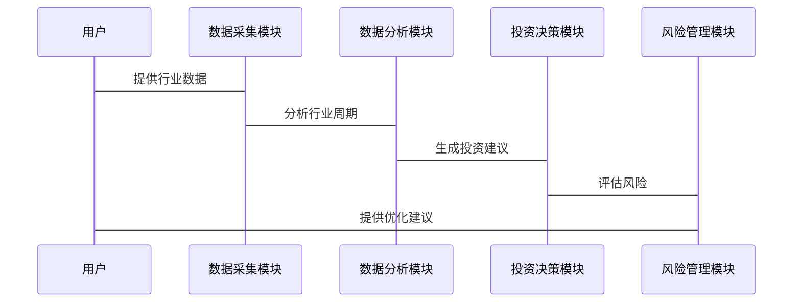

                 


# 大卫·温特斯的周期性价值投资：把握行业轮动机会

---

## 关键词
大卫·温特斯, 周期性价值投资, 行业轮动, 技术分析, 价值投资策略

---

## 摘要
本文深入探讨大卫·温特斯的周期性价值投资策略，分析其如何通过行业轮动捕捉市场机会。文章从周期性投资的基本概念出发，结合技术分析和系统架构设计，详细解读大卫·温特斯的投资方法，并通过实际案例展示其策略的应用。通过系统化的分析和实战指导，帮助投资者更好地理解周期性投资的核心原理和实际操作技巧。

---

# 第1章: 价值投资与周期性投资的概述

## 1.1 价值投资的基本概念

### 1.1.1 价值投资的定义与核心理念
价值投资是一种以基本面分析为基础的投资策略，强调购买价格低于其内在价值的资产。其核心理念在于寻找市场中的“便宜货”，并长期持有，等待其价值回归。大卫·温特斯作为价值投资的践行者，注重对周期性行业的分析，寻找在经济周期波动中能够表现优异的投资标的。

**关键公式：**  
价值投资的核心在于计算资产的内在价值，公式为：  
$$\text{内在价值} = \frac{\text{现金流}}{\text{折现率}}$$

### 1.1.2 周期性行业的特征与分类
周期性行业是指其业绩表现与经济周期高度相关的行业。这些行业的收入和利润在经济扩张期增长显著，在经济衰退期则大幅下滑。常见的周期性行业包括能源、材料、工业和金融等。

**周期性行业分类：**
| 行业 | 特征 | 常见公司 |
|------|------|----------|
| 能源 | 受能源价格波动影响较大 | 原油、天然气公司 |
| 材料 | 依赖于制造业需求 | 钢铁、化工企业 |
| 工业 | 与制造业和建筑业密切相关 | 机械制造、建筑公司 |
| 金融 | 受经济周期影响显著 | 银行、保险公司 |

### 1.1.3 大卫·温特斯的投资风格与方法
大卫·温特斯的价值投资策略注重对周期性行业的深入分析，通过识别行业周期的转折点，捕捉投资机会。他的方法包括：
1. **基本面分析**：研究行业和公司的财务数据，寻找低估值标的。
2. **周期性分析**：利用经济周期波动，预测行业轮动方向。
3. **风险控制**：通过分散投资和严格的风险管理，降低投资组合的波动性。

---

## 1.2 周期性行业的特征与分类

### 1.2.1 周期性行业的定义与分类
周期性行业是指其业绩表现与经济周期高度相关的行业。这些行业的收入和利润在经济扩张期增长显著，在经济衰退期则大幅下滑。常见的周期性行业包括能源、材料、工业和金融等。

**周期性行业分类：**
| 行业 | 特征 | 常见公司 |
|------|------|----------|
| 能源 | 受能源价格波动影响较大 | 原油、天然气公司 |
| 材料 | 依赖于制造业需求 | 钢铁、化工企业 |
| 工业 | 与制造业和建筑业密切相关 | 机械制造、建筑公司 |
| 金融 | 受经济周期影响显著 | 银行、保险公司 |

### 1.2.2 周期性波动的原因与规律
周期性波动的主要原因包括：
1. **经济周期**：经济的扩张和衰退直接影响行业需求。
2. **政策变化**：政府政策调整对行业产生重大影响。
3. **市场供需**：行业供需关系的变化导致价格波动。

**经济周期波动与行业轮动的关系：**  
在经济扩张期，周期性行业表现优异；在经济衰退期，防御性行业更具吸引力。

---

## 1.3 大卫·温特斯的行业轮动策略

### 1.3.1 识别周期性行业的核心指标
大卫·温特斯通过以下指标识别周期性行业的拐点：
1. **市盈率（P/E）**：衡量股价与盈利的关系，低市盈率通常意味着低估。
2. **市净率（P/B）**：衡量股价与资产净值的关系，低市净率表明资产可能被低估。
3. **ROE（净资产收益率）**：衡量公司的盈利能力，高ROE表明公司效率高。

---

# 第2章: 行业轮动的基本原理

## 2.1 行业轮动的驱动因素分析

### 2.1.1 经济周期对行业轮动的影响
经济周期是行业轮动的核心驱动因素。在不同的经济周期阶段，不同的行业会轮番表现。

**经济周期阶段与行业表现：**  
- **衰退期**：防御性行业（如公用事业、医疗保健）表现较好。
- **复苏期**：周期性行业（如材料、工业）开始复苏。
- **扩张期**：周期性行业表现优异，尤其是能源和金融行业。
- **过热期**：市场波动加剧，技术行业可能表现突出。

### 2.1.2 宏观经济指标与行业轮动的关系
宏观经济指标是预测行业轮动的重要工具。以下指标对行业轮动有重要影响：
1. **GDP增长率**：反映经济整体表现，高增长率通常伴随周期性行业的繁荣。
2. **利率水平**：低利率环境通常有利于金融和工业行业。
3. **通货膨胀率**：高通胀可能推高能源和材料行业的价格。

---

## 2.2 技术分析在周期性投资中的应用

### 2.2.1 移动平均线（MA）的应用
移动平均线是技术分析中常用的指标，用于过滤短期波动，揭示价格趋势。

**移动平均线计算公式：**  
$$\text{MA}_n = \frac{\sum_{i=1}^{n} \text{Price}_i}{n}$$

**应用策略：**  
- 当价格突破短期移动平均线时，可能是买入信号。
- 当价格跌破长期移动平均线时，可能是卖出信号。

### 2.2.2 相对强弱指数（RSI）的应用
RSI用于衡量价格的超买或超卖状态，通常在0-100之间。

**RSI计算公式：**  
$$\text{RSI} = 100 - \frac{100}{1 + \text{平均上涨幅度}/\text{平均下跌幅度}}$$

**应用策略：**  
- RSI低于30时，可能为超卖，考虑买入。
- RSI高于70时，可能为超买，考虑卖出。

---

## 2.3 大卫·温特斯的行业轮动策略

### 2.3.1 识别行业拐点
大卫·温特斯通过以下方法识别行业拐点：
1. **估值分析**：寻找低估值的周期性行业。
2. **趋势分析**：结合技术分析，判断行业趋势的转折点。

### 2.3.2 构建投资组合
大卫·温特斯的投资组合通常包括以下行业：
1. **周期性行业**：如能源、材料、工业。
2. **防御性行业**：如公用事业、医疗保健，用于对冲风险。

---

# 第3章: 系统架构与算法设计

## 3.1 系统功能设计

### 3.1.1 领域模型
领域模型描述了系统的核心实体及其关系。



### 3.1.2 系统架构设计
系统架构设计描述了系统的模块划分和交互流程。


### 3.1.3 系统交互设计
系统交互设计描述了用户与系统之间的交互流程。



---

## 3.2 算法实现

### 3.2.1 行业拐点预测算法
以下是一个用于预测行业拐点的简单算法：

```python
def predict_industry_trend(data, window=20):
    import pandas as pd
    import numpy as np

    # 计算移动平均线
    ma = data['价格'].rolling(window).mean()
    # 计算相对强弱指数
    delta = data['价格'].diff()
    up_days = delta.where(delta > 0).notna().cumsum()
    down_days = delta.where(delta < 0).notna().cumsum()
    rsi = 100 - (100 / (1 + (up_days / down_days)))

    # 判断趋势
    if data['价格'].iloc[-1] > ma.iloc[-1]:
        return "上升趋势"
    elif rsi.iloc[-1] < 30:
        return "买入信号"
    else:
        return "下降趋势"

# 示例数据
data = pd.DataFrame({
    '价格': [100, 105, 98, 102, 107, 110, 108, 112, 115, 113]
})
print(predict_industry_trend(data))
```

### 3.2.2 投资组合优化算法
以下是一个简单的投资组合优化算法：

```python
import numpy as np
from scipy.optimize import minimize

# 定义目标函数
def objective(weights, covariance_matrix, target_return):
    return -weights.T.dot(covariance_matrix).dot(weights)

# 定义约束条件
def constraint(weights, return_vec, target_return):
    return return_vec.T.dot(weights) - target_return

# 示例数据
returns = np.array([0.1, 0.15, 0.08, 0.12])
covariance_matrix = np.array([
    [0.02, 0.01, 0.005, 0.015],
    [0.01, 0.03, 0.008, 0.02],
    [0.005, 0.008, 0.04, 0.018],
    [0.015, 0.02, 0.018, 0.03]
])

# 求解优化问题
result = minimize(objective, [0.25, 0.25, 0.25, 0.25], args=(covariance_matrix, 0.1))

print("最优权重：", result.x)
```

---

# 第4章: 项目实战

## 4.1 环境安装与数据准备

### 4.1.1 环境安装
安装必要的Python库：
```bash
pip install pandas numpy matplotlib
```

### 4.1.2 数据准备
获取周期性行业的历史数据，例如能源行业的每日收盘价。

---

## 4.2 核心实现

### 4.2.1 行业拐点预测
使用上述算法预测行业拐点，并生成买入或卖出信号。

### 4.2.2 投资组合优化
根据预测结果，优化投资组合，降低风险。

---

## 4.3 案例分析

### 4.3.1 数据分析
以能源行业为例，分析其历史价格走势。

### 4.3.2 策略实施
根据预测结果，实施买入或卖出策略。

### 4.3.3 结果解读
评估策略的收益与风险，调整投资组合。

---

# 第5章: 总结与展望

## 5.1 总结
大卫·温特斯的周期性价值投资策略通过识别行业拐点，捕捉市场机会。结合技术分析和系统架构设计，投资者可以更有效地进行投资决策。

## 5.2 展望
未来的研究方向包括：
1. **人工智能的应用**：利用机器学习算法优化行业轮动预测。
2. **风险管理的优化**：开发更先进的风险控制系统。
3. **多因子模型**：结合多个因子进行投资决策，提高收益。

---

## 最佳实践 Tips

1. **持续学习**：关注宏观经济动态和行业趋势。
2. **严格风险控制**：设置止损点，避免重大损失。
3. **分散投资**：通过投资不同行业的标的，降低风险。
4. **定期复盘**：评估投资策略的有效性，及时调整。

---

通过本文的系统分析与实战指导，投资者可以更好地理解大卫·温特斯的周期性价值投资策略，并在实际操作中灵活运用，抓住行业轮动带来的投资机会。

