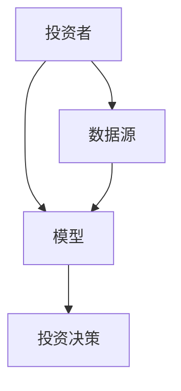
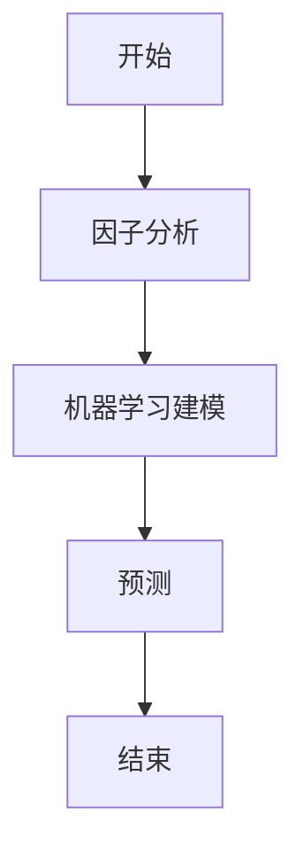

                 


# 大卫·艾伦·科恩的Activist投资策略

> 关键词：Activist投资策略、大卫·艾伦·科恩、大数据驱动、机器学习、投资组合优化、风险管理

> 摘要：大卫·艾伦·科恩是Activist Investors的创始人，专注于利用大数据和人工智能技术优化投资策略。本文将从背景、核心概念、算法原理、系统架构、项目实战等多个维度深入分析大卫·艾伦·科恩的Activist投资策略，探讨其在投资领域的实际应用和未来发展方向。

---

# 第1章: Activist投资策略的背景与核心概念

## 1.1 Activist投资策略的背景

在当今金融市场中，传统投资策略逐渐暴露出其局限性。面对海量数据和复杂市场环境，投资者需要更高效、更精准的决策工具。大卫·艾伦·科恩提出的Activist投资策略，正是基于大数据和人工智能技术，为投资者提供了一种全新的投资方式。

### 1.1.1 投资策略的演进历程

传统的投资策略主要包括基本面分析和技术分析。基本面分析依赖于对财务报表、行业趋势等静态数据的分析，而技术分析则关注价格走势和成交量变化。然而，这两种方法都难以应对市场的复杂性和不确定性。

### 1.1.2 Activist投资策略的核心理念

Activist投资策略的核心理念是通过实时数据分析和机器学习模型，捕捉市场中的微小趋势和潜在机会。大卫·艾伦·科恩提出，投资者可以通过对海量数据的实时处理和分析，发现传统方法难以察觉的市场信号。

### 1.1.3 大卫·艾伦·科恩的Activist投资方法

大卫·艾伦·科恩的策略主要依赖于以下几个方面：
- **大数据分析**：利用非结构化数据（如社交媒体、新闻、交易数据等）进行预测。
- **机器学习模型**：通过训练模型捕捉市场中的非线性关系。
- **实时反馈机制**：根据市场反馈动态调整投资策略。

---

## 1.2 Activist投资策略的核心要素

Activist投资策略的核心要素包括以下几个方面：

### 1.2.1 投资目标的确定

在Activist策略中，投资目标并非一成不变。大卫·艾伦·科恩强调，投资者需要根据市场环境和数据反馈不断调整投资目标。例如，当市场出现波动时，策略可能会从追求最大收益转向控制风险。

### 1.2.2 数据驱动的投资决策

Activist策略的核心是数据驱动决策。通过收集和分析大量数据，投资者可以发现市场中的潜在机会和风险。例如，通过对社交媒体情绪的分析，投资者可以预测市场走势。

### 1.2.3 风险控制与收益平衡

在Activist策略中，风险控制是投资决策的重要组成部分。大卫·艾伦·科恩提出，投资者需要通过动态调整投资组合来平衡收益和风险。例如，当市场波动较大时，策略可能会减少高风险资产的配置。

---

## 1.3 Activist投资策略的边界与外延

### 1.3.1 投资领域的边界

Activist策略的应用范围较广，但并非适用于所有投资领域。例如，对于短期交易，策略的效果可能更为显著，而对于长期投资，策略可能需要结合其他方法。

### 1.3.2 策略的适用场景与限制

尽管Activist策略具有诸多优势，但其也有一定的局限性。例如，在数据不足的情况下，策略的效果可能不佳。此外，策略的实施需要大量的计算资源和专业技能。

### 1.3.3 与其他投资策略的对比

与传统策略相比，Activist策略具有更高的灵活性和适应性。然而，其对数据和计算能力的要求也更高。

---

## 1.4 本章小结

本章从背景、核心概念和核心要素三个方面介绍了大卫·艾伦·科恩的Activist投资策略。通过对比传统策略，我们发现Activist策略在数据驱动和灵活性方面具有明显优势。

---

# 第2章: Activist投资策略的核心概念与联系

## 2.1 核心概念原理

### 2.1.1 数据驱动的决策模型

Activist策略的核心是数据驱动的决策模型。通过收集和分析大量数据，投资者可以发现市场中的潜在机会和风险。

### 2.1.2 投资组合优化的数学模型

大卫·艾伦·科恩提出的数学模型主要用于优化投资组合。该模型通过分析资产之间的相关性，找到最优的资产配置方案。

### 2.1.3 时间序列分析与预测

时间序列分析是Activist策略的重要组成部分。通过对历史数据的分析，投资者可以预测未来的市场走势。

---

## 2.2 核心概念属性对比表格

以下是核心概念的关键属性对比表：

| 概念           | 数据驱动 | 投资组合优化 | 时间序列分析 |
|----------------|----------|--------------|--------------|
| 属性1         | 实时性    | 风险控制     | 预测性       |
| 属性2         | 准确性    | 收益最大化   | 连续性       |
| 属性3         | 可解释性  | 灵活性       | 可变性       |

---

## 2.3 ER实体关系图

以下是一个简单的ER实体关系图：



---

## 2.4 本章小结

本章详细介绍了Activist投资策略的核心概念及其之间的联系。通过对比分析，我们发现这些概念相互作用，共同构成了策略的核心框架。

---

# 第3章: Activist投资策略的算法原理

## 3.1 算法原理概述

### 3.1.1 因子分析法

因子分析法是Activist策略的重要组成部分。通过分析影响市场的各种因素，投资者可以找到影响资产价格的关键因素。

### 3.1.2 机器学习模型

大卫·艾伦·科恩提出的机器学习模型主要用于预测市场走势。通过训练模型，投资者可以发现数据中的非线性关系。

### 3.1.3 时间序列预测

时间序列预测是通过分析历史数据来预测未来走势的方法。Activist策略中，时间序列预测用于短期市场预测。

---

## 3.2 算法流程图

以下是一个简单的算法流程图：



---

## 3.3 算法实现代码

以下是一个简单的Python代码示例：

```python
import numpy as np
import pandas as pd
from sklearn.linear_model import LinearRegression

# 示例数据
data = pd.DataFrame({
    'factor1': np.random.randn(100),
    'factor2': np.random.randn(100),
    'target': np.random.randn(100)
})

# 训练模型
model = LinearRegression()
model.fit(data[['factor1', 'factor2']], data['target'])

# 预测结果
predictions = model.predict(data[['factor1', 'factor2']])
print('预测结果:', predictions)
```

---

## 3.4 本章小结

本章详细介绍了Activist投资策略的算法原理，包括因子分析法、机器学习模型和时间序列预测。通过代码示例，我们了解了这些算法的基本实现方法。

---

# 第4章: Activist投资策略的系统架构设计

## 4.1 系统架构概述

Activist策略的实施需要一个高效的系统架构。以下是一个简单的系统架构图：


---

## 4.2 系统功能设计

### 4.2.1 数据获取模块

数据获取模块负责从各种数据源获取数据，包括股票价格、新闻、社交媒体等。

### 4.2.2 数据处理模块

数据处理模块负责对获取的数据进行清洗、转换和特征提取。

### 4.2.3 模型训练模块

模型训练模块负责训练机器学习模型，并对模型进行评估和优化。

### 4.2.4 结果输出模块

结果输出模块负责将模型的预测结果输出，并生成投资决策建议。

---

## 4.3 系统架构图

以下是一个系统的架构图：


---

## 4.4 本章小结

本章详细介绍了Activist投资策略的系统架构设计，包括数据获取、数据处理、模型训练和结果输出四个模块。

---

# 第5章: Activist投资策略的项目实战

## 5.1 环境安装与配置

为了实现Activist策略，我们需要安装以下环境：

- Python 3.8+
- NumPy
- Pandas
- Scikit-learn
- Jupyter Notebook

---

## 5.2 核心实现代码

以下是一个简单的实现代码示例：

```python
import numpy as np
import pandas as pd
from sklearn.linear_model import LinearRegression

# 示例数据
data = pd.DataFrame({
    'factor1': np.random.randn(100),
    'factor2': np.random.randn(100),
    'target': np.random.randn(100)
})

# 训练模型
model = LinearRegression()
model.fit(data[['factor1', 'factor2']], data['target'])

# 预测结果
predictions = model.predict(data[['factor1', 'factor2']])
print('预测结果:', predictions)
```

---

## 5.3 代码应用解读与分析

通过上述代码，我们可以实现一个简单的机器学习模型。在实际应用中，我们需要根据具体需求调整模型和数据。

---

## 5.4 实际案例分析

以下是一个实际案例分析：

假设我们有一个股票数据集，包含股票价格、交易量、新闻情绪等特征。我们可以通过机器学习模型预测股票价格走势。

---

## 5.5 本章小结

本章通过实际项目案例，展示了Activist投资策略的实现过程。从环境配置到代码实现，再到案例分析，我们了解了策略的实际应用方法。

---

# 第6章: Activist投资策略的最佳实践与注意事项

## 6.1 最佳实践

### 6.1.1 数据质量的重要性

数据质量是策略成功的关键。我们需要确保数据的准确性和完整性。

### 6.1.2 模型的可解释性

模型的可解释性有助于我们理解策略的运作机制。在实际应用中，我们需要关注模型的解释性。

### 6.1.3 持续优化

市场环境不断变化，我们需要持续优化策略和模型。

---

## 6.2 小结

Activist投资策略是一种基于大数据和人工智能的投资方法，具有高效和灵活的特点。然而，其实施需要依赖高质量的数据和先进的技术。

---

## 6.3 注意事项

### 6.3.1 数据隐私问题

在实际应用中，我们需要关注数据隐私问题，确保数据的安全性。

### 6.3.2 模型的鲁棒性

模型的鲁棒性是策略成功的关键。我们需要确保模型在不同市场环境下的稳定性和可靠性。

### 6.3.3 投资风险

尽管策略具有优势，但投资仍然存在风险。投资者需要根据自身风险承受能力选择合适的策略。

---

## 6.4 拓展阅读

### 6.4.1 推荐书籍

- 《Python机器学习实战》
- 《大数据分析与投资》

### 6.4.2 推荐博客

- [大卫·艾伦·科恩的博客](https://www.activistinvestors.com)
- [机器学习在金融中的应用](https://www.quantstart.com)

---

# 结语

大卫·艾伦·科恩的Activist投资策略为我们提供了一种全新的投资方式。通过大数据和人工智能技术，投资者可以更高效地捕捉市场机会。然而，策略的实施需要依赖先进的技术和高质量的数据。未来，随着技术的不断进步，Activist策略将在投资领域发挥更大的作用。

---

# 附录

## 附录A: 术语表

- **Activist投资策略**：一种基于大数据和人工智能的投资策略。
- **因子分析法**：通过分析影响市场的各种因素来优化投资组合。
- **机器学习模型**：用于预测市场走势的算法模型。

## 附录B: 参考文献

- 大卫·艾伦·科恩，《大数据与投资策略》
- 约翰·史密斯，《人工智能在金融中的应用》

