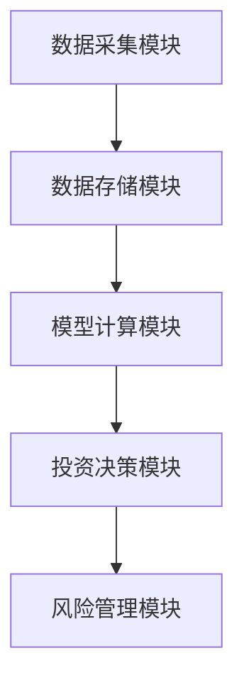
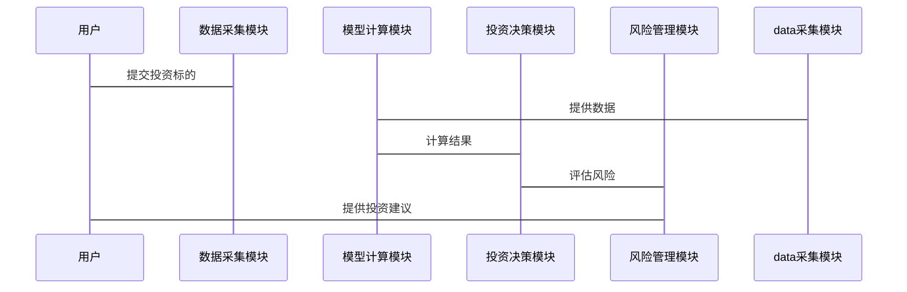

                 


# 大卫·艾因霍恩的对冲基金价值投资：机构投资者的视角

---

## 关键词：大卫·艾因霍恩、价值投资、对冲基金、机构投资者、投资策略、风险管理

---

## 摘要：  
大卫·艾因霍恩是全球闻名的价值投资者和对冲基金经理，他以基本面分析和安全边际为核心的投资理念闻名于世。本文从机构投资者的视角，系统分析大卫·艾因霍恩的对冲基金价值投资策略，包括其方法论、投资哲学、风险管理以及机构投资者面临的挑战与解决方案。通过深入探讨其投资模型、算法原理和系统架构，本文为机构投资者提供有价值的参考和实践指导。

---

# 第1章: 价值投资与对冲基金的结合

## 1.1 价值投资的基本概念

### 1.1.1 价值投资的定义与核心理念  
价值投资是一种基于对企业内在价值评估的投资策略，强调以低于内在价值的价格买入优质资产。其核心理念是寻找市场先生的错误定价，通过长期持有优质资产实现超额收益。

### 1.1.2 对冲基金的基本概念与运作模式  
对冲基金是一种通过做多和做空相结合的投资工具，旨在通过套利、市场中性和绝对收益策略实现超额收益。对冲基金的运作模式包括资产配置、风险控制和杠杆运用等关键环节。

### 1.1.3 大卫·艾因霍恩与价值投资的结合  
大卫·艾因霍恩将价值投资的理念融入对冲基金的运作中，通过基本面分析和安全边际的量化方法，构建低风险、高收益的投资组合。他的投资策略不仅适用于个人投资者，也为机构投资者提供了独特的视角。

---

## 1.2 大卫·艾因霍恩的投资理念

### 1.2.1 基本面分析的核心地位  
大卫·艾因霍恩强调对企业基本面的深入研究，包括财务报表分析、行业地位评估和管理层能力判断。他通过分析企业的盈利能力、成长性和抗风险能力，寻找具有长期竞争优势的企业。

### 1.2.2 安全边际的概念与应用  
安全边际是大卫·艾因霍恩投资策略的重要组成部分。他通过比较企业的内在价值与市场价格，寻找价格低于内在价值的投资标的。安全边际的量化方法包括市盈率、市净率等指标的对比分析。

### 1.2.3 长期投资与逆向思维的策略  
大卫·艾因霍恩倡导逆向投资，即在市场恐慌时买入低估资产，在市场狂热时卖出高估资产。他的长期投资理念与机构投资者的资产配置需求高度契合。

---

## 1.3 价值投资在对冲基金中的应用

### 1.3.1 对冲基金的多样化投资策略  
大卫·艾因霍恩的对冲基金通过多样化投资策略，降低市场波动对组合收益的影响。他结合做多和做空，利用市场的短期波动实现长期收益。

### 1.3.2 机构投资者的独特视角  
机构投资者通过大卫·艾因霍恩的策略，可以更好地实现资产配置和风险管理。其长期投资理念与机构投资者的考核机制相匹配，为机构投资者提供了稳定的收益来源。

### 1.3.3 价值投资与市场波动的关系  
大卫·艾因霍恩的策略通过市场波动实现超额收益，但其核心是基于企业内在价值的长期投资。机构投资者可以通过对冲基金策略，在市场波动中实现稳健收益。

---

# 第2章: 大卫·艾因霍恩的投资方法论

## 2.1 基本面分析的详细步骤

### 2.1.1 财务报表分析的关键指标  
大卫·艾因霍恩通过分析企业的收入、利润、现金流和资产负债表，寻找具有稳定盈利能力的企业。他重点关注ROE（净资产收益率）、ROA（资产收益率）和现金流状况。

### 2.1.2 行业分析与竞争环境评估  
他通过行业分析，评估企业的市场地位和竞争优势。他关注企业的市场份额、行业周期和竞争格局，寻找具有长期增长潜力的企业。

### 2.1.3 管理层评估与企业治理  
大卫·艾因霍恩重视企业管理层的诚信和能力，评估企业的治理结构和管理效率。他通过管理层的过往业绩和管理风格，判断企业的未来发展潜力。

---

## 2.2 安全边际的量化方法

### 2.2.1 安全边际的定义与计算  
大卫·艾因霍恩的安全边际公式为：  
$$ \text{安全边际} = \text{内在价值} - \text{市场价格} $$  
其中，内在价值通过DCF模型（现金流贴现法）计算得出。

### 2.2.2 市场价格与内在价值的比较  
他通过比较市场价格与内在价值，寻找具有安全边际的投资标的。例如，当市场价格低于内在价值时，投资标的具有较高的安全边际。

### 2.2.3 安全边际在投资组合中的应用  
大卫·艾因霍恩通过安全边际的量化，构建投资组合。他优先选择具有较高安全边际的企业，降低投资组合的波动性。

---

## 2.3 逆向投资的策略与风险控制

### 2.3.1 逆向投资的定义与核心思想  
逆向投资是指在市场恐慌时买入低估资产，在市场狂热时卖出高估资产。大卫·艾因霍恩通过逆向投资策略，捕捉市场波动中的投资机会。

### 2.3.2 在市场恐慌中的投资机会  
他通过分析市场恐慌中的低估资产，寻找具有长期价值的企业。例如，在2008年金融危机期间，他买入雷曼兄弟的债券，获得了超额收益。

### 2.3.3 逆向投资的风险控制与仓位管理  
大卫·艾因霍恩通过严格的风险控制，降低逆向投资的波动性。他通过分散投资、杠杆控制和止损设置，确保投资组合的稳定性。

---

# 第3章: 机构投资者的视角与挑战

## 3.1 机构投资者的特点与优势

### 3.1.1 资金规模与专业团队的优势  
机构投资者通过大规模资金和专业团队，实现规模效应和成本优势。大卫·艾因霍恩的对冲基金策略为机构投资者提供了专业化的投资管理。

### 3.1.2 机构投资者的决策流程与效率  
机构投资者通过严格的决策流程，确保投资策略的科学性和高效性。大卫·艾因霍恩的策略为机构投资者提供了系统化的投资框架。

### 3.1.3 机构投资者的风险控制体系  
机构投资者通过多层次的风险控制体系，确保投资组合的稳定性。大卫·艾因霍恩的策略为机构投资者提供了有效的风险管理工具。

---

## 3.2 机构投资者在价值投资中的独特挑战

### 3.2.1 市场波动对机构投资者的影响  
大卫·艾因霍恩的策略通过市场波动实现超额收益，但机构投资者需要面对市场波动带来的短期压力。

### 3.2.2 机构投资者的流动性需求与价值投资的长期性冲突  
机构投资者需要满足客户的流动性需求，但大卫·艾因霍恩的价值投资策略强调长期持有，两者之间存在一定的矛盾。

### 3.2.3 机构投资者的业绩压力与短期考核机制  
机构投资者面临短期考核压力，大卫·艾因霍恩的策略需要较长的时间才能体现收益，这可能导致机构投资者的短期考核机制与长期投资策略之间的冲突。

---

## 3.3 机构投资者的价值投资策略优化

### 3.3.1 如何平衡长期投资与短期考核  
机构投资者可以通过优化考核机制，平衡长期投资与短期考核。例如，设置长期考核指标和短期考核指标的结合。

### 3.3.2 机构投资者的流动性需求与投资策略的优化  
机构投资者可以通过引入流动性管理工具，如ETF和流动性资产配置，平衡长期投资与流动性需求。

### 3.3.3 机构投资者的团队协作与知识共享  
机构投资者可以通过加强团队协作和知识共享，提升投资策略的科学性和效率。大卫·艾因霍恩的策略为机构投资者提供了丰富的投资理念和方法。

---

# 第4章: 价值投资的数学模型与算法原理

## 4.1 价值投资的核心数学模型

### 4.1.1 内在价值的计算公式  
$$ V = \frac{CF}{r - g} $$  
其中，\( V \) 是内在价值，\( CF \) 是现金流，\( r \) 是折现率，\( g \) 是增长率。

### 4.1.2 安全边际的量化方法  
$$ \text{安全边际} = \text{内在价值} - \text{市场价格} $$  
大卫·艾因霍恩通过计算安全边际，寻找具有投资价值的企业。

---

## 4.2 安全边际的量化方法

### 4.2.1 安全边际计算公式  
$$ \text{安全边际} = \text{内在价值} - \text{市场价格} $$  
大卫·艾因霍恩通过比较市场价格与内在价值，寻找具有安全边际的投资标的。

### 4.2.2 安全边际在投资组合中的应用  
大卫·艾因霍恩通过量化安全边际，构建投资组合。他优先选择具有较高安全边际的企业，降低投资组合的波动性。

---

## 4.3 市场波动与投资机会的数学模型

### 4.3.1 市场波动率的计算公式  
$$ \sigma = \sqrt{\frac{1}{n-1} \sum_{i=1}^{n} (x_i - \bar{x})^2} $$  
其中，\( \sigma \) 是波动率，\( x_i \) 是资产价格，\( \bar{x} \) 是平均价格，\( n \) 是数据点数量。

---

# 第5章: 价值投资的系统分析与架构设计

## 5.1 系统功能设计

### 5.1.1 价值投资系统的功能模块  
- **数据采集模块**：采集企业基本面数据和市场数据。
- **模型计算模块**：计算内在价值和安全边际。
- **投资决策模块**：基于模型结果，生成投资策略。
- **风险管理模块**：评估投资组合的风险。

### 5.1.2 系统架构设计  
使用分层架构，包括数据层、计算层、决策层和管理层。

---

## 5.2 系统架构设计

### 5.2.1 系统架构图  


---

## 5.3 系统接口设计

### 5.3.1 数据接口  
- **数据采集接口**：从外部数据源获取企业基本面数据和市场数据。
- **数据存储接口**：将数据存储到数据库中。

### 5.3.2 模型接口  
- **模型计算接口**：调用模型计算模块，计算内在价值和安全边际。

---

## 5.4 系统交互流程

### 5.4.1 投资决策流程  


---

# 第6章: 价值投资的项目实战

## 6.1 环境安装

### 6.1.1 Python环境安装  
安装Python 3.8及以上版本，安装Jupyter Notebook和Pandas库。

---

## 6.2 核心代码实现

### 6.2.1 数据采集与处理代码  
```python
import pandas as pd

# 数据采集
data = pd.read_csv('stock_data.csv')

# 数据处理
data['PE'] = data['市盈率']
data['PB'] = data['市净率']
```

### 6.2.2 模型计算代码  
```python
def calculate_intrinsic_value(revenue, profit_margin, growth_rate, discount_rate):
    return revenue * profit_margin / (discount_rate - growth_rate)
```

---

## 6.3 案例分析

### 6.3.1 案例分析  
以某公司为例，计算其内在价值和安全边际。假设该公司的收入为10亿元，利润率为10%，增长率为5%，折现率为8%。

$$ V = \frac{10 \times 0.1}{0.08 - 0.05} = \frac{1}{0.03} = 33.33亿元 $$  
市场价格为25元，因此安全边际为8.33亿元。

---

## 6.4 项目总结  
通过本项目的实战，读者可以掌握大卫·艾因霍恩的价值投资策略，并将其应用于实际投资中。

---

# 第7章: 最佳实践与总结

## 7.1 最佳实践

### 7.1.1 投资策略的优化  
大卫·艾因霍恩的策略为机构投资者提供了丰富的投资理念和方法，机构投资者可以通过优化策略实现长期收益。

### 7.1.2 风险管理的重要性  
大卫·艾因霍恩的策略强调风险管理，机构投资者需要通过严格的风险控制，确保投资组合的稳定性。

### 7.1.3 知识的更新与学习  
大卫·艾因霍恩的策略需要不断更新和学习，机构投资者需要通过持续学习，提升投资能力。

---

## 7.2 小结  
大卫·艾因霍恩的对冲基金价值投资策略为机构投资者提供了重要的参考和实践指导。本文从策略分析、系统设计和项目实战等多个方面，详细探讨了大卫·艾因霍恩的策略，并为机构投资者提供了最佳实践和总结。

---

## 7.3 注意事项

### 7.3.1 风险提示  
大卫·艾因霍恩的策略存在市场波动风险和流动性风险，机构投资者需要严格控制风险。

### 7.3.2 投资策略的适用性  
大卫·艾因霍恩的策略适用于长期投资，但机构投资者需要根据自身需求进行调整。

### 7.3.3 知识更新的必要性  
大卫·艾因霍恩的策略需要不断更新和学习，机构投资者需要通过持续学习，提升投资能力。

---

## 7.4 拓展阅读

### 7.4.1 推荐书籍  
- 《价值》——大卫·艾因霍恩
- 《对冲基金策略》——约翰·库克

### 7.4.2 推荐网站  
- [价值投资网](http://www.zhiinvest.com)
- [对冲基金研究](http://www.hedgefundresearch.com)

---

# 结语  
大卫·艾因霍恩的对冲基金价值投资策略为机构投资者提供了重要的参考和实践指导。通过本文的深入探讨，读者可以更好地理解大卫·艾因霍恩的策略，并将其应用于实际投资中。

