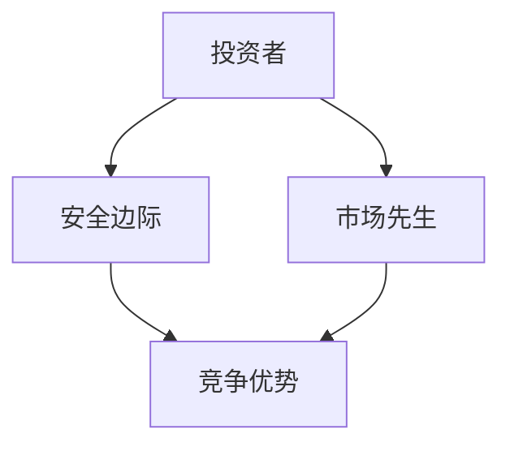
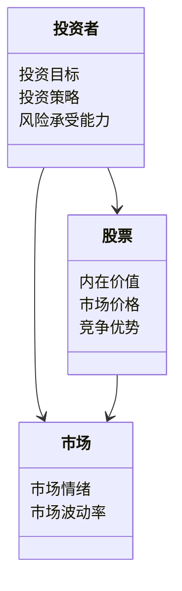
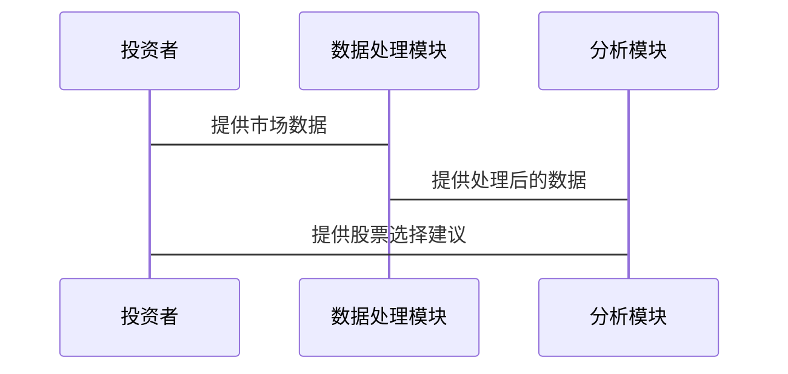

                 


# 大卫德雷曼的价值投资案例分析

> 关键词：价值投资，大卫德雷曼，安全边际，竞争优势，市盈率，市净率，现金流折现法

> 摘要：本文深入分析了大卫德雷曼的价值投资理念，探讨了其核心概念、算法原理及实际应用案例。通过对安全边际、竞争优势等关键概念的详细阐述，结合数学模型和系统架构设计，为读者提供了一套系统的价值投资分析方法。

---

## 第1章: 价值投资的基本概念

### 1.1 价值投资的定义与特点

#### 1.1.1 价值投资的定义
价值投资是一种以基本面分析为基础的投资策略，旨在通过识别市场低估的证券，长期持有以实现超额收益。其核心在于寻找具有安全边际的投资标的。

#### 1.1.2 价值投资的核心特点
1. **长期视角**：注重长期价值，而非短期价格波动。
2. **安全边际**：买入价格低于内在价值，以降低风险。
3. **逆向思维**：在市场恐慌时寻找机会，避免盲目跟风。

#### 1.1.3 价值投资与其它投资策略的区别
- **成长投资**：侧重于高增长潜力，风险较高。
- **指数投资**：被动跟踪市场指数，风险分散。
- **价值投资**：注重安全边际和内在价值，风险可控。

### 1.2 大卫·德雷曼的贡献

#### 1.2.1 大卫·德雷曼的生平简介
大卫·德雷曼（David Dreman）是价值投资领域的先驱，以其对安全边际和竞争优势的深入研究闻名。他的投资理念强调基本面分析和风险控制。

#### 1.2.2 德雷曼的价值投资理念
德雷曼提出，投资成功的关键在于识别市场低估的股票，并长期持有。他强调安全边际的重要性，即买入价格低于内在价值。

#### 1.2.3 德雷曼投资策略的独特性
德雷曼的独特性在于其对心理因素的深入研究，认为市场情绪波动是投资机会的来源。

---

## 第2章: 价值投资的背景与现状

### 2.1 价值投资的历史发展

#### 2.1.1 价值投资的起源
价值投资起源于20世纪初，本杰明·格雷厄姆和大卫·德雷曼是其重要推动者。

#### 2.1.2 价值投资的发展阶段
- **初期阶段**：以格雷厄姆和德雷曼为代表，强调安全边际。
- **发展阶段**：引入多因子模型和量化分析。
- **现代阶段**：结合大数据和人工智能技术。

#### 2.1.3 价值投资在现代金融中的地位
价值投资是金融学的重要组成部分，广泛应用于机构投资和个人理财。

### 2.2 当前价值投资的现状

#### 2.2.1 价值投资的市场环境
当前市场环境复杂多变，价值投资面临挑战与机遇。

#### 2.2.2 价值投资的挑战与机遇
- **挑战**：市场波动加剧，信息不对称加剧。
- **机遇**：技术进步为价值发现提供了新工具。

#### 2.2.3 价值投资的未来趋势
价值投资将与大数据、人工智能等技术深度融合，提升分析效率和准确性。

---

## 第3章: 价值投资的核心概念

### 3.1 安全边际

#### 3.1.1 安全边际的定义
安全边际是指买入价格与内在价值之间的差距，用于缓冲市场波动带来的风险。

#### 3.1.2 安全边际的重要性
安全边际是价值投资的核心，确保投资者在市场波动中不损失本金。

#### 3.1.3 安全边际的计算方法
$$ \text{安全边际} = \text{内在价值} - \text{市场价格} $$

### 3.2 市场先生

#### 3.2.1 市场先生的定义
市场先生代表市场情绪，价格波动反映了市场参与者的心理变化。

#### 3.2.2 市场先生的行为特征
市场先生情绪波动，价格波动与实际价值脱节。

#### 3.2.3 市场先生与投资者决策的关系
投资者应独立于市场情绪，基于基本面进行决策。

### 3.3 竞争优势

#### 3.3.1 竞争优势的定义
竞争优势是企业相对于竞争对手的核心优势，确保其长期盈利能力。

#### 3.3.2 竞争优势的类型
- **成本优势**：生产效率高，成本低。
- **品牌优势**：品牌知名度高，客户忠诚度高。
- **技术优势**：技术领先，创新能力强。

#### 3.3.3 竞争优势的评估方法
1. **行业分析**：评估企业在行业中的地位。
2. **财务分析**：分析企业的盈利能力、资产负债情况。
3. **竞争优势的可持续性**：评估竞争优势的长期性。

---

## 第4章: 价值投资的核心概念联系

### 4.1 价值投资核心概念的对比分析

#### 4.1.1 安全边际与竞争优势的对比
- **安全边际**：关注价格与价值的关系。
- **竞争优势**：关注企业盈利能力。

#### 4.1.2 市场先生与安全边际的关系
市场先生情绪影响价格波动，安全边际缓冲市场波动带来的风险。

#### 4.1.3 竞争优势与市场先生的联系
竞争优势决定企业的长期盈利能力，市场先生情绪影响短期价格波动。

### 4.2 价值投资核心概念的ER实体关系图



### 4.3 价值投资核心概念的数学模型

#### 4.3.1 安全边际计算公式
$$ \text{安全边际} = \text{内在价值} - \text{市场价格} $$

#### 4.3.2 市场先生情绪指数
$$ \text{市场情绪指数} = \frac{\text{市场波动率}}{\text{历史波动率}} $$

---

## 第5章: 价值投资的算法原理

### 5.1 多因子模型

#### 5.1.1 多因子模型的定义
多因子模型通过多个因子（如价值、成长、动量等）来评估股票的投资价值。

#### 5.1.2 多因子模型的构建步骤
1. **因子选择**：选择相关因子。
2. **数据收集**：收集相关数据。
3. **因子权重确定**：确定各因子的权重。
4. **模型构建**：构建多因子模型。
5. **模型验证**：验证模型的有效性。

#### 5.1.3 多因子模型的优缺点
- **优点**：全面考虑多个因子，提高模型的准确性。
- **缺点**：因子过多可能导致过拟合。

### 5.2 市盈率与市净率分析

#### 5.2.1 市盈率的计算与应用
- **计算公式**：$$ \text{市盈率} = \frac{\text{股价}}{\text{每股收益}} $$
- **应用**：评估股票的估值是否合理。

#### 5.2.2 市净率的计算与应用
- **计算公式**：$$ \text{市净率} = \frac{\text{股价}}{\text{每股净资产}} $$
- **应用**：评估股票的估值是否合理。

#### 5.2.3 市盈率与市净率的对比分析
- **市盈率**：适用于盈利稳定的公司。
- **市净率**：适用于净资产较多的公司。

### 5.3 现金流折现法

#### 5.3.1 现金流折现法的定义
现金流折现法通过将未来现金流折现，评估股票的内在价值。

#### 5.3.2 现金流折现法的计算公式
$$ \text{内在价值} = \sum_{t=1}^{n} \frac{\text{现金流}_t}{(1 + r)^t} $$

#### 5.3.3 现金流折现法的步骤
1. **预测未来现金流**：预测未来自由现金流。
2. **确定折现率**：选择合适的折现率。
3. **计算内在价值**：将未来现金流折现，得到内在价值。

---

## 第6章: 系统分析与架构设计

### 6.1 系统功能设计

#### 6.1.1 领域模型


#### 6.1.2 系统架构设计


#### 6.1.3 系统接口设计
- **输入接口**：投资者的需求和市场数据。
- **输出接口**：股票选择和投资建议。

#### 6.1.4 系统交互设计


---

## 第7章: 项目实战

### 7.1 环境安装

#### 7.1.1 安装Python
```bash
pip install python3
```

#### 7.1.2 安装相关库
```bash
pip install numpy pandas matplotlib
```

### 7.2 系统核心实现源代码

#### 7.2.1 多因子模型实现
```python
import numpy as np
import pandas as pd

# 假设data是一个包含股票数据的DataFrame
data = pd.DataFrame({'price': [10, 20, 30], 'eps': [5, 10, 15])

# 计算市盈率
data['pe_ratio'] = data['price'] / data['eps']

print(data)
```

#### 7.2.2 现金流折现法实现
```python
def discounted_cash_flows(cash_flows, discount_rate):
    return sum(cash_flow / (1 + discount_rate) ** t for t, cash_flow in enumerate(cash_flows))

cash_flows = [100, 200, 300]
discount_rate = 0.05

print(discounted_cash_flows(cash_flows, discount_rate))
```

### 7.3 实际案例分析

#### 7.3.1 案例选择
以某公司为例，分析其市盈率和市净率。

#### 7.3.2 数据分析
分析该公司的历史财务数据，评估其竞争优势和安全边际。

#### 7.3.3 投资建议
基于分析结果，给出投资建议。

---

## 第8章: 最佳实践与小结

### 8.1 最佳实践

#### 8.1.1 理解价值投资的核心理念
安全边际和竞争优势是价值投资的关键。

#### 8.1.2 持续学习与实践
不断学习新的投资理念和技术，提升分析能力。

#### 8.1.3 风险管理
合理控制仓位，分散投资，降低风险。

### 8.2 小结

大卫德雷曼的价值投资理念为投资者提供了重要的指导。通过安全边际和竞争优势的分析，投资者可以在市场中找到低估的投资标的，实现长期稳定收益。

### 8.3 注意事项

- **避免过度自信**：市场波动难以预测，投资需谨慎。
- **分散投资**：降低投资风险。
- **持续学习**：市场变化快，需不断更新知识。

### 8.4 拓展阅读

推荐阅读大卫德雷曼的经典著作《价值投资：德雷曼的成功之路》。

---

## 第9章: 总结

大卫德雷曼的价值投资理念为投资者提供了重要的指导。通过安全边际和竞争优势的分析，投资者可以在市场中找到低估的投资标的，实现长期稳定收益。希望本文能为投资者提供有价值的参考。

---

以上是文章的完整目录结构，涵盖从基础概念到实际应用的各个方面。通过系统化的分析和详细的案例解读，本文旨在为读者提供有价值的投资指导。

