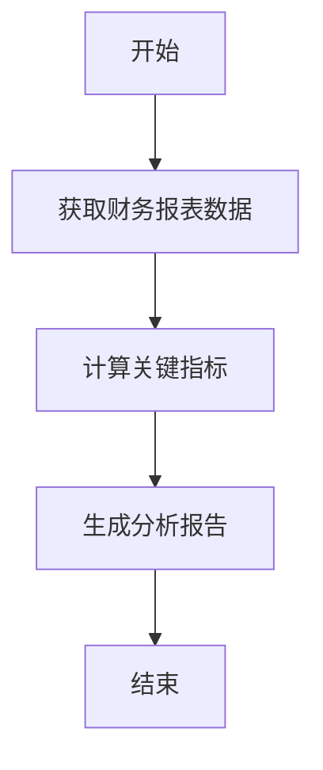
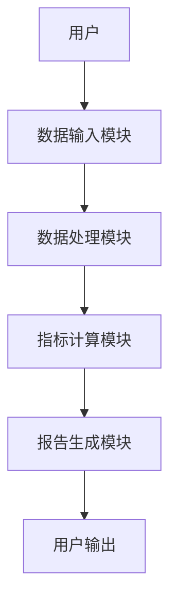
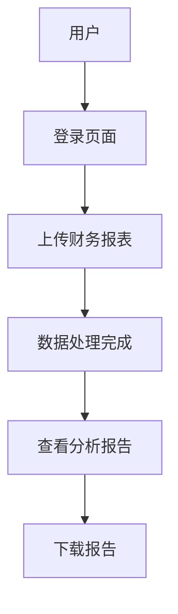

                 


# 大卫德雷曼的财务报表解读

## 关键词：财务报表分析、财务健康度、企业估值、投资决策、会计报表解读

## 摘要：
本文深入解读大卫德雷曼的财务报表分析方法，从基础概念到高级技巧，结合实际案例，帮助投资者和企业管理者全面理解财务报表的内涵与外延，掌握财务报表分析的核心算法与系统架构，从而做出明智的投资决策和企业估值。

---

## 第一部分：财务报表解读基础

### 第1章：财务报表的基本概念

#### 1.1 财务报表的定义与作用
- 财务报表的定义：记录企业财务状况、经营成果和现金流量的正式文件。
- 财务报表的作用：评估企业盈利能力、偿债能力、运营效率和成长潜力。

#### 1.2 三张主要财务报表介绍
- 资产负债表：记录企业在某一特定日期的资产、负债和所有者权益。
- 利润表：展示企业在一定会计期间的收入、费用和利润。
- 现金流量表：反映企业在一定会计期间内现金流入和流出的情况。

#### 1.3 财务报表分析的基本方法
- 单独分析：分别分析资产负债表、利润表和现金流量表。
- 综合分析：将三张报表结合，全面评估企业财务状况。

---

### 第2章：财务报表的核心概念与联系

#### 2.1 财务报表的核心概念
- 资产：企业拥有的资源，包括流动资产和非流动资产。
- 负债：企业欠款，包括短期负债和长期负债。
- 所有者权益：企业净资产，等于资产减去负债。
- 收入：企业通过销售商品或提供服务获得的收入。
- 费用：企业为获得收入而发生的支出。
- 利润：收入减去费用后的净收益。

#### 2.2 财务报表核心概念的联系
- 资产负债表与利润表的关联：利润表的净利润影响资产负债表的所有者权益。
- 利润表与现金流量表的关联：利润表的收入和费用部分转化为现金流量表的现金流。
- 财务报表整体的逻辑结构：三张报表共同反映企业的财务状况和经营成果。

#### 2.3 财务报表核心概念对比分析
- 资产与负债的对比：资产是企业拥有的资源，负债是企业欠款，两者共同构成资产负债表。
- 收入与费用的对比：收入是企业获得的经济利益，费用是为获得收入而发生的支出。
- 净利润与每股收益的对比：净利润是企业的总利润，每股收益是净利润分配到每一份普通股的金额。

---

### 第3章：财务报表分析的算法原理

#### 3.1 财务报表分析的数学模型
- 净资产收益率（ROE）公式：
$$\text{ROE} = \frac{\text{净利润}}{\text{所有者权益}}$$
- 每股收益（EPS）公式：
$$\text{EPS} = \frac{\text{净利润}}{\text{普通股股数}}$$
- 资产负债率公式：
$$\text{资产负债率} = \frac{\text{总负债}}{\text{总资产}}$$

#### 3.2 财务报表分析的算法流程


#### 3.3 财务报表分析的Python实现
- 环境安装：
```bash
pip install pandas numpy matplotlib
```
- 核心代码实现：
```python
import pandas as pd

# 示例：计算ROE
def calculate_roe(net_income, equity):
    return net_income / equity

# 示例：计算EPS
def calculate_eps(net_income, common_shares):
    return net_income / common_shares

# 示例：计算资产负债率
def calculate_debt_ratio(total_liabilities, total_assets):
    return total_liabilities / total_assets
```

---

## 第二部分：系统分析与架构设计

### 第4章：系统分析与架构设计

#### 4.1 问题场景介绍
- 企业需要通过财务报表分析系统，快速获取关键财务指标，评估企业财务健康度。

#### 4.2 系统功能设计
- 系统功能模块：
  - 数据输入模块：支持上传财务报表数据。
  - 指标计算模块：自动计算ROE、EPS、资产负债率等关键指标。
  - 报告生成模块：生成财务分析报告，包括图表和文字解读。

#### 4.3 系统架构设计


#### 4.4 系统接口设计
- 数据输入接口：支持CSV或Excel格式的财务报表数据。
- 指标计算接口：提供RESTful API，供其他系统调用。
- 报告生成接口：生成PDF或HTML格式的财务分析报告。

#### 4.5 系统交互流程


---

## 第三部分：项目实战

### 第5章：项目实战

#### 5.1 环境安装
- 安装必要的Python库：
```bash
pip install pandas numpy matplotlib
```

#### 5.2 核心代码实现
- 示例代码：
```python
import pandas as pd

# 示例：读取财务报表数据
df = pd.read_csv('financial_statements.csv')

# 示例：计算ROE
roe = df['net_income'] / df['equity']
print('ROE:', roe)

# 示例：计算EPS
eps = df['net_income'] / df['common_shares']
print('EPS:', eps)
```

#### 5.3 案例分析
- 案例背景：假设我们有一家企业的财务报表数据，需要分析其财务健康度。
- 分析步骤：
  1. 读取数据。
  2. 计算关键指标（ROE、EPS、资产负债率）。
  3. 生成分析报告，包括图表和文字解读。

#### 5.4 项目总结
- 通过项目实战，读者可以掌握如何使用Python进行财务报表分析，理解系统的整体架构和实现流程。

---

## 第四部分：最佳实践与小结

### 第6章：最佳实践与小结

#### 6.1 最佳实践
- 数据清洗：在分析财务报表之前，确保数据的准确性和完整性。
- 指标对比：将企业的财务指标与行业平均水平进行对比，评估其表现。
- 风险控制：在进行财务分析时，注意识别潜在的财务风险，如高负债率或低现金流。

#### 6.2 小结
- 本文从财务报表的基础知识到高级分析方法，全面解读了大卫德雷曼的财务报表分析方法，帮助读者掌握财务报表分析的核心算法与系统架构。

#### 6.3 注意事项
- 财务分析需要结合企业实际业务情况，不能仅依赖数字。
- 数据来源和可靠性是财务分析的关键，确保数据的准确性和权威性。

#### 6.4 拓展阅读
- 建议读者进一步学习财务报表分析的高级技巧，如杜邦分析法、趋势分析法等。

---

## 结语
通过本文的学习，读者可以系统地掌握大卫德雷曼的财务报表分析方法，从基础概念到系统设计，再到实际应用，全面提升财务报表分析的能力，为投资决策和企业估值提供有力支持。

