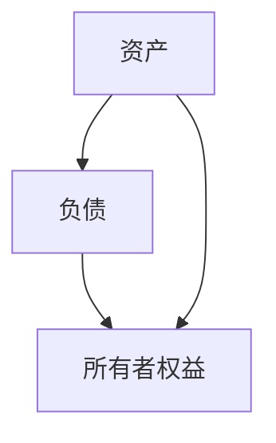
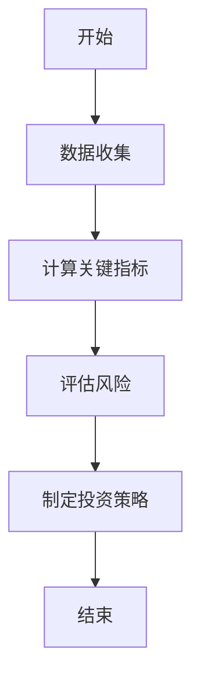
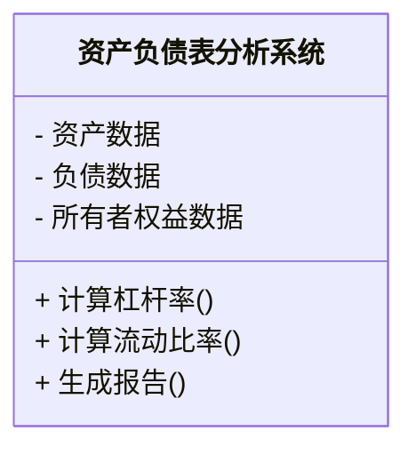
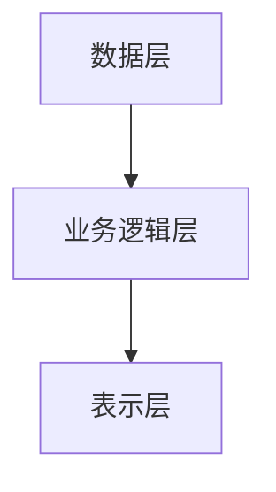

                 


# 大卫德雷曼的资产负债表分析

> 关键词：资产负债表分析、财务健康评估、大卫德雷曼分析、投资决策、财务指标、资产与负债结构、投资策略

> 摘要：大卫德雷曼的资产负债表分析方法是投资决策中的重要工具。本文详细探讨了资产负债表的核心要素、分析方法、数学模型及系统架构，结合实际案例进行深入分析，帮助读者掌握这一分析框架的应用。

---

## 第1章：背景介绍

### 1.1 资产负债表的基本概念

资产负债表是企业财务健康状况的核心体现，记录了企业在某一特定时间点的资产、负债和所有者权益。它通过展示企业的财务状况，帮助投资者评估企业的价值和风险。

#### 资产负债表的构成

资产负债表由三部分组成：资产、负债和所有者权益。

1. **资产**：企业拥有的资源，包括流动资产（如现金、应收账款）和非流动资产（如固定资产）。
2. **负债**：企业欠款，包括短期负债和长期负债。
3. **所有者权益**：企业的净资产，等于资产减去负债。

### 1.2 大卫德雷曼的分析方法

大卫德雷曼是著名的投资专家，他通过独特的分析方法评估企业的财务健康状况。他的方法强调通过资产负债表的关键指标，如杠杆率、流动比率等，来判断企业的财务风险和投资价值。

#### 分析框架

1. **杠杆率**：资产/所有者权益，衡量企业使用债务的程度。
2. **流动比率**：流动资产/流动负债，评估企业的短期偿债能力。

### 1.3 分析的独特视角

大卫德雷曼关注企业的资产与负债结构，通过分析这些结构来预测企业的未来表现。他强调，企业的财务健康不仅影响其当前状况，还影响其长期发展潜力。

---

## 第2章：核心概念与联系

### 2.1 资产、负债、所有者权益的特征对比

通过对比分析，我们可以更好地理解各部分在资产负债表中的作用。

| 特性       | 资产          | 负债          | 所有者权益      |
|------------|---------------|---------------|----------------|
| 定义       | 企业资源      | 企业债务      | 企业净资产      |
| 影响因素   | 经营活动      | 债务融资      | 盈利和股息      |
| 计算公式   | 资产 = 负债 + 所有者权益 | 负债 = 资产 - 所有者权益 | 所有者权益 = 资产 - 负债 |

### 2.2 实体关系图



---

## 第3章：算法原理讲解

### 3.1 分析流程

大卫德雷曼的分析流程包括以下步骤：

1. **数据收集**：获取企业的资产负债表数据。
2. **关键指标计算**：计算杠杆率、流动比率等指标。
3. **风险评估**：根据指标评估企业的财务风险。
4. **投资决策**：基于评估结果，制定投资策略。

#### 流程图



### 3.2 数学模型

#### 杠杆率公式

$$\text{杠杆率} = \frac{\text{资产}}{\text{所有者权益}}$$

#### 流动比率公式

$$\text{流动比率} = \frac{\text{流动资产}}{\text{流动负债}}$$

#### 示例

假设某企业资产为1000万元，所有者权益为200万元，则杠杆率为5。若流动资产为800万元，流动负债为400万元，则流动比率为2。

---

## 第4章：系统分析与架构设计

### 4.1 功能设计

系统功能包括数据输入、指标计算、风险评估和报告生成。

#### 类图



### 4.2 架构设计

系统采用分层架构，包括数据层、业务逻辑层和表示层。

#### 架构图



### 4.3 接口设计

系统提供API接口，供其他系统调用分析结果。

---

## 第5章：项目实战

### 5.1 环境安装

需要安装Python和相关库（如Pandas、Matplotlib）。

### 5.2 核心实现

#### Python代码示例

```python
def calculate_levergae_ratio/assets:
    return assets / equity

assets = 10000000
equity = 2000000
leverage_ratio = calculate_levergae_ratio(assets, equity)
print(f"杠杆率: {leverage_ratio}")
```

### 5.3 案例分析

以某公司为例，分析其财务状况，计算关键指标，并评估投资价值。

---

## 第6章：总结与展望

### 6.1 最佳实践

- 定期更新数据，保持分析的准确性。
- 结合其他财务指标，全面评估企业。

### 6.2 小结

大卫德雷曼的资产负债表分析方法为投资者提供了有效的工具，帮助他们做出明智的投资决策。

### 6.3 注意事项

- 数据的准确性影响分析结果。
- 结合市场环境和其他因素进行综合评估。

### 6.4 拓展阅读

推荐阅读大卫德雷曼的相关书籍，深入理解其分析方法。

---

以上是《大卫德雷曼的资产负债表分析》的详细目录和内容结构。通过系统化的分析和实际案例，读者可以全面掌握这一分析方法的应用。

