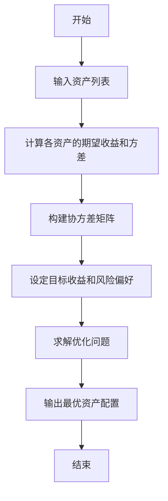

                 


# 大卫斯文森的另类投资策略

## 关键词：大卫·斯文森，另类投资，私募股权，对冲基金，投资组合优化

## 摘要：本文深入分析了大卫·斯文森的另类投资策略，探讨了其在耶鲁大学捐赠基金中的实践、数学模型、算法原理、系统架构设计以及项目实战。通过详细讲解投资组合优化的数学模型和算法实现，结合实际案例分析，为读者提供了一个全面了解大卫·斯文森投资策略的机会，并帮助他们实际应用这些策略。

---

## 第一部分: 大卫·斯文森另类投资策略的背景与核心概念

### 第1章: 另类投资策略的定义与背景

#### 1.1 另类投资的定义与特点
##### 1.1.1 传统投资与另类投资的对比
传统投资主要集中在股票、债券和现金等资产上，而另类投资则包括私募股权、对冲基金、不动产投资和债务投资等多种资产类别。与传统投资相比，另类投资具有更高的收益潜力和更低的相关性，但也伴随着更高的风险和复杂性。

##### 1.1.2 另类投资的核心要素
- **多样化**：通过投资不同类型的资产来分散风险。
- **流动性**：部分另类资产具有较低的流动性，需要较长的投资期限。
- **高门槛**：通常需要较高的最低投资额，且对投资者的资质和经验有较高要求。

##### 1.1.3 大卫·斯文森的另类投资理念
大卫·斯文森是耶鲁大学首席投资官，他主张通过投资私募股权、对冲基金和不动产等多种另类资产来实现长期稳定的收益。他的策略强调资产配置的重要性，并通过分散投资来降低风险。

#### 1.2 大卫·斯文森的贡献与影响
##### 1.2.1 大卫·斯文森的个人背景
大卫·斯文森自1982年起担任耶鲁大学捐赠基金的首席投资官，他的投资策略帮助耶鲁大学捐赠基金实现了超过20%的年化回报率，使其成为全球最大的捐赠基金之一。

##### 1.2.2 斯文森投资策略的核心思想
- **长期投资**：斯文森主张长期持有优质资产，避免频繁交易。
- **多样化配置**：通过投资多种资产类别来分散风险。
- **主动管理**：斯文森认为，通过积极选择和监控投资组合中的资产，可以实现超额收益。

##### 1.2.3 斯文森策略在耶鲁大学捐赠基金中的实践
斯文森将捐赠基金的资金分配到不同类型的另类资产中，包括私募股权、对冲基金、不动产和债务投资。他强调对投资对象的深入研究和长期持有。

#### 1.3 另类投资的现状与趋势
##### 1.3.1 当前另类投资市场的特点
- **增长迅速**：随着机构投资者和个人投资者对另类资产的兴趣增加，市场规模不断扩大。
- **复杂性增加**：另类资产的投资门槛高，且需要专业的知识和经验。
- **监管趋严**：全球监管机构对另类投资的监管力度加大，以确保市场的透明度和合规性。

##### 1.3.2 另类投资的未来发展方向
随着技术的进步和市场的变化，另类投资将更加依赖数据分析和自动化交易。同时，环境、社会和治理（ESG）因素也将成为投资决策中的重要考量。

##### 1.3.3 斯文森策略的持续价值
尽管市场环境不断变化，斯文森的策略依然具有重要的参考价值。他的投资理念强调长期视角和多样化配置，这在当前的市场环境中依然适用。

### 第2章: 另类投资的核心概念与框架

#### 2.1 另类投资的主要类型
##### 2.1.1 私募股权
私募股权是指对未上市公司进行投资，并通过长期持有和增值后出售实现收益。私募股权的风险较高，但潜在回报也较大。

##### 2.1.2 对冲基金
对冲基金通过做多和做空多种资产来对冲市场风险，并追求绝对收益。对冲基金的策略多样，包括套利、事件驱动和宏观对冲等。

##### 2.1.3 不动产投资
不动产投资包括投资房地产和房地产相关的产品。房地产市场的周期性波动较低，且通常具有较高的流动性溢价。

##### 2.1.4 债务投资
债务投资包括投资公司债、政府债券和高收益债券等。债务投资的风险和收益通常介于股票和债券之间。

##### 2.1.5 其他另类资产
其他另类资产包括商品（如黄金、原油）、基础设施和私人债务等。这些资产具有不同的风险和收益特征，可以进一步分散投资组合的风险。

#### 2.2 另类投资的风险与收益分析
##### 2.2.1 另类投资的风险特征
- **流动性风险**：部分另类资产的流动性较低，可能导致变现困难。
- **市场风险**：另类资产的价格受市场波动影响，可能面临较大的价格波动。
- **信用风险**：债务投资面临债务人违约的风险。

##### 2.2.2 另类投资的收益来源
- **资本增值**：通过资产价格上涨实现收益。
- **股息和利息收入**：通过持有资产获得定期的现金流。
- **套利机会**：通过对市场价差的捕捉实现收益。

##### 2.2.3 风险-收益权衡分析
不同的另类资产具有不同的风险-收益特征。例如，私募股权的风险较高，但潜在回报也较大；而对冲基金的风险和收益相对平衡。

#### 2.3 斯文森投资策略的核心框架
##### 2.3.1 资产配置的重要性
斯文森强调资产配置的重要性，认为通过合理的资产配置可以实现风险分散和收益最大化。他通常将捐赠基金的资金分配到8种不同的资产类别中，包括私募股权、对冲基金、不动产和债务投资等。

##### 2.3.2 投资期限与流动性管理
斯文森的投资策略强调长期投资，通常将资金分配到流动性较低的资产中。他通过长期持有优质资产来实现收益最大化。

##### 2.3.3 风险分散与组合优化
斯文森通过投资多种类型的资产来分散风险，并通过优化投资组合的构成来实现收益最大化。他通常使用现代投资组合理论（MPT）来优化资产配置。

### 第3章: 另类投资的数学模型与算法原理

#### 3.1 投资组合优化的数学模型
##### 3.1.1 现代投资组合理论（MPT）
现代投资组合理论（MPT）是由哈里·马科维茨提出的，旨在通过优化投资组合的资产配置来实现风险最小化和收益最大化。MPT的核心是通过分散投资来降低风险。

##### 3.1.2 均值-方差优化
均值-方差优化是一种优化方法，旨在在给定的收益水平下最小化投资组合的风险，或者在给定的风险水平下最大化收益。均值-方差优化的核心是通过计算资产的期望收益和协方差矩阵来优化投资组合。

##### 3.1.3 资产分配的数学公式
现代投资组合理论（MPT）的核心公式是：

$$
\sigma^2 = \mathbf{w}^T \Sigma \mathbf{w}
$$

其中，$\sigma^2$ 是投资组合的方差，$\mathbf{w}$ 是资产权重向量，$\Sigma$ 是资产的协方差矩阵。

#### 3.2 投资组合优化的算法实现
##### 3.2.1 算法流程图
以下是投资组合优化的算法流程图：



##### 3.2.2 Python代码实现
以下是一个简单的投资组合优化的Python代码示例：

```python
import numpy as np
from scipy.optimize import minimize

def portfolio_optimization(returns, cov_matrix, target_return):
    n = len(returns)
    # 定义优化目标函数
    def objective(weights):
        return -np.sum(weights * returns)
    
    # 定义约束条件
    constraints = []
    constraints.append({'type': 'eq', 'fun': lambda w: np.sum(w) - 1.0})
    constraints.append({'type': 'eq', 'fun': lambda w: np.dot(w, returns) - target_return})
    
    # 定义边界条件
    bounds = [(0.0, 1.0) for _ in range(n)]
    
    # 求解优化问题
    result = minimize(objective, np.ones(n)/n, bounds=bounds, constraints=constraints)
    
    return result.x

# 示例数据
n = 3
returns = np.array([0.1, 0.15, 0.08])
cov_matrix = np.array([
    [0.02, 0.01, 0.01],
    [0.01, 0.03, 0.02],
    [0.01, 0.02, 0.03]
])

target_return = 0.12

weights = portfolio_optimization(returns, cov_matrix, target_return)
print("优化后的权重为:", weights)
```

##### 3.2.3 投资组合优化的数学模型
以下是投资组合优化的数学模型：

$$
\text{minimize} \quad \mathbf{w}^T \Sigma \mathbf{w}
$$

$$
\text{subject to} \quad \mathbf{w}^T \mathbf{r} = r_{\text{target}}
$$

$$
\text{和} \quad \mathbf{w}^T \mathbf{1} = 1
$$

其中，$\mathbf{w}$ 是资产权重向量，$\Sigma$ 是资产的协方差矩阵，$\mathbf{r}$ 是资产的期望收益向量，$r_{\text{target}}$ 是目标收益水平。

---

## 总结

大卫·斯文森的另类投资策略是一种以长期视角和多样化配置为核心的投资方法，通过投资私募股权、对冲基金、不动产和其他另类资产来实现收益最大化和风险分散。本文通过详细讲解投资组合优化的数学模型和算法实现，结合实际案例分析，为读者提供了一个全面了解大卫·斯文森投资策略的机会，并帮助他们实际应用这些策略。

---

### 最佳实践 Tips

- **风险控制**：在进行另类投资时，务必做好风险评估和管理，避免过度集中于某一类型资产。
- **市场适应性**：根据市场环境的变化及时调整投资策略，保持投资组合的灵活性。
- **长期视角**：斯文森的成功离不开他对长期投资的坚持，投资者应保持耐心，避免短期波动的影响。

通过本文的讲解，您应该能够更好地理解大卫·斯文森的另类投资策略，并在实际投资中加以应用。

