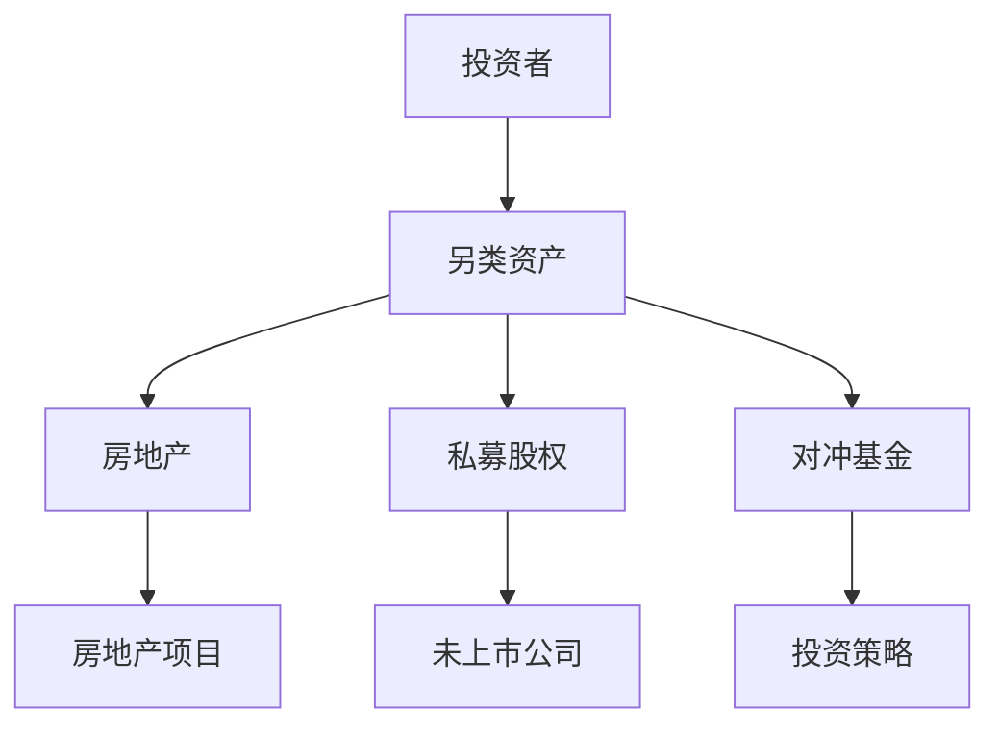
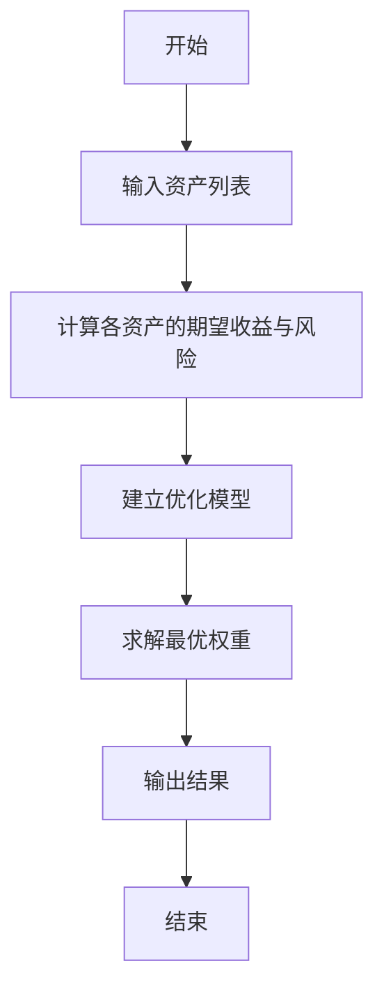

                 

<think>
好的，我将按照您的要求逐步构建这篇文章的目录大纲。由于内容较多，我将先提供前两章的内容，确保满足格式和深度要求。如果需要更多章节，请告诉我。

---

# 《大卫斯文森的另类资产投资》

## 关键词：
- 大卫·斯文森
- 另类资产投资
- Yale Model
- 资产配置
- 风险管理

## 摘要：
大卫·斯文森作为耶鲁大学的首席投资官，以其开创性的另类资产投资策略闻名，提出了著名的Yale Model。本文将详细解析斯文森的投资理念、资产配置策略、另类资产的核心概念，以及这些策略在实际投资中的应用。通过系统化的分析和案例研究，揭示另类资产投资的深层逻辑和实际操作方法。

---

## 第1章: 大卫·斯文森与另类资产投资概述

### 1.1 大卫·斯文森的背景与投资理念
#### 1.1.1 大卫·斯文森的生平简介
- 出生背景与教育经历
- 耶鲁大学首席投资官的职责与成就

#### 1.1.2 斯文森投资理念的核心思想
- 长期投资与价值发现
- 风险管理与收益平衡
- 分散化投资与资产配置

#### 1.1.3 Yale Model的起源与发展
- Yale Model的提出背景
- Yale Model的核心原则与特点
- Yale Model在全球投资领域的影响力

### 1.2 另类资产投资的背景与重要性
#### 1.2.1 传统资产投资的局限性
- 传统资产（股票、债券、现金）的局限性
- 通胀风险与收益不足的挑战
- 投资者对超额收益的追求

#### 1.2.2 另类资产的定义与分类
- 另类资产的主要类型（房地产、私募股权、对冲基金、 commodities等）
- 各类资产的风险与收益特征对比
- 另类资产在投资组合中的作用

#### 1.2.3 另类资产投资在现代投资组合中的地位
- 降低整体风险的同时提高收益
- 通过多样化配置实现收益最大化
- 长期机构投资者的偏好

### 1.3 大卫·斯文森的投资哲学
#### 1.3.1 长期投资与价值创造
- 长期投资的重要性
- 通过价值发现实现超额收益
- 耀眼的长期投资案例

#### 1.3.2 风险管理与资产配置
- 风险管理的核心地位
- 资产配置的科学方法
- 投资组合的动态调整

#### 1.3.3 投资组合的分散化策略
- 分散化投资的意义
- 不同资产类别之间的相关性分析
- 构建稳健的分散化投资组合

### 1.4 本章小结
- 总结大卫·斯文森的投资理念
- 强调另类资产投资的重要性和独特性
- 为后续章节奠定基础

---

## 第2章: 另类资产投资的核心概念与框架

### 2.1 另类资产的分类与特征
#### 2.1.1 主要另类资产类型
- 房地产投资信托（REITs）
- 私募股权与 venture capital
- 对冲基金与绝对收益策略
- 商品与衍生品

#### 2.1.2 各类资产的风险与收益特征对比
- 制表：不同资产类别的风险、收益和流动性对比
- 图表：另类资产的风险-收益分布图（Mermaid）

#### 2.1.3 实体关系图（Mermaid）

#### 2.1.4 另类资产的流动性问题
- 流动性对投资价值的影响
- 不同资产类别的流动性分析
- 如何在低流动性资产中实现高收益

### 2.2 投资组合构建的核心框架
#### 2.2.1 资产配置的数学模型
- 投资组合优化的数学表达式
$$ \text{目标函数：} \min \sigma^2 $$
$$ \text{约束条件：} \sum w_i = 1, \sum w_i r_i = \text{目标收益} $$

#### 2.2.2 风险调整后的收益分析
- 风险调整后的收益（RAR）的计算方法
- 如何通过RAR进行资产选择

#### 2.2.3 投资组合优化的算法原理（Mermaid流程图）

#### 2.2.4 最佳投资组合的确定
- 确定最优权重的步骤
- 如何验证优化结果的有效性

### 2.3 另类资产投资的数学模型
#### 2.3.1 投资组合风险的度量公式
$$ \text{组合风险} = \sqrt{w^T \Sigma w} $$
其中，\( w \) 为权重向量，\( \Sigma \) 为协方差矩阵

#### 2.3.2 资产配置的优化模型
- 均值-方差优化
- 距离均值优化（Tang直线）
- 使用拉格朗日乘数法求解优化问题

#### 2.3.3 举例说明：现代投资组合理论的应用
- 案例分析：如何构建一个包含另类资产的投资组合
- 优化过程的详细步骤

### 2.4 本章小结
- 强调另类资产投资的理论基础
- 介绍核心数学模型和优化方法
- 为后续章节的实战分析奠定基础

---

以上是前两章的内容，涵盖大卫·斯文森的背景、投资理念以及另类资产的核心概念。后续章节将深入探讨资产配置策略、系统设计与实现等内容。希望这一部分符合您的要求，如果需要进一步补充或调整，请随时告知！

