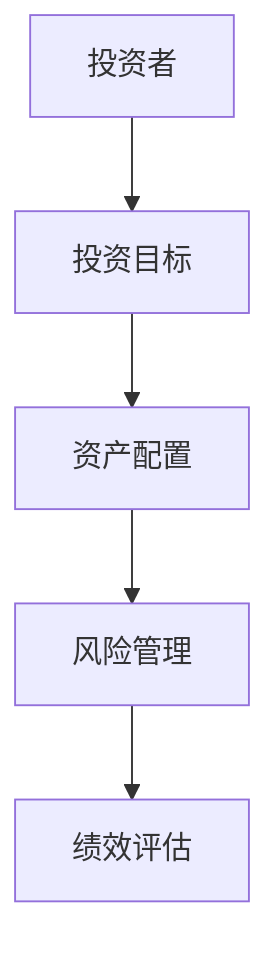
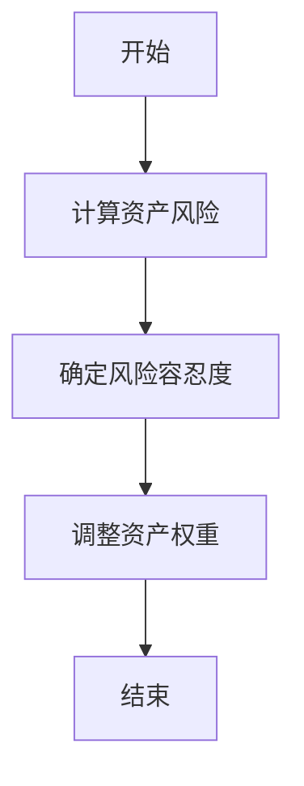
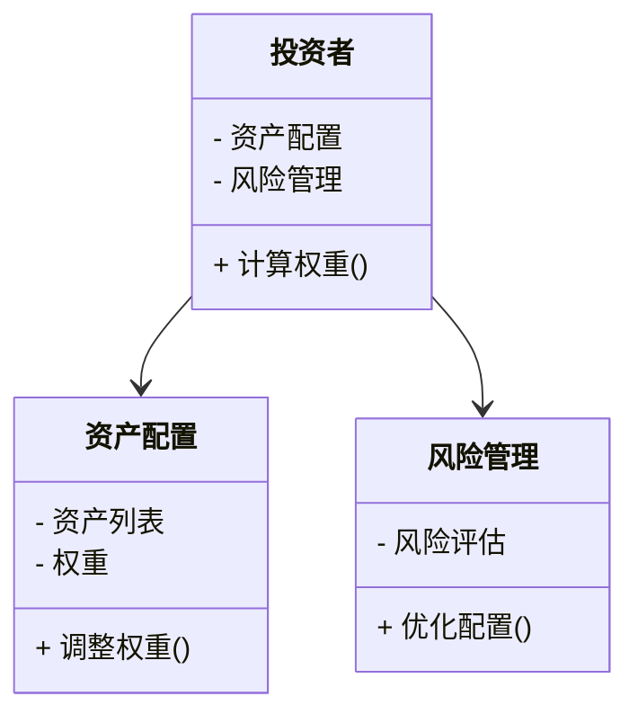
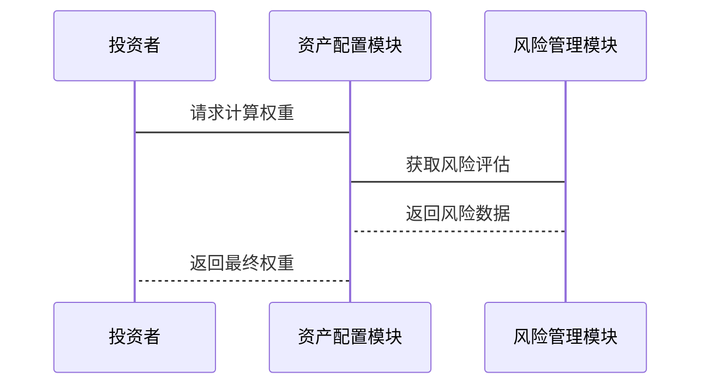

                 


# 大卫斯文森的耐心资本理念

> 关键词：耐心资本、大卫·斯文森、投资策略、风险管理、资产配置、捐赠基金

> 摘要：本文深入探讨了大卫·斯文森提出的耐心资本理念，从其背景、核心概念、数学模型到实际应用，全面分析了这一理念在投资领域的独特价值和实践意义。

---

# 第一部分: 耐心资本理念的背景与核心概念

## 第1章: 耐心资本理念的起源与发展

### 1.1 耐心资本的起源
#### 1.1.1 耐心资本的定义与核心思想
耐心资本（Patient Capital）是一种长期导向的投资理念，强调通过长期持有优质资产，追求稳定的复利增长。大卫·斯文森（David Swensen）作为耶鲁大学捐赠基金的首席投资官，是该理念的主要倡导者。他认为，投资者应以耐心的态度对待市场波动，避免短期投机，专注于长期价值。

#### 1.1.2 大卫·斯文森的背景与贡献
大卫·斯文森在耶鲁大学捐赠基金的管理中，成功将耐心资本的理念付诸实践，使基金的收益率远超市场平均水平。他的投资策略强调分散化和长期持有，为机构投资者树立了典范。

#### 1.1.3 耐心资本理念的演变历程
耐心资本理念起源于20世纪80年代，随着全球市场的波动和机构投资的发展，这一理念不断完善，逐渐成为机构投资的重要策略。

---

### 1.2 耐心资本的核心原则
#### 1.2.1 长期投资的哲学
耐心资本的核心是长期投资，相信市场会随着时间的推移趋向合理。斯文森认为，短期波动不应影响长期投资决策。

#### 1.2.2 分散化投资的智慧
通过分散投资，降低特定资产或行业的风险。斯文森建议将资产分配到多个领域，以平衡风险和收益。

#### 1.2.3 风险管理的艺术
耐心资本强调审慎的风险管理，通过定期评估和调整资产配置，确保投资组合的稳健性。

---

## 第2章: 耐心资本理念的核心概念与联系

### 2.1 耐心资本的核心要素
#### 2.1.1 投资目标的明确性
明确的投资目标是耐心资本的基础，斯文森强调，投资决策应基于长期目标，而非短期收益。

#### 2.1.2 资产配置的科学性
科学的资产配置是耐心资本的核心，斯文森提出，应根据市场环境和投资目标动态调整资产分配。

#### 2.1.3 风险控制的严格性
严格的风控措施是确保投资组合稳健的关键，斯文森建议定期审查和优化投资组合。

---

### 2.2 耐心资本与传统投资的对比
#### 2.2.1 投资理念的差异
耐心资本强调长期投资和分散化，而传统投资更注重短期收益和集中投资。

#### 2.2.2 投资策略的对比
耐心资本策略包括多元化的资产配置和长期持有，而传统策略可能更关注市场波动和短期交易。

#### 2.2.3 风险管理的异同
耐心资本注重长期风险管理，而传统投资可能更关注短期波动。

---

### 2.3 耐心资本的ER实体关系图


---

## 第3章: 耐心资本理念的数学模型与算法原理

### 3.1 资产配置的数学模型
#### 3.1.1 资产配置的公式表示
$$ w_i = \frac{r_i}{\sum_{j=1}^{n} r_j} $$
其中，$w_i$ 表示第 $i$ 个资产的权重，$r_i$ 表示第 $i$ 个资产的风险调整后收益。

---

### 3.2 风险管理的算法流程


---

### 3.3 算法实现的Python代码
```python
def calculate_asset_weights(risks):
    total_risk = sum(risks)
    weights = [risk / total_risk for risk in risks]
    return weights

# 示例输入
risks = [0.2, 0.3, 0.5]
weights = calculate_asset_weights(risks)
print(weights)
```

---

## 第4章: 系统分析与架构设计方案

### 4.1 问题场景介绍
耐心资本理念的应用需要一个高效的管理系统，能够实时监控市场波动，调整资产配置，并评估投资绩效。

---

### 4.2 系统功能设计
#### 4.2.1 领域模型（Mermaid 类图）


---

### 4.3 系统架构设计（Mermaid 架构图）
```mermaid
container 客户端 {
    投资者
}
container 服务端 {
    资产配置模块
    风险管理模块
}
investor (客户端) --> 资产配置模块 (服务端)
investor --> 风险管理模块
```

---

### 4.4 系统交互设计（Mermaid 序列图）


---

## 第5章: 项目实战与应用案例

### 5.1 环境安装
需要安装Python、NumPy和Matplotlib等工具。

---

### 5.2 核心代码实现
```python
import numpy as np
import matplotlib.pyplot as plt

def plot_portfolio_weights(weights):
    plt.bar(range(len(weights)), weights)
    plt.title('资产配置权重')
    plt.xlabel('资产')
    plt.ylabel('权重')
    plt.show()

# 示例调用
risks = [0.2, 0.3, 0.5]
weights = calculate_asset_weights(risks)
plot_portfolio_weights(weights)
```

---

### 5.3 实际案例分析
以耶鲁大学捐赠基金为例，分析耐心资本理念的应用效果。

---

## 第6章: 最佳实践与小结

### 6.1 最佳实践
- 定期审查和调整资产配置。
- 保持长期投资视角。
- 严格控制投资风险。

---

### 6.2 小结
耐心资本理念通过长期投资和分散化，为机构投资者提供了稳健的投资策略。斯文森的成功实践证明了这一理念的有效性。

---

## 第7章: 注意事项与拓展阅读

### 7.1 注意事项
- 避免过度分散投资。
- 定期评估市场环境变化。
- 严格遵守风险控制原则。

---

### 7.2 拓展阅读
- 《机构投资的创新之路》
- 《大卫·斯文森的投资哲学》
- 《资产配置的艺术》

---

# 结语
耐心资本理念不仅是一种投资策略，更是一种长期稳健的思维方式。通过科学的资产配置和严格的风险管理，投资者可以在复杂多变的市场中实现长期稳定的收益。

--- 

本文通过系统的分析和详细的案例，全面解读了大卫·斯文森的耐心资本理念，为投资者提供了深刻的启发和实践指导。

