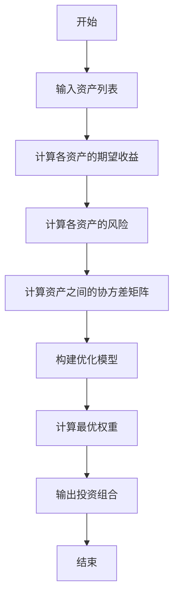
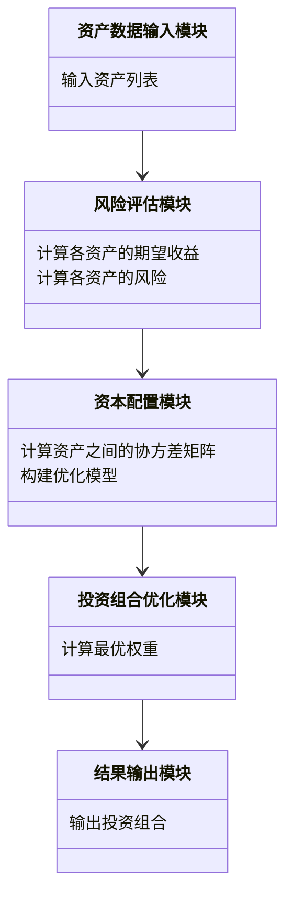

                 

---

# 《大卫斯文森的长期资本配置》

## 关键词：长期资本配置，大卫·斯文森，资产配置，投资策略，风险管理，数学模型

## 摘要：本文系统地介绍了大卫·斯文森的长期资本配置理论与实践，结合现代投资组合理论（MPT），详细分析了长期资本配置的数学模型、算法实现、系统架构及投资策略。通过大卫·斯文森在耶鲁大学的实践案例，本文探讨了长期资本配置的核心理念、风险控制方法及动态调整策略，并通过系统分析与架构设计，展示了如何将理论应用于实际投资管理中。

---

## 第一部分: 长期资本配置的理论基础

### 第1章: 长期资本配置的定义与背景

#### 1.1 长期资本配置的定义

长期资本配置是指在较长的时间跨度内，将资金分配到不同的资产类别或投资工具中，以实现特定的财务目标。与短期投资不同，长期资本配置强调稳定性和可持续性，注重资产的长期增值和风险控制。其核心在于通过合理的资产分配，平衡风险与收益，实现资产的最优配置。

#### 1.2 大卫·斯文森与长期资本配置

大卫·斯文森（David Swensen）是耶鲁大学（Yale University）的首席投资官，以其成功的长期资本配置策略闻名。他在耶鲁大学的实践中，通过分散化投资、长期视角和动态调整，实现了机构投资的优异回报。斯文森的长期资本配置理念不仅在学术界得到了广泛应用，也在实践中被证明是有效的。

#### 1.3 长期资本配置的理论基础

现代投资组合理论（Modern Portfolio Theory, MPT）是长期资本配置的理论基础。MPT的核心思想是通过分散投资降低风险，同时在给定风险水平下最大化收益。长期资本配置的目标是在风险可控的前提下，实现资产的长期增值。

---

## 第二部分: 大卫·斯文森的投资策略

### 第2章: 斯文森的投资原则

#### 2.1 斯文森的七项投资原则

斯文森的投资原则是长期资本配置的核心理念，包括以下七项原则：

1. **分散化投资**：通过投资不同类型资产降低风险。
2. **长期视角**：关注资产的长期表现，避免短期波动的影响。
3. **资产配置的重要性**：合理分配资产类别，以平衡风险和收益。
4. **风险管理**：定期评估和调整投资组合，以应对市场变化。
5. **动态调整**：根据市场环境变化，及时优化资产配置。
6. **低成本投资**：选择费用低的基金或投资工具，提高净收益。
7. **耐心资本**：长期持有优质资产，避免频繁交易。

#### 2.2 斯文森的投资策略与实践

斯文森在耶鲁大学的投资实践中，采用全球资产配置模型，包括股票、债券、房地产等多种资产类别。他强调分散化和风险控制，通过动态调整优化投资组合。斯文森的全球资产配置模型为机构投资者提供了重要的参考。

---

## 第三部分: 资本配置模型与算法

### 第3章: 资本配置的数学模型

#### 3.1 现代投资组合理论（MPT）的数学公式

现代投资组合理论（MPT）的核心公式包括：

- **投资组合的期望收益**：\( E(R_p) = \sum w_i E(R_i) \)
- **投资组合的风险**：\( \sigma_p^2 = \sum \sum w_i w_j \sigma_{ij} \)
- **最优权重计算**：使用均值-方差优化模型，找到使风险最小化或收益最大化的权重组合。

#### 3.2 资本配置的算法实现

资本配置的算法实现步骤如下：

1. **输入**：资产列表、历史收益数据、协方差矩阵。
2. **计算**：各资产的期望收益、风险和协方差。
3. **优化**：构建优化模型，计算最优权重。
4. **输出**：投资组合的配置建议。

#### 3.3 投资组合优化流程图

---

## 第四部分: 系统分析与架构设计

### 第4章: 投资管理系统的设计

#### 4.1 系统功能模块划分

投资管理系统的主要功能模块包括：

- **资产数据输入模块**：接收资产数据。
- **风险评估模块**：计算各资产的风险。
- **资本配置模块**：根据模型分配权重。
- **投资组合优化模块**：优化投资组合。
- **结果输出模块**：展示配置结果。

#### 4.2 系统架构设计

---

## 总结

大卫·斯文森的长期资本配置理论与实践为投资者提供了重要的参考。通过现代投资组合理论（MPT）的数学模型和算法实现，结合系统的架构设计，投资者可以更好地进行长期资本配置。未来，随着市场环境的变化和新技术的应用，长期资本配置的研究和实践将更加丰富和深入。

--- 

**注意事项**：
- 长期资本配置需要根据市场环境和投资者目标进行动态调整。
- 在实际操作中，建议结合专业投资顾问的意见进行配置。
- 投资者应关注市场的长期趋势，避免短期波动的影响。

**拓展阅读**：
- 《投资学》（教材）
- 现代投资组合理论（MPT）的相关文献
- 大卫·斯文森的其他投资理念和实践案例

