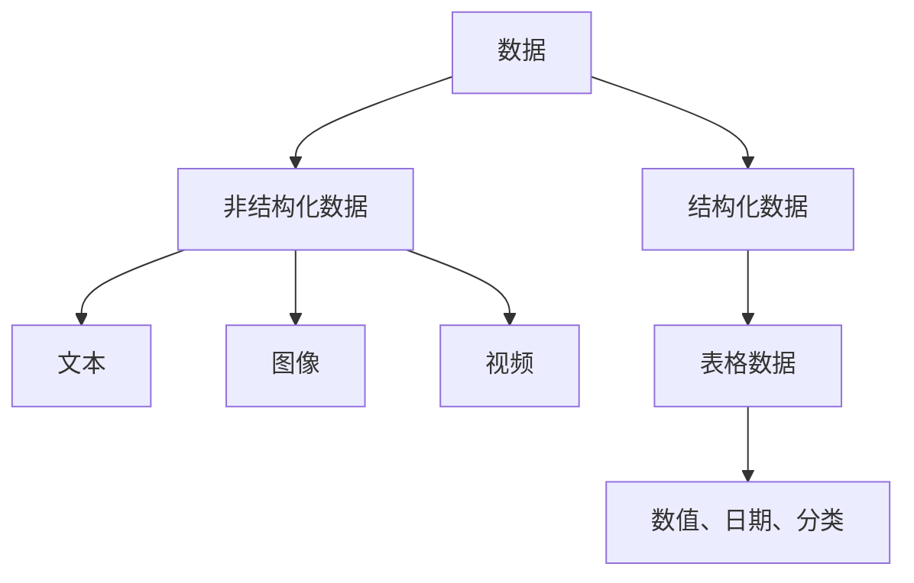
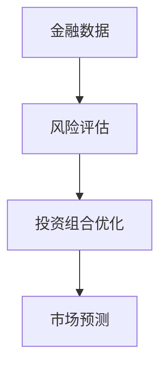
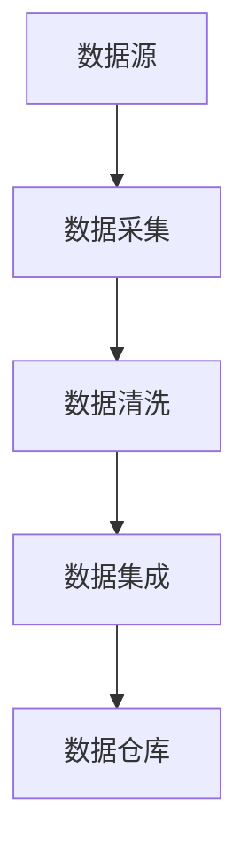
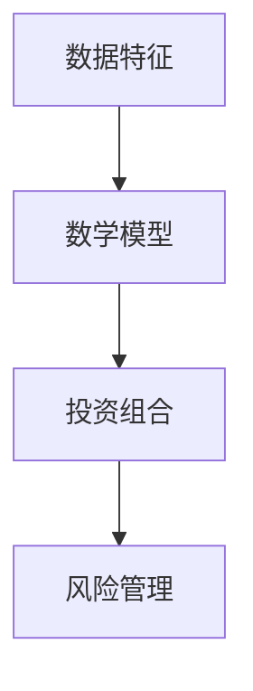

                 


# 大数据分析在各行业应用的投资价值

> **关键词**: 大数据分析, 投资价值, 金融行业, 医疗行业, 零售行业, 数据挖掘, 机器学习

> **摘要**: 大数据分析作为一种新兴的技术手段，正在被广泛应用于各个行业。本文将深入探讨大数据分析在金融、医疗、零售等行业的应用，并分析其投资价值。通过理论分析和实际案例，本文旨在为投资者提供有价值的参考。

---

## 第一部分: 大数据分析的背景与核心概念

### 第1章: 大数据分析的基本概念

#### 1.1 大数据分析的定义与特点

- **1.1.1 数据的定义与分类**
  - 数据是信息的载体，可以是结构化数据（如表格数据）或非结构化数据（如文本、图像）。
  - 数据的分类：文本、数值、日期、分类数据等。

- **1.1.2 大数据分析的核心特点**
  - **Volume**: 数据量大。
  - **Velocity**: 数据产生速度快。
  - **Variety**: 数据类型多样。
  - **Value**: 数据价值密度低，但整体价值高。
  - **Veracity**: 数据的真实性与可靠性。

- **1.1.3 大数据分析与传统数据分析的区别**
  - 传统数据分析主要处理结构化数据，而大数据分析处理各种类型的数据。
  - 大数据分析强调实时性和预测性，而传统分析更注重描述性。



#### 1.2 大数据分析的背景与发展趋势

- **1.2.1 信息技术发展的推动作用**
  - 技术进步推动数据产生和处理能力提升。
  - 互联网、物联网等技术促进了数据的爆炸式增长。

- **1.2.2 大数据时代的到来与特征**
  - 数据量急剧增加，数据类型多样化。
  - 数据处理技术从传统数据库向分布式存储和并行计算转变。

- **1.2.3 大数据分析的未来发展**
  - 更加智能化和自动化。
  - 与人工智能、机器学习深度融合。

---

### 第2章: 大数据分析在各行业的应用现状

#### 2.1 金融行业的应用

- **2.1.1 金融数据分析的基本原理**
  - 金融数据包括股票价格、交易记录、市场指数等。
  - 数据分析用于风险评估、投资组合优化和市场预测。

- **2.1.2 金融风险评估与预测**
  - 使用时间序列分析预测市场波动。
  - 通过逻辑回归模型评估信用风险。

- **2.1.3 投资组合优化**
  - 使用均值-方差模型优化投资组合。
  - 考虑市场风险和流动性风险。



#### 2.2 医疗行业的应用

- **2.2.1 医疗数据分析的基本原理**
  - 医疗数据包括电子健康记录、基因数据、影像数据等。
  - 数据分析用于疾病预测、诊断支持和治疗方案优化。

- **2.2.2 疾病预测与诊断支持**
  - 使用机器学习算法分析电子健康记录，预测疾病风险。
  - 图像识别技术辅助诊断，如X光片分析。

- **2.2.3 医疗资源优化配置**
  - 分析患者流量，优化医院资源分配。
  - 预测药品需求，降低库存成本。

#### 2.3 零售行业的应用

- **2.3.1 零售数据分析的基本原理**
  - 数据包括销售数据、客户行为数据、库存数据等。
  - 数据分析用于客户细分、需求预测和供应链优化。

- **2.3.2 消费者行为分析**
  - 使用聚类分析进行客户细分。
  - 分析购买历史，预测未来需求。

- **2.3.3 供应链优化**
  - 使用线性规划模型优化库存管理。
  - 分析物流数据，降低运输成本。

---

## 第二部分: 大数据分析的核心概念与技术

### 第3章: 大数据分析的核心技术

#### 3.1 数据采集与预处理

- **3.1.1 数据采集的基本方法**
  - 数据采集工具：数据库查询、API调用、日志解析等。
  - 数据清洗：处理缺失值、异常值、重复数据。

- **3.1.2 数据集成与转换**
  - 数据集成：将多个数据源整合到统一数据仓库。
  - 数据转换：数据格式转换、数据标准化。



#### 3.2 数据存储与管理

- **3.2.1 数据库的基本概念**
  - 关系型数据库：MySQL、PostgreSQL。
  - 非关系型数据库：MongoDB、Redis。

- **3.2.2 数据仓库与大数据存储技术**
  - 数据仓库：用于存储和分析大量数据。
  - 大数据存储技术：Hadoop、Hive、HBase。

- **3.2.3 分布式存储系统**
  - 分布式文件系统：Hadoop HDFS。
  - 分布式数据库：HBase、Cassandra。

#### 3.3 数据分析与挖掘

- **3.3.1 数据分析的基本方法**
  - 描述性分析：总结数据特征。
  - 预测性分析：预测未来趋势。
  - 实验性分析：因果关系分析。

- **3.3.2 数据挖掘的核心算法**
  - 聚类算法：K-means。
  - 分类算法：决策树、随机森林。
  - 回归算法：线性回归。

---

### 第4章: 投资价值评估模型

#### 4.1 模型构建

- **4.1.1 数据特征提取**
  - 选择影响投资价值的关键变量。
  - 数据标准化和归一化处理。

- **4.1.2 评价指标**
  - 准确率、召回率、F1分数。
  - ROC曲线和AUC值。

#### 4.2 投资决策支持

- **4.2.1 投资组合优化**
  - 使用数学模型优化资产配置。
  - 考虑市场波动和风险偏好。

- **4.2.2 风险管理**
  - 通过VaR（在险值）模型评估投资风险。
  - 利用压力测试模拟极端市场情况。



---

## 第三部分: 项目实战

### 5.1 项目背景

- 项目目标：分析某行业的大数据，评估投资价值。
- 数据来源：公开数据集或企业内部数据。

### 5.2 系统设计

- **5.2.1 系统架构**
  - 数据采集层：数据接口。
  - 数据处理层：数据清洗、转换。
  - 数据分析层：模型训练、预测。
  - 数据可视化层：结果展示。


### 5.3 核心代码实现

- **数据清洗代码**
  ```python
  import pandas as pd

  df = pd.read_csv('data.csv')
  df.dropna(inplace=True)
  ```

- **模型训练代码**
  ```python
  from sklearn.model import LinearRegression

  model = LinearRegression()
  model.fit(X_train, y_train)
  ```

---

## 第四部分: 最佳实践与总结

### 6.1 经验总结

- 数据质量是关键，确保数据准确性和完整性。
- 模型选择要根据具体问题，尝试多种算法。
- 结果解释要清晰，便于决策者理解。

### 6.2 投资策略建议

- 根据行业特点选择合适的数据分析方法。
- 结合市场趋势和公司基本面进行综合判断。
- 定期更新模型，适应市场变化。

### 6.3 未来展望

- 更多行业将应用大数据分析。
- 技术将更加智能化和自动化。
- 人工智能将与大数据分析深度融合，提供更强大的决策支持。

---

通过以上结构，本文系统地分析了大数据分析在各行业的应用及其投资价值，为投资者提供了理论和实践指导。希望本文能为相关领域的读者提供有价值的参考。

