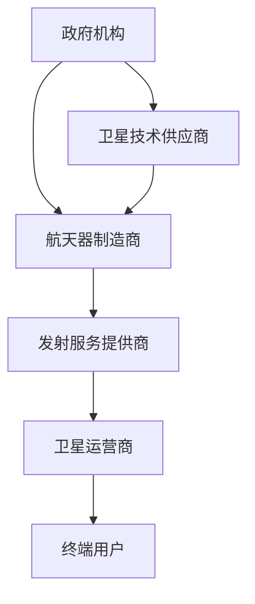
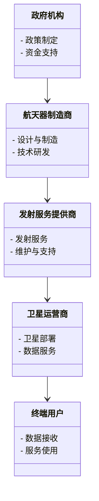
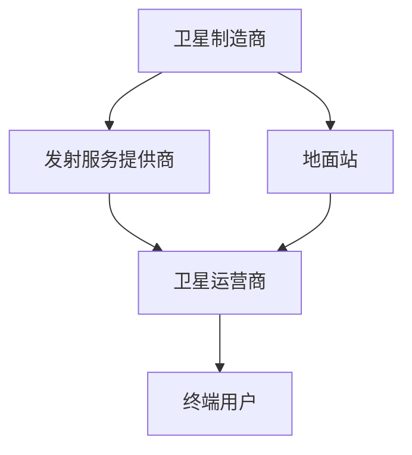

                 


# 太空经济：新兴投资领域的风险与回报

> 关键词：太空经济, 投资风险, 商业航天, 卫星技术, 深空探索

> 摘要：太空经济作为新兴的投资领域，正吸引着越来越多的投资者关注。本文将从太空经济的背景、核心概念、产业链分析、投资机会与风险、数学模型与风险评估、系统架构与项目实战、最佳实践等方面进行详细分析，探讨其在投资领域的潜力与挑战，帮助投资者更好地理解和把握太空经济的机遇与风险。

---

## 第一部分：太空经济的背景与定义

### 第1章：太空经济的定义与背景

#### 1.1 太空经济的定义与背景

太空经济是指围绕太空资源开发、卫星技术应用、商业航天服务等领域所形成的经济体系。与传统经济不同，太空经济涉及的技术复杂度高、投资周期长、回报潜力大，且具有高度的前沿性和创新性。

#### 1.2 太空经济的核心构成要素

太空经济的核心构成要素包括：

- **卫星技术**：卫星通信、遥感技术和导航系统的研发与应用。
- **商业航天**：发射服务、航天器制造和深空探索任务。
- **太空资源**：月球、小行星等天体的资源开发与利用。

#### 1.3 太空经济与其他经济领域的对比

太空经济与其他经济领域的对比如下：

| 经济领域 | 技术复杂度 | 投资周期 | 市场潜力 |
|----------|------------|----------|----------|
| 传统制造业 | 中等 | 中等 | 有限 |
| 信息技术 | 高 | 长 | 巨大 |
| 太空经济 | 极高 | 极长 | 未知 |

---

### 第2章：太空经济的核心概念与产业链

#### 2.1 太空经济的产业链分析

太空经济的产业链由多个环节构成，各环节之间的关系可以用以下Mermaid图表示：



#### 2.2 太空经济的主要商业模式

太空经济的主要商业模式包括：

- **政府采购模式**：政府直接采购航天服务和技术。
- **商业航天模式**：由私营企业主导的发射服务和卫星应用。
- **资源开发模式**：私营企业投资开发月球、小行星等天体资源。

---

## 第二部分：太空经济的投资机会与风险分析

### 第3章：太空经济的投资机会

#### 3.1 卫星通信与互联网

- **市场潜力**：卫星互联网的市场规模预计将在未来十年内达到数千亿美元。
- **技术挑战**：低轨卫星星座的建设和维护成本高昂。
- **投资机会**：参与卫星通信技术的研发和商业化应用。

#### 3.2 太空资源开发

- **资源潜力**：月球、小行星等地域蕴藏着丰富的矿产资源。
- **技术风险**：资源开发的技术难度极高，且成本巨大。
- **政策影响**：国际法和地缘政治对资源开发的影响显著。

#### 3.3 商业航天服务

- **市场需求**：发射服务、太空旅游等商业航天服务的需求不断增长。
- **竞争格局**：SpaceX、Blue Origin等企业的竞争加剧了市场的不确定性。
- **投资机会**：参与商业航天服务的上下游产业链投资。

---

### 第4章：太空经济的主要风险

#### 4.1 技术风险

- **技术可行性**：太空技术的研发周期长，失败风险高。
- **研发成本**：高额的研发投入可能难以回收。
- **技术替代**：新技术的出现可能迅速淘汰现有技术。

#### 4.2 市场风险

- **市场需求**：太空经济的市场需求受政策和技术的影响波动较大。
- **竞争格局**：行业内的竞争可能导致价格压力和利润率下降。
- **市场进入壁垒**：高技术门槛和高昂的投资成本限制了新进入者。

#### 4.3 政策与法律风险

- **政策不确定性**：各国政府的政策变化可能对太空经济产生重大影响。
- **国际法问题**：太空资源的开发涉及复杂的国际法律问题。
- **监管风险**：严格的监管可能限制企业的创新和发展。

---

## 第三部分：太空经济的数学模型与风险评估

### 第5章：太空经济的数学模型构建

#### 5.1 模型假设

- 投资项目的回报率与技术成功概率成正比。
- 投资成本与技术复杂度和开发周期成正比。
- 市场需求与技术成熟度和商业应用潜力成正比。

#### 5.2 模型构建

太空经济项目的回报率可以用以下公式表示：

$$
\text{回报率} = \text{技术成功概率} \times \text{市场需求潜力} - \text{投资成本}
$$

#### 5.3 模型验证

通过对历史数据的分析，验证模型的有效性。例如，SpaceX的火星探索计划的成功概率和技术成熟度可以用上述模型进行评估。

---

### 第6章：风险评估的数学方法

#### 6.1 风险系数计算

风险系数可以通过以下公式计算：

$$
\text{风险系数} = \frac{\text{技术失败概率} \times \text{市场失败概率}}{\text{技术成功概率} \times \text{市场需求潜力}}
$$

#### 6.2 风险分层评估

根据风险系数的大小，将风险分为高、中、低三个层次，并制定相应的风险管理策略。

---

## 第四部分：太空经济的系统分析与架构设计

### 第7章：系统功能设计

#### 7.1 领域模型

以下是太空经济系统的领域模型：



---

## 第五部分：太空经济的项目实战

### 第8章：项目实战分析

#### 8.1 低轨卫星星座项目

##### 8.1.1 项目背景

低轨卫星星座项目旨在通过部署大量低轨卫星，提供全球互联网服务。

##### 8.1.2 项目架构设计

项目架构设计如下：



##### 8.1.3 项目实现

以下是卫星星座项目的Python代码示例：

```python
import math

class Satellite:
    def __init__(self, orbit, inclination):
        self.orbit = orbit
        self.inclination = inclination

    def calculate_position(self, time):
        # 假设轨道为圆形，计算卫星的位置
        return (math.cos(time), math.sin(time), 0)

class Constellation:
    def __init__(self, satellites):
        self.satellites = satellites

    def deploy(self):
        for sat in self.satellites:
            print(f"Deploying satellite {sat.orbit} at {sat.inclination} degrees")

# 示例用法
satellite1 = Satellite(500, 90)
satellite2 = Satellite(500, 30)
constellation = Constellation([satellite1, satellite2])
constellation.deploy()
```

##### 8.1.4 项目风险分析

- **技术风险**：卫星部署的技术复杂性高，失败概率大。
- **市场风险**：市场需求的不确定性可能导致投资回报不足。
- **政策风险**：国际政策的变化可能影响项目的实施。

---

## 第六部分：太空经济的最佳实践与总结

### 第9章：最佳实践与小结

#### 9.1 投资关键点

- **技术创新**：重点关注具有技术优势的企业和项目。
- **风险分散**：通过多元化投资降低风险。
- **长期视角**：太空经济的发展需要长期投入和耐心。

#### 9.2 风险提示

- **技术失败**：太空技术的研发失败可能导致重大损失。
- **政策变化**：国际政策的变化可能对项目产生重大影响。
- **市场波动**：市场需求的波动可能影响项目的经济回报。

#### 9.3 未来展望

随着技术的进步和商业化的深入，太空经济的投资潜力将逐步释放。未来，投资者需要更加关注技术创新、政策变化和市场需求的变化，以更好地把握投资机会。

---

通过以上分析，我们可以看到，太空经济作为新兴的投资领域，既有巨大的潜力，也伴随着较高的风险。投资者需要从技术、市场和政策等多个维度进行综合评估，制定科学的投资策略，才能在这一领域获得成功。

