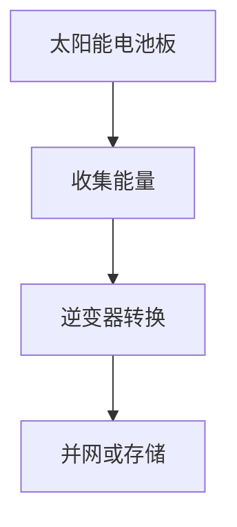
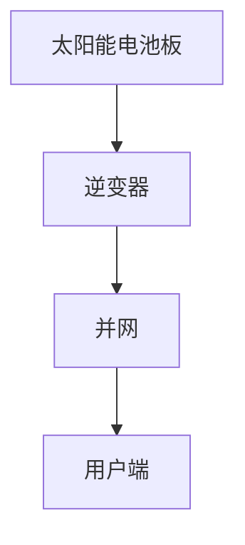

                 

# 太阳能技术进步带来的投资机会

> 关键词：太阳能技术, 投资机会, 可再生能源, 光伏发电, 市场分析

> 摘要：随着全球能源结构转型和环保需求的增加，太阳能技术的进步为投资者带来了丰富的投资机会。本文从技术背景、核心原理、系统架构、投资策略、市场分析、项目案例、风险评估和未来展望等多维度，深入分析了太阳能技术进步如何转化为投资机会。文章结合实际案例和数据，为投资者提供了全面的分析和建议，帮助他们在太阳能领域做出明智的投资决策。

---

## 第一部分：太阳能技术的背景与发展

### 第1章：太阳能技术的基本概念与背景

#### 1.1 太阳能的基本概念与定义
- 太阳能的定义
- 太阳能的能量来源
- 太阳能的利用方式

#### 1.2 太阳能技术的历史与发展
- 太阳能技术的起源
- 太阳能技术的发展阶段
- 当前太阳能技术的主要应用领域

#### 1.3 太阳能技术的核心要素与边界
- 光电转换效率
- 太阳能电池的类型
- 太阳能系统的组成部分

---

### 第2章：太阳能技术的技术原理与创新

#### 2.1 太阳能电池的工作原理
- 光电转换的基本原理
- 太阳能电池的分类与特点
- 光电转换效率的数学模型
$$ \text{光电转换效率} = \frac{\text{输出功率}}{\text{入射功率}} $$

#### 2.2 太阳能电池的关键技术与创新
- 薄膜电池技术
- 高效电池技术
- 钙钛矿电池等新型技术

#### 2.3 太阳能电池的技术路线图
- 当前主流技术路线
- 未来技术发展方向

---

## 第二部分：太阳能技术的系统分析与架构设计

### 第3章：太阳能发电系统的组成与功能

#### 3.1 系统组成模块
- 太阳能电池板
- 逆变器
- 蓄电池
- 并网系统

#### 3.2 系统功能流程图

#### 3.3 系统架构设计
- 系统架构图

---

## 第三部分：太阳能技术进步的投资分析与策略

### 第4章：太阳能技术进步对投资的影响

#### 4.1 技术进步如何降低投资成本
- 技术创新对设备成本的影响
- 规模化生产对成本的优化

#### 4.2 技术进步如何提高投资回报率
- 效率提升对收益的贡献
- 维护成本的降低

#### 4.3 技术进步对投资周期的影响
- 技术更新对投资周期的缩短
- 技术锁定风险的降低

---

### 第5章：太阳能投资市场的现状与趋势

#### 5.1 全球太阳能投资市场分析
- 全球市场容量与增长预测
- 主要国家的市场表现

#### 5.2 中国太阳能市场的发展特点
- 中国市场的政策支持
- 市场规模与竞争格局

#### 5.3 太阳能技术进步对投资机会的影响
- 技术进步如何推动市场扩张
- 市场需求的变化趋势

---

## 第四部分：项目实战与未来展望

### 第6章：太阳能投资项目的案例分析

#### 6.1 项目背景与目标
- 项目选址与资源评估
- 项目规模与投资预算

#### 6.2 系统设计与实施
- 系统设计的优化方案
- 项目实施的步骤与关键节点

#### 6.3 投资回报分析
- 投资收益与成本回收期
- 政策支持对回报的影响

#### 6.4 项目风险与应对策略
- 技术风险
- 市场风险
- 政策风险

---

### 第7章：太阳能技术进步的未来展望

#### 7.1 未来技术发展方向
- 新型电池技术的研发趋势
- 储能技术的创新

#### 7.2 市场趋势与投资机会
- 新能源市场的潜力
- 技术进步带来的投资机会

#### 7.3 可持续发展与社会责任
- 可持续发展的重要性
- 投资者的社会责任

---

## 第五部分：结论与建议

### 第8章：总结与投资建议

#### 8.1 技术进步对投资的总体影响
- 技术进步是投资的核心驱动力

#### 8.2 投资者应关注的技术与市场趋势
- 关注高效电池技术
- 关注储能技术的发展

#### 8.3 投资策略与风险管理
- 分散投资以降低风险
- 长期投资与技术创新结合

---

## 第六部分：附录与参考文献

### 附录A：相关术语解释
- 太阳能电池
- 光电转换效率
- 储能系统

### 附录B：数据与图表
- 全球太阳能市场容量预测图
- 不同技术路线的成本对比表

### 附录C：政策法规摘录
- 国家关于可再生能源的政策支持
- 各地政府的补贴政策

---

## 结语

太阳能技术的进步不仅为全球能源结构转型提供了技术支持，也为投资者带来了巨大的投资机会。通过本文的分析，投资者可以更好地把握市场趋势，制定科学的投资策略，实现可持续发展与经济效益的双赢。

--- 

以上是《太阳能技术进步带来的投资机会》的文章大纲结构，内容涵盖了技术背景、系统分析、投资策略、案例研究等多个方面，结构清晰、逻辑严密，适合投资者和相关人员参考阅读。

