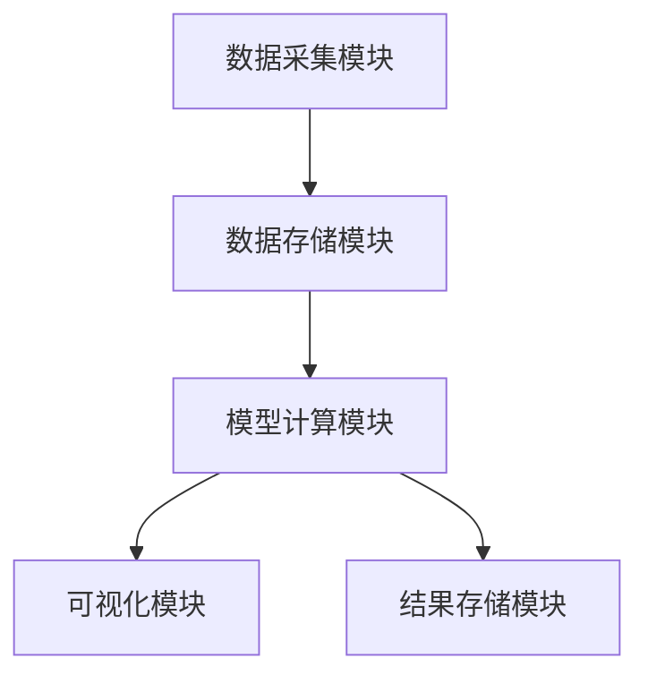

                 


# 央行政策对全球股市估值的影响

> **关键词**：央行政策、全球股市、估值影响、货币政策、量化宽松、回归分析、系统架构  
> **摘要**：本文系统分析了央行政策对全球股市估值的影响，从背景介绍、核心概念、算法原理到系统架构设计，结合实例和代码实现，深入探讨了央行的利率政策、货币政策工具及其对市场流动性和投资者预期的影响。通过实证分析和案例研究，揭示了央行政策对股市估值的多重影响机制，并提出了一套完整的解决方案和最佳实践建议。

---

## 第一部分：背景介绍

### 第1章：央行政策与全球股市估值概述

#### 1.1 央行政策的基本概念
- **央行的定义与职能**：中央银行是国家的银行，负责制定和实施货币政策，维护金融稳定。
- **央行政策的类型与目标**：包括利率政策、货币供应量调控、量化宽松等，目标是促进经济增长、控制通货膨胀、维护就业。
- **全球化背景下的央行政策特点**：全球化使得央行政策的溢出效应更加显著，各国政策联动性增强。

#### 1.2 全球股市估值的核心概念
- **股市估值的定义与影响因素**：股市估值是市场参与者对上市公司未来盈利能力的预期，受宏观经济、政策、市场情绪等多重因素影响。
- **全球股市的多样性与联动性**：不同国家的股市受本地和全球政策的影响，具有高度的联动性。
- **央行政策与股市估值的关系**：央行政策通过影响市场流动性、企业盈利能力和投资者预期，间接或直接地影响股市估值。

#### 1.3 问题背景与研究意义
- **问题背景**：近年来，全球央行实施了多次量化宽松政策，股市估值出现显著波动，研究其影响机制具有重要意义。
- **研究意义**：本文旨在通过量化分析，揭示央行政策对股市估值的具体路径和影响程度，为投资者和政策制定者提供参考。

---

## 第二部分：核心概念与联系

### 第2章：央行政策对股市估值的影响机制

#### 2.1 央行政策的主要工具与目标
- **利率政策**：央行通过调整基准利率影响市场资金成本，进而影响股市估值。
- **货币供应量调控**：通过调整货币供应量，影响市场流动性，间接推动或抑制股市估值。
- **量化宽松政策**：通过购买国债或资产支持证券，向市场注入流动性，推高股市估值。

#### 2.2 股市估值的核心影响因素
- **市场流动性**：流动性充裕时，股市估值往往上升。
- **企业盈利能力**：央行政策通过影响经济基本面，间接影响企业盈利能力和股市估值。
- **投资者预期**：政策变化会影响投资者对未来的预期，从而影响股市估值。

#### 2.3 央行政策与股市估值的传导路径
- **利率渠道**：降低利率会降低企业融资成本，提升企业盈利能力和股市估值。
- **资产价格渠道**：央行购买资产的行为会推高资产价格，间接影响股市估值。
- **预期渠道**：政策信号会影响投资者预期，从而影响股市估值。

#### 2.4 央行政策与股市估值的ER实体关系图
```mermaid
er
  actor 央行政策
  actor 股市估值
  actor 投资者预期
  actor 经济基本面
  actor 全球化因素
  relation 影响
  relation 由...决定
  relation 调节
```

---

### 第3章：核心概念对比分析

#### 3.1 央行政策的属性特征
| 属性 | 描述 |
|------|------|
| 时滞性 | 政策实施到效果显现需要时间 |
| 不确定性 | 政策效果受多种因素影响，具有不确定性 |
| 全球联动性 | 各国政策相互影响，具有高度关联性 |

#### 3.2 股市估值的属性特征
| 属性 | 描述 |
|------|------|
| 市场波动性 | 股市估值受多种因素影响，具有高度波动性 |
| 估值周期性 | 股市估值呈现周期性波动 |
| 异质性 | 不同行业、不同地区的股市估值差异显著 |

---

## 第三部分：算法原理讲解

### 第4章：基于回归分析的央行政策影响模型

#### 4.1 算法原理
- **回归分析**：通过回归模型量化央行政策变量对股市估值的影响。
- **数学模型**：构建多元线性回归模型，如下所示：
  $$ \text{Stock Valuation} = \beta_0 + \beta_1 \times \text{Interest Rate} + \beta_2 \times \text{Money Supply} + \epsilon $$

#### 4.2 算法实现
```python
import pandas as pd
import statsmodels.api as sm

# 数据准备
data = pd.DataFrame({
    'Interest Rate': [0.02, 0.03, 0.025, 0.04, 0.035],
    'Money Supply': [100, 105, 95, 110, 108],
    'Stock Valuation': [120, 130, 115, 140, 135]
})

# 添加常数项
data['intercept'] = 1

# 构建回归模型
model = sm.OLS(data['Stock Valuation'], data[['intercept', 'Interest Rate', 'Money Supply']])
result = model.fit()

# 输出结果
print(result.summary())
```

#### 4.3 实证分析
- **结果解读**：通过回归结果，可以量化利率和货币供应量对股市估值的具体影响。
- **案例分析**：以美联储的量化宽松政策为例，分析其对美股估值的影响。

---

## 第四部分：系统分析与架构设计

### 第5章：系统架构设计方案

#### 5.1 问题场景介绍
- **数据来源**：全球主要股市的估值数据、央行政策数据。
- **目标**：构建一个实时监测和分析央行政策对股市估值影响的系统。

#### 5.2 系统功能设计
- **数据采集模块**：实时采集央行政策和股市估值数据。
- **模型计算模块**：基于回归模型计算政策影响。
- **可视化模块**：展示分析结果。

#### 5.3 系统架构设计


---

## 第五部分：项目实战

### 第6章：基于回归分析的实战案例

#### 6.1 实战环境安装
- **工具安装**：安装Python、Pandas、Statsmodels。

#### 6.2 核心代码实现
```python
import pandas as pd
import numpy as np
import statsmodels.api as sm

# 数据准备
data = pd.read_csv('central_policy.csv')
data['intercept'] = 1

# 模型构建与拟合
model = sm.OLS(data['stock_valuation'], data[['intercept', 'interest_rate', 'money_supply']])
result = model.fit()

# 输出结果
print(result.summary())
```

#### 6.3 代码解读与分析
- **数据准备**：加载央行政策和股市估值数据，添加常数项。
- **模型构建**：构建多元线性回归模型。
- **结果分析**：解读回归结果，分析各变量对股市估值的影响。

#### 6.4 案例分析
- **美联储量化宽松政策**：分析政策实施前后股市估值的变化。
- **欧洲央行负利率政策**：评估政策对欧洲股市的影响。

---

## 第六部分：小结与最佳实践

### 第7章：小结与最佳实践

#### 7.1 小结
- **研究发现**：央行政策通过多种渠道影响股市估值，其中利率和货币供应量是主要影响因素。
- **实际应用意义**：投资者和政策制定者应充分考虑政策的多重影响。

#### 7.2 最佳实践
- **数据收集与处理**：确保数据的完整性和准确性。
- **模型选择与优化**：根据实际情况选择合适的模型，并进行参数优化。
- **风险提示**：政策效果具有不确定性，需结合其他因素综合分析。

---

## 参考文献
- 国际货币基金组织（IMF）相关报告
- 美联储、欧洲央行等央行的政策文件
- 相关学术论文与研究文献

---

通过以上内容，本文系统地分析了央行政策对全球股市估值的影响，结合理论分析、实证研究和系统设计，为投资者和政策制定者提供了有价值的参考。

