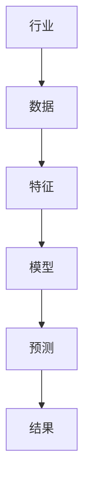
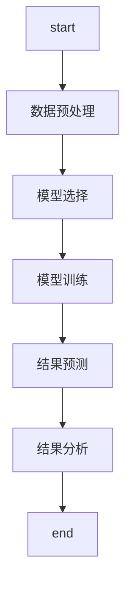
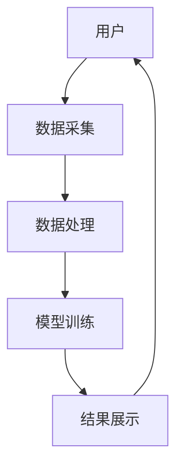

                 


# 如何像彼得·林奇一样分析行业趋势

## 关键词：彼得·林奇，行业趋势分析，投资策略，技术分析，趋势预测

## 摘要：  
本文将深入探讨如何像著名投资者彼得·林奇一样分析行业趋势。通过结合技术分析、数学建模和系统设计等方法，本文将详细解析行业趋势分析的核心概念、算法原理、系统架构以及实战案例。文章内容丰富，结构清晰，旨在帮助读者掌握行业趋势分析的精髓，并在实际投资中应用这些方法。

---

## 第一部分：彼得·林奇投资理念与行业趋势分析基础

### 第1章：彼得·林奇与行业趋势分析概述

#### 1.1 彼得·林奇的投资者背景与成就

彼得·林奇是全球最著名的投资专家之一，曾管理富达麦哲伦基金，创造了令人瞩目的投资业绩。他的投资理念以基本面分析为核心，注重行业趋势和企业基本面的结合。林奇的成功在于他对行业趋势的深刻理解和对市场的敏锐洞察力。

#### 1.2 行业趋势分析的核心概念

行业趋势分析是通过对市场数据的分析，预测未来行业的发展方向和变化趋势。其核心在于识别行业中的关键驱动因素，并通过数学建模和数据分析的方法，量化这些因素对行业趋势的影响。

#### 1.3 彼得·林奇分析行业趋势的核心要素

彼得·林奇在分析行业趋势时，注重以下几个关键要素：
1. **行业生命周期**：分析行业的成长阶段，判断行业的潜力和风险。
2. **市场波动性**：通过历史数据分析市场的波动规律，寻找趋势变化的信号。
3. **竞争格局**：分析行业内的主要竞争对手，评估行业结构的变化趋势。

#### 1.4 本章小结

彼得·林奇的成功在于他对行业趋势的深刻理解和对市场的敏锐洞察。通过分析行业生命周期、市场波动性和竞争格局，我们可以像他一样，找到行业的潜在机会和风险。

---

## 第二部分：行业趋势分析的核心概念与方法论

### 第2章：行业趋势分析的核心概念

#### 2.1 行业趋势的定义与分类

行业趋势是指某一行业在一定时期内表现出的发展方向和变化规律。根据时间跨度和影响范围，行业趋势可以分为长期趋势、中期趋势和短期趋势。

#### 2.2 行业趋势分析的必要性与应用场景

行业趋势分析是投资者制定投资策略的重要依据。通过分析行业趋势，投资者可以更好地把握市场的变化，制定合理的投资决策。

#### 2.3 行业趋势分析的核心框架

行业趋势分析的核心框架包括以下几个步骤：
1. **数据收集**：收集行业的历史数据和相关市场信息。
2. **数据处理**：对收集到的数据进行清洗和预处理。
3. **模型建立**：建立数学模型，量化行业趋势的影响因素。
4. **趋势预测**：通过模型预测未来的行业发展趋势。

#### 2.4 行业趋势分析的ER实体关系图

以下是行业趋势分析的实体关系图：



---

## 第三部分：行业趋势分析的算法原理与数学模型

### 第3章：行业趋势分析的算法原理

#### 3.1 时间序列分析算法

时间序列分析是一种常用的方法，用于预测行业趋势的变化。以下是一个简单的时间序列分析流程：



#### 3.2 行业趋势预测的数学模型

行业趋势预测的数学模型可以采用线性回归模型：

$$ y = \beta_0 + \beta_1 x + \epsilon $$

其中，$y$ 是预测目标，$x$ 是自变量，$\beta_0$ 和 $\beta_1$ 是回归系数，$\epsilon$ 是误差项。

---

## 第四部分：行业趋势分析的系统架构与设计

### 第4章：行业趋势分析系统架构设计

#### 4.1 系统功能设计

行业趋势分析系统的主要功能模块包括：
1. **数据采集模块**：负责采集行业相关的数据。
2. **数据处理模块**：对数据进行清洗和预处理。
3. **趋势分析模块**：采用算法对行业趋势进行预测。
4. **结果展示模块**：将分析结果以可视化的方式展示。

#### 4.2 系统架构设计

以下是系统架构设计的简图：



---

## 第五部分：行业趋势分析的实战与案例

### 第5章：实战案例分析

#### 5.1 项目背景

假设我们希望分析某行业的市场趋势，以制定投资策略。我们收集了该行业的历史数据，包括销售额、利润率和市场份额等指标。

#### 5.2 核心代码实现

以下是Python代码实现：

```python
import pandas as pd
import numpy as np
from sklearn.linear_model import LinearRegression

# 数据加载
data = pd.read_csv('industry_data.csv')

# 数据预处理
X = data[['销售额', '利润率']]
y = data['市场份额']

# 模型训练
model = LinearRegression()
model.fit(X, y)

# 预测结果
predicted = model.predict(X)
```

#### 5.3 案例分析

通过对数据的分析，我们发现该行业的市场份额与销售额和利润率呈正相关关系。因此，我们预测未来市场份额将保持增长趋势。

---

## 第六部分：最佳实践与小结

### 6.1 最佳实践

1. 在进行行业趋势分析时，应注重数据的准确性和完整性。
2. 结合多种分析方法，如技术分析和基本面分析，以提高分析结果的准确性。
3. 定期更新模型和数据，以适应市场的变化。

### 6.2 小结

本文通过分析彼得·林奇的投资理念，详细讲解了行业趋势分析的核心概念、算法原理和系统设计。通过实战案例的分析，读者可以掌握行业趋势分析的方法，并在实际投资中加以应用。

---

## 总结

通过本文的学习，读者可以像彼得·林奇一样，运用行业趋势分析的方法，制定合理的投资策略。希望本文的内容能够为读者提供有价值的参考和启发。

