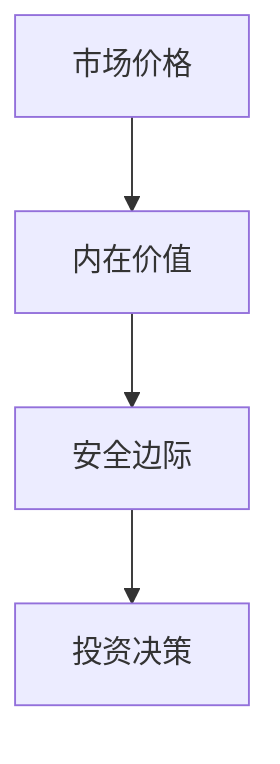
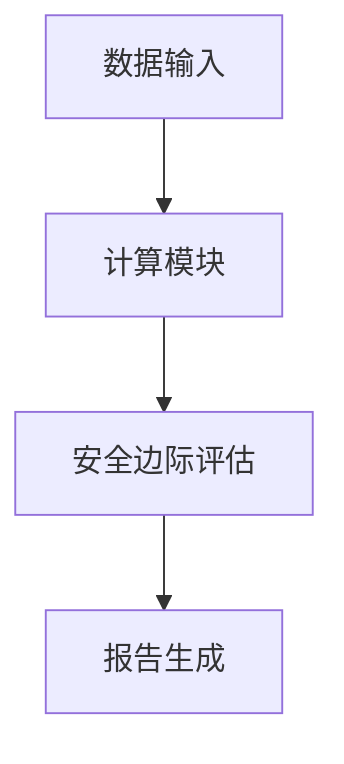

                 


# 如何判断股价是否具有吸引力：巴菲特的视角

## 关键词

- 巴菲特投资策略  
- 股价吸引力  
- 内在价值评估  
- 安全边际  
- DCF模型  

## 摘要

本文从巴菲特的价值投资视角，详细探讨如何判断股价是否具有吸引力。通过分析内在价值、安全边际、DCF模型等关键概念，结合实际案例和系统设计，为读者提供一套科学的投资分析方法。文章内容涵盖背景介绍、核心概念、算法原理、系统分析和项目实战，帮助读者全面理解并实践巴菲特的投资理念。

---

# 第一部分：背景介绍

## 第1章：价值投资的核心理念

### 1.1 价值投资的基本概念

- **定义**：价值投资是一种通过分析企业内在价值，寻找市场价格低于内在价值的股票进行投资的策略。
- **核心思想**：市场先生的存在导致股价波动，投资者应关注企业的基本面，而非短期市场波动。

### 1.2 投资的三大要素

- **价格**：市场价格波动，但非永久性。
- **价值**：企业的内在价值，即其未来现金流的现值。
- **安全边际**：买入价格低于内在价值，确保投资的安全性。

---

# 第二部分：核心概念与联系

## 第2章：内在价值与安全边际

### 2.1 内在价值的定义

- **内在价值**：企业未来现金流的现值，是其真实价值。
- **公式**：$$\text{内在价值} = \sum_{t=1}^{n} \frac{\text{CF}_t}{(1 + r)^t} + \frac{FV}{(1 + r)^n}$$
  - CFₜ：第t年的自由现金流
  - r：折现率
  - FV：终值

### 2.2 安全边际的重要性

- **安全边际**：买入价格低于内在价值，确保投资的盈利能力。
- **公式**：$$\text{安全边际} = \text{内在价值} - \text{市场价格}$$

### 2.3 内在价值与市场价格的关系

- 使用mermaid图展示内在价值与市场价格的关系：



---

# 第三部分：算法原理

## 第3章：DCF模型的数学解析

### 3.1 DCF模型的步骤

1. **预测未来现金流**：估计企业未来5-10年的自由现金流。
2. **计算终值**：使用永续增长率公式计算终值。
   - $$\text{终值} = \frac{\text{CF}_{n+1}}{r - g}$$
   - r：折现率
   - g：永续增长率
3. **计算现值**：将未来现金流和终值贴现到现值。
4. **计算加权平均资本成本（WACC）**：
   - WACC = (w_d × r_d) + (w_l × r_l) + (w_e × r_e)
   - w_d：债务比例，r_d：债务成本
   - w_l：优先股比例，r_l：优先股成本
   - w_e：股权比例，r_e：股权成本

### 3.2 实际案例分析

- **案例**：假设某公司未来5年现金流分别为100, 120, 140, 160, 180万元，永续增长率为5%，折现率为10%。
- 计算终值：
  $$\text{终值} = \frac{180 \times (1 + 0.05)}{0.10 - 0.05} = 3780 \text{万元}$$
- 计算现值：
  $$\text{现值} = \sum_{t=1}^{5} \frac{\text{CF}_t}{(1 + 0.10)^t} + \frac{3780}{(1 + 0.10)^5}$$
  计算结果约为现值2000万元。

---

# 第四部分：系统分析与架构

## 第4章：投资分析系统的构建

### 4.1 系统功能设计

- **需求分析**：分析企业财务数据，计算内在价值，评估安全边际。
- **功能模块**：
  1. 数据输入模块：输入公司财务数据。
  2. 计算模块：计算现金流、WACC、内在价值。
  3. 安全边际评估模块：比较市场价格与内在价值。
  4. 报告生成模块：输出分析结果。

### 4.2 系统架构设计



---

# 第五部分：项目实战

## 第5章：基于DCF模型的股价分析

### 5.1 项目环境

- 工具：Python、pandas、numpy
- 数据来源：公司财务报表

### 5.2 核心代码实现

```python
import numpy as np

def calculate_intrinsic_value(fcf, wacc, perpetual_growth):
    # 计算终值
    terminal_value = fcf[-1] * (1 + perpetual_growth) / (wacc - perpetual_growth)
    # 计算现值
    pv = 0
    for year, cash_flow in enumerate(fcf):
        pv += cash_flow / (1 + wacc) ** year
    pv += terminal_value / (1 + wacc) ** len(fcf)
    return pv

# 示例数据
fcf = [100, 120, 140, 160, 180]
wacc = 0.10
perpetual_growth = 0.05

iv = calculate_intrinsic_value(fcf, wacc, perpetual_growth)
print(f"内在价值：{iv} 万元")
```

### 5.3 实际案例分析

- **案例**：假设某公司当前股价为10元，计算其内在价值为15元，则安全边际为5元。

---

# 第六部分：最佳实践与总结

## 第6章：巴菲特投资策略的总结

### 6.1 投资的关键点

- **安全边际**：买入价格低于内在价值。
- **长期持有**：复利效应最大化收益。
- **管理层信任**：选择优秀的企业和管理层。

### 6.2 实践中的注意事项

- **数据准确性**：确保财务数据的准确性和完整性。
- **模型假设**：合理假设现金流和增长率。
- **市场波动**：关注市场波动，但避免频繁交易。

### 6.3 拓展阅读

- 《巴菲特致股东的信》
- 《价值投资实战手册》

---

# 总结

通过本文的详细分析，读者可以掌握巴菲特的价值投资理念，并通过DCF模型等工具，科学判断股价的吸引力。投资不仅是数字的计算，更需要对企业的深入了解和对市场的敏锐洞察。希望本文能为读者的投资决策提供有价值的参考。

