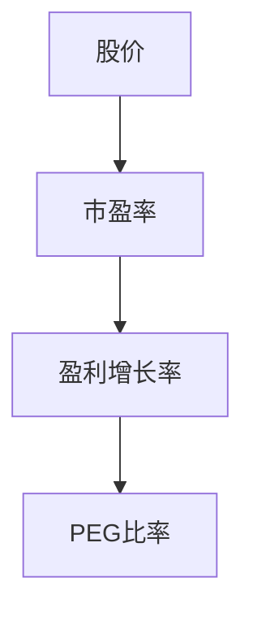

                 


# 如何利用PEG比率进行企业估值

**关键词**：企业估值、PEG比率、投资分析、股票分析、财务指标

**摘要**：本文详细介绍了如何利用PEG（Price/Earnings to Growth）比率进行企业估值。通过定义和计算PEG比率，分析其在投资决策中的应用，结合实际案例，探讨PEG比率的优势与局限性，并提供实际操作中的注意事项和最佳实践。

---

# 如何利用PEG比率进行企业估值

## 引言

在投资分析中，企业估值是评估股票价值的核心步骤。PEG比率作为一种结合市盈率和盈利增长率的指标，为企业估值提供了重要的视角。本文将逐步分析PEG比率的定义、计算方法、应用场景及其在实际投资中的应用。

---

## 第1章：PEG比率的基本概念与应用

### 1.1 什么是PEG比率

PEG比率全称为Price/Earnings to Growth，用于衡量股票价格相对于其盈利增长率的合理性。其公式为：

$$ \text{PEG比率} = \frac{\text{市盈率}}{\text{盈利增长率}} $$

其中，市盈率（P/E）为股票价格除以每股收益（EPS），盈利增长率则为净利润的年增长率。

### 1.2 PEG比率的背景与发展

PEG比率由彼得·林奇推广，旨在评估高增长企业的合理估值。它弥补了市盈率仅考虑当前盈利的不足，将盈利增长率纳入考量。

### 1.3 PEG比率的应用场景

PEG比率适用于高增长企业，尤其在科技和新兴行业表现突出。它帮助投资者判断股票是否被低估或高估。

---

## 第2章：PEG比率的数学模型与公式

### 2.1 PEG比率的数学推导

以某公司为例，假设其股价为$50，每股收益为$5，盈利增长率为10%。计算其PEG比率：

$$ \text{PEG比率} = \frac{50/5}{0.10} = 10 $$

### 2.2 PEG比率的图形化解释

使用mermaid图展示PEG比率的计算过程：



### 2.3 PEG比率的实例计算

以苹果公司为例，假设其市盈率为25，盈利增长率为10%，则：

$$ \text{PEG比率} = 25/0.10 = 25 $$

---

## 第3章：PEG比率在企业估值中的应用

### 3.1 PEG比率的企业估值原理

PEG比率通过评估股票价格与盈利增长的匹配程度，帮助投资者判断其是否被低估或高估。通常，PEG比率低于1表示股票被低估，高于1则可能被高估。

### 3.2 PEG比率的行业应用案例

#### 3.2.1 高增长行业的应用

以科技公司为例，假设其市盈率为40，盈利增长率为20%，则：

$$ \text{PEG比率} = 40/0.20 = 2 $$

PEG比率为2，表明该股票可能被低估。

#### 3.2.2 低增长行业的应用

以传统制造公司为例，假设其市盈率为15，盈利增长率为5%，则：

$$ \text{PEG比率} = 15/0.05 = 3 $$

PEG比率为3，表明该股票可能被高估。

### 3.3 PEG比率的动态调整与优化

考虑市场环境和公司规模对PEG的影响，动态调整增长率预测，以更准确地评估企业价值。

---

## 第4章：PEG比率的实际案例分析

### 4.1 苹果公司的PEG分析

假设苹果的股价为$150，每股收益为$10，盈利增长率为12%。计算其PEG比率：

$$ \text{PEG比率} = 150/10 / 0.12 = 12.5 $$

PEG比率为12.5，高于行业平均水平，可能被高估。

### 4.2 亚马逊公司的PEG分析

假设亚马逊的股价为$3000，每股收益为$100，盈利增长率为25%。计算其PEG比率：

$$ \text{PEG比率} = 3000/100 / 0.25 = 12 $$

PEG比率为12，表明该股票可能合理估值。

---

## 第5章：PEG比率的高级分析与注意事项

### 5.1 PEG比率的局限性

- 盈利增长率预测的不确定性影响PEG的准确性。
- 高增长公司的PEG可能偏高，需谨慎评估。
- PEG不考虑市净率等其他因素，需结合其他指标使用。

### 5.2 PEG比率与其他估值方法的结合

结合市净率（P/B比率）和股息率等指标，全面评估股票价值。

### 5.3 动态调整PEG模型

根据市场环境和公司战略调整增长率预测，优化企业估值。

---

## 结论

PEG比率作为一种有效的估值工具，帮助投资者评估股票的合理价值。通过实际案例分析，展示了其在不同行业中的应用，并提供了动态调整的建议。然而，投资者需结合其他指标，全面评估股票价值。

---

## 附录

### 附录A：PEG比率的数学公式

- 市盈率：$$ \text{P/E} = \frac{\text{股价}}{\text{每股收益}} $$
- 盈利增长率：$$ \text{净利润增长率} = \frac{\text{当年净利润} - \text{上期净利润}}{\text{上期净利润}} \times 100\% $$
- PEG比率：$$ \text{PEG} = \frac{\text{P/E}}{\text{净利润增长率}} $$

### 附录B：工具推荐

- 使用Excel或Python进行PEG比率计算。
- 推荐的Python代码示例：

```python
def calculate_peg(pe, growth_rate):
    return pe / growth_rate

pe = 25
growth_rate = 0.10
peg = calculate_peg(pe, growth_rate)
print(f"PEG比率: {peg}")
```

---

通过以上分析，您可以系统地学习和应用PEG比率进行企业估值，做出更明智的投资决策。

