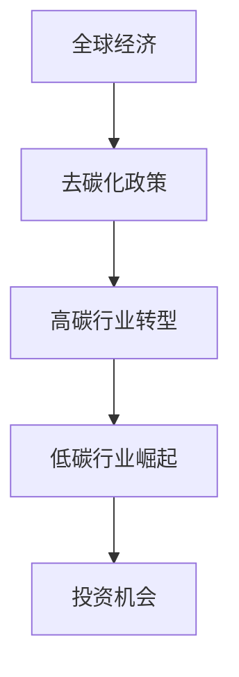
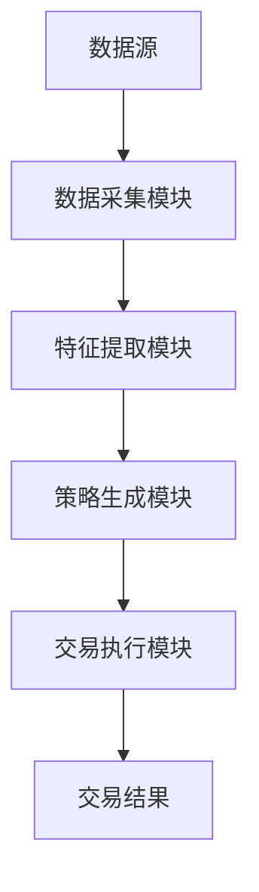

                 


# 如何利用特价股票投资应对全球经济去碳化趋势

## 关键词：特价股票、去碳化趋势、投资策略、技术分析、风险管理

## 摘要

全球经济正面临去碳化趋势，这一趋势对股票市场产生了深远影响。本文将探讨如何利用特价股票投资应对这一趋势。通过分析去碳化趋势下的行业变化，结合特价股票的特点，提出一套基于技术分析和量化投资的策略。文章从背景介绍、核心概念、算法原理、系统分析、项目实战和最佳实践等多方面展开，为投资者提供深度的分析和实用的建议。

---

## 第一部分：背景介绍

### 第1章：全球经济去碳化趋势概述

#### 1.1 全球气候变化与去碳化背景

- **1.1.1 气候变化的现状与挑战**  
  全球气候变化问题日益严重，极端天气事件频发，联合国政府间气候变化专门委员会（IPCC）报告指出，人类活动是主要驱动力。全球气温上升、海平面上升、生态系统破坏等问题亟待解决。

- **1.1.2 去碳化的定义与目标**  
  去碳化是指减少温室气体（主要是二氧化碳）的排放，以减缓气候变化的速度。全球去碳化目标包括《巴黎协定》设定的将全球气温升幅控制在1.5°C以内。

- **1.1.3 去碳化对全球经济的影响**  
  去碳化将重塑全球经济结构，推动能源结构转型、产业升级和技术创新。高碳行业（如化石能源、传统制造）将面临转型压力，而低碳行业（如新能源、绿色科技）将获得发展机遇。

---

#### 1.2 投资视角下的去碳化趋势

- **1.2.1 去碳化对股票市场的机遇**  
  去碳化政策将推动新能源、电动汽车、绿色科技等领域的发展，这些行业的公司股票可能迎来上涨机会。

- **1.2.2 高碳行业的转型风险**  
  高碳行业（如传统能源、钢铁、水泥）面临政策限制和市场需求下降的风险，部分公司可能因转型失败而股价下跌。

- **1.2.3 政策驱动与市场驱动的双重影响**  
  去碳化不仅是政策驱动的产物，也是市场对可持续发展的自然选择。政策补贴、碳交易机制和消费者偏好的变化都将影响股票市场。

---

#### 1.3 特价股票的定义与特点

- **1.3.1 特价股票的定义与分类**  
  特价股票是指市场价格显著低于其内在价值或历史平均水平的股票。根据市场环境，特价股票可以分为周期性特价股票和结构性特价股票。

- **1.3.2 特价股票的市场特性**  
  特价股票通常具有高波动性、低流动性、高风险和高收益并存的特点。这些股票可能因市场情绪或短期事件而被低估。

- **1.3.3 特价股票与去碳化趋势的关联**  
  在去碳化趋势下，高碳行业的特价股票可能因行业转型而面临更大的波动，而低碳行业的特价股票可能因市场认可而快速反弹。

---

## 第二部分：核心概念与联系

### 第2章：去碳化趋势下的行业分析

#### 2.1 高碳行业的转型风险

- **2.1.1 石油、天然气行业的去碳化挑战**  
  石油和天然气行业是碳排放的主要来源，去碳化政策将推动这些行业向可再生能源转型。

- **2.1.2 传统制造业的转型压力**  
  高碳制造行业（如钢铁、水泥）需要采用新技术降低碳排放，否则可能面临市场需求下降和政策惩罚。

- **2.1.3 高碳行业股票的投资风险**  
  高碳行业股票可能因政策限制和市场需求下降而面临股价下跌风险。

---

#### 2.2 低碳行业的投资机会

- **2.2.1 新能源行业的崛起**  
  新能源行业（如太阳能、风能）是去碳化趋势的最大受益者，市场需求持续增长。

- **2.2.2 电动汽车与绿色科技的潜力**  
  电动汽车行业（如特斯拉、宁德时代）和绿色科技行业（如智能电网、碳捕捉技术）具有广阔的发展前景。

- **2.2.3 可再生能源领域的投资机会**  
  可再生能源（如太阳能、风能）的投资回报率较高，政策支持也较强。

---

#### 2.3 行业影响的Mermaid图表



---

## 第三部分：算法原理与技术分析

### 第3章：基于技术指标的股票筛选算法

#### 3.1 技术分析法

- **3.1.1 K线图分析**  
  K线图是股票价格走势的可视化工具，通过分析K线图中的趋势线、支撑位和阻力位，可以判断股票的买卖时机。

- **3.1.2 相对强弱指数（RSI）**  
  RSI是一种衡量股票超买或超卖状态的技术指标，通常用于判断短期价格波动的方向。

- **3.1.3 移动平均收敛散度（MACD）**  
  MACD是一种判断股票价格趋势的指标，由两条移动平均线和一个柱状图组成。

---

#### 3.2 算法原理与代码实现

```python
import pandas as pd
import numpy as np
import matplotlib.pyplot as plt
from pandas_datareader import DataReader

# 获取股票数据
def get_stock_data(ticker, start_date, end_date):
    data = DataReader(ticker, 'yahoo', start_date, end_date)
    return data

# 计算技术指标
def calculate_technical_indicators(data):
    # 计算MACD
    def compute_macd(data):
        ema12 = data['Close'].ewm(span=12, adjust=False).mean()
        ema26 = data['Close'].ewm(span=26, adjust=False).mean()
        macd = ema12 - ema26
        signal = macd.ewm(span=9, adjust=False).mean()
        return macd, signal

    # 计算RSI
    def compute_rsi(data, period=14):
        delta = data['Close'].diff()
        up = delta.where(delta > 0, 0)
        down = delta.where(delta < 0, 0)
        rs = up.rolling(period).sum() / down.rolling(period).sum()
        rsi = 100 - (100 - (rs.rolling(period).mean()))
        return rsi

    data['MACD'], data['MACD_signal'] = compute_macd(data)
    data['RSI'] = compute_rsi(data)
    return data

# 绘制技术指标图表
def plot_technical_indicators(data):
    plt.figure(figsize=(12, 8))
    plt.subplot(3, 1, 1)
    data['Close'].plot(label='Close Price')
    plt.title('Stock Price Analysis')
    plt.xlabel('Date')
    plt.ylabel('Price')
    plt.legend()

    plt.subplot(3, 1, 2)
    data['RSI'].plot(label='RSI')
    plt.title('RSI Analysis')
    plt.xlabel('Date')
    plt.ylabel('RSI Value')
    plt.legend()

    plt.subplot(3, 1, 3)
    data['MACD'].plot(label='MACD')
    data['MACD_signal'].plot(label='Signal Line')
    plt.title('MACD Analysis')
    plt.xlabel('Date')
    plt.ylabel('MACD Value')
    plt.legend()

    plt.tight_layout()
    plt.show()

# 示例代码
if __name__ == "__main__":
    ticker = 'AAPL'
    start_date = '2020-01-01'
    end_date = '2023-01-01'
    data = get_stock_data(ticker, start_date, end_date)
    data = calculate_technical_indicators(data)
    plot_technical_indicators(data)
```

---

### 第4章：量化投资策略与风险管理

#### 4.1 量化投资策略

- **4.1.1 策略概述**  
  量化投资策略基于数学模型和算法，通过大数据分析和机器学习技术，寻找市场中的套利机会和价格异常。

- **4.1.2 策略实现**  
  使用Python和量化工具（如Pandas、NumPy、Scikit-learn）构建量化模型，分析市场数据，生成交易信号。

- **4.1.3 策略优缺点**  
  量化投资策略的优点是高效、客观和低情绪影响，缺点是模型失效风险和市场不可预测性。

---

#### 4.2 风险管理与资产配置

- **4.2.1 风险管理的核心原则**  
  风险管理是投资成功的关键，投资者需要控制仓位、设置止损和止盈点，并定期评估投资组合的风险。

- **4.2.2 资产配置的重要性**  
  资产配置是将资金分配到不同资产类别（如股票、债券、黄金）中，以分散风险和优化收益。

---

## 第四部分：系统分析与架构设计

### 第5章：系统功能设计

#### 5.1 系统功能模块

- **5.1.1 数据采集模块**  
  从Yahoo Finance或 Bloomberg 等数据源获取股票数据。

- **5.1.2 特征提取模块**  
  计算技术指标（如RSI、MACD）和市场情绪指标。

- **5.1.3 策略生成模块**  
  基于技术分析生成交易信号和投资建议。

- **5.1.4 交易执行模块**  
  执行交易指令，记录交易日志和收益。

---

#### 5.2 系统架构设计



---

## 第五部分：项目实战

### 第6章：投资案例分析

#### 6.1 投资案例：投资于一家新能源公司

- **6.1.1 案例背景**  
  选择一家新能源公司，分析其股票价格走势和去碳化趋势下的投资机会。

- **6.1.2 数据分析**  
  使用技术分析工具（如RSI、MACD）分析该公司的股票数据，判断投资时机。

- **6.1.3 投资策略**  
  在股票价格超跌或技术指标出现买入信号时，逐步建仓。

- **6.1.4 交易结果**  
  分析实际交易结果，总结经验教训，优化投资策略。

---

## 第六部分：最佳实践与总结

### 第7章：最佳投资实践

#### 7.1 投资策略总结

- **7.1.1 长期投资与短期交易结合**  
  长期投资关注行业趋势，短期交易捕捉市场波动。

- **7.1.2 价值投资与趋势投资结合**  
  选择具有长期增长潜力的公司，同时关注短期价格波动。

- **7.1.3 分散投资与集中投资结合**  
  通过分散投资降低风险，同时集中投资于高潜力行业。

---

#### 7.2 风险管理建议

- **7.2.1 设置止损和止盈点**  
  防止亏损过大，锁定收益。

- **7.2.2 定期评估投资组合**  
  根据市场变化和公司基本面，及时调整投资组合。

- **7.2.3 保持关注市场动态**  
  关注政策变化和行业动态，及时调整投资策略。

---

### 第8章：总结与展望

#### 8.1 总结

- 本文通过分析全球经济去碳化趋势，提出了利用特价股票投资的策略。通过技术分析和量化投资，投资者可以在去碳化趋势下捕捉投资机会，实现收益最大化。

---

#### 8.2 展望

- 随着全球去碳化进程的加速，新能源、绿色科技等低碳行业的投资机会将不断增加。投资者需要持续关注市场动态，优化投资策略，抓住市场机遇。

---

## 结语

全球经济去碳化趋势为投资者提供了新的机遇和挑战。通过合理利用特价股票，结合技术分析和量化投资，投资者可以在去碳化趋势下实现财富增值。然而，投资需要谨慎，需注意市场风险和政策变化。希望本文能为投资者提供有益的指导和启发。

