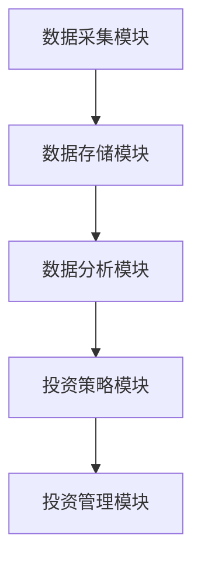
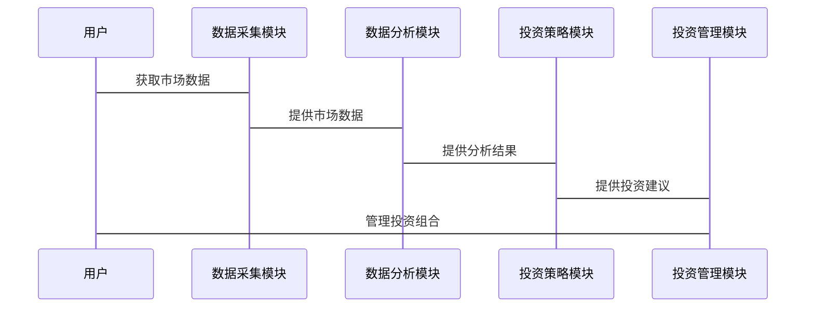

                 


# 如何利用特价股票投资应对经济衰退风险

## 关键词：特价股票，经济衰退，投资策略，风险管理，价值投资

## 摘要：  
在经济衰退期间，投资者面临更高的市场波动和资产贬值风险。本文将探讨如何通过特价股票投资来应对这些风险。通过分析经济衰退的基本原理、特价股票的核心概念、投资策略的实施方法、风险管理的重要性以及实际案例的分析，本文为投资者提供一套系统化的投资框架，帮助他们在经济衰退中保护和增值资产。

---

# 第1章: 经济衰退与投资风险管理

## 1.1 经济衰退的基本概念

### 1.1.1 经济衰退的定义与特征  
经济衰退是指经济活动的显著下降，通常表现为GDP连续数个季度负增长、就业率下降、消费者信心不足等。经济衰退的特征包括：  
1. **GDP负增长**：国内生产总值（GDP）是衡量经济的主要指标，连续两个季度或更长时间的负增长通常标志着经济衰退。  
2. **高失业率**：企业裁员、就业机会减少导致失业率上升。  
3. **消费信心下降**：消费者对未来经济预期悲观，减少开支。  
4. **信贷紧缩**：银行贷款收紧，企业融资困难。  

### 1.1.2 经济衰退的类型与表现  
经济衰退可以分为两类：  
1. **周期性衰退**：由经济周期波动引发，通常与过度生产和投资泡沫破裂有关。  
2. **结构性衰退**：由经济结构失衡、技术创新或全球竞争加剧导致。  
经济衰退的表现包括：  
1. **股市大跌**：投资者恐慌性抛售，导致股市大幅下跌。  
2. **债券收益率下降**：债券价格上升，收益率下降。  
3. **货币贬值**：货币购买力下降，导致通货膨胀。  

### 1.1.3 经济衰退对投资的影响  
经济衰退对投资的影响是多方面的：  
1. **资产价格下跌**：股票、房地产等资产价格大幅缩水。  
2. **投资回报下降**：企业盈利能力下降，分红减少。  
3. **流动性风险增加**：投资者急于变现，导致资产贬值。  

## 1.2 特价股票投资的基本概念

### 1.2.1 特价股票的定义与分类  
特价股票是指在市场下跌或经济衰退期间，由于市场恐慌或公司基本面暂时不佳，导致股价远低于其内在价值的股票。  
特价股票可以分为以下几类：  
1. **周期性股票**：受经济周期影响较大的行业（如制造业、建筑业）的股票。  
2. **价值型股票**：市盈率、市净率等估值指标低于行业平均水平的股票。  
3. **防御性股票**：在经济衰退中表现相对稳定的行业（如公用事业、消费品）。  

### 1.2.2 特价股票与普通股票的区别  
1. **波动性**：特价股票波动较大，普通股票相对稳定。  
2. **估值**：特价股票通常被低估，普通股票估值较为合理。  
3. **风险**：特价股票风险较高，普通股票风险相对较低。  

### 1.2.3 特价股票投资的适用场景  
1. **经济衰退期间**：市场恐慌导致股价暴跌，投资者可以通过低价买入特价股票，等待市场复苏。  
2. **市场泡沫破裂**：当市场出现过度投机时，高价股票可能大幅回调，特价股票成为抄底机会。  

## 1.3 投资风险管理的重要性

### 1.3.1 风险管理的基本概念  
风险管理是指通过识别、评估和应对投资中的各种风险，以最小化损失并最大化收益的过程。  

### 1.3.2 经济衰退中的风险管理策略  
1. **分散投资**：将资金分配到不同行业、不同资产类别中，降低单一资产的风险。  
2. **止损策略**：设定止损点，当股价跌破某一水平时立即卖出，避免进一步损失。  
3. **长期持有**：避免频繁交易，降低交易成本和税务负担。  

### 1.3.3 特价股票在风险管理中的作用  
1. **对冲风险**：通过投资稳定的价值型股票，对冲市场整体下跌的风险。  
2. **锁定低价**：在市场底部买入特价股票，等待市场回升。  

## 1.4 本章小结  
本章介绍了经济衰退的基本概念、类型和对投资的影响，以及特价股票的定义、分类和适用场景。通过风险管理策略的实施，投资者可以在经济衰退中保护资产，抓住特价股票的投资机会。

---

# 第2章: 特价股票投资的基本原理

## 2.1 特价股票投资的理论基础

### 2.1.1 市场有效假说  
市场有效假说认为，股票价格反映了所有可获取的信息，因此很难通过技术分析或基本面分析获得超额收益。然而，在经济衰退期间，市场可能出现非有效状态，投资者可以通过寻找被低估的特价股票获得收益。  

### 2.1.2 价值投资理论  
价值投资理论强调以低于内在价值的价格买入股票，等待市场重新评估其价值。本杰明·格雷厄姆曾提出“安全边际”概念，即买入价格低于内在价值，以确保投资的安全性。  

### 2.1.3 行为金融学与投资者心理  
行为金融学指出，投资者的心理偏差（如过度恐惧、从众心理）可能导致市场过度波动。在经济衰退期间，市场恐慌可能导致股价低于其实际价值，为投资者提供买入机会。  

## 2.2 特价股票投资的核心原则

### 2.2.1 低估值原则  
投资者应选择市盈率、市净率等估值指标低于行业平均水平的股票。例如，市盈率低于行业平均水平的股票可能被低估。  

### 2.2.2 高质量原则  
选择财务健康、盈利能力强、债务水平低的公司。例如，ROE（净资产收益率）高且稳定的公司具有较高的投资价值。  

### 2.2.3 风险分散原则  
通过投资不同行业、不同地区的股票，降低单一资产的风险。  

## 2.3 特价股票投资的实施步骤

### 2.3.1 确定投资目标  
投资者需要明确自己的投资目标，如资产保值、资本增值或收入生成。  

### 2.3.2 选择投资标的  
通过基本面分析和估值指标筛选出被低估的股票。  

### 2.3.3 制定投资计划  
根据市场情况和资金分配，制定详细的买入和卖出计划。  

## 2.4 本章小结  
本章介绍了特价股票投资的理论基础和核心原则，强调了低估值、高质量和风险分散的重要性。通过实施步骤的指导，投资者可以系统化地进行特价股票投资。

---

# 第3章: 经济衰退中的投资策略

## 3.1 防御性投资策略

### 3.1.1 防御性投资的基本概念  
防御性投资是指在经济衰退期间，通过投资稳定或防御性行业（如公用事业、消费品）的股票，降低投资风险。  

### 3.1.2 防御性投资的具体实施  
1. **选择防御性行业**：如公用事业、食品饮料、医疗保健等行业的股票。  
2. **选择防御性公司**：选择具有稳定盈利和高股息率的公司。  
3. **构建防御性投资组合**：将资金分配到防御性行业和股票中，降低整体投资组合的波动性。  

### 3.1.3 防御性投资的风险管理  
1. **风险识别与评估**：定期评估投资组合的风险敞口。  
2. **止损策略**：设定止损点，避免重大损失。  

## 3.2 逆向投资策略

### 3.2.1 逆向投资的基本概念  
逆向投资是指在市场恐慌时买入，市场乐观时卖出。这种策略要求投资者具备独立思考和判断能力。  

### 3.2.2 逆向投资的具体实施  
1. **识别市场恐慌**：通过市场情绪指标（如恐慌指数）判断市场是否处于恐慌状态。  
2. **筛选被低估股票**：寻找基本面良好但股价被市场抛售的股票。  
3. **长期持有**：避免短期波动干扰，耐心等待市场回升。  

## 3.3 价值投资策略

### 3.3.1 价值投资的基本概念  
价值投资强调以低于内在价值的价格买入股票，等待市场重新评估其价值。  

### 3.3.2 价值投资的具体实施  
1. **基本面分析**：分析公司的财务报表，评估其盈利能力、债务水平和成长潜力。  
2. **估值指标**：使用市盈率、市净率等指标筛选被低估的股票。  
3. **长期持有**：避免短期波动干扰，耐心持有优质股票。  

## 3.4 本章小结  
本章介绍了防御性投资、逆向投资和价值投资三种策略，强调在经济衰退期间，投资者应根据市场情况选择合适的策略，降低投资风险。

---

# 第4章: 特价股票投资的系统分析与架构设计

## 4.1 系统分析

### 4.1.1 问题场景介绍  
投资者需要在经济衰退期间，通过系统化的方法筛选和管理特价股票投资组合。  

### 4.1.2 项目介绍  
本项目旨在构建一个基于特价股票投资策略的投资管理系统，帮助投资者实现自动化筛选、分析和管理投资组合。  

## 4.2 系统架构设计

### 4.2.1 系统功能设计  
系统功能包括：  
1. **数据采集**：获取股票市场数据、财务报表等。  
2. **数据分析**：计算估值指标、筛选被低估股票。  
3. **投资策略**：根据市场情况制定投资策略。  
4. **投资管理**：监控投资组合，调整持仓。  

### 4.2.2 系统架构图  


### 4.2.3 系统接口设计  
系统接口包括：  
1. **数据接口**：与金融数据源（如Yahoo Finance）对接。  
2. **用户接口**：提供用户查询和管理投资组合的功能。  

## 4.3 系统交互设计

### 4.3.1 交互流程图  


## 4.4 本章小结  
本章通过系统分析和架构设计，提出了一个基于特价股票投资策略的管理系统，为投资者提供了一套系统化的解决方案。

---

# 第5章: 特价股票投资的项目实战

## 5.1 环境安装与配置

### 5.1.1 系统环境  
- 操作系统：Windows/Mac/Linux  
- 开发工具：Python、Jupyter Notebook  
- 数据源：Yahoo Finance、Google Finance  

### 5.1.2 安装依赖库  
```bash
pip install pandas numpy matplotlib yfinance
```

## 5.2 核心实现代码

### 5.2.1 数据采集代码  
```python
import yfinance as yf
import pandas as pd

def get_stock_data(ticker, start, end):
    data = yf.download(ticker, start=start, end=end)
    return data['Adj Close']
```

### 5.2.2 估值指标计算代码  
```python
def calculate_valuation_metrics(stock_data, financial_data):
    metrics = {}
    metrics['PE'] = financial_data['净利润'] / stock_data[-1]
    metrics['PB'] = financial_data['净资产'] / stock_data[-1]
    return metrics
```

### 5.2.3 筛选特价股票代码  
```python
def screen_penny_stocks(stock_list, threshold=0.5):
    selected = []
    for stock in stock_list:
        metrics = calculate_valuation_metrics(get_stock_data(stock), get_financial_data(stock))
        if metrics['PE'] < threshold or metrics['PB'] < threshold:
            selected.append(stock)
    return selected
```

## 5.3 代码应用解读与分析

### 5.3.1 数据采集与处理  
通过`yfinance`获取股票数据，并计算收盘价、成交量等指标。  

### 5.3.2 估值指标计算  
使用市盈率（PE）和市净率（PB）等指标筛选被低估的股票。  

### 5.3.3 策略实现  
根据筛选结果，生成投资组合，并定期监控和调整持仓。  

## 5.4 实际案例分析

### 5.4.1 案例背景  
以2020年新冠疫情引发的经济衰退为例，分析特价股票的投资机会。  

### 5.4.2 数据分析  
通过Python代码筛选出被低估的股票，并分析其历史表现。  

## 5.5 本章小结  
本章通过实际案例分析，展示了如何利用Python代码进行特价股票投资，帮助投资者在经济衰退期间抓住投资机会。

---

# 第6章: 投资策略的数学模型与公式

## 6.1 投资收益与风险的数学模型

### 6.1.1 投资收益的计算公式  
$$E(R_i) = \sum_{j=1}^n P_j \cdot R_j$$  
其中，\(P_j\)是第\(j\)种状态发生的概率，\(R_j\)是第\(j\)种状态下的收益率。  

### 6.1.2 风险的度量指标  
1. **方差**：$$\sigma^2 = \sum_{j=1}^n P_j \cdot (R_j - E(R))^2$$  
2. **标准差**：$$\sigma = \sqrt{\sum_{j=1}^n P_j \cdot (R_j - E(R))^2}$$  

## 6.2 风险调整后的投资回报模型

### 6.2.1 CAPM模型  
$$E(R_i) = R_f + \beta_i (R_m - R_f)$$  
其中，\(R_f\)是无风险利率，\(R_m\)是市场预期收益率，\(\beta_i\)是股票的贝塔系数。  

### 6.2.2 Fama-French三因子模型  
$$E(R_i) = R_f + \beta_1 \cdot (R_m - R_f) + \beta_2 \cdot SMB + \beta_3 \cdot HML$$  
其中，SMB是小盘股溢价，HML是价值溢价。  

## 6.3 风险调整后的投资组合优化

### 6.3.1 Markowitz有效前沿  
通过优化投资组合，找到在给定风险水平下的最大收益，或在给定收益水平下的最小风险。  

### 6.3.2 风险调整后的资产配置  
根据市场情况和投资者风险偏好，动态调整资产配置比例。  

## 6.4 本章小结  
本章通过数学模型和公式，展示了如何量化投资收益与风险，并通过资产配置优化投资组合，降低整体风险。

---

# 第7章: 最佳实践与投资心态

## 7.1 投资心态与纪律

### 7.1.1 避免情绪化决策  
投资者应避免因市场恐慌或贪婪做出非理性决策。  

### 7.1.2 保持长期视角  
投资是长期游戏，短期波动不应影响长期决策。  

## 7.2 持续学习与改进

### 7.2.1 跟踪市场动态  
通过阅读财经新闻、分析市场数据，保持对市场的敏感性。  

### 7.2.2 不断优化策略  
根据市场变化和投资目标，不断优化投资策略和组合。  

## 7.3 定期复盘与总结

### 7.3.1 投资组合回顾  
定期检查投资组合的表现，评估是否符合预期目标。  

### 7.3.2 经验总结  
从投资实践中总结经验教训，为未来投资提供参考。  

## 7.4 本章小结  
本章强调了投资心态的重要性，提出了保持纪律、持续学习和定期复盘的建议，帮助投资者在经济衰退中稳健投资。

---

# 结语

通过本文的系统化分析和策略指导，投资者可以在经济衰退期间利用特价股票投资来应对市场风险。从核心概念的理解，到具体策略的实施，再到系统化的投资管理，本文为投资者提供了一套完整的解决方案。希望本文能帮助读者在经济衰退中保护和增值资产，实现长期稳健的投资回报。  

--- 

**附录**  
1. 代码示例  
2. 数据来源与参考文献

