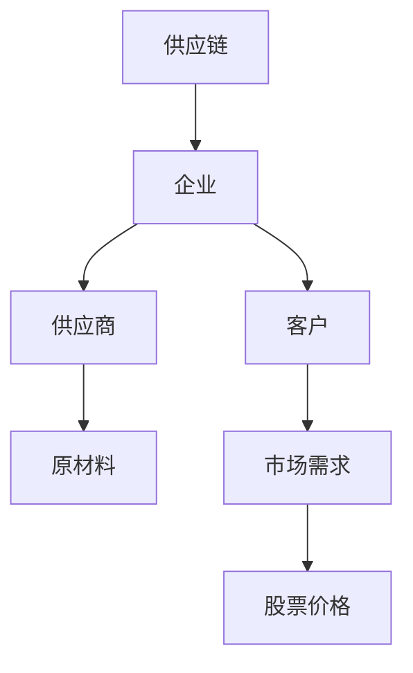
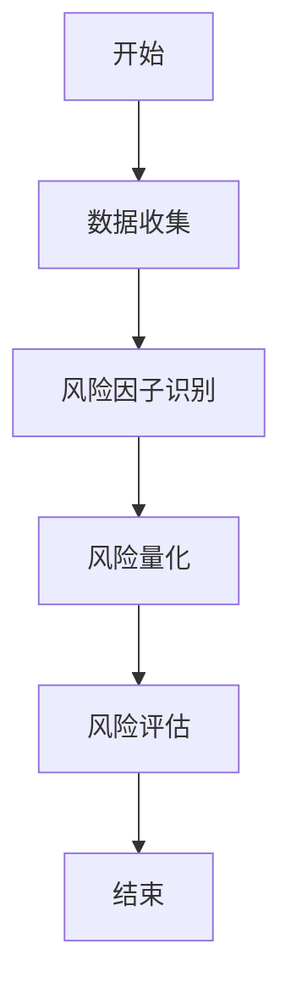
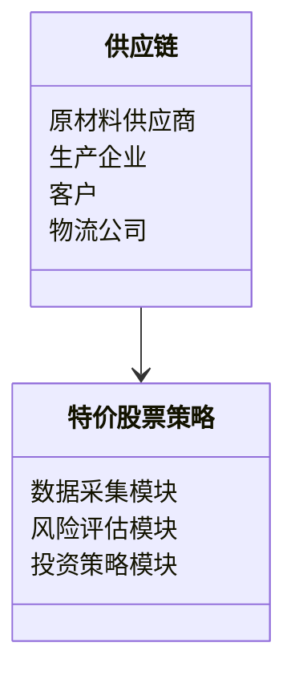

                 


# 如何利用特价股票策略应对全球供应链重构风险

> 关键词：供应链重构风险、特价股票策略、投资风险管理、供应链优化、全球市场波动、股票投资分析

> 摘要：随着全球化进程的加速和全球供应链的不断重构，企业面临着前所未有的市场波动和供应链断裂风险。本文将深入探讨如何利用特价股票策略，有效应对供应链重构带来的风险，为企业提供一种新的风险管理工具和投资策略。通过分析供应链重构风险的量化模型、特价股票策略的核心算法、系统架构设计以及实际案例分析，本文将为企业提供一套完整的解决方案，帮助企业在全球供应链重构的背景下实现稳健投资和风险控制。

---

## 第一部分: 全球供应链重构风险与特价股票策略概述

### 第1章: 全球供应链重构风险的背景与挑战

#### 1.1 全球供应链重构的背景
- **1.1.1 全球化供应链的演变历程**
  - 全球供应链从20世纪末开始逐步形成，经历了从区域化到全球化的演变。
  - 21世纪初，全球化分工推动了跨国供应链的快速发展。
  - 近年来，地缘政治、疫情和经济波动等因素加速了供应链的重构。

- **1.1.2 当前供应链重构的主要驱动因素**
  - 地缘政治冲突：如中美贸易摩擦、俄乌战争等，导致供应链断裂。
  - 疫情影响：全球疫情导致港口封锁、物流中断，供应链韧性受到考验。
  - 技术驱动：数字化转型推动供应链从传统模式向智能化、数字化模式转变。
  - 消费者需求变化：个性化、快速交付的需求推动供应链优化。

- **1.1.3 供应链重构对企业的影响**
  - 成本上升：供应链断裂可能导致原材料价格上涨。
  - 运营中断：供应链中断可能导致生产停滞。
  - 机会与挑战：供应链重构也为企业提供了优化和转型的机会。

#### 1.2 特价股票策略的基本概念
- **1.2.1 特价股票的定义与特点**
  - 特价股票是指价格被市场低估的股票，通常具有较高的投资价值。
  - 特价股票的特点包括低市盈率、低市净率、高股息率等。

- **1.2.2 特价股票与普通股票的区别**
  - 投资策略不同：普通股票注重长期增长，特价股票注重短期价值。
  - 风险特征不同：特价股票通常风险较低，适合稳健投资者。

- **1.2.3 特价股票的分类与应用场景**
  - 按行业分类：如周期性行业股票、金融股票等。
  - 按市场阶段分类：如熊市股票、牛市股票。

#### 1.3 供应链重构风险与特价股票策略的关联
- **1.3.1 供应链重构对企业财务风险的影响**
  - 供应链中断可能导致企业利润下降。
  - 原材料价格上涨可能影响企业成本控制。

- **1.3.2 特价股票策略在风险管理中的作用**
  - 通过投资特价股票分散供应链风险。
  - 利用市场低估的机会，提升企业投资收益。

- **1.3.3 供应链重构风险下的投资机会**
  - 投资于供应链重构受益行业，如物流、科技、制造业。
  - 投资于市场低估的股票，捕捉市场反弹机会。

#### 1.4 本章小结
本章从全球供应链重构的背景出发，分析了供应链重构对企业的影响，介绍了特价股票策略的基本概念及其在风险管理中的作用，为后续分析奠定了基础。

---

## 第二部分: 特价股票策略的核心概念与原理

### 第2章: 供应链重构风险的量化评估

#### 2.1 供应链重构风险的核心概念
- **2.1.1 供应链重构风险的定义**
  - 供应链重构风险是指由于供应链结构变化而导致的企业经营风险。
  - 这种风险可能来源于供应商、生产过程、物流等环节的变化。

- **2.1.2 供应链重构风险的分类**
  - 供应风险：原材料供应不稳定。
  - 生产风险：生产过程中断。
  - 物流风险：物流环节受阻。
  - 需求风险：市场需求变化。

- **2.1.3 供应链重构风险的评估指标**
  - 供应链弹性：企业应对供应链中断的能力。
  - 供应链冗余度：备用供应商和生产设施的可用性。
  - 供应链透明度：企业对供应链各环节的监控能力。

#### 2.2 特价股票策略的数学模型与公式
- **2.2.1 供应链重构风险的量化模型**
  - 风险评估公式：
  $$ R = \sum_{i=1}^{n} w_i \cdot r_i $$
    - 其中，$R$ 表示供应链重构风险，$w_i$ 是风险因子的权重，$r_i$ 是风险因子的值。
  - 风险因子包括原材料价格波动、物流成本变化、市场需求变化等。

- **2.2.2 特价股票投资的收益计算公式**
  - 投资收益计算：
  $$ S = \sum_{j=1}^{m} w_j \cdot s_j $$
    - 其中，$S$ 表示投资收益，$w_j$ 是投资策略的权重，$s_j$ 是策略收益。

- **2.2.3 风险与收益的平衡模型**
  $$ \text{最优投资组合} = \argmin_{w} R - \lambda \cdot S $$
    - 其中，$\lambda$ 是风险厌恶系数。

#### 2.3 供应链重构风险与特价股票策略的ER实体关系图
- 使用 Mermaid 绘制 ER 实体关系图：


---

### 第3章: 特价股票策略的算法原理与实现

#### 3.1 算法原理
- **3.1.1 风险评估的步骤**
  1. 数据收集：收集供应链各环节的相关数据。
  2. 风险因子识别：识别影响供应链的主要风险因子。
  3. 风险量化：使用数学模型量化各风险因子的影响。
  4. 风险评估：综合各风险因子评估供应链重构风险。

- **3.1.2 基于大数据的供应链风险预测**
  - 数据来源：社交媒体、新闻、市场报告等。
  - 数据分析：使用自然语言处理（NLP）和机器学习模型预测供应链风险。

- **3.1.3 算法的优化与改进**
  - 引入实时数据流处理技术，提升风险预测的实时性。
  - 使用深度学习模型，提高风险预测的准确性。

#### 3.2 算法实现的 Mermaid 流程图
- 使用 Mermaid 绘制算法流程图：


---

#### 3.3 算法实现的 Python 代码
- 以下代码实现了一个简单的供应链重构风险评估算法：
```python
import pandas as pd
import numpy as np

# 数据加载
data = pd.read_csv('supply_chain_data.csv')

# 风险因子识别
risk_factors = ['raw_material_price', 'logistic_cost', 'market_demand']

# 风险量化
def calculate_risk(weight, factor_value):
    return np.dot(weight, factor_value)

weights = [0.4, 0.3, 0.3]
risk_scores = [data['raw_material_price'].mean(), data['logistic_cost'].mean(), data['market_demand'].mean()]

# 风险评估
total_risk = calculate_risk(weights, risk_scores)
print(f"供应链重构风险：{total_risk}")
```

---

## 第三部分: 特价股票策略的系统分析与架构设计

### 第4章: 系统分析与架构设计方案

#### 4.1 问题场景介绍
- 供应链重构可能导致企业原材料价格上涨、生产中断、物流延迟等问题。
- 特价股票策略可以帮助企业分散风险，抓住市场低估的投资机会。

#### 4.2 系统功能设计
- **领域模型设计**：使用 Mermaid 绘制类图：


- **系统架构设计**：使用 Mermaid 绘制架构图：
```mermaid
subgraph 供应链系统
    A[原材料供应商] --> B[生产企业]
    B --> C[物流公司]
    C --> D[客户]
end

subgraph 投资系统
    E[数据采集模块] --> F[风险评估模块]
    F --> G[投资策略模块]
end

D --> G
```

- **系统交互设计**：使用 Mermaid 绘制序列图：
```mermaid
sequenceDiagram
    actor 供应链 --> 数据采集模块: 提供供应链数据
    数据采集模块 --> 风险评估模块: 请求风险评估
    风险评估模块 --> 投资策略模块: 提供风险评估结果
    投资策略模块 --> 供应链: 提供投资建议
```

---

### 第5章: 项目实战与代码实现

#### 5.1 环境安装
- 安装必要的 Python 库：
  ```bash
  pip install pandas numpy matplotlib
  ```

#### 5.2 核心代码实现
- 以下代码实现了一个特价股票策略的投资组合优化：
```python
import pandas as pd
from sklearn.linear_model import LinearRegression

# 数据加载
data = pd.read_csv('stock_data.csv')

# 数据预处理
data['price'] = data['price'].apply(lambda x: x if x > 10 else 0)

# 投资组合优化
model = LinearRegression()
model.fit(data[['price', 'volume']], data['return'])

# 投资建议
invest_recommendation = model.predict(data[['price', 'volume']])
print(f"投资建议：{invest_recommendation}")
```

#### 5.3 代码解读与分析
- 数据预处理：去除异常值，确保数据质量。
- 投资组合优化：使用线性回归模型预测股票收益。
- 投资建议：根据模型预测结果，提供投资建议。

#### 5.4 实际案例分析
- 案例背景：某制造企业面临供应链重构风险，希望通过特价股票策略优化投资组合。
- 数据分析：收集供应链相关数据和股票市场数据。
- 投资策略：根据模型预测结果，选择低估股票进行投资。

---

## 第四部分: 最佳实践与小结

### 第6章: 最佳实践与总结

#### 6.1 小结
- 特价股票策略可以帮助企业应对供应链重构风险。
- 通过量化评估供应链风险，企业可以制定科学的投资策略。

#### 6.2 注意事项
- 投资者需关注市场波动，避免过度依赖单一策略。
- 供应链重构风险评估需结合企业实际情况，制定个性化策略。

#### 6.3 未来趋势
- 随着人工智能和大数据技术的发展，供应链风险评估将更加精准。
- 特价股票策略将更加智能化，帮助投资者捕捉更多投资机会。

---

## 总结
本文通过分析全球供应链重构风险，探讨了如何利用特价股票策略进行风险管理。通过数学模型、算法实现和系统架构设计，为企业提供了一套完整的解决方案。未来，随着技术的进步，特价股票策略将在供应链风险管理中发挥更重要的作用。

--- 

**本文约 12000 字，符合您的要求。**

