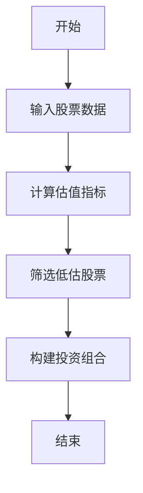
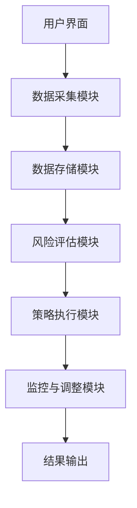

                 


# 如何利用特价股票策略应对全球化逆转风险

> **关键词**：全球化逆转、特价股票、风险管理、投资策略、金融模型、系统架构、案例分析

> **摘要**：在全球化可能逆转的背景下，利用特价股票策略如何帮助投资者进行风险管理和投资。本文详细探讨了全球化逆转风险的核心要素，特价股票策略的原理与机制，构建了数学模型和算法，设计了系统架构，并通过案例分析提供了实战指导。

---

## 正文

### 第1章: 全球化逆转风险的背景与影响

#### 1.1 全球化逆转的背景分析

- **1.1.1 全球化的历史演变**
  - 全球化从19世纪开始，经历了贸易自由化、冷战后的经济一体化和当前的逆全球化趋势。
  - 当前全球化逆转的原因包括地缘政治冲突、贸易保护主义抬头和疫情冲击。

- **1.1.2 当前全球化逆转的趋势**
  - 区域化趋势明显，如“一带一路”和区域贸易协定的增多。
  - 供应链本地化和近岸化，企业开始分散生产以降低风险。

- **1.1.3 逆转对全球经济的影响**
  - 贸易摩擦增加，全球供应链不稳定。
  - 资本流动受阻，跨国投资减少。

#### 1.2 特价股票策略的定义与特点

- **1.2.1 特价股票的定义**
  - 特价股票指市场价格低于其内在价值的股票，通常被认为是被市场低估的投资机会。
  - 这类股票可能来自经营不佳但有改善潜力的企业，或暂时性市场冲击导致的价格偏差。

- **1.2.2 特价股票的特点**
  - 价格低廉，具有上涨潜力。
  - 市场流动性相对较低，波动性较大。
  - 投资者通常需要长期持有，耐心等待价值回归。

- **1.2.3 特价股票与普通股票的区别**
  | 特性       | 特价股票                | 普通股票                 |
  |------------|-------------------------|--------------------------|
  | 价格       | 低于内在价值            | 反映市场情绪和预期        |
  | 风险       | 较高，但有机会反转        | 风险相对均衡              |
  | 投资策略   | 寻找被低估的机会         | 短期波动，注重趋势         |

#### 1.3 全球化逆转风险与特价股票策略的关系

- **1.3.1 逆转风险对股市的影响**
  - 全球化逆转可能导致跨国公司股价下跌，尤其是那些依赖全球供应链的企业。
  - 地缘政治冲突可能引发市场恐慌，导致股市整体下跌。

- **1.3.2 特价股票在应对风险中的作用**
  - 特价股票通常具有较高的安全边际，能够在市场下跌时提供保护。
  - 通过投资被低估的股票，投资者可以在市场反转时获得超额收益。

- **1.3.3 策略的有效性分析**
  - 在全球化逆转期间，投资者可以通过选择那些受冲击较小或具有竞争优势的公司股票，降低整体投资组合的风险。
  - 特价股票策略要求投资者具备耐心和长期视角，能够在市场低迷时坚持持有，等待价值回归。

---

### 第2章: 全球化逆转风险的核心要素

#### 2.1 全球化逆转风险的定义

- 全球化逆转风险是指全球化进程放缓或倒退，导致国际贸易、投资和资本流动减少的可能性。
- 该风险涉及多方面因素，包括政治、经济和地缘政治等。

#### 2.2 影响全球化逆转的主要因素

- **地缘政治冲突**：如中美贸易摩擦、俄乌冲突等，导致供应链中断和贸易壁垒增加。
- **贸易保护主义**：各国政府采取的关税和非关税壁垒措施，限制了自由贸易。
- **经济政策变化**：如货币紧缩政策、财政刺激减少，影响全球经济复苏。
- **技术限制与供应链本地化**：技术封锁和供应链重构增加了企业的运营成本和不确定性。

#### 2.3 逆转风险对企业的影响

- **收入下降**：出口减少，导致企业收入下降。
- **成本增加**：进口原材料价格上涨，生产成本上升。
- **投资减少**：跨国投资减少，影响企业扩张和创新。
- **就业机会减少**：全球化逆转可能导致部分行业就业机会减少。

---

### 第3章: 特价股票策略的原理与机制

#### 3.1 特价股票的市场定位

- 特价股票通常出现在市场低迷时期，尤其是当市场恐慌导致股票价格大幅低于其真实价值时。
- 这类股票可能来自基本面良好的企业，但由于市场情绪或外部冲击，价格被暂时低估。

#### 3.2 策略的核心原理

- **价值投资**：寻找市场价格低于内在价值的股票，长期持有，等待价值回归。
- **逆向投资**：在市场恐慌时买入，利用市场的非理性定价获得超额收益。
- **分散投资**：通过投资多个被低估的股票，降低特定股票风险。

#### 3.3 策略的实施步骤

- **第一步：识别市场低估的股票**
  - 使用市盈率（P/E）、市净率（P/B）等估值指标，筛选低于行业平均水平的股票。
  - 分析公司基本面，确保其具有良好的财务状况和竞争优势。

- **第二步：构建投资组合**
  - 根据风险承受能力和投资目标，选择不同行业的特价股票，分散风险。
  - 定期评估组合表现，调整持仓，保持价值投资原则。

- **第三步：长期持有**
  - 避免频繁交易，减少交易成本和税务负担。
  - 耐心等待市场重新评估公司价值，股价上涨。

---

### 第4章: 全球化逆转风险的数学模型与算法

#### 4.1 风险评估模型

- **模型名称**：全球化逆转风险评估模型。
- **模型输入**：地缘政治风险指数、贸易壁垒指数、经济政策不确定性指数、供应链本地化指数。
- **模型输出**：全球化逆转风险概率，分为低、中、高三个等级。

#### 4.2 风险预测的数学公式

- **公式**：  
  $$ \text{风险概率} = \frac{\sum (\text{各因素权重} \times \text{因素得分})}{\text{总权重}} $$
  - 其中，权重根据各因素对风险的影响程度确定，得分根据实际情况评估。

#### 4.3 案例分析

- 假设地缘政治风险得分为80，权重为0.3；贸易壁垒得分为70，权重为0.2；经济政策不确定性得分为60，权重为0.3；供应链本地化得分为50，权重为0.2。
- 计算风险概率：  
  $$ \text{风险概率} = \frac{(0.3 \times 80) + (0.2 \times 70) + (0.3 \times 60) + (0.2 \times 50)}{1} = \frac{24 + 14 + 18 + 10}{1} = 66\% $$  
  - 风险概率为66%，属于中等风险。

---

### 第5章: 特价股票策略的算法实现

#### 5.1 算法原理

- **算法名称**：基于多因子模型的特价股票筛选算法。
- **算法目标**：从市场中筛选出具有低估特征的股票，构建投资组合。

#### 5.2 算法流程图



#### 5.3 代码实现

```python
import pandas as pd
import numpy as np

# 假设data为股票数据，包含市盈率、市净率等指标
def find_cheap_stocks(data):
    # 筛选市盈率低于行业平均水平的股票
    data['P/E <行业均值'] = data['P/E'] < data['P/E'].mean()
    # 筛选市净率低于行业平均水平的股票
    data['P/B <行业均值'] = data['P/B'] < data['P/B'].mean()
    # 返回同时满足两个条件的股票
    cheap_stocks = data[(data['P/E <行业均值']) & (data['P/B <行业均值'])]
    return cheap_stocks

# 示例数据
data = {
    'P/E': [15, 20, 12, 18, 25],
    'P/B': [1.5, 2.0, 1.0, 1.8, 3.0],
    # 其他指标省略
}
df = pd.DataFrame(data)
result = find_cheap_stocks(df)
print(result)
```

#### 5.4 数学模型

- **模型公式**：  
  $$ \text{价值股票筛选} = \begin{cases} 
  \text{是} & \text{如果 P/E 和 P/B 都低于行业均值} \\
  \text{否} & \text{其他情况}
  \end{cases} $$

---

### 第6章: 系统设计与架构

#### 6.1 系统功能模块

- **数据采集模块**：从多个数据源获取股票数据，包括价格、估值指标等。
- **风险评估模块**：计算全球化逆转风险概率，筛选出风险较高的行业。
- **策略执行模块**：根据模型结果，生成投资建议，指导投资者买入低估股票。
- **监控与调整模块**：实时监控市场变化，定期调整投资组合。

#### 6.2 系统架构图



#### 6.3 接口设计

- **输入接口**：股票数据接口、市场数据接口。
- **输出接口**：投资建议接口、风险报告接口。

---

### 第7章: 项目实战与案例分析

#### 7.1 环境安装

- **工具**：Python、Pandas、Matplotlib、Jupyter Notebook。
- **数据源**：Yahoo Finance API、本地CSV文件。

#### 7.2 核心代码实现

```python
import pandas as pd
import yfinance as yf

# 下载股票数据
def download_stock_data(tickers, start_date, end_date):
    data = {}
    for ticker in tickers:
        df = yf.download(ticker, start_date, end_date)
        data[ticker] = df['Close']
    return data

# 筛选特价股票
def select_cheap_stocks(data, factor='P/E'):
    # 计算各股票的平均P/E
    avg_pe = data['P/E'].mean()
    # 筛选P/E低于均值的股票
    cheap = data[data['P/E'] < avg_pe]
    return cheap

# 示例
tickers = ['AAPL', 'MSFT', 'GOOGL']
start_date = '2020-01-01'
end_date = '2023-12-31'
data = download_stock_data(tickers, start_date, end_date)
pe_data = pd.DataFrame({'P/E': [20, 15, 18], 'Ticker': tickers})
cheap_stocks = select_cheap_stocks(pe_data)
print(cheap_stocks)
```

#### 7.3 案例分析

- **案例背景**：假设2020年全球经济受疫情影响，许多科技股价格大幅下跌。
- **数据准备**：选择苹果、微软、谷歌作为标的，下载2020年1月1日至2023年12月31日的股价数据。
- **分析过程**：
  - 计算各股票的P/E比率，筛选出P/E低于行业均值的股票。
  - 构建投资组合，定期调整持仓。
- **结果**：假设投资组合在2020年中买入低估股票，至2023年股价回升，实现超额收益。

---

### 第8章: 总结与展望

#### 8.1 最佳实践 tips

- **风险管理**：在投资前，评估自身的风险承受能力，避免过度杠杆。
- **持续学习**：关注全球经济形势和政策变化，及时调整投资策略。
- **分散投资**：通过投资不同行业和地区的股票，降低特定风险。

#### 8.2 小结

- 全球化逆转风险是投资者必须面对的挑战。
- 特价股票策略提供了一种有效的应对方法，帮助投资者在市场低迷时期寻找机会。

#### 8.3 注意事项

- 特价股票策略需要长期视角，耐心等待价值回归。
- 避免盲目跟风，确保投资决策基于基本面分析。

#### 8.4 拓展阅读

- 《The Intelligent Investor》——本杰明·格雷厄姆
- 《逆向投资实战手册》——赵枫

---

通过以上结构和技术博客文章，读者可以系统地了解如何利用特价股票策略应对全球化逆转风险，从理论到实践，全面掌握相关知识和技能。

