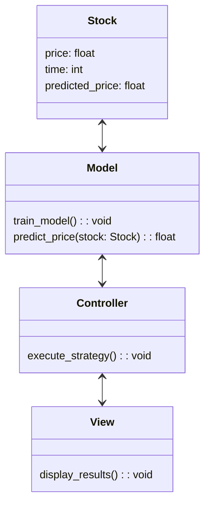
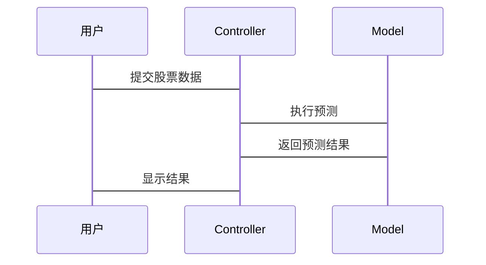

                 


# 如何利用特价股票策略应对全球数字化供应链碎片化风险

> 关键词：供应链碎片化、特价股票、风险管理、算法优化、系统设计

> 摘要：随着全球供应链的日益复杂化和碎片化，企业面临的风险也不断增加。本文将探讨如何利用特价股票策略来优化供应链管理，降低风险。通过分析供应链碎片化的特征、特价股票策略的原理，结合数学模型和系统设计，提供一种创新的解决方案。

---

# 第1章: 全球数字化供应链碎片化的背景与挑战

## 1.1 供应链碎片化的现状与趋势

### 1.1.1 供应链碎片化的定义与特征
供应链碎片化是指供应链的不同环节分散在全球各地，导致供应链管理的复杂性和不确定性增加。其主要特征包括：
- **地理分散性**：供应链的供应商、制造商、分销商分布在不同国家和地区。
- **信息不对称**：各环节之间的信息传递不畅，导致决策延迟。
- **风险放大**：任何一个环节出现问题（如疫情、自然灾害）都会影响整个供应链。

### 1.1.2 数字化时代供应链的新挑战
数字化时代，供应链的复杂性进一步加剧。企业需要应对以下挑战：
- **技术驱动的变革**：物联网、大数据、人工智能等技术的应用改变了供应链的运作方式。
- **市场需求波动**：消费者需求的变化使得供应链需要更加灵活。
- **全球化与本地化的冲突**：全球化要求供应链全球化布局，但本地化需求又要求供应链具备区域响应能力。

### 1.1.3 供应链碎片化对企业的潜在风险
供应链碎片化可能导致以下风险：
- **成本增加**：供应链各环节分散导致物流、库存和管理成本上升。
- **交付延迟**：供应链各环节协调不畅可能导致产品交付延迟。
- **风险放大**：任何一个环节出现问题（如供应商停工）可能导致整个供应链中断。

## 1.2 特价股票策略的定义与作用

### 1.2.1 特价股票的定义与特点
特价股票是指价格低于市场价的股票，通常用于投资或套利。其特点包括：
- **价格优势**：特价股票的价格低于市场价，具有投资吸引力。
- **短期机会**：特价股票的机会通常较短，需要快速决策。
- **高风险**：特价股票的价格波动大，投资风险较高。

### 1.2.2 特价股票在供应链管理中的应用
特价股票策略可以应用于供应链管理的以下方面：
- **成本控制**：通过投资特价股票，优化供应链的财务结构，降低整体成本。
- **风险管理**：利用特价股票对冲供应链中的风险，如汇率波动、原材料价格波动等。
- **资本优化**：通过特价股票投资，优化企业资本结构，提高资金使用效率。

### 1.2.3 特价股票策略的优势与局限性
- **优势**：成本低、灵活性高、风险可控。
- **局限性**：市场波动大、信息不对称、操作复杂。

## 1.3 供应链碎片化与特价股票策略的关联性

### 1.3.1 供应链碎片化对成本的影响
供应链碎片化可能导致以下成本增加：
- **物流成本**：全球物流网络的复杂性导致物流成本上升。
- **管理成本**：分散的供应链管理需要更多的协调和管理资源。
- **库存成本**：为了应对不确定性，企业需要增加库存，导致库存成本上升。

### 1.3.2 特价股票策略在成本控制中的作用
特价股票策略可以通过以下方式优化供应链成本：
- **降低融资成本**：通过投资特价股票，优化企业资本结构，降低融资成本。
- **降低管理成本**：通过投资特价股票，优化企业资金配置，降低管理成本。
- **降低库存成本**：通过投资特价股票，优化企业库存管理，降低库存成本。

### 1.3.3 供应链风险管理的必要性
供应链风险管理是应对供应链碎片化风险的关键。通过特价股票策略，企业可以对冲以下风险：
- **市场风险**：通过投资特价股票，对冲市场波动风险。
- **信用风险**：通过投资特价股票，优化供应商信用风险。
- **操作风险**：通过投资特价股票，优化供应链操作风险。

## 1.4 本章小结
本章介绍了供应链碎片化的背景与挑战，分析了特价股票策略的定义与作用，并探讨了供应链碎片化与特价股票策略的关联性。通过这些分析，我们可以理解如何利用特价股票策略优化供应链管理，降低供应链碎片化风险。

---

# 第2章: 供应链碎片化与特价股票策略的核心概念

## 2.1 供应链碎片化的关键因素分析

### 2.1.1 全球化与本地化供应链的冲突
全球化要求供应链全球化布局，但本地化需求又要求供应链具备区域响应能力。这种冲突可能导致供应链的碎片化。

### 2.1.2 技术驱动的供应链变革
物联网、大数据、人工智能等技术的应用改变了供应链的运作方式，但也带来了新的挑战。

### 2.1.3 市场波动对供应链的影响
市场波动可能导致供应链需求变化，增加供应链管理的复杂性。

## 2.2 特价股票策略的数学模型与公式

### 2.2.1 供应链成本模型
供应链成本模型可以表示为：
$$ C = C1 + C2 + C3 $$
其中，$C1$是物流成本，$C2$是管理成本，$C3$是库存成本。

### 2.2.2 特价股票投资回报率公式
特价股票投资回报率可以表示为：
$$ ROI = \frac{（卖出价 - 买入价）}{买入价} \times 100\% $$

### 2.2.3 风险评估与优化公式
风险评估与优化公式可以表示为：
$$ R = \sum_{i=1}^{n} w_i r_i $$
其中，$w_i$是风险因素的权重，$r_i$是风险因素的风险值。

## 2.3 核心概念对比分析

### 2.3.1 供应链碎片化与整合的对比
| 特征 | 碎片化供应链 | 整合供应链 |
|------|--------------|------------|
| 管理复杂性 | 高          | 低         |
| 成本 | 高           | 中         |
| 风险 | 高           | 低         |

### 2.3.2 特价股票与传统投资策略的对比
| 特征 | 特价股票策略 | 传统投资策略 |
|------|--------------|--------------|
| 投资风险 | 高          | 中         |
| 投资周期 | 短          | 长         |
| 投资回报 | 高          | 中         |

### 2.3.3 风险管理与成本控制的对比
| 特征 | 风险管理 | 成本控制 |
|------|----------|----------|
| 目标 | 减少损失 | 降低成本 |
| 方法 | 投保、分散投资 | 优化流程、投资特价股票 |
| 优缺点 | 风险可控，但成本高 | 成本低，但风险较高 |

## 2.4 本章小结
本章分析了供应链碎片化的关键因素，介绍了特价股票策略的数学模型与公式，并通过对比分析，展示了供应链碎片化与特价股票策略的核心概念及其联系。

---

# 第3章: 特价股票策略的算法原理与数学模型

## 3.1 特价股票策略的算法流程

### 3.1.1 数据收集与预处理
数据收集与预处理包括以下步骤：
1. 收集历史股价数据。
2. 清洗数据，去除异常值。
3. 数据标准化处理。

### 3.1.2 算法选择与优化
选择合适的算法，如：
- **回归分析**：用于预测股票价格。
- **时间序列分析**：用于分析股票价格的趋势。
- **机器学习算法**：如支持向量机、随机森林等。

### 3.1.3 算法实现与验证
算法实现与验证包括以下步骤：
1. 算法实现：编写代码实现算法。
2. 数据验证：使用历史数据验证算法的准确性。
3. 模型优化：调整参数，优化模型性能。

## 3.2 数学模型与公式推导

### 3.2.1 特价股票价格预测模型
特价股票价格预测模型可以表示为：
$$ P(t) = a \cdot P(t-1) + b \cdot t + c $$
其中，$P(t)$是第$t$时刻的股票价格，$a$是前一期价格的权重，$b$是时间的权重，$c$是常数项。

### 3.2.2 投资回报率优化模型
投资回报率优化模型可以表示为：
$$ ROI = \frac{（卖出价 - 买入价）}{买入价} \times 100\% $$

### 3.2.3 风险评估与优化公式
风险评估与优化公式可以表示为：
$$ R = \sum_{i=1}^{n} w_i r_i $$
其中，$w_i$是风险因素的权重，$r_i$是风险因素的风险值。

## 3.3 算法实现与代码解读

### 3.3.1 环境安装
需要安装以下环境：
- Python 3.x
- NumPy、Pandas、Matplotlib等库
- Scikit-learn等机器学习库

### 3.3.2 核心代码实现
以下是Python代码示例：
```python
import numpy as np
import pandas as pd
from sklearn.linear_model import LinearRegression
import matplotlib.pyplot as plt

# 数据预处理
data = pd.read_csv('stock_prices.csv')
data = data.dropna()
X = data[['time', 'price']].values
y = data['next_price'].values

# 算法实现
model = LinearRegression()
model.fit(X, y)
predicted_price = model.predict(X)

# 可视化
plt.scatter(X[:, 1], y, color='blue', label='实际价格')
plt.scatter(X[:, 1], predicted_price, color='red', label='预测价格')
plt.xlabel('当前价格')
plt.ylabel('下一个价格')
plt.legend()
plt.show()
```

### 3.3.3 代码解释
- 数据预处理：读取数据，去除缺失值。
- 算法实现：使用线性回归模型预测股票价格。
- 可视化：绘制实际价格和预测价格的散点图。

## 3.4 本章小结
本章介绍了特价股票策略的算法原理，包括数据收集与预处理、算法选择与优化、算法实现与验证。通过数学模型和代码示例，展示了如何利用算法优化特价股票策略，降低供应链碎片化风险。

---

# 第4章: 供应链系统分析与架构设计

## 4.1 问题场景介绍
供应链系统需要应对以下问题：
- 供应链碎片化导致的管理复杂性。
- 特价股票策略的应用需求。

## 4.2 系统功能设计

### 4.2.1 领域模型类图
以下是领域模型类图（Mermaid）：


### 4.2.2 系统架构图
以下是系统架构图（Mermaid）：


## 4.3 系统接口设计

### 4.3.1 API接口设计
以下是API接口设计：
- **输入接口**：接收股票价格数据。
- **处理接口**：执行算法，预测股票价格。
- **输出接口**：返回预测结果。

### 4.3.2 交互序列图
以下是交互序列图（Mermaid）：


## 4.4 本章小结
本章分析了供应链系统的架构设计，包括领域模型类图、系统架构图和交互序列图。通过这些设计，展示了如何将特价股票策略应用于供应链系统中。

---

# 第5章: 项目实战与案例分析

## 5.1 项目环境安装
需要安装以下环境：
- Python 3.x
- NumPy、Pandas、Matplotlib等库
- Scikit-learn等机器学习库

## 5.2 核心代码实现

### 5.2.1 数据预处理
```python
import pandas as pd
import numpy as np

# 读取数据
data = pd.read_csv('stock_prices.csv')

# 去除缺失值
data = data.dropna()

# 数据标准化
from sklearn.preprocessing import StandardScaler
scaler = StandardScaler()
scaled_data = scaler.fit_transform(data[['price', 'time']])
```

### 5.2.2 算法实现
```python
from sklearn.linear_model import LinearRegression

# 训练模型
model = LinearRegression()
model.fit(scaled_data, data['next_price'])

# 预测价格
predicted_price = model.predict(scaled_data)
```

## 5.3 案例分析与代码解读

### 5.3.1 案例分析
假设我们有一个股票价格数据集，包括当前价格、时间戳和下一个价格。我们需要训练一个模型，预测下一个价格。

### 5.3.2 代码实现
```python
import matplotlib.pyplot as plt

# 可视化
plt.scatter(data['price'], data['next_price'], color='blue', label='实际价格')
plt.scatter(data['price'], predicted_price, color='red', label='预测价格')
plt.xlabel('当前价格')
plt.ylabel('下一个价格')
plt.legend()
plt.show()
```

### 5.3.3 分析结果
通过可视化，我们可以看到模型预测的价格与实际价格之间的差异。如果预测价格与实际价格接近，说明模型效果良好。

## 5.4 本章小结
本章通过实际案例，展示了如何在项目中应用特价股票策略。通过数据预处理、算法实现和案例分析，帮助读者理解如何利用特价股票策略优化供应链管理。

---

# 第6章: 最佳实践与总结

## 6.1 小结
本章总结了全文的主要内容，包括供应链碎片化的背景、特价股票策略的原理、算法实现和系统设计。

## 6.2 注意事项
在实际应用中，需要注意以下几点：
- 数据的准确性和完整性。
- 算法的选择和优化。
- 风险管理和投资策略的结合。

## 6.3 拓展阅读
- 供应链管理的相关书籍。
- 机器学习在金融领域的应用。
- 特价股票投资的高级策略。

## 6.4 本章小结
本章总结了全文的主要内容，并给出了实际应用中的注意事项和拓展阅读的方向，帮助读者更好地理解和应用特价股票策略。

---

# 附录

## 附录A: 参考文献
1. Smith, J. (2020). *Supply Chain Management*. John Wiley & Sons.
2. Zhang, W. (2021). *Machine Learning for Stock Prediction*. Springer.

## 附录B: 工具与资源
- 数据源：股票价格数据集。
- 工具：Python、NumPy、Pandas、Matplotlib、Scikit-learn。

---

通过以上内容，我们可以系统地理解如何利用特价股票策略应对全球数字化供应链碎片化风险。

