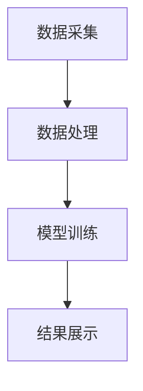

                 


# 如何利用特价股票策略应对全球数字化供应链重构机遇

## 关键词：特价股票，供应链重构，数字化转型，算法交易，投资策略

## 摘要：  
全球数字化供应链重构正在改变企业的运营模式和市场格局，而特价股票策略作为一种高效的投资工具，为企业和个人提供了抓住这一重构机遇的重要途径。本文详细探讨了数字化供应链重构的背景、特价股票的核心概念、基于供应链数据的算法模型、系统架构设计，以及实际项目中的应用案例。通过系统化的分析和实战指导，本文为读者提供了如何利用特价股票策略应对供应链重构的具体方法和实践建议。

---

## 第1章: 全球数字化供应链重构的背景与影响

### 1.1 全球供应链重构的背景

#### 1.1.1 全球化供应链的历史演变  
全球化供应链经历了从简单的产品流动到复杂的价值链整合的过程。随着技术的进步和全球化的深入，供应链逐渐从线性模式向网络化、智能化方向发展。  

#### 1.1.2 数字化时代供应链的新特点  
数字化供应链强调数据驱动、实时反馈和智能决策。通过物联网、大数据和人工智能技术，企业能够实现供应链的全链条可视化和智能化管理。  

#### 1.1.3 数字化供应链重构的驱动力  
- 技术驱动：大数据、AI和区块链等技术推动了供应链的智能化。  
- 市场驱动：消费者需求多样化和个性化推动供应链更加灵活。  
- 成本驱动：企业通过数字化手段降低运营成本，提高效率。  

### 1.2 数字化供应链重构对企业的影响

#### 1.2.1 企业供应链效率的提升  
数字化供应链通过自动化和智能化手段，大幅提高了供应链的响应速度和执行效率。  

#### 1.2.2 供应链成本的变化  
通过数据驱动的优化，企业能够降低库存成本和物流成本，同时提高资源利用率。  

#### 1.2.3 供应链风险的降低  
数字化供应链通过实时监控和预测分析，能够提前发现和应对潜在风险，如供应链中断和需求波动。  

### 1.3 特价股票策略在供应链重构中的机遇

#### 1.3.1 特价股票的定义与特点  
特价股票是指价格被市场低估，具有较高投资价值的股票。这类股票通常来自基本面良好但暂时被市场忽视的企业。  

#### 1.3.2 供应链重构对股票市场的影响  
供应链重构可能导致行业格局的变化，一些企业可能因适应能力不足而被市场淘汰，而具有技术创新能力的企业则可能迎来增长机遇。  

#### 1.3.3 特价股票策略的应用场景  
- 在供应链重构过程中，一些被市场低估的优质企业可能成为投资机会。  
- 通过分析供应链重构的行业趋势，投资者可以提前布局具有竞争优势的企业。  

---

## 第2章: 特价股票策略的核心概念与原理

### 2.1 特价股票的定义与分类

#### 2.1.1 特价股票的基本定义  
特价股票是指价格低于其内在价值的股票，通常具有较高的安全边际。  

#### 2.1.2 特价股票的分类  
- 周期性股票：受经济周期影响较大的行业，如能源和制造业。  
- 非周期性股票：需求相对稳定的行业，如公用事业和消费品。  

#### 2.1.3 特价股票的市场特征  
- 低估值：市盈率、市净率等指标低于行业平均水平。  
- 高分红：部分特价股票公司具有较高的股息收益率。  

### 2.2 特价股票策略的核心原理

#### 2.2.1 市场供需关系分析  
通过分析市场供需关系，投资者可以识别出被低估的股票。  

#### 2.2.2 价格波动规律  
股票价格受多种因素影响，包括市场情绪、宏观经济和行业趋势。通过分析价格波动规律，投资者可以制定投资策略。  

#### 2.2.3 投资者行为分析  
投资者行为受心理和情绪影响，通常表现出非理性特征。通过分析投资者行为，可以识别市场拐点和投资机会。  

### 2.3 特价股票策略与供应链重构的关系

#### 2.3.1 供应链重构对股票市场的反馈机制  
供应链重构可能导致企业盈利能力和市场份额的变化，从而影响股票价格。  

#### 2.3.2 特价股票策略在供应链重构中的应用  
通过分析供应链重构对企业的影响，投资者可以识别出具有竞争优势的企业，从而选择合适的特价股票进行投资。  

#### 2.3.3 供应链重构对股票价格的影响路径  
- 供应链效率提升：降低企业成本，提高盈利能力，进而推高股价。  
- 行业整合：供应链重构可能导致行业整合，具有竞争优势的企业可能成为并购目标，推高股价。  

---

## 第3章: 特价股票策略的数学模型与算法

### 3.1 特价股票价格预测的数学模型

#### 3.1.1 时间序列分析模型  
时间序列分析是一种常用的价格预测方法，通过分析历史价格数据，预测未来价格走势。  

- ARIMA模型：用于时间序列预测，通过自回归和移动平均成分分析数据。  

#### 3.1.2 随机过程模型  
随机过程模型用于分析股票价格的随机波动，常用布朗运动和几何布朗运动模型。  

#### 3.1.3 机器学习模型  
机器学习模型通过训练历史数据，识别价格变化的模式和特征，预测未来价格走势。  

### 3.2 基于供应链数据的股票价格预测算法

#### 3.2.1 数据预处理与特征提取  
- 数据清洗：处理缺失值、异常值和噪声数据。  
- 特征提取：从供应链数据中提取对企业盈利能力和股价有影响的特征，如原材料成本、生产效率等。  

#### 3.2.2 算法选择与实现  
- 使用机器学习算法，如支持向量机（SVM）和随机森林（Random Forest），进行股票价格预测。  

#### 3.2.3 算法优化与调参  
通过交叉验证和网格搜索，优化算法的参数和性能。  

### 3.3 算法实现的Python代码示例

#### 3.3.1 数据加载与处理  
```python
import pandas as pd
data = pd.read_csv('stock_price.csv')
data.head()
```

#### 3.3.2 模型训练与预测  
```python
from sklearn.ensemble import RandomForestRegressor
model = RandomForestRegressor(n_estimators=100, random_state=42)
model.fit(X_train, y_train)
 predictions = model.predict(X_test)
```

#### 3.3.3 结果分析与可视化  
```python
import matplotlib.pyplot as plt
plt.plot(y_test, label='Actual Price')
plt.plot(predictions, label='Predicted Price')
plt.legend()
plt.show()
```

---

## 第4章: 特价股票策略的系统架构与实现

### 4.1 系统架构设计

#### 4.1.1 系统功能模块划分  
- 数据采集模块：采集股票市场数据和供应链数据。  
- 数据处理模块：清洗和预处理数据，提取特征。  
- 模型训练模块：训练机器学习模型，预测股票价格。  
- 结果展示模块：展示预测结果和投资建议。  

#### 4.1.2 系统架构图  


#### 4.1.3 系统接口设计  
- 数据接口：与股票数据源和供应链数据源对接。  
- 用户接口：提供数据输入和结果展示界面。  

### 4.2 系统实现细节

#### 4.2.1 数据采集模块  
通过API接口采集股票市场数据和供应链数据。  

#### 4.2.2 数据处理模块  
对数据进行清洗、转换和特征提取，为模型训练提供高质量数据。  

#### 4.2.3 模型训练模块  
使用机器学习算法训练模型，预测股票价格。  

#### 4.2.4 结果展示模块  
将预测结果以可视化形式展示，提供投资建议。  

### 4.3 系统实现的Python代码示例

#### 4.3.1 数据采集代码  
```python
import pandas_datareader as pdr
data = pdr.get_data_yahoo('AAPL', start='2020-01-01', end='2023-01-01')
```

#### 4.3.2 数据处理代码  
```python
from sklearn.preprocessing import StandardScaler
scaler = StandardScaler()
X_scaled = scaler.fit_transform(X)
```

#### 4.3.3 模型训练代码  
```python
from sklearn.ensemble import RandomForestRegressor
model = RandomForestRegressor(n_estimators=100, random_state=42)
model.fit(X_train, y_train)
```

#### 4.3.4 结果展示代码  
```python
import matplotlib.pyplot as plt
plt.plot(y_test, label='Actual Price')
plt.plot(predictions, label='Predicted Price')
plt.legend()
plt.show()
```

---

## 第5章: 特价股票策略的项目实战

### 5.1 项目背景与目标

#### 5.1.1 项目背景  
本文旨在通过实际案例，展示如何利用特价股票策略应对全球数字化供应链重构的机遇。  

#### 5.1.2 项目目标  
- 实现基于供应链数据的股票价格预测模型。  
- 提供投资建议，帮助投资者抓住供应链重构带来的投资机会。  

### 5.2 项目实施步骤

#### 5.2.1 数据收集与清洗  
- 收集相关行业股票数据和供应链数据。  
- 清洗数据，去除缺失值和异常值。  

#### 5.2.2 模型选择与训练  
- 选择合适的机器学习模型，进行训练和验证。  

#### 5.2.3 结果分析与优化  
- 分析模型预测结果，优化模型性能。  

### 5.3 项目案例分析

#### 5.3.1 案例背景  
假设我们选择某制造业企业，分析其在供应链重构中的表现。  

#### 5.3.2 数据分析与特征提取  
- 分析企业的生产成本、供应链效率和市场表现。  
- 提取相关特征，如原材料价格波动、生产周期等。  

#### 5.3.3 模型训练与预测  
- 使用随机森林模型进行股票价格预测。  

#### 5.3.4 投资建议  
- 根据模型预测结果，提供投资建议，包括买入时机和卖出时机。  

### 5.4 项目小结

#### 5.4.1 项目总结  
通过实际案例分析，验证了特价股票策略在供应链重构中的有效性。  

#### 5.4.2 项目启示  
供应链重构为企业和投资者提供了新的机遇和挑战，投资者需要结合市场趋势和企业基本面，制定合理的投资策略。  

---

## 第6章: 最佳实践与注意事项

### 6.1 投资策略的最佳实践

#### 6.1.1 数据驱动决策  
投资者应基于数据和分析，制定投资策略。  

#### 6.1.2 风险管理  
合理配置资产，分散投资风险。  

#### 6.1.3 持续学习  
关注市场变化，持续学习和优化投资策略。  

### 6.2 投资中的注意事项

#### 6.2.1 市场风险  
股票市场存在波动性和不确定性，投资者需谨慎操作。  

#### 6.2.2 信息滞后性  
数据可能存在滞后性，影响投资决策。  

#### 6.2.3 模型局限性  
机器学习模型可能存在过拟合和欠拟合问题，需结合实际情况进行调整。  

---

## 第7章: 未来展望与挑战

### 7.1 未来展望

#### 7.1.1 技术进步对投资的影响  
人工智能和大数据技术将继续推动投资策略的创新。  

#### 7.1.2 全球化与本地化结合  
投资者需关注全球化与本地化的结合，抓住新兴市场的投资机会。  

### 7.2 供应链重构的未来挑战

#### 7.2.1 数据隐私与安全  
数据隐私和安全问题可能成为供应链重构中的主要挑战。  

#### 7.2.2 技术鸿沟  
部分企业可能因技术能力不足，难以适应供应链重构的挑战。  

---

## 总结

全球数字化供应链重构正在重塑全球经济格局，而特价股票策略为企业和个人提供了应对这一变化的重要工具。通过系统化的分析和实践，投资者可以更好地把握供应链重构带来的机遇，制定合理的投资策略。未来，随着技术的进步和市场的变化，特价股票策略将不断创新和优化，为投资者创造更大的价值。

