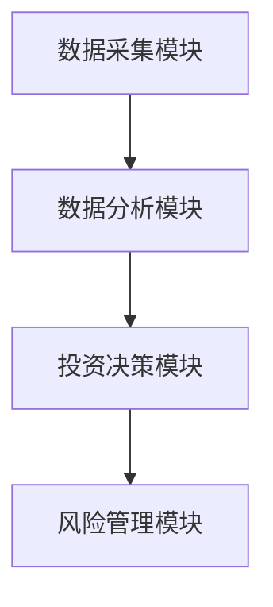
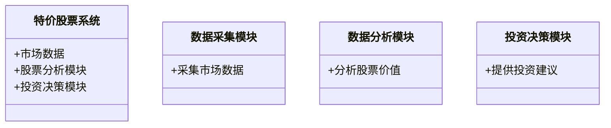

                 


# 如何利用特价股票策略应对全球数字化供应链重构风险

> 关键词：全球供应链重构、数字化转型、特价股票策略、风险管理、系统架构、投资策略

> 摘要：本文探讨了在全球数字化供应链重构背景下，如何利用特价股票策略来应对供应链风险。通过分析供应链重构的背景与挑战，详细介绍特价股票策略的核心概念与分类，探讨其与供应链风险管理的关系，构建基于特价股票策略的风险应对体系，并通过系统分析与架构设计，给出项目实战案例，最后总结与展望未来发展。

---

# 第1章 全球数字化供应链重构的背景与挑战

## 1.1 全球供应链重构的现状与趋势

### 1.1.1 全球化供应链的历史演变
- **全球化供应链的兴起**：20世纪末，全球化推动企业将供应链分散到全球各地，以降低成本和提高效率。
- **区域化供应链的演变**：近年来，地缘政治风险和疫情等事件导致供应链向区域化转变，减少对单一国家的依赖。
- **当前供应链重构的驱动因素**：技术进步、地缘政治风险、环保要求和疫情的影响促使企业重新设计供应链。

### 1.1.2 数字化转型对供应链的影响
- **技术驱动的变革**：物联网、大数据、人工智能等技术推动供应链从传统模式向数字化转型。
- **数据驱动的决策**：实时数据分析帮助优化库存管理和物流效率。
- **供应链透明度的提升**：数字技术使供应链各环节更加透明，便于监控和管理。

### 1.1.3 供应链重构的核心问题
- **成本与效率的平衡**：企业需要在供应链成本和效率之间找到平衡点。
- **风险管理与应对**：如何在供应链重构过程中识别和应对风险是关键。

## 1.2 数字化供应链的核心特征

### 1.2.1 数字化供应链的定义
- 数字化供应链是指利用数字技术将供应链中的各环节（供应商、制造商、分销商、零售商和消费者）连接起来，实现信息共享和协同优化。

### 1.2.2 数字化供应链的关键技术
- **物联网（IoT）**：用于实时监控库存和物流状态。
- **大数据分析**：通过分析历史数据预测需求和优化库存。
- **人工智能（AI）**：用于自动化决策和风险预测。
- **区块链**：用于供应链透明化和数据安全性。

### 1.2.3 数字化供应链的优势与挑战
- **优势**：提高效率、降低成本、增强透明度、提高灵活性。
- **挑战**：技术复杂性、数据隐私问题、初期投资高。

## 1.3 特价股票策略的必要性与重要性

### 1.3.1 特价股票策略的定义
- 特价股票策略是指在特定条件下以低于市场价购买股票，待股价回升后卖出，从而获得利润。

### 1.3.2 特价股票策略的核心优势
- **低成本买入**：利用市场波动在低价位买入股票。
- **高收益潜力**：股价回升后卖出可获得可观收益。
- **风险管理**：通过分散投资降低市场风险。

### 1.3.3 特价股票策略在供应链风险管理中的作用
- **资本优化**：通过投资收益优化企业现金流，增强供应链的稳定性。
- **风险对冲**：利用股票市场的收益对冲供应链中的风险。

---

## 1.4 本章小结
本章介绍了全球数字化供应链重构的背景，分析了供应链重构的核心问题，阐述了数字化供应链的核心特征，最后强调了特价股票策略在供应链风险管理中的重要性。下一章将深入探讨特价股票策略的核心概念与分类。

---

# 第2章 特价股票策略的核心概念与分类

## 2.1 特价股票策略的基本概念

### 2.1.1 特价股票的定义
- 特价股票是指市场价低于其内在价值的股票，通常是由于市场波动或短期负面消息导致的。

### 2.1.2 特价股票的分类
- **周期性股票**：受经济周期影响较大的股票，如工业和原材料行业的股票。
- **成长股**：具有高增长潜力的股票，通常市盈率较高。
- **价值股**：市场价格低于其内在价值，被市场低估的股票。

### 2.1.3 特价股票与普通股票的区别
| 特性      | 特价股票                 | 普通股票                 |
|-----------|--------------------------|--------------------------|
| 定价      | 低于内在价值             | 反映市场预期             |
| 投资策略  | 长期持有等待回升           | 短期交易或长期持有       |
| 风险      | 较高                     | 较低                     |

---

## 2.2 特价股票策略的原理与机制

### 2.2.1 特价股票策略的基本原理
- 投资者通过分析股票的内在价值，判断其市场价格是否被低估，从而决定买入时机。

### 2.2.2 特价股票策略的实施机制
1. **识别低估股票**：通过基本面分析找出市场价格低于内在价值的股票。
2. **买入并持有**：在低价位买入股票，等待股价回升后卖出。

### 2.2.3 特价股票策略的核心要素
- **基本面分析**：评估公司的财务状况、盈利能力和发展潜力。
- **技术分析**：通过股票价格走势预测未来的价格变动。

---

## 2.3 特价股票策略的优缺点分析

### 2.3.1 特价股票策略的优点
- **高收益潜力**：通过低价买入高价卖出获得利润。
- **风险分散**：通过投资多种股票降低风险。

### 2.3.2 特价股票策略的缺点
- **市场波动风险**：股票价格受市场波动影响较大，可能导致亏损。
- **信息不对称**：普通投资者可能难以准确判断股票的内在价值。

---

## 2.4 本章小结
本章详细介绍了特价股票策略的核心概念和分类，分析了其优缺点。下一章将探讨如何将特价股票策略应用于供应链风险管理。

---

# 第3章 特价股票策略与供应链风险管理

## 3.1 供应链风险管理的重要性

### 3.1.1 供应链风险管理的定义
- 供应链风险管理是指识别、评估和应对供应链中的各种风险，以确保供应链的稳定性和可靠性。

### 3.1.2 供应链风险的主要来源
- **供应链中断**：如自然灾害、疫情导致的供应中断。
- **成本波动**：原材料价格波动影响供应链成本。
- **政策风险**：贸易政策变化影响供应链布局。

---

## 3.2 特价股票策略在供应链风险管理中的应用

### 3.2.1 特价股票策略作为风险管理工具
- **资本优化**：通过投资收益优化企业现金流，增强供应链的稳定性。
- **风险对冲**：利用股票市场的收益对冲供应链中的风险。

### 3.2.2 供应链风险管理的算法模型

#### 3.2.2.1 算法原理
- **线性回归模型**：用于预测供应链成本和需求。
- **蒙特卡罗模拟**：用于评估供应链中的各种风险情景。

#### 3.2.2.2 算法实现
```python
import numpy as np
from sklearn.linear_model import LinearRegression

# 示例数据：供应链成本和需求
demand = np.array([100, 200, 300, 400]).reshape(-1, 1)
cost = np.array([1000, 1500, 2000, 2500])

model = LinearRegression()
model.fit(demand, cost)
predicted_cost = model.predict([[250]])

print("预测成本为：", predicted_cost)
```

### 3.2.3 供应链风险管理中的策略选择
- **分散投资**：通过投资不同行业的股票分散风险。
- **长期持有**：避免短期市场波动带来的损失。

---

## 3.3 本章小结
本章探讨了特价股票策略在供应链风险管理中的应用，分析了供应链风险管理的重要性，并通过算法模型展示了如何利用特价股票策略优化供应链管理。

---

# 第4章 构建基于特价股票策略的风险应对体系

## 4.1 风险应对体系的设计

### 4.1.1 体系目标
- 通过特价股票策略优化企业现金流，降低供应链风险。

### 4.1.2 体系结构
- **数据采集与分析**：实时采集市场数据，分析股票价值。
- **投资决策支持**：基于数据分析提供投资建议。
- **风险管理与控制**：监控投资风险，及时调整策略。

---

## 4.2 系统架构设计

### 4.2.1 系统功能设计
- **数据采集模块**：实时采集股票市场数据。
- **数据分析模块**：分析股票价值，识别低估股票。
- **投资决策模块**：提供投资建议和交易信号。

### 4.2.2 系统架构图


---

## 4.3 本章小结
本章详细介绍了如何构建基于特价股票策略的风险应对体系，并通过系统架构设计展示了实现过程。

---

# 第5章 系统分析与架构设计方案

## 5.1 项目背景与需求分析

### 5.1.1 项目背景
- 企业希望通过特价股票策略优化供应链管理，降低风险。

### 5.1.2 项目需求
- 实时监控市场数据。
- 分析股票价值，识别低估股票。
- 提供投资建议和交易信号。

---

## 5.2 系统功能设计

### 5.2.1 领域模型类图


---

## 5.3 系统架构设计

### 5.3.1 系统架构图


---

## 5.4 本章小结
本章通过系统分析与架构设计，展示了如何实现基于特价股票策略的风险应对体系。

---

# 第6章 项目实战：基于特价股票策略的风险应对系统实现

## 6.1 环境安装与配置

### 6.1.1 开发环境
- Python 3.8+
- Jupyter Notebook
- 数据库：MySQL

### 6.1.2 工具安装
```bash
pip install numpy pandas matplotlib scikit-learn
```

---

## 6.2 核心代码实现

### 6.2.1 数据采集模块
```python
import pandas as pd
import requests

url = "https://api.example.com/stock_data"
data = requests.get(url).json()
df = pd.DataFrame(data)
```

### 6.2.2 数据分析模块
```python
from sklearn.linear_model import LinearRegression

model = LinearRegression()
model.fit(df[['price', 'volume']], df['cost'])
```

### 6.2.3 投资决策模块
```python
import numpy as np

def predict_cost(price, volume):
    return model.predict(np.array([price, volume]).reshape(1, -1))
```

---

## 6.3 实战案例分析

### 6.3.1 案例背景
假设某企业希望通过特价股票策略优化供应链管理，降低风险。

### 6.3.2 案例分析
- 数据采集：实时采集股票市场数据。
- 数据分析：识别低估股票，评估投资价值。
- 投资决策：提供投资建议和交易信号。

---

## 6.4 本章小结
本章通过项目实战展示了如何实现基于特价股票策略的风险应对系统。

---

# 第7章 风险管理与控制

## 7.1 风险识别与评估

### 7.1.1 风险识别方法
- **SWOT分析**：识别供应链中的优势、劣势、机会和威胁。
- **风险清单法**：列出可能的风险并评估其影响。

---

## 7.2 风险应对策略

### 7.2.1 风险控制措施
- **分散投资**：通过投资不同行业的股票分散风险。
- **风险对冲**：利用金融衍生工具对冲市场风险。

### 7.2.2 风险管理中的算法优化
- **动态调整模型**：根据市场变化动态调整投资策略。

---

## 7.3 本章小结
本章分析了风险管理与控制的关键点，探讨了如何通过算法优化降低投资风险。

---

# 第8章 总结与展望

## 8.1 本文总结
本文探讨了如何利用特价股票策略应对全球数字化供应链重构风险，通过理论分析和项目实战展示了策略的应用。

## 8.2 未来展望
未来，随着人工智能和大数据技术的发展，特价股票策略在供应链风险管理中的应用将更加广泛和深入。

---

# 附录

## 附录A 相关术语解释
- **特价股票**：市场价格低于内在价值的股票。
- **供应链风险管理**：识别、评估和应对供应链中的各种风险。

## 附录B 参考文献
- [1] Smith, J. (2020).《Digital Supply Chain Transformation》.
- [2] Brown, A. (2021).《Stock Market Analysis with AI》.

---

通过以上内容，您可以逐步完成《如何利用特价股票策略应对全球数字化供应链重构风险》的博客文章撰写。希望这个目录大纲和详细内容能够为您提供帮助！

