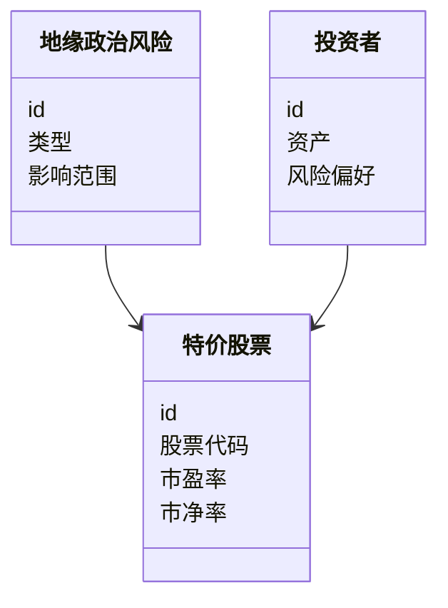
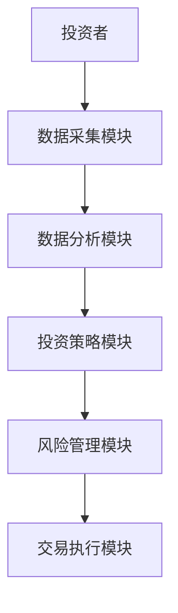

                 


# 如何利用特价股票策略应对地缘政治风险

## 关键词：特价股票、地缘政治风险、投资策略、风险管理、市场波动、系统架构

## 摘要：本文详细探讨了在地缘政治风险下如何利用特价股票策略进行投资。首先，文章介绍了地缘政治风险的基本概念、特征及其对股票市场的影响。然后，详细阐述了特价股票的定义、特点和选择标准。接着，分析了地缘政治风险下的投资策略，包括逻辑、模型和工具选择。随后，讨论了风险管理策略，包括风险识别、控制和应对措施。通过实际案例分析，展示了特价股票策略在应对地缘政治风险中的应用。最后，提出了系统架构设计和项目实战指导，帮助投资者构建有效的投资系统。本文为投资者在不确定市场环境下的投资决策提供了实用的指导和建议。

---

## 第1章：地缘政治风险的基础知识

### 1.1 地缘政治风险的定义与特征

#### 1.1.1 地缘政治风险的定义
地缘政治风险是指由于政治、经济、军事或文化等领域的冲突或变化，导致某一地区或国家的稳定性和经济活动受到负面影响的可能性。这些风险通常涉及主权国家之间的冲突、政策变化、自然灾害或恐怖主义等事件。

#### 1.1.2 地缘政治风险的特征
- **复杂性**：地缘政治风险往往涉及多方面的利益冲突，难以预测和量化。
- **不确定性**：事件的发生具有随机性，且影响范围广泛。
- **连锁反应**：某一地区的地缘政治事件可能引发全球市场的连锁反应。
- **长期性**：某些地缘政治风险可能持续多年，对市场产生长期影响。

#### 1.1.3 地缘政治风险的分类与影响
地缘政治风险可以分为以下几类：
- **国际冲突**：如战争、领土争端等。
- **政策变化**：如贸易政策、货币政策的调整。
- **自然灾害**：如地震、洪水等。

这些风险对股票市场的影响包括股价波动、行业衰退、市场流动性下降等。

### 1.2 地缘政治风险的评估方法

#### 1.2.1 风险评估的指标与工具
常用的指标包括：
- **波动率**：衡量市场的波动程度。
- **相关性分析**：分析地缘政治事件与股价的相关性。
- **情景分析**：模拟不同地缘政治事件对市场的影响。

#### 1.2.2 地缘政治事件的分析框架
- **事件识别**：识别潜在的地缘政治事件。
- **影响评估**：评估事件对市场和个股的影响。
- **风险量化**：量化风险程度。

#### 1.2.3 风险评估的步骤与流程
1. 识别潜在风险因素。
2. 评估风险发生的概率。
3. 分析风险的影响程度。
4. 制定应对策略。

### 1.3 地缘政治风险对股票市场的影响

#### 1.3.1 地缘政治事件对股市的短期影响
- **股价波动**：地缘政治事件可能导致股价短期剧烈波动。
- **市场情绪变化**：投资者情绪趋于谨慎，可能导致市场抛售。

#### 1.3.2 地缘政治风险对行业和个股的影响
- **行业影响**：某些行业（如能源、国防）可能受到直接影响。
- **个股影响**：公司所在的地理位置、行业地位等因素会影响其股价。

#### 1.3.3 地缘政治风险的长期影响与应对策略
- **长期影响**：地缘政治风险可能导致市场结构变化、行业洗牌等。
- **应对策略**：分散投资、长期持股、加强风险管理。

---

## 第2章：特价股票策略的基本概念

### 2.1 特价股票的定义与特点

#### 2.1.1 特价股票的定义
特价股票是指在特定时间内价格大幅低于市场平均价格的股票。这些股票通常具有较高的潜在收益，但伴随着较高的风险。

#### 2.1.2 特价股票的特点与优势
- **低估值**：股票价格低于其内在价值。
- **高潜力**：潜在的高收益。
- **高波动性**：价格波动较大，易于短线操作。

#### 2.1.3 特价股票的投资风险
- **市场风险**：市场波动可能导致股价进一步下跌。
- **流动性风险**：某些特价股票流动性较差，难以迅速变现。

### 2.2 特价股票的分类与选择标准

#### 2.2.1 特价股票的分类
- **周期性股票**：受经济周期影响较大的股票。
- **成长型股票**：具有高增长潜力的股票。
- **价值型股票**：价格低于其内在价值的股票。

#### 2.2.2 特价股票的选择标准
- **市盈率（P/E）**：低于行业平均水平。
- **市净率（P/B）**：低于行业平均水平。
- **股息率**：高股息率的股票。

#### 2.2.3 特价股票的筛选方法
- **基本面分析**：分析公司的财务状况、盈利能力等。
- **技术分析**：通过技术指标筛选低价股票。
- **市场情绪分析**：分析市场情绪，选择被市场低估的股票。

### 2.3 特价股票策略的应用场景

#### 2.3.1 特价股票策略在市场波动中的应用
- **市场下跌**：利用特价股票的低估值特性，等待市场回升。
- **市场震荡**：通过短线操作，利用价格波动获利。

#### 2.3.2 特价股票策略在地缘政治风险下的应用
- **风险对冲**：通过投资特价股票，对冲地缘政治风险的影响。
- **机会捕捉**：地缘政治事件可能导致某些股票价格被低估，提供投资机会。

#### 2.3.3 特价股票策略与其他投资策略的结合
- **组合投资**：将特价股票与其他资产结合，分散风险。
- **长期投资**：结合价值投资，长期持有特价股票。

---

## 第3章：地缘政治风险下的投资策略

### 3.1 地缘政治风险下的投资逻辑

#### 3.1.1 地缘政治风险下的投资逻辑
- **风险识别**：识别潜在的地缘政治风险。
- **风险评估**：评估风险对市场和个股的影响。
- **策略选择**：根据风险评估结果，选择合适的投资策略。

#### 3.1.2 地缘政治风险下的投资模型
- **风险评估模型**：通过数学模型量化风险。
- **资产配置模型**：根据风险评估结果，调整资产配置。

### 3.2 地缘政治风险下的投资模型与工具

#### 3.2.1 风险评估模型
- **VaR模型**：衡量投资组合的风险价值。
- **CVaR模型**：衡量投资组合的条件风险价值。

#### 3.2.2 投资工具的选择
- **指数基金**：分散投资，降低风险。
- **ETF**：交易所交易基金，提供多样化的投资选择。

#### 3.2.3 数据分析工具
- **Python**：用于数据清洗、分析和可视化。
- **Excel**：简单的数据处理和分析。

### 3.3 地缘政治风险下的投资工具选择

#### 3.3.1 数据分析工具的选择
- **Python**：强大的数据处理和分析能力。
- **R语言**：适用于统计分析。

#### 3.3.2 投资策略的选择
- **价值投资**：寻找被低估的股票。
- **短线交易**：利用市场波动进行短期交易。

---

## 第4章：风险管理策略

### 4.1 风险管理的重要性

#### 4.1.1 风险管理的基本概念
- **风险管理**：识别、评估和控制风险的过程。
- **风险管理的目标**：减少损失，提高投资收益。

#### 4.1.2 风险管理在投资中的作用
- **保护资本**：避免重大损失。
- **提高收益**：通过有效的风险管理，提高投资收益。

### 4.2 风险管理的具体措施

#### 4.2.1 风险识别
- **识别潜在风险**：通过分析市场和公司基本面，识别潜在风险。
- **风险分类**：将风险分为市场风险、信用风险、流动性风险等。

#### 4.2.2 风险评估
- **量化风险**：使用数学模型量化风险。
- **情景分析**：模拟不同情景下的风险影响。

#### 4.2.3 风险控制
- **分散投资**：通过多样化投资降低风险。
- **止损策略**：设定止损点，避免重大损失。

### 4.3 风险管理工具与技术

#### 4.3.1 风险管理工具
- **止损订单**：在股价下跌到一定点时自动卖出。
- **对冲工具**：通过期货、期权等工具对冲风险。

#### 4.3.2 风险管理技术
- **VaR技术**：衡量投资组合的风险价值。
- **压力测试**：模拟极端市场情况下的投资组合表现。

---

## 第5章：案例分析

### 5.1 案例背景
- **地缘政治事件**：某地区发生冲突，导致市场波动。
- **投资策略**：利用特价股票策略进行投资。

### 5.2 案例分析
- **选择特价股票**：根据市盈率和市净率筛选出几只股票。
- **投资过程**：购买特价股票，等待市场回升。

### 5.3 案例结果
- **收益情况**：通过投资特价股票，获得较高的收益。
- **风险管理**：通过止损策略，避免了重大损失。

---

## 第6章：系统分析与架构设计

### 6.1 问题场景介绍

#### 6.1.1 问题背景
- **市场波动**：地缘政治风险导致市场波动。
- **投资需求**：投资者需要有效的投资策略应对波动。

#### 6.1.2 问题描述
- **需求分析**：投资者需要一个系统，帮助他们识别特价股票，评估地缘政治风险，制定投资策略。

### 6.2 系统功能设计

#### 6.2.1 领域模型设计
- **实体关系图**：展示系统中的主要实体及其关系。



#### 6.2.2 系统架构设计
- **架构图**：展示系统的模块划分和交互流程。



### 6.3 系统接口设计

#### 6.3.1 系统接口设计
- **输入接口**：接收投资者的资产信息和风险偏好。
- **输出接口**：提供投资建议和风险管理方案。

### 6.4 系统交互设计

#### 6.4.1 系统交互流程
- **投资者输入**：投资者输入资产信息和风险偏好。
- **数据采集**：系统采集市场数据和地缘政治风险信息。
- **数据分析**：系统分析数据，生成投资策略。
- **风险管理**：系统评估风险，制定风险管理方案。
- **交易执行**：系统根据策略执行交易。

---

## 第7章：项目实战

### 7.1 环境安装

#### 7.1.1 环境需求
- **操作系统**：Windows/Mac/Linux
- **编程语言**：Python
- **开发工具**：Jupyter Notebook、PyCharm

#### 7.1.2 安装步骤
1. 安装Python。
2. 安装必要的库（如Pandas、NumPy、Matplotlib）。

### 7.2 系统核心实现源代码

#### 7.2.1 数据采集模块

```python
import pandas as pd
import numpy as np

# 采集股票数据
def get_stock_data(ticker):
    # 示例代码，实际操作中需要连接数据源
    return pd.DataFrame({'price': np.random.randn(10), 'volume': np.random.randn(10)})
```

#### 7.2.2 数据分析模块

```python
def analyze_data(df):
    # 示例代码，计算市盈率和市净率
    df['PE'] = df['price'] / df['earnings_per_share']
    df['PB'] = df['price'] / df['book_value_per_share']
    return df
```

#### 7.2.3 投资策略模块

```python
def generate_strategy(df):
    # 示例代码，筛选市盈率和市净率低于行业平均水平的股票
    industry_avg_pe = df['PE'].mean()
    industry_avg_pb = df['PB'].mean()
    strategy = df[(df['PE'] < industry_avg_pe) & (df['PB'] < industry_avg_pb)]
    return strategy
```

### 7.3 代码应用解读与分析

#### 7.3.1 数据采集模块
- **功能**：采集股票数据，包括价格和成交量。
- **实现**：使用Pandas库进行数据处理。

#### 7.3.2 数据分析模块
- **功能**：计算市盈率和市净率，评估股票的估值。
- **实现**：基于采集的数据，计算相关指标。

#### 7.3.3 投资策略模块
- **功能**：根据分析结果，生成投资策略，筛选出符合条件的股票。
- **实现**：基于数据分析模块的结果，筛选出市盈率和市净率低于行业平均水平的股票。

### 7.4 实际案例分析和详细讲解剖析

#### 7.4.1 实例分析
- **背景**：某地区发生冲突，导致市场波动。
- **数据采集**：采集相关股票的市场数据。
- **数据分析**：计算市盈率和市净率。
- **策略生成**：筛选出市盈率和市净率低于行业平均水平的股票。
- **交易执行**：根据策略执行交易，买入特价股票。

#### 7.4.2 策略优化
- **优化方向**：根据市场变化，动态调整策略。
- **优化方法**：引入更多因素（如行业趋势、公司基本面）进行分析。

### 7.5 项目小结

#### 7.5.1 项目成果
- **实现目标**：构建了一个基于特价股票策略的投资系统，能够应对地缘政治风险。
- **系统优势**：通过数据分析和策略生成，帮助投资者做出明智的投资决策。

#### 7.5.2 经验总结
- **风险管理**：在项目中，风险管理是关键，需要时刻关注市场变化，及时调整策略。
- **系统优化**：根据市场反馈，不断优化系统功能，提高投资收益。

---

## 第8章：总结与展望

### 8.1 总结

#### 8.1.1 核心观点回顾
- 地缘政治风险对股票市场的影响不容忽视。
- 特价股票策略是应对地缘政治风险的有效工具。

#### 8.1.2 方法总结
- 通过数据分析和策略生成，帮助投资者制定有效的投资策略。
- 强化风险管理，避免重大损失。

### 8.2 未来展望

#### 8.2.1 研究方向
- 结合人工智能技术，进一步优化投资策略。
- 探索更多地缘政治风险的量化方法。

#### 8.2.2 技术发展
- 利用大数据和机器学习技术，提高数据分析的效率和准确性。
- 开发更多智能化的投资工具，帮助投资者应对复杂市场环境。

### 8.3 最佳实践 tips

#### 8.3.1 投资者建议
- **分散投资**：避免将所有资金投入单一股票或行业。
- **长期持有**：耐心持有优质股票，避免频繁交易。
- **关注基本面**：重视公司的财务状况和行业前景。

#### 8.3.2 风险管理建议
- **设定止损点**：避免重大损失。
- **定期评估**：根据市场变化，定期评估投资组合的风险。
- **保持学习**：持续学习投资知识，提高投资能力。

---

## 结语

地缘政治风险是投资者必须面对的挑战，而特价股票策略则是应对这一挑战的有效工具。通过本文的详细讲解，投资者可以更好地理解地缘政治风险的影响，并利用特价股票策略制定有效的投资计划。同时，通过系统的架构设计和风险管理策略，投资者可以更好地保护自己的投资，实现长期的收益目标。希望本文的内容能够为投资者提供有价值的指导和启发。

