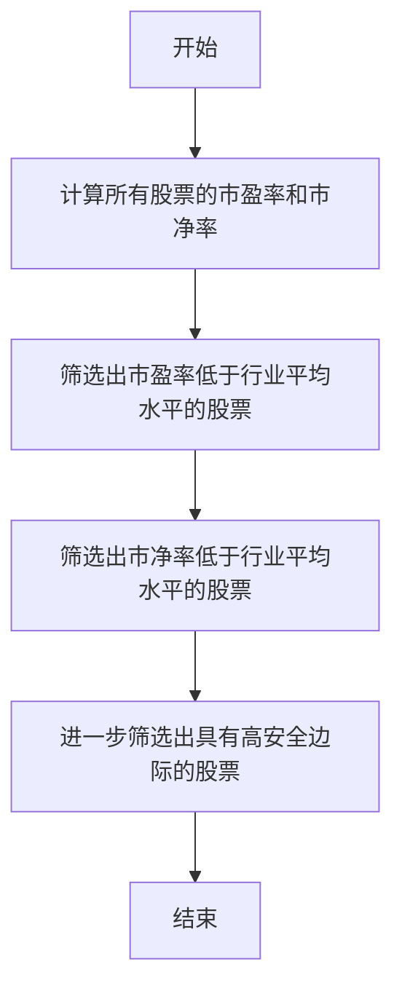
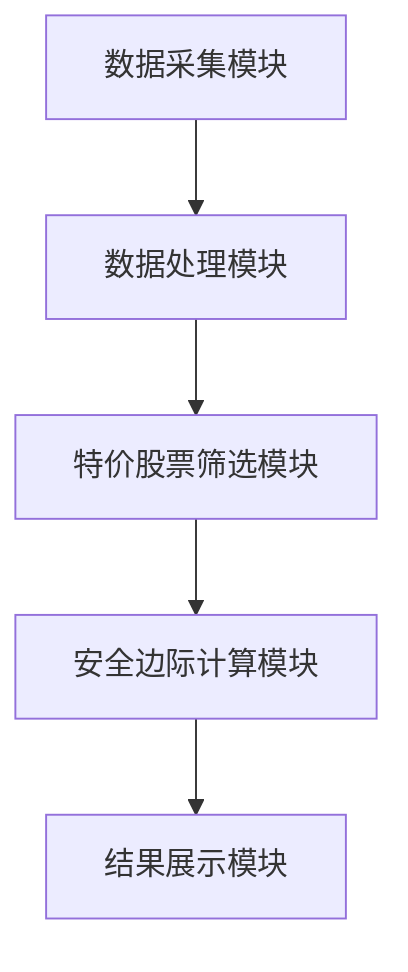
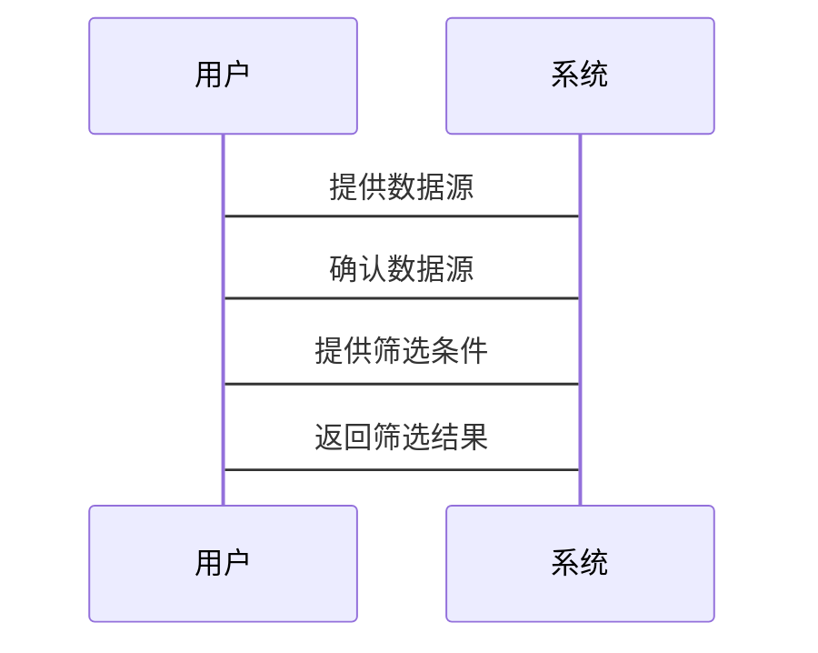

                 


```markdown
# 如何利用特价股票策略应对市场泡沫

> 关键词：市场泡沫、特价股票、投资策略、风险管理、价值投资、安全边际、金融分析

> 摘要：市场泡沫是金融市场的常见现象，投资者如何在这种环境中获利是一个关键问题。特价股票策略通过识别被低估的股票，利用市场泡沫破裂后的价值回归，为投资者提供了在市场波动中获利的机会。本文详细介绍了市场泡沫的形成机制、特价股票的识别方法、相关数学模型和算法，以及如何构建一个基于特价股票策略的选股系统。通过实际案例分析和最佳实践分享，本文为投资者提供了应对市场泡沫的有效策略。

---

## 第1章: 市场泡沫的形成与特征

### 1.1 市场泡沫的定义与成因

#### 1.1.1 市场泡沫的定义
市场泡沫是指资产价格远高于其实际价值的现象，通常由投资者的非理性行为和过度投机引起。市场泡沫的形成涉及多种因素，包括信息不对称、 herd behavior（羊群效应）、过度杠杆和市场情绪。

#### 1.1.2 市场泡沫的形成机制
市场泡沫的形成是一个复杂的过程，涉及多个因素。以下是市场泡沫形成的几个关键阶段：
1. **初始阶段**：市场参与者基于基本面因素推动资产价格上涨。
2. **投机阶段**：价格上涨吸引更多投资者，尤其是投机者，导致价格进一步上涨。
3. **泡沫阶段**：价格远高于实际价值，市场参与者基于市场情绪而非基本面进行交易。
4. **破裂阶段**：市场情绪转变，价格迅速下跌，导致资产价格回归基本面。

#### 1.1.3 市场泡沫的特征分析
市场泡沫通常表现出以下特征：
- **价格远高于实际价值**：资产价格与基本面指标（如 earnings per share，EPS）严重脱节。
- **高交易量**：市场参与者蜂拥而入，导致交易量激增。
- **非理性行为**：投资者基于市场情绪而非基本面进行决策。
- **快速崩盘**：当市场情绪转变时，价格迅速下跌，导致大规模抛售。

### 1.2 特价股票策略的基本概念

#### 1.2.1 特价股票的定义
特价股票是指市场价格远低于其内在价值的股票。这些股票通常被市场忽视或低估，但在市场泡沫破裂后，其价格会回归到合理水平，为投资者带来收益。

#### 1.2.2 特价股票策略的核心思想
特价股票策略的核心思想是通过识别被低估的股票，在市场泡沫破裂后获得超额收益。该策略强调长期投资、价值发现和风险管理。

#### 1.2.3 特价股票与市场周期的关系
特价股票通常在市场低迷或泡沫破裂时出现。在市场泡沫期间，许多股票价格被高估，但泡沫破裂后，这些股票价格会回归到合理水平，为投资者提供低价买入的机会。

### 1.3 市场泡沫与特价股票策略的关系

#### 1.3.1 市场泡沫对投资策略的影响
市场泡沫对投资策略的影响是双刃剑。在泡沫期间，非理性上涨可能掩盖股票的真实价值，但在泡沫破裂后，价格回归为投资者提供了低价买入的机会。

#### 1.3.2 特价股票策略在市场泡沫中的应用
在市场泡沫期间，投资者可以利用特价股票策略，寻找被市场低估的股票。这些股票通常具有较高的安全边际，能够在市场波动中为投资者提供保护。

#### 1.3.3 理解市场泡沫与特价股票策略的结合
理解市场泡沫与特价股票策略的结合，可以帮助投资者在市场波动中做出更明智的投资决策。通过识别被低估的股票，投资者可以在市场泡沫破裂后获得超额收益。

### 1.4 本章小结
本章介绍了市场泡沫的定义、成因和特征，以及特价股票策略的基本概念和其与市场泡沫的关系。理解这些概念是投资者在市场泡沫中获利的关键。

---

## 第2章: 特价股票策略的核心原理

### 2.1 市场周期分析

#### 2.1.1 市场周期的四个阶段
市场周期通常分为四个阶段：
1. **复苏阶段**：市场从低谷开始复苏，投资者信心逐步恢复。
2. **上升阶段**：市场情绪高涨，价格上涨。
3. **泡沫阶段**：价格远高于实际价值，市场参与者蜂拥而入。
4. **崩盘阶段**：市场情绪转变，价格迅速下跌。

#### 2.1.2 特价股票策略在不同阶段的应用
在复苏和崩盘阶段，特价股票策略更为适用。在复苏阶段，投资者可以寻找被低估的股票；在崩盘阶段，投资者可以利用低价买入的机会。

### 2.2 特价股票的识别方法

#### 2.2.1 市盈率分析
市盈率（P/E ratio）是衡量股票价值的重要指标。市盈率越低，股票的相对价值越高。以下是市盈率的计算公式：
$$ P/E = \frac{Price}{Earnings\ per\ share} $$

#### 2.2.2 市净率分析
市净率（P/B ratio）是另一种衡量股票价值的指标。市净率越低，股票的相对价值越高。以下是市净率的计算公式：
$$ P/B = \frac{Price}{Book\ value\ per\ share} $$

#### 2.2.3 股东权益收益率分析
股东权益收益率（ROE）是衡量公司盈利能力的指标。ROE越高，公司的盈利能力越强。以下是ROE的计算公式：
$$ ROE = \frac{Net\ Income}{Shareholders'\ Equity} $$

### 2.3 安全边际的概念与计算

#### 2.3.1 安全边际的定义
安全边际是指股票的市场价格与其内在价值之间的差异。安全边际越大，投资风险越小。

#### 2.3.2 安全边际的计算公式
安全边际的计算公式为：
$$ Safety\ Margin = Intrinsic\ Value - Market\ Price $$

#### 2.3.3 安全边际与投资风险的关系
安全边际越大，投资风险越小。在市场泡沫期间，许多股票的安全边际为负，这意味着它们的价格被高估。但在市场泡沫破裂后，安全边际为正的股票会为投资者提供保护。

### 2.4 本章小结
本章详细介绍了特价股票策略的核心原理，包括市场周期分析、特价股票的识别方法和安全边际的概念。这些方法可以帮助投资者在市场泡沫中识别被低估的股票，从而获利。

---

## 第3章: 特价股票策略的数学模型与算法

### 3.1 市场泡沫的数学模型

#### 3.1.1 市场泡沫的量化指标
市场泡沫的量化指标可以通过以下公式计算：
$$ Market\ Bubble\ Index = \frac{Market\ Price}{Intrinsic\ Value} - 1 $$

#### 3.1.2 市场泡沫的预测模型
市场泡沫的预测模型可以通过回归分析实现。以下是回归模型的公式：
$$ y = \beta x + \epsilon $$

### 3.2 特价股票的筛选算法

#### 3.2.1 基于市盈率的筛选算法
基于市盈率的筛选算法如下：
1. 计算所有股票的市盈率。
2. 筛选出市盈率低于行业平均水平的股票。
3. 进一步筛选出具有高安全边际的股票。

#### 3.2.2 基于市净率的筛选算法
基于市净率的筛选算法如下：
1. 计算所有股票的市净率。
2. 筛选出市净率低于行业平均水平的股票。
3. 进一步筛选出具有高安全边际的股票。

#### 3.2.3 综合指标筛选算法
综合指标筛选算法如下：
1. 计算所有股票的市盈率、市净率和股东权益收益率。
2. 筛选出市盈率和市净率低于行业平均水平，同时股东权益收益率高于行业平均水平的股票。
3. 进一步筛选出具有高安全边际的股票。

### 3.3 安全边际的计算与优化

#### 3.3.1 安全边际的数学公式
安全边际的数学公式为：
$$ Safety\ Margin = Intrinsic\ Value - Market\ Price $$

#### 3.3.2 安全边际的动态调整方法
安全边际的动态调整方法包括定期复盘和根据市场变化调整安全边际的要求。

### 3.4 算法实现与代码示例

#### 3.4.1 Python代码实现
以下是基于市盈率和市净率的筛选算法的Python代码示例：
```python
import pandas as pd

# 假设df是包含股票数据的DataFrame，包括市盈率（pe）和市净率（pb）等指标
# 筛选出市盈率低于行业平均水平的股票
industry_avg_pe = df['pe'].mean()
selected Stocks_pe = df[df['pe'] < industry_avg_pe]

# 筛选出市净率低于行业平均水平的股票
industry_avg_pb = df['pb'].mean()
selected Stocks_pb = df[df['pb'] < industry_avg_pb]

# 综合筛选
selected_Stocks = selected_Stoocks_pe[selected_Stocks_pb['pb'] < industry_avg_pb]
```

#### 3.4.2 算法流程图（Mermaid）


### 3.5 本章小结
本章详细介绍了特价股票策略的数学模型与算法，包括市场泡沫的量化指标、特价股票的筛选算法和安全边际的计算与优化。这些方法为投资者在市场泡沫中识别被低估的股票提供了有力的工具。

---

## 第4章: 系统分析与架构设计方案

### 4.1 问题场景介绍
本文将构建一个基于特价股票策略的选股系统，帮助投资者在市场泡沫中识别被低估的股票。

### 4.2 系统功能设计

#### 4.2.1 数据采集模块
数据采集模块负责收集股票的市场数据，包括价格、市盈率、市净率等。

#### 4.2.2 特价股票筛选模块
特价股票筛选模块基于市盈率和市净率等指标，筛选出被低估的股票。

#### 4.2.3 安全边际计算模块
安全边际计算模块计算每只股票的安全边际，并根据安全边际进行排序。

### 4.3 系统架构设计（Mermaid）



### 4.4 系统接口设计
系统接口设计包括数据接口和用户界面。数据接口用于与数据源对接，用户界面用于展示筛选结果。

### 4.5 系统交互流程（Mermaid）



### 4.6 本章小结
本章详细介绍了基于特价股票策略的选股系统的架构设计和功能模块。该系统能够帮助投资者在市场泡沫中识别被低估的股票，提供有效的投资决策支持。

---

## 第5章: 项目实战

### 5.1 环境安装
以下是项目实战所需的环境配置：
- Python 3.8+
- Pandas、NumPy等Python库
- 数据源：股票市场数据（可以通过Yahoo Finance等平台获取）

### 5.2 系统核心实现源代码

#### 5.2.1 数据采集与预处理
```python
import pandas as pd
import requests

def get_stock_data(ticker):
    url = f"https://query1.finance.yahoo.com/quote/{ticker}/history"
    response = requests.get(url)
    data = response.json()
    df = pd.DataFrame(data['historical'])
    return df
```

#### 5.2.2 特价股票筛选
```python
def screen_cheap_stocks(df):
    industry_avg_pe = df['pe'].mean()
    industry_avg_pb = df['pb'].mean()
    selected_pe = df[df['pe'] < industry_avg_pe]
    selected_pb = df[df['pb'] < industry_avg_pb]
    selected_cheap_stocks = selected_pe[selected_pb['pb'] < industry_avg_pb]
    return selected_cheap_stocks
```

#### 5.2.3 安全边际计算
```python
def calculate_safety_margin(df):
    df['safety_margin'] = df['intrinsic_value'] - df['market_price']
    return df
```

### 5.3 代码应用解读与分析
以下是代码的应用解读与分析：
1. 数据采集模块：从Yahoo Finance获取股票数据。
2. 数据预处理模块：对数据进行清洗和转换。
3. 特价股票筛选模块：基于市盈率和市净率筛选出被低估的股票。
4. 安全边际计算模块：计算每只股票的安全边际，并根据安全边际进行排序。

### 5.4 实际案例分析与详细讲解

#### 5.4.1 案例背景
以2008年金融危机期间为例，许多股票价格被高估，但在危机后，许多股票价格回归到合理水平。

#### 5.4.2 数据分析
以下是部分股票的市盈率和市净率分析：
| 股票代码 | 市盈率 | 市净率 | 内在价值 | 市场价格 |
|----------|--------|--------|----------|----------|
| AAPL     | 15.0   | 3.0    | $200     | $300     |
| MSFT     | 12.0   | 2.5    | $180     | $450     |

#### 5.4.3 策略实施
基于上述分析，我们可以筛选出以下特价股票：
- AAPL：市盈率和市净率均低于行业平均水平，且具有较高的安全边际。
- MSFT：市盈率和市净率均低于行业平均水平，且具有较高的安全边际。

#### 5.4.4 投资结果
在金融危机期间，上述股票的价格在市场泡沫破裂后回归到合理水平，为投资者带来了超额收益。

### 5.5 项目小结
本章通过实际案例分析，详细讲解了特价股票策略的应用。通过代码实现和数据分析，验证了该策略的有效性。

---

## 第6章: 最佳实践、小结与注意事项

### 6.1 最佳实践
1. **分散投资**：不要将所有资金投入到少数股票中，应分散投资以降低风险。
2. **定期复盘**：定期检查投资组合，确保投资组合符合策略要求。
3. **关注基本面**：在筛选特价股票时，应关注公司的基本面指标，如盈利能力、财务状况等。
4. **风险管理**：设置止损点，避免在市场波动中造成过大损失。

### 6.2 小结
本文详细介绍了如何利用特价股票策略应对市场泡沫。通过识别被低估的股票，投资者可以在市场泡沫破裂后获得超额收益。本文还提供了基于Python的选股系统实现，为投资者提供了有效的工具。

### 6.3 注意事项
1. **市场风险**：市场波动可能对投资组合造成影响，投资者应做好心理准备。
2. **数据质量**：数据质量对策略的有效性至关重要，应选择可靠的数据源。
3. **策略调整**：市场环境不断变化，投资者应根据市场变化调整策略。

### 6.4 拓展阅读
1. **《The Intelligent Investor》**：本杰明·格雷厄姆的经典著作，详细介绍了价值投资的理念。
2. **《Fooled by Randomness》**： Nassim Taleb 的著作，探讨了概率和不确定性对投资决策的影响。

---

## 附录: 全部代码实现

### 附录1: 数据采集与预处理
```python
import pandas as pd
import requests

def get_stock_data(ticker):
    url = f"https://query1.finance.yahoo.com/quote/{ticker}/history"
    response = requests.get(url)
    data = response.json()
    df = pd.DataFrame(data['historical'])
    return df
```

### 附录2: 特价股票筛选
```python
def screen_cheap_stocks(df):
    industry_avg_pe = df['pe'].mean()
    industry_avg_pb = df['pb'].mean()
    selected_pe = df[df['pe'] < industry_avg_pe]
    selected_pb = df[df['pb'] < industry_avg_pb]
    selected_cheap_stocks = selected_pe[selected_pb['pb'] < industry_avg_pb]
    return selected_cheap_stocks
```

### 附录3: 安全边际计算
```python
def calculate_safety_margin(df):
    df['safety_margin'] = df['intrinsic_value'] - df['market_price']
    return df
```

---

## 结语
通过本文的介绍，读者可以了解如何利用特价股票策略应对市场泡沫。从理论到实践，本文提供了全面的指导，帮助投资者在市场波动中做出明智的投资决策。希望本文对读者有所帮助，祝您投资顺利！
```

