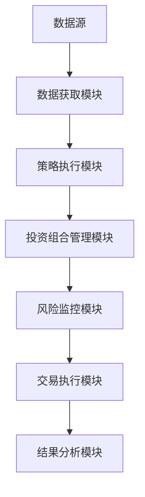

                 

# 如何利用特价股票策略应对市场泡沫风险

> 关键词：特价股票策略, 市场泡沫, 风险管理, 股票投资, 量化分析

> 摘要：本文详细探讨了如何利用特价股票策略来应对市场泡沫风险。通过分析市场泡沫的成因和特性，结合特价股票策略的核心要素，本文提出了在市场泡沫中利用特价股票策略的具体方法，并通过数学模型和实际案例进行了详细阐述。此外，本文还探讨了风险管理的重要性，并提供了一些实用的风险管理技巧和系统设计建议，以帮助投资者在市场泡沫中稳健投资。

---

## 第一章: 市场泡沫与风险概述

### 1.1 市场泡沫的定义与特征

市场泡沫是指金融市场中资产价格远高于其实际价值的现象。这种现象通常由投资者的非理性行为、过度乐观预期或市场操纵等因素引发。市场泡沫的特征包括：

- **价格虚高**：资产价格脱离基本面，远远高于其内在价值。
- **交易量激增**：投资者蜂拥而入，导致交易量急剧增加。
- **波动性加剧**：价格波动剧烈，短期内可能出现大幅波动。
- **参与者非理性**：投资者往往基于情绪而非基本面进行决策。

#### 市场泡沫的形成机制

市场泡沫的形成通常经历以下几个阶段：
1. **初步上涨**：市场参与者基于利好消息或预期开始买入资产。
2. **价格虚高**：价格持续上涨，远超其实际价值。
3. **泡沫破裂**：价格突然下跌，导致大量投资者亏损。

### 1.2 市场泡沫风险的来源

市场泡沫风险来源于多方面因素，包括投资者行为、市场结构和宏观经济环境等。

#### 投资者行为分析

- **羊群效应**：投资者盲目跟随市场潮流，缺乏独立判断。
- **过度自信**：投资者过度相信自己的判断，忽视市场风险。
- **杠杆交易**：大量使用杠杆资金放大了市场波动性和风险。

#### 市场波动性分析

- **波动性加剧**：市场波动性增加，导致价格剧烈波动。
- **流动性风险**：市场流动性不足，可能导致资产难以变现。

#### 宏观经济因素

- **货币政策宽松**：低利率或量化宽松政策可能引发资产泡沫。
- **市场参与者结构**：机构投资者和个人投资者的比例失衡可能导致市场波动。

### 1.3 市场泡沫对投资者的影响

市场泡沫对投资者的影响是多方面的，包括心理和经济层面。

#### 个人投资者的影响

- **短期收益**：在泡沫形成初期，个人投资者可能获得短期收益。
- **长期损失**：泡沫破裂后，个人投资者可能面临重大损失。

#### 机构投资者的影响

- **资产贬值**：机构投资者的资产可能大幅贬值。
- **声誉风险**：投资策略失误可能导致机构声誉受损。

#### 市场整体稳定性的影响

- **市场波动**：市场泡沫破裂可能导致市场整体波动加剧。
- **信心丧失**：投资者信心下降，可能影响市场长期稳定。

### 1.4 本章小结

- 市场泡沫的核心概念总结：市场泡沫是资产价格虚高的现象，通常由投资者非理性行为引发。
- 风险来源的分类：包括投资者行为、市场波动性和宏观经济因素。
- 投资者应对策略的方向：通过理性分析和风险管理应对市场泡沫风险。

---

## 第二章: 特价股票策略的基础知识

### 2.1 特价股票的定义与分类

#### 特价股票的定义

特价股票是指市场价格低于其内在价值的股票。这种股票通常被市场低估，具有较大的上涨潜力。

#### 特价股票的分类

- **价值型股票**：基本面良好，但市场价格低于其内在价值。
- **成长型股票**：具有高增长潜力，但市场价格被低估。
- **防御型股票**：在市场波动中表现稳定的股票。

#### 特价股票的特点

- **低估值**：市场价格低于内在价值。
- **高潜力**：具有较高的上涨潜力。
- **稳定性**：在市场波动中表现稳定。

### 2.2 特价股票策略的核心要素

#### 策略目标

- **短期目标**：抓住市场低估的机会，获得超额收益。
- **长期目标**：通过长期持有，获得资本增值。

#### 策略执行

- **选股标准**：基于基本面分析和估值指标，筛选出低估股票。
- **买入时机**：在市场底部或股价被低估时买入。
- **卖出时机**：股价回归合理估值或市场出现反转信号时卖出。

#### 策略评估

- **绩效评估**：通过回测和实证分析，评估策略的有效性。
- **风险评估**：分析策略在不同市场环境下的风险表现。

### 2.3 特价股票策略的优势与劣势

#### 优势分析

- **低风险**：通过精选低估股票，降低投资风险。
- **高收益潜力**：长期持有具有较高的收益潜力。
- **稳定性**：在市场波动中表现相对稳定。

#### 劣势分析

- **短期波动**：短期内可能面临股价继续下跌的风险。
- **市场认知度低**：市场对低估股票的关注度较低，可能影响流动性。
- **选择难度大**：筛选低估股票需要较高的市场分析能力。

#### 适用场景

- **市场底部**：在市场底部时，更容易找到低估股票。
- **市场波动**：在市场波动较大时，策略表现可能更优。
- **长期投资**：适合长期投资者，尤其是价值投资者。

### 2.4 本章小结

- 特价股票策略的核心要素总结：基于低估值和高潜力的选股标准，通过长期持有实现资本增值。
- 策略优劣势的平衡：通过精选股票和合理时机选择，降低风险并提高收益潜力。
- 策略适用场景的分析：在市场底部和波动较大的市场环境中，策略表现更优。

---

## 第三章: 市场泡沫中的特价股票策略应用

### 3.1 市场泡沫中的投资机会

#### 市场泡沫中的低估值股票

- **定义**：在市场泡沫中，部分股票可能被市场情绪忽视，仍处于低估值状态。
- **特征**：基本面良好，但市场价格远低于其内在价值。
- **案例分析**：例如，某行业龙头公司因市场恐慌被低估，但其基本面良好，具有较高的上涨潜力。

#### 市场泡沫中的高增长股票

- **定义**：在市场泡沫中，部分高增长股票可能被市场过度炒作，但其基本面仍然强劲。
- **特征**：具有较高的增长潜力，但市场价格可能被高估。
- **案例分析**：例如，科技行业的某创新公司，尽管市场估值较高，但其未来增长潜力巨大。

#### 市场泡沫中的防御性股票

- **定义**：在市场泡沫中，防御性股票通常表现稳定，不受市场波动影响。
- **特征**：行业稳定，收益来源多样化，具有较强的防御性。
- **案例分析**：例如，公用事业行业的某公司，其收益稳定，股价波动较小。

### 3.2 特价股票策略在市场泡沫中的应用

#### 策略选择

- **价值投资**：选择基本面良好但市场价格被低估的股票。
- **成长投资**：选择具有高增长潜力但市场价格被高估的股票。
- **防御投资**：选择行业稳定、收益来源多元的防御性股票。

#### 策略执行

- **选股标准**：结合基本面分析和估值指标，筛选出低估股票。
- **买入时机**：在市场底部或股价被低估时买入。
- **卖出时机**：股价回归合理估值或市场出现反转信号时卖出。

#### 策略优化

- **动态调整**：根据市场变化，动态调整选股标准和投资组合。
- **风险管理**：设置止损点，控制投资风险。

### 3.3 特价股票策略的风险管理

#### 风险评估

- **市场风险**：市场整体波动可能影响股票价格。
- **流动性风险**：部分股票流动性差，可能影响变现能力。
- **选择风险**：选股标准不当可能导致投资失败。

#### 风险控制

- **分散投资**：通过投资多个行业和股票，降低投资风险。
- **止损策略**：设置止损点，避免重大损失。
- **定期评估**：定期评估投资组合的表现，及时调整策略。

### 3.4 本章小结

- 市场泡沫中的投资机会：通过分析市场泡沫中的低估值、高增长和防御性股票，投资者可以在市场泡沫中找到投资机会。
- 特价股票策略的应用：通过精选股票和合理时机选择，投资者可以在市场泡沫中实现稳健投资。
- 风险管理的重要性：通过分散投资、止损策略和定期评估，投资者可以有效控制投资风险。

---

## 第四章: 市场泡沫中的特价股票策略风险管理

### 4.1 市场风险的量化与控制

#### 风险量化

- **波动率分析**：通过分析股票价格的波动率，评估投资风险。
- **VaR模型**：使用VaR（Value at Risk）模型，量化投资组合的潜在损失。
- **回测分析**：通过历史数据回测，评估策略在不同市场环境下的表现。

#### 风险控制

- **分散投资**：通过投资多个行业和股票，降低市场风险。
- **动态调整**：根据市场变化，动态调整投资组合。
- **止损策略**：设置止损点，避免重大损失。

### 4.2 风险管理的数学模型

#### VaR模型

$$ VaR = \mu + z \cdot \sigma $$

其中：
- $\mu$ 是资产收益率的平均值
- $z$ 是标准正态分布的分位数
- $\sigma$ 是资产收益率的标准差

#### 风险调整后的收益模型

$$ R_{adjusted} = R_{original} - \lambda \cdot R_{risk} $$

其中：
- $R_{original}$ 是原始收益
- $\lambda$ 是风险调整系数
- $R_{risk}$ 是投资风险

### 4.3 心理风险管理

#### 心理因素对投资决策的影响

- **过度自信**：投资者可能过度自信，忽视市场风险。
- **恐惧与贪婪**：市场波动可能引发投资者的恐惧或贪婪情绪，影响投资决策。

#### 心理风险管理技巧

- **情绪控制**：通过心理调节，保持冷静和理性。
- **纪律性**：严格执行投资计划，避免情绪化决策。
- **定期反思**：定期反思投资决策，总结经验教训。

### 4.4 本章小结

- 风险量化与控制：通过VaR模型和回测分析，量化投资风险，并通过分散投资和止损策略进行风险控制。
- 风险管理的数学模型：通过数学模型，量化投资风险，并调整投资策略。
- 心理风险管理：通过情绪控制和纪律性，避免心理因素对投资决策的影响。

---

## 第五章: 特价股票策略的系统设计与实现

### 5.1 系统设计概述

#### 系统目标

- **目标**：开发一个基于特价股票策略的投资管理系统。
- **功能**：实现股票筛选、投资组合管理、风险监控和交易执行等功能。

#### 系统架构

- **数据获取模块**：获取股票数据，包括价格、成交量、财务指标等。
- **策略执行模块**：根据选股标准，筛选出符合条件的股票。
- **风险监控模块**：实时监控投资组合的风险，及时发出预警。
- **交易执行模块**：根据策略信号，执行买入或卖出交易。

#### 系统架构图

### 5.2 系统实现

#### 数据获取模块

- **数据接口**：通过API获取实时股票数据。
- **数据存储**：将数据存储到数据库中，便于后续分析。

#### 策略执行模块

- **选股标准**：基于基本面分析和估值指标，筛选出低估股票。
- **交易信号**：根据市场变化，生成买入或卖出信号。

#### 风险监控模块

- **风险指标**：监控市场波动率、VaR值等风险指标。
- **预警机制**：当风险指标超过阈值时，及时发出预警。

#### 交易执行模块

- **订单生成**：根据策略信号，生成买入或卖出订单。
- **订单执行**：通过交易系统，执行订单并记录交易结果。

### 5.3 系统优化

#### 系统优化方向

- **提高数据处理效率**：优化数据获取和处理流程，提高系统运行效率。
- **增强风险监控能力**：引入更多的风险监控指标，提高风险预警能力。
- **优化交易执行策略**：通过算法优化，提高交易执行效率和效果。

### 5.4 本章小结

- 系统设计概述：通过模块化设计，实现股票筛选、投资组合管理、风险监控和交易执行等功能。
- 系统实现：详细介绍了各模块的功能实现和技术细节。
- 系统优化：通过优化数据处理效率、增强风险监控能力和优化交易执行策略，提高系统的整体性能。

---

## 第六章: 特价股票策略的高级应用与拓展

### 6.1 市场预测与策略优化

#### 市场预测模型

- **技术分析**：通过技术指标，如移动平均线、相对强弱指数等，预测市场走势。
- **基本面分析**：通过财务指标，如市盈率、市净率等，预测公司未来表现。

#### 策略优化

- **多因子模型**：通过多因子模型，筛选出具有更高收益潜力的股票。
- **动态调整**：根据市场变化，动态调整选股标准和投资组合。

### 6.2 特价股票策略在复杂市场环境中的应用

#### 复杂市场环境的特征

- **市场波动加剧**：市场波动性增加，导致股票价格剧烈波动。
- **市场参与者多样化**：市场参与者包括个人投资者、机构投资者和高频交易者。
- **信息不对称加剧**：市场信息不对称加剧，导致股票价格波动。

#### 特价股票策略的应用

- **多策略结合**：结合多种策略，如价值投资、成长投资和防御投资，提高投资效果。
- **动态调整**：根据市场变化，动态调整投资策略。

### 6.3 量化投资策略

#### 量化投资策略的定义

- **量化投资策略**：通过数学模型和算法，进行投资决策。
- **优势**：量化投资策略具有客观性、系统性和高效性。
- **劣势**：量化投资策略可能忽视市场情绪和突发事件的影响。

#### 量化投资策略的实现

- **数据获取**：获取实时股票数据和市场信息。
- **策略开发**：基于数学模型和算法，开发投资策略。
- **交易执行**：通过算法交易系统，执行买入或卖出交易。

### 6.4 本章小结

- 市场预测与策略优化：通过技术分析和基本面分析，预测市场走势，并优化投资策略。
- 复杂市场环境中的策略应用：在复杂市场环境中，通过多策略结合和动态调整，提高投资效果。
- 量化投资策略：通过量化分析，提高投资决策的客观性和系统性。

---

## 第七章: 特价股票策略的风险管理与最佳实践

### 7.1 风险管理的最佳实践

#### 风险管理的核心要素

- **风险识别**：识别潜在的投资风险。
- **风险评估**：评估风险的潜在影响。
- **风险控制**：制定有效的风险控制措施。

#### 风险管理的具体措施

- **分散投资**：通过投资多个行业和股票，降低投资风险。
- **止损策略**：设置止损点，避免重大损失。
- **定期评估**：定期评估投资组合的表现，及时调整策略。

### 7.2 心理风险管理

#### 心理因素对投资决策的影响

- **过度自信**：投资者可能过度自信，忽视市场风险。
- **恐惧与贪婪**：市场波动可能引发投资者的恐惧或贪婪情绪，影响投资决策。

#### 心理风险管理技巧

- **情绪控制**：通过心理调节，保持冷静和理性。
- **纪律性**：严格执行投资计划，避免情绪化决策。
- **定期反思**：定期反思投资决策，总结经验教训。

### 7.3 投资策略的小结

#### 投资策略总结

- **价值投资**：选择基本面良好但市场价格被低估的股票。
- **成长投资**：选择具有高增长潜力但市场价格被高估的股票。
- **防御投资**：选择行业稳定、收益来源多元的防御性股票。

#### 投资策略的优劣势

- **优势**：通过精选股票和合理时机选择，降低投资风险，提高收益潜力。
- **劣势**：短期内可能面临股价继续下跌的风险，市场认知度低，选择难度大。

### 7.4 本章小结

- 风险管理的核心要素：通过风险识别、风险评估和风险控制，降低投资风险。
- 心理风险管理：通过情绪控制和纪律性，避免心理因素对投资决策的影响。
- 投资策略总结：通过价值投资、成长投资和防御投资，实现稳健投资。

---

## 第八章: 附录与拓展阅读

### 8.1 特价股票策略相关工具与资源

- **数据获取工具**：如Yahoo Finance、Quandl等。
- **数据分析工具**：如Python、R等。
- **交易执行工具**：如Interactive Brokers、MetaTrader等。

### 8.2 法律与道德风险提示

- **法律风险**：投资者需遵守相关法律法规，避免违规操作。
- **道德风险**：投资者需遵守职业道德，避免操纵市场等不法行为。

### 8.3 拓展阅读建议

- **经典书籍**：如《价值投资：从格雷厄姆到巴菲特》。
- **学术论文**：如《市场波动与投资者行为》。
- **行业报告**：如《全球股票市场分析报告》。

### 8.4 本章小结

- 附录与拓展阅读：提供特价股票策略相关的工具和资源，帮助读者进一步学习和实践。
- 法律与道德风险提示：提醒读者注意法律和道德风险，避免违规操作。
- 拓展阅读建议：推荐相关书籍和报告，帮助读者深入了解特价股票策略。

---

## 第九章: 结语与展望

### 9.1 本文总结

- 本文详细探讨了如何利用特价股票策略应对市场泡沫风险，分析了市场泡沫的成因和特性，结合特价股票策略的核心要素，提出了在市场泡沫中利用特价股票策略的具体方法，并通过数学模型和实际案例进行了详细阐述。此外，本文还探讨了风险管理的重要性，并提供了一些实用的风险管理技巧和系统设计建议，以帮助投资者在市场泡沫中稳健投资。

### 9.2 未来展望

- 未来的研究可以进一步探讨如何结合量化分析和人工智能技术，优化特价股票策略，提高投资效果。
- 另外，还可以研究如何在不同市场环境下，动态调整特价股票策略，以应对市场波动和风险。

### 9.3 结语

- 市场泡沫是投资者必须面对的挑战，但通过合理的策略和有效的风险管理，投资者可以在市场泡沫中找到投资机会，实现稳健投资。

---

# 结语

本文通过详细分析市场泡沫的成因和特性，结合特价股票策略的核心要素，提出了在市场泡沫中利用特价股票策略的具体方法，并通过数学模型和实际案例进行了详细阐述。此外，本文还探讨了风险管理的重要性，并提供了一些实用的风险管理技巧和系统设计建议，以帮助投资者在市场泡沫中稳健投资。未来的研究可以进一步探讨如何结合量化分析和人工智能技术，优化特价股票策略，提高投资效果。

