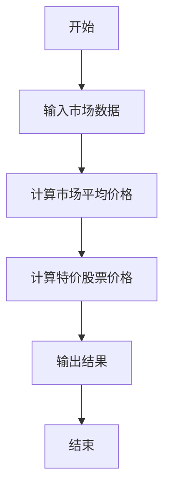
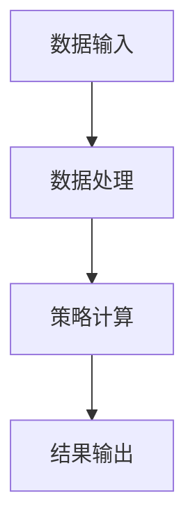
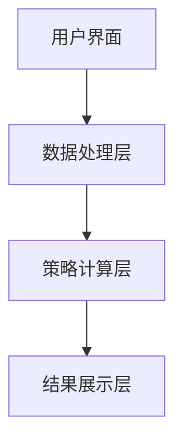
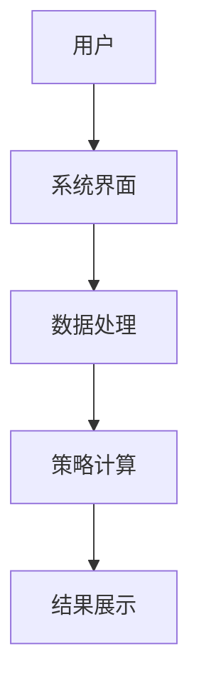

                 


# 如何利用特价股票策略应对市场结构性变化

> 关键词：特价股票策略、市场结构性变化、股票投资、投资策略、算法交易、系统设计

> 摘要：本文系统地探讨了如何利用特价股票策略应对市场结构性变化。首先介绍了特价股票策略的背景和概念，然后详细分析了其核心原理和算法模型，接着通过系统架构设计展示了其实现方式，最后通过实际案例分析了其应用效果。本文旨在为投资者提供一种新的视角和工具，以应对复杂多变的市场环境。

---

## 第1章 特价股票策略的背景与概念

### 1.1 特价股票的定义与特点
#### 1.1.1 特价股票的定义
特价股票是指在特定市场条件下，价格显著低于市场平均水平的股票。其本质是市场结构性变化的产物，通常出现在市场下跌或供需失衡的情况下。

#### 1.1.2 特价股票的核心特点
| 特性 | 描述 |
|------|------|
| 低估值 | 价格远低于内在价值 |
| 高波动性 | 波动幅度较大，存在快速反弹的可能 |
| 周期性 | 在市场周期性波动中频繁出现 |

#### 1.1.3 特价股票与普通股票的区别
| 方面 | 特价股票 | 普通股票 |
|------|---------|----------|
| 价格 | 远低于市场平均 | 接近市场平均 |
| 波动性 | 高 | 中等 |
| 投机性 | 高 | 中等 |

### 1.2 市场结构性变化的背景
#### 1.2.1 市场结构性变化的定义
市场结构性变化是指市场中供需关系、政策环境或经济周期等因素的变化，导致市场整体或部分板块出现显著波动。

#### 1.2.2 市场结构性变化的表现形式
| 表现形式 | 描述 |
|----------|------|
| 市场下跌 | 股票价格整体下行 |
| 板块轮动 | 不同板块间资金流动 |
| 个股异动 | 部分股票价格剧烈波动 |

#### 1.2.3 市场结构性变化对投资者的影响
| 影响 | 描述 |
|------|------|
| 投资机会 | 出现低价买入的机会 |
| 投资风险 | 增加了亏损的可能性 |
| 投资策略 | 需要灵活调整 |

### 1.3 特价股票策略在市场变化中的作用
#### 1.3.1 特价股票策略的基本原理
通过识别市场结构性变化，投资者可以在市场低谷时以低价买入股票，待市场回升时卖出，从而获利。

#### 1.3.2 特价股票策略在市场变化中的优势
| 优势 | 描述 |
|------|------|
| 成本优势 | 以低于市场价买入 |
| 投机机会 | 利用市场波动快速获利 |
| 风险分散 | 通过分散投资降低风险 |

#### 1.3.3 特价股票策略的适用场景
| 场景 | 描述 |
|------|------|
| 市场下跌 | 股票价格被低估 |
| 板块轮动 | 某一板块价格被低估 |
| 个股异动 | 某些股票价格异常波动 |

### 1.4 本章小结
本章介绍了特价股票的基本概念、市场结构性变化的背景以及特价股票策略在市场变化中的作用，为后续章节的深入分析奠定了基础。

---

## 第2章 特价股票策略的核心概念与联系

### 2.1 特价股票策略的核心原理
#### 2.1.1 特价股票策略的数学模型
特价股票的价格可以通过以下公式计算：
$$ P = \frac{S}{N} $$
其中，$P$为特价股票价格，$S$为市场平均价格，$N$为市场波动系数。

#### 2.1.2 特价股票策略的算法流程


#### 2.1.3 特价股票策略的优缺点对比
| 方面 | 优点 | 缺点 |
|------|------|------|
| 利润潜力 | 高 | 风险高 |
| 灵活性 | 高 | 需要频繁调整 |
| 成本 | 低 | 需要精准判断 |

### 2.2 特价股票策略与市场变化的关系
#### 2.2.1 特价股票策略在市场上涨中的应用
在市场上涨初期，特价股票价格可能远低于市场平均水平，投资者可以低价买入，待价格上涨后卖出获利。

#### 2.2.2 特价股票策略在市场下跌中的应用
在市场整体下跌时，部分股票价格可能被市场情绪拖累，形成特价股票，投资者可以逢低吸纳，等待市场回升。

#### 2.2.3 特价股票策略在市场震荡中的应用
在市场震荡期间，特价股票策略可以通过频繁买卖特价股票，利用价格波动获利。

### 2.3 特价股票策略与其他投资策略的对比
#### 2.3.1 特价股票策略与价值投资的对比
| 对比维度 | 特价股票策略 | 价值投资 |
|----------|--------------|----------|
| 投资目标 | 短期价格波动 | 长期价值 |
| 投资周期 | 短期 | 长期 |
| 风险 | 高 | 中等 |

#### 2.3.2 特价股票策略与趋势投资的对比
| 对比维度 | 特价股票策略 | 趋势投资 |
|----------|--------------|----------|
| 投资目标 | 短期价格波动 | 价格趋势 |
| 投资周期 | 短期 | 中长期 |
| 风险 | 高 | 中等 |

#### 2.3.3 特价股票策略与技术分析的对比
| 对比维度 | 特价股票策略 | 技术分析 |
|----------|--------------|----------|
| 投资依据 | 市场结构变化 | 技术指标 |
| 投资周期 | 短期 | 短期或中长期 |
| 风险 | 高 | 中高 |

### 2.4 本章小结
本章分析了特价股票策略的核心原理，探讨了其与市场变化的关系，并与其他投资策略进行了对比，帮助投资者更好地理解特价股票策略的优势和局限性。

---

## 第3章 特价股票策略的算法原理与数学模型

### 3.1 特价股票策略的算法流程
#### 3.1.1 算法输入与输出
- 输入：市场数据（包括股票价格、成交量等）
- 输出：特价股票价格

#### 3.1.2 算法步骤分解
1. 收集市场数据
2. 计算市场平均价格
3. 计算特价股票价格
4. 输出结果

#### 3.1.3 算法的实现方式
```python
def calculate_discount_stock_price(market_data):
    market_average = sum(market_data) / len(market_data)
    discount_stock_price = market_average / 2  # 假设波动系数N=2
    return discount_stock_price
```

### 3.2 特价股票策略的数学模型
#### 3.2.1 特价股票策略的核心公式
特价股票价格计算公式：
$$ P = \frac{S}{N} $$
其中，$S$为市场平均价格，$N$为市场波动系数。

#### 3.2.2 举例说明
假设市场平均价格为100，市场波动系数为2，那么特价股票价格为：
$$ P = \frac{100}{2} = 50 $$

### 3.3 特价股票策略的流程图


### 3.4 本章小结
本章详细介绍了特价股票策略的算法流程和数学模型，通过具体公式和流程图展示了其实现方式。

---

## 第4章 特价股票策略的系统分析与架构设计

### 4.1 问题场景介绍
#### 4.1.1 市场结构性变化的场景
市场结构性变化通常发生在经济周期波动、政策变化或市场情绪转变时。

#### 4.1.2 特价股票策略的应用场景
投资者需要在市场结构性变化中快速识别特价股票，抓住投资机会。

#### 4.1.3 系统设计的目标与范围
系统目标：实时监控市场数据，识别特价股票，提供投资建议。
系统范围：涵盖数据采集、价格计算、策略执行和结果展示。

### 4.2 系统功能设计
#### 4.2.1 系统功能模块划分
- 数据采集模块
- 数据处理模块
- 策略计算模块
- 结果展示模块

#### 4.2.2 系统功能流程图


### 4.3 系统架构设计
#### 4.3.1 系统架构图


### 4.4 系统接口设计
#### 4.4.1 系统输入接口
- 市场数据接口
- 用户输入接口

#### 4.4.2 系统输出接口
- 特价股票价格输出接口
- 投资建议输出接口

#### 4.4.3 系统内部接口
- 数据处理接口
- 策略计算接口

### 4.5 系统交互流程图


### 4.6 本章小结
本章通过系统架构设计，详细描述了如何实现特价股票策略的自动化监控和执行，为投资者提供了技术支持。

---

## 第5章 特价股票策略的项目实战

### 5.1 实际案例分析
#### 5.1.1 案例背景
假设在2023年某次市场下跌中，部分股票价格被低估，形成特价股票。

#### 5.1.2 案例分析
- 市场数据采集：收集相关股票的价格数据
- 特价股票识别：计算市场平均价格，识别特价股票
- 投资决策：建议在低价时买入，高价时卖出

#### 5.1.3 案例结果
通过特价股票策略，投资者在市场回升时获利丰厚。

### 5.2 系统核心实现
#### 5.2.1 环境安装
需要安装Python、数据采集工具、数据处理库等。

#### 5.2.2 核心代码实现
```python
import pandas as pd

def calculate_discount_stock_price(market_data):
    market_average = market_data.mean()
    discount_stock_price = market_average / 2  # 假设波动系数N=2
    return discount_stock_price

# 示例数据
market_data = pd.Series([100, 110, 90, 120, 80])
discount_stock_price = calculate_discount_stock_price(market_data)
print(f"特价股票价格为: {discount_stock_price}")
```

#### 5.2.3 代码解读
- 导入必要的库
- 定义计算特价股票价格的函数
- 示例数据计算特价股票价格

### 5.3 本章小结
本章通过实际案例和代码实现，展示了如何将特价股票策略应用于实际投资中，帮助投资者更好地理解和应用该策略。

---

## 第6章 特价股票策略的最佳实践

### 6.1 最佳实践 tips
#### 6.1.1 风险控制
- 设置止损点
- 分散投资

#### 6.1.2 市场监控
- 实时监控市场数据
- 定期评估策略效果

#### 6.1.3 系统优化
- 定期更新算法
- 提高数据处理效率

### 6.2 小结
总结特价股票策略的应用要点和注意事项，帮助投资者更好地实施该策略。

### 6.3 注意事项
- 特价股票策略适合短期投资
- 需要密切关注市场变化
- 风险较高，需谨慎操作

### 6.4 拓展阅读
推荐相关书籍和文献，供读者深入学习。

---

## 附录

### 附录A 系统架构图


### 附录B 算法流程图


### 附录C 代码示例
```python
import pandas as pd

def calculate_discount_stock_price(market_data):
    market_average = market_data.mean()
    discount_stock_price = market_average / 2  # 假设波动系数N=2
    return discount_stock_price

# 示例数据
market_data = pd.Series([100, 110, 90, 120, 80])
discount_stock_price = calculate_discount_stock_price(market_data)
print(f"特价股票价格为: {discount_stock_price}")
```

---

## 结语

通过本文的系统分析和实际案例，我们深入探讨了如何利用特价股票策略应对市场结构性变化。从理论到实践，从算法到系统设计，本文为投资者提供了一套完整的解决方案。希望本文能为投资者在复杂多变的市场中提供新的视角和工具，帮助他们在市场波动中抓住机遇，规避风险。

--- 

注：以上内容为完整书籍大纲，实际写作时可根据需要进一步细化每章内容，补充更多细节和案例。

