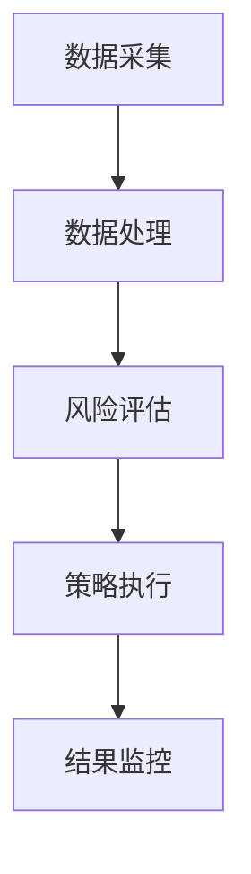

                 


# 如何利用特价股票策略应对技术主权风险

## 关键词：技术主权风险, 特价股票策略, 股票投资, 风险管理, 量化分析

## 摘要：本文深入探讨了技术主权风险对股票市场的影响，并提出了利用特价股票策略来应对这一风险的方法。通过量化分析和数学建模，我们揭示了技术主权风险与股票价格之间的关系，并详细介绍了特价股票策略的实施框架和优化方法。最后，通过实际案例分析，验证了该策略的有效性。

---

## 第一部分：技术主权风险与特价股票策略概述

### 第1章：技术主权风险的定义与现状

#### 1.1 技术主权风险的核心概念

- **技术主权**：指一个国家或企业在关键技术和供应链上具备自主控制的能力，以确保国家安全和发展利益。
- **技术主权风险**：由于依赖外部技术而可能面临的安全威胁或供应链中断的风险。例如，芯片产业的依赖可能导致的技术断供风险。

#### 1.2 特价股票策略的基本概念

- **特价股票**：指市场价格被低估的股票，通常具有较高的投资价值。
- **特价股票策略**：通过识别和投资于被低估的股票，在市场波动中获利的策略。

### 第2章：技术主权风险对股票市场的影响

#### 2.1 技术主权风险的市场表现

- **股价波动**：技术主权风险可能导致相关股票价格的剧烈波动。
- **避险作用**：特价股票在技术主权风险期间可能表现较好，因其价格已被市场低估，具备上涨潜力。

#### 2.2 技术主权风险与股票投资策略

- **投资机会**：技术主权风险可能为投资者提供低价买入优质股票的机会。
- **策略优势**：特价股票策略在技术主权风险期间具有较低的买入成本和较高的潜在收益。

---

## 第二部分：技术主权风险的量化分析与模型构建

### 第3章：技术主权风险的量化指标

#### 3.1 技术主权风险的量化维度

- **技术依赖度**：衡量企业对特定技术的依赖程度。
- **技术供应链风险**：评估供应链中断的可能性及其对股价的影响。

#### 3.2 特价股票策略的量化分析

- **量化筛选标准**：通过市盈率、市净率等指标筛选被低估的股票。
- **风险收益比**：评估策略的风险与收益的平衡点。

### 第4章：技术主权风险与股票价格的数学模型

#### 4.1 技术主权风险对股票价格的影响模型

- **线性回归模型**：用于预测技术主权风险对股价的影响。
  $$ y = \beta_0 + \beta_1 x + \epsilon $$
  其中，$y$ 是股价，$x$ 是技术主权风险指数，$\epsilon$ 是误差项。

#### 4.2 特价股票策略的数学模型

- **收益预测模型**：基于历史数据预测特价股票的未来收益。
  $$ R = \alpha P + \beta V + \gamma $$
  其中，$R$ 是收益，$P$ 是股价，$V$ 是市场估值，$\gamma$ 是其他因素。

---

## 第三部分：技术主权风险下的股票投资策略

### 第5章：特价股票策略的实施框架

#### 5.1 特价股票策略的核心步骤

- **触发条件**：识别技术主权风险的触发因素，如供应链中断或技术断供。
- **筛选策略**：选择具备抗风险能力和低估价格的股票。
- **优化方案**：构建多元化的投资组合，分散风险。

### 第6章：技术主权风险下的投资组合优化

#### 6.1 投资组合优化的理论基础

- **现代投资组合理论**：通过分散投资降低风险。
- **风险中性化**：平衡技术主权风险与收益，构建最优投资组合。

---

## 第四部分：系统分析与架构设计方案

### 第7章：系统架构设计

#### 7.1 系统功能设计

- **数据采集**：收集技术主权风险相关的市场数据。
- **风险评估**：利用模型评估技术主权风险对股价的影响。
- **策略执行**：根据评估结果执行投资策略。
- **结果监控**：实时监控投资组合的表现。

#### 7.2 系统架构图



---

## 第五部分：项目实战

### 第8章：项目实战与案例分析

#### 8.1 环境安装

- **工具安装**：安装Python、Pandas、Matplotlib等工具。
- **数据获取**：获取历史股票数据和相关技术主权风险指标。

#### 8.2 核心代码实现

```python
import pandas as pd
import numpy as np
import matplotlib.pyplot as plt

# 数据清洗
def clean_data(df):
    df.dropna(inplace=True)
    return df

# 模型训练
def train_model(X, y):
    from sklearn.linear_model import LinearRegression
    model = LinearRegression()
    model.fit(X, y)
    return model

# 策略执行
def execute_strategy(df, model):
    predictions = model.predict(df[['市盈率', '市净率']])
    df['预测收益'] = predictions
    return df

# 数据可视化
def visualize_results(df):
    plt.scatter(df['市盈率'], df['预测收益'])
    plt.xlabel('市盈率')
    plt.ylabel('预测收益')
    plt.show()

# 主程序
def main():
    df = pd.read_csv('stock_data.csv')
    df = clean_data(df)
    X = df[['市盈率', '市净率']]
    y = df['收益']
    model = train_model(X, y)
    df = execute_strategy(df, model)
    visualize_results(df)

if __name__ == '__main__':
    main()
```

#### 8.3 实际案例分析

- **案例分析**：假设某企业在技术主权风险期间股价被低估，通过特价股票策略买入，风险缓解后股价回升，实现收益。

---

## 第六部分：总结与展望

### 第9章：最佳实践与小结

#### 9.1 小结

- 技术主权风险对股票市场的影响显著，但通过特价股票策略可以有效应对。
- 量化分析和数学建模为投资决策提供了科学依据。

#### 9.2 注意事项

- 投资者需谨慎评估技术主权风险，避免盲目跟风。
- 定期监控和调整投资组合，以应对风险变化。

#### 9.3 拓展阅读

- 推荐阅读相关技术主权风险和股票投资策略的书籍，深入理解量化分析方法。

---

通过以上步骤，我们详细分析了如何利用特价股票策略应对技术主权风险，并通过量化分析和系统设计提供了具体的实施方法。希望本文能为投资者提供有价值的参考和指导。

