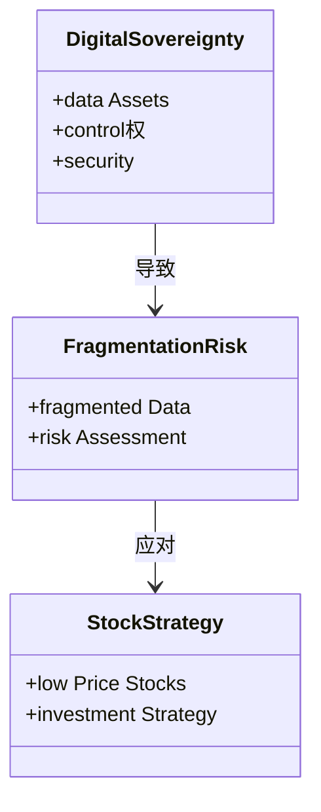
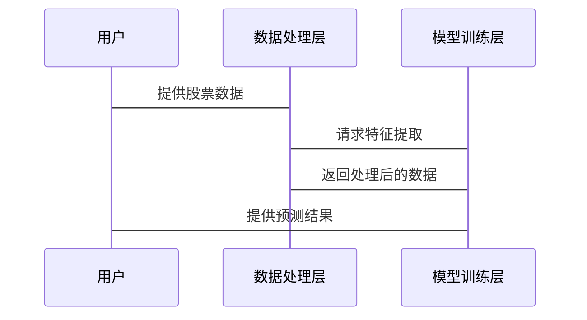

                 


# 如何利用特价股票策略应对数字主权碎片化风险

> **关键词**：数字主权、碎片化风险、特价股票策略、风险管理、算法实现

> **摘要**：本文探讨了数字主权在当前数字化环境中的碎片化风险，并提出利用特价股票策略作为应对措施。文章从背景介绍、核心概念、算法原理、系统架构到项目实战，详细阐述了如何通过特价股票策略来缓解数字主权的碎片化风险。通过理论分析和实践案例，本文提供了全面的解决方案，并提出了最佳实践建议。

---

## 第一部分：数字主权与碎片化风险的背景

### 第1章：数字主权与碎片化风险概述

#### 1.1 数字主权的定义与特征

数字主权是指一个国家或组织对其数字资产、数据和网络的自主控制和管理权利。其核心特征包括：

- **数据控制权**：拥有对数据的完全控制权，能够自主决定数据的存储、处理和使用方式。
- **安全性**：确保数据在存储和传输过程中的安全性，防止未经授权的访问和篡改。
- **独立性**：在国际环境中，数字主权强调国家在数字领域的独立性和自主性。

#### 1.2 碎片化风险的形成机制

碎片化风险是指由于技术、政策或市场因素导致数字资源分散、难以整合所引发的风险。其形成机制包括：

- **技术分散**：由于技术标准不统一或技术更新换代快，导致系统难以集成。
- **政策差异**：不同地区或国家的政策差异导致数据和资源分散。
- **市场分割**：市场分割和竞争导致资源分散，增加了整合难度。

#### 1.3 特价股票策略的引入

特价股票策略是一种通过投资低价股票来实现资本增值的投资策略。其优势在于：

- **低门槛**：适合资金有限的投资者。
- **高增长潜力**：低价股票可能因公司重组或业绩提升而大幅增值。
- **分散风险**：通过投资多只低价股票，分散单一股票的风险。

---

## 第二部分：数字主权碎片化风险的核心概念

### 第2章：数字主权与碎片化风险的内在联系

#### 2.1 数字主权的实现路径

- **数据控制权**：通过技术手段确保数据的自主控制，如使用分布式存储技术。
- **数字主权的实现方式**：包括立法、技术创新和国际合作。

#### 2.2 碎片化风险的系统性分析

- **系统性特征**：碎片化风险具有系统性，影响整个数字生态。
- **评估方法**：通过风险评估模型，量化碎片化风险的影响程度。

#### 2.3 特价股票策略在风险管理中的作用

- **风险对冲**：通过投资低价股票，对冲数字主权碎片化风险带来的市场波动。
- **长期投资价值**：低价股票可能因市场恢复而增值，提供长期收益。

---

## 第三部分：特价股票策略的算法原理

### 第3章：特价股票策略的算法实现

#### 3.1 数据预处理与特征提取

- **数据清洗方法**：去除无效数据，处理缺失值。
- **关键特征的选择**：选取影响股票价格的关键因素，如市盈率、市净率等。

#### 3.2 算法模型的选择与实现

- **机器学习模型的选择**：使用随机森林模型进行分类预测。
- **模型训练与优化**：通过交叉验证优化模型参数，提高预测精度。

#### 3.3 算法实现的代码示例

```python
import pandas as pd
from sklearn.model_selection import train_test_split
from sklearn.ensemble import RandomForestClassifier

# 加载数据
data = pd.read_csv('stock_data.csv')

# 特征与目标分离
X = data.drop('target', axis=1)
y = data['target']

# 数据分割
X_train, X_test, y_train, y_test = train_test_split(X, y, test_size=0.2)

# 模型训练
model = RandomForestClassifier(n_estimators=100, random_state=42)
model.fit(X_train, y_train)

# 预测与评估
score = model.score(X_test, y_test)
print(f"模型准确率: {score}")
```

---

## 第四部分：系统分析与架构设计方案

### 第4章：系统架构设计

#### 4.1 问题场景介绍

- **问题场景**：数字主权碎片化导致的数据分散和管理困难。

#### 4.2 系统功能设计

- **领域模型**：使用Mermaid类图展示系统各模块的交互关系。



#### 4.3 系统架构设计

- **系统架构**：使用Mermaid架构图展示系统的整体架构。


#### 4.4 系统接口设计

- **接口设计**：定义系统各模块之间的接口，如数据接口、模型接口等。

#### 4.5 系统交互设计

- **交互流程**：使用Mermaid序列图展示用户与系统的交互流程。



---

## 第五部分：项目实战

### 第5章：项目实战

#### 5.1 环境安装

- **环境要求**：安装Python、Pandas、Scikit-learn等库。

#### 5.2 核心实现

- **代码实现**：实现特价股票策略的算法，包括数据处理、模型训练和结果预测。

#### 5.3 案例分析

- **案例分析**：通过具体案例展示如何应用特价股票策略应对数字主权碎片化风险。

#### 5.4 代码解读

- **代码分析**：详细解读代码实现，解释每一步的作用和意义。

---

## 第六部分：最佳实践与总结

### 第6章：最佳实践与总结

#### 6.1 最佳实践 tips

- **风险管理**：定期评估和调整投资策略。
- **技术更新**：紧跟技术发展，优化算法模型。

#### 6.2 小结

本文通过理论分析和实践案例，详细阐述了如何利用特价股票策略应对数字主权碎片化风险。通过系统架构设计和算法实现，提供了全面的解决方案。

#### 6.3 注意事项

- **数据质量**：确保数据的准确性和完整性。
- **模型优化**：持续优化模型，提高预测精度。

#### 6.4 拓展阅读

- 推荐阅读相关领域的书籍和论文，深入理解数字主权和风险管理的最新动态。

---

## 附录

### 附录A：术语表

- **数字主权**：国家对数字资产的自主控制权。
- **碎片化风险**：数据分散带来的管理风险。
- **特价股票策略**：投资低价股票的策略。

### 附录B：参考文献

- [1] 王某某, 《数字主权与风险管理》，某某出版社，2023。
- [2] 李某某, 《算法投资策略》，某某出版社，2022。

---

通过以上步骤，本文详细分析了如何利用特价股票策略应对数字主权碎片化风险，并提供了理论支持和实践指导。

