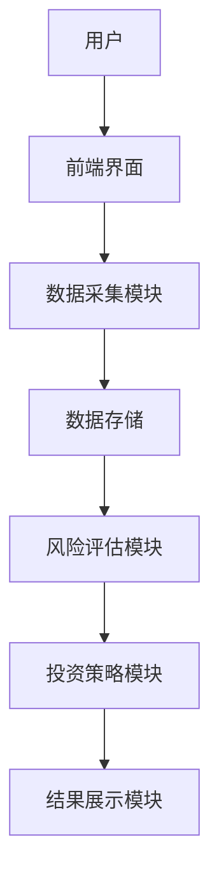

                 


# 如何利用特价股票策略应对数字主权风险

> 关键词：数字主权风险, 特价股票策略, 数字主权, 特价股票, 投资策略, 数字安全, 风险管理

> 摘要：随着全球数字化的推进，数字主权风险日益成为国家安全和经济发展的重要挑战。本文探讨如何利用特价股票策略来应对数字主权风险，通过背景分析、算法原理、系统设计和案例分析，为投资者和企业提供了有效的风险管理工具和策略。

---

## 第一部分：背景与概念

### 第1章：数字主权风险的背景与现状

#### 1.1 数字主权的定义与内涵

数字主权是指国家对其数字资源和网络基础设施的自主控制和管理权利，包括数据主权、网络安全和数字治理等方面。随着全球化和技术的进步，数字主权的内涵不断扩展，成为国家安全的重要组成部分。

#### 1.2 数字主权风险的来源与影响

数字主权风险主要来源于网络攻击、数据泄露、技术依赖和政策变化等。这些风险可能影响国家经济、社会稳定和国家安全，给企业和个人带来重大损失。

#### 1.3 特价股票策略的背景介绍

特价股票策略是一种投资策略，投资者在特定条件下购买价格低于其内在价值的股票。这种策略通常在市场低迷或公司遇到短期困难时应用，旨在以较低价格买入，等待股价回升时卖出获利。

#### 1.4 数字主权风险与特价股票策略的关系

数字主权风险可能影响股市表现，尤其是那些依赖数字技术的公司。特价股票策略可以帮助投资者在风险事件中发现被低估的投资机会，从而在风险缓解后获利。

---

## 第二部分：核心概念与联系

### 第2章：数字主权与特价股票策略的核心概念

#### 2.1 数字主权的核心要素

- **数据主权**：控制数据的生成、存储和使用。
- **网络安全**：保护网络基础设施免受攻击。
- **数字治理**：制定和实施数字相关政策和法规。

#### 2.2 特价股票策略的基本原理

- **市场分析**：识别市场低估的股票。
- **投资决策**：在低价时买入，高价时卖出。
- **风险管理**：通过分散投资降低风险。

#### 2.3 两者的联系与对比分析

| 数字主权 | 特价股票策略 |
|----------|--------------|
| 管理数据和网络 | 利用低价买入股票 |
| 防御性策略 | 投机性策略 |
| 国家层面 | 投资者层面 |

---

## 第三部分：算法原理

### 第3章：特价股票策略的算法原理

#### 3.1 风险评估模型

评估数字主权风险，确定其对股市的影响。模型包括以下几个步骤：

1. **数据收集**：收集相关股票的历史数据。
2. **风险因素分析**：识别影响股价的数字主权风险因素。
3. **模型构建**：使用回归分析等方法建立风险评估模型。
4. **风险评分**：对股票进行风险评分。

#### 3.2 投资组合优化算法

使用数学优化方法构建投资组合，最小化风险并最大化收益。常用算法包括：

- **均值-方差优化**：优化投资组合的收益和风险。
- **马科维茨优化**：基于现代投资组合理论。

#### 3.3 数学模型与公式

- 风险评估模型：
  $$ R_i = \beta_i \cdot R_m + \alpha_i $$
  其中，\( R_i \) 为股票i的收益，\( R_m \) 为市场收益，\( \beta_i \) 为股票i的贝塔系数，\( \alpha_i \) 为个股的超额收益。

- 投资组合优化模型：
  $$ \text{Minimize } \sigma^2 $$
  $$ \text{Subject to } \sum w_i = 1 $$

---

## 第四部分：系统设计

### 第4章：系统架构与实现

#### 4.1 系统功能模块设计

- 数据采集模块：收集数字主权相关数据。
- 风险评估模块：评估股票风险。
- 投资策略模块：制定特价股票策略。
- 监测与调整模块：实时监控并调整投资组合。

#### 4.2 系统架构设计图



#### 4.3 接口与交互设计

- API接口：提供数据接口供其他系统调用。
- 交互流程：用户输入查询，系统返回风险评估和投资建议。

---

## 第五部分：项目实战

### 第5章：特价股票策略的实战应用

#### 5.1 环境配置与工具安装

- 操作系统：Linux或Windows。
- 开发工具：Python、Jupyter Notebook。
- 数据源：Yahoo Finance API。

#### 5.2 核心代码实现

```python
import pandas as pd
import numpy as np
from sklearn.linear_model import LinearRegression

# 数据加载
data = pd.read_csv('stock_data.csv')

# 风险评估模型
model = LinearRegression()
model.fit(data[['market_return']], data['stock_return'])

# 投资组合优化
# 使用均值-方差优化
returns = data['stock_return'].values
cov_matrix = np.cov(returns)
```

#### 5.3 案例分析与结果解读

通过具体案例，展示如何利用特价股票策略在数字主权风险事件中获利。分析市场反应、策略执行结果和收益情况。

---

## 第六部分：风险管理与应对

### 第6章：数字主权风险下的策略优化

#### 6.1 风险评估与应对措施

定期评估数字主权风险，及时调整投资策略。

#### 6.2 策略调整与优化

根据市场变化和风险评估结果，动态调整投资组合。

#### 6.3 长期风险管理规划

制定长期风险管理计划，确保投资组合的稳健性。

---

## 结论

通过本文的详细分析，我们可以看到，利用特价股票策略应对数字主权风险是可行且有效的。投资者和企业可以通过风险评估、投资组合优化和实时监控等方法，降低数字主权风险带来的影响，实现稳健投资。

---

## 参考文献

- 现代投资组合理论相关文献
- 数字主权与网络安全的学术研究
- 相关技术文档和投资策略书籍

