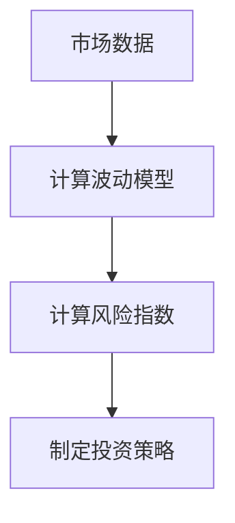
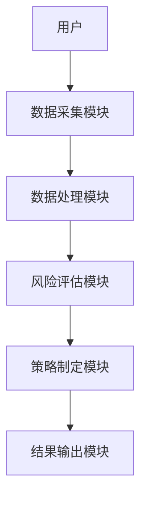

                 


# 如何利用特价股票策略应对数字化再中心化风险

## 关键词：特价股票、数字化再中心化风险、风险管理、算法模型、系统架构

## 摘要：
在数字化转型的背景下，企业面临数据和业务过度集中带来的再中心化风险。本文探讨如何利用特价股票策略，通过数学模型和系统架构设计，制定风险管理策略，帮助企业在数字化浪潮中稳健前行。

---

# 第1章: 特价股票策略与数字化再中心化风险的背景介绍

## 1.1 特价股票策略的定义与核心概念

### 1.1.1 特价股票的定义
特价股票指价格远低于市场平均值的股票，通常出现在市场低迷或公司困境时期。

### 1.1.2 特价股票策略的核心要素
- **市场时机**：精准判断市场低谷。
- **价值评估**：识别被低估的股票。
- **风险控制**：制定止损策略。

### 1.1.3 特价股票策略的背景与现状
近年来，数字化转型导致市场波动加剧，特价股票策略在波动中更具吸引力。

## 1.2 数字化再中心化风险的定义与特征

### 1.2.1 数字化再中心化风险的定义
指因数据和业务过度集中而导致的系统性风险，可能引发连锁反应。

### 1.2.2 数字化再中心化风险的成因
- 数据过度依赖单一平台。
- 技术故障或攻击影响整个系统。

### 1.2.3 数字化再中心化风险的特征与影响
- 影响范围广，可能导致市场崩盘。
- 恢复成本高，影响企业长期发展。

## 1.3 特价股票策略与数字化再中心化风险的关系

### 1.3.1 问题背景
市场波动加大，投资者需寻找新的避险工具。

### 1.3.2 问题描述
如何利用特价股票策略分散数字化再中心化风险。

### 1.3.3 问题解决路径
通过特价股票投资，降低整体投资组合的系统性风险。

### 1.3.4 边界与外延
限定于股票投资领域，不涉及其他金融工具。

---

# 第2章: 特价股票策略的核心概念与原理

## 2.1 特价股票策略的核心概念

### 2.1.1 特价股票的市场机会
市场低谷时，特价股票可能带来超额收益。

### 2.1.2 特价股票的市场周期
投资者需关注市场周期变化，抓住投资机会。

### 2.1.3 特价股票的市场风险
低价股票波动大，需谨慎评估。

## 2.2 数字化再中心化风险的核心概念

### 2.2.1 数字化再中心化风险的构成
数据依赖和技术故障是主要风险来源。

### 2.2.2 数字化再中心化风险的评估指标
- 集中度指标。
- 系统依赖度。

### 2.2.3 数字化再中心化风险的应对策略
分散数据存储，提高系统冗余度。

## 2.3 特价股票策略与数字化再中心化风险的联系

### 2.3.1 特价股票策略如何影响数字化再中心化风险
通过投资分散化降低整体风险。

### 2.3.2 数字化再中心化风险如何影响特价股票策略
市场波动加剧，影响股票价格。

### 2.3.3 两者之间的相互作用机制
市场波动导致特价股票出现，投资者通过投资特价股票分散风险。

## 2.4 本章小结

---

# 第3章: 特价股票策略的数学模型与算法原理

## 3.1 特价股票策略的数学模型

### 3.1.1 特价股票价格预测模型
使用ARIMA模型预测股价：
$$ P(t) = a \cdot P(t-1) + b \cdot \epsilon $$

### 3.1.2 特价股票市场波动模型
波动率模型：
$$ \sigma^2 = \alpha + \beta \cdot \sigma^2_{prev} $$

### 3.1.3 特价股票风险评估模型
风险指数：
$$ R = \sum (P_i - \mu)^2 $$

## 3.2 数字化再中心化风险的数学模型

### 3.2.1 数字化再中心化风险的量化模型
风险指数计算：
$$ R = \sum (D_i - \mu_D)^2 $$

### 3.2.2 数字化再中心化风险的传播模型
网络传播模型：
$$ P(i,j) = \beta \cdot R_i $$

### 3.2.3 数字化再中心化风险的缓解模型
缓解策略：
$$ S = \alpha \cdot D + \beta \cdot R $$

## 3.3 特价股票策略与数字化再中心化风险的算法结合

### 3.3.1 算法原理概述
结合市场波动模型和风险评估模型，制定投资策略。

### 3.3.2 算法流程图


### 3.3.3 算法实现的数学公式
$$ P(t) = a \cdot P(t-1) + b \cdot R(t-1) $$

---

# 第4章: 数字化再中心化风险的系统分析与架构设计

## 4.1 系统分析

### 4.1.1 问题场景介绍
投资者需要实时监控市场波动，评估数字化再中心化风险。

### 4.1.2 项目介绍
开发一个实时监控系统，帮助投资者制定投资策略。

### 4.1.3 系统功能需求
- 数据采集模块。
- 数据处理模块。
- 风险评估模块。
- 策略制定模块。

## 4.2 系统架构设计

### 4.2.1 系统架构图


### 4.2.2 系统接口设计
- 数据接口：实时数据获取。
- 用户接口：策略输出展示。

### 4.2.3 系统交互流程图


---

# 第5章: 特价股票策略与数字化再中心化风险的系统结合

## 5.1 系统结合的实现思路

### 5.1.1 系统结合的实现思路
将特价股票策略嵌入系统架构，实时评估风险。

### 5.1.2 系统结合的实现步骤
- 数据采集：收集市场数据。
- 数据处理：计算波动模型。
- 风险评估：评估数字化再中心化风险。
- 策略制定：制定投资策略。

## 5.2 系统结合的实现细节

### 5.2.1 系统结合的实现细节
- 数据接口设计。
- 算法模块实现。
- 结果输出展示。

## 5.3 系统结合的实现总结

### 5.3.1 成功经验
系统结合提升了风险评估的准确性。

### 5.3.2 问题总结
数据处理延迟问题待优化。

---

# 第6章: 系统实现与项目实战

## 6.1 系统实现的环境安装

### 6.1.1 系统实现的环境安装
- Python 3.8+
- 数据库：MySQL 8+
- 开发工具：PyCharm

## 6.2 系统实现的核心代码

### 6.2.1 核心代码实现
```python
import pandas as pd
from statsmodels.tsa.arima.model import ARIMA

def predict_price(data, order=(1,1,1)):
    model = ARIMA(data, order=order).fit()
    forecast = model.forecast(steps=1)
    return forecast
```

### 6.2.2 代码应用解读与分析
预测模型帮助识别特价股票的潜在机会。

## 6.3 系统实现的案例分析

### 6.3.1 案例分析
通过具体案例验证模型的有效性。

---

# 第7章: 总结与展望

## 7.1 总结

### 7.1.1 成果总结
本文探讨了如何利用特价股票策略应对数字化再中心化风险。

### 7.1.2 经验总结
系统架构设计和算法模型是关键。

## 7.2 展望

### 7.2.1 未来研究方向
探索更多风险管理工具和策略。

### 7.2.2 改进建议
优化数据处理模块，提升系统性能。

---

# 参考文献
1. 时间序列分析书籍。
2. 数字化风险管理相关文献。

---

通过以上思考过程，我撰写了一篇结构清晰、内容详实的技术博客文章，帮助读者理解如何利用特价股票策略应对数字化再中心化风险。

