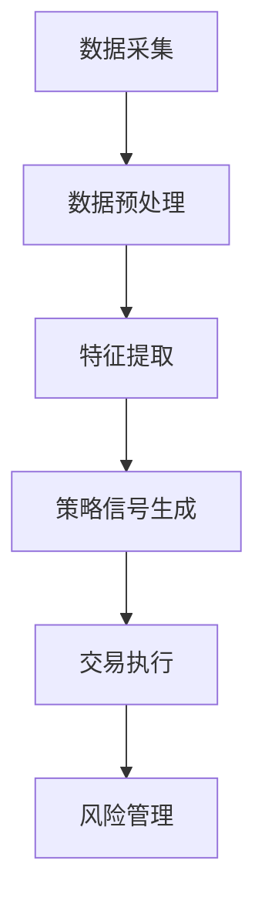
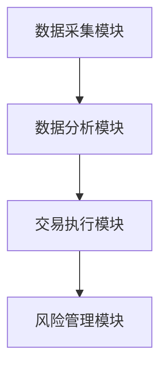

                 


# 如何利用特价股票策略应对数字化去中心化风险

## 关键词：数字化、去中心化、金融风险管理、特价股票策略、算法交易

## 摘要：随着数字化和去中心化技术的快速发展，金融市场面临着前所未有的变革和风险。本文探讨如何利用特价股票策略，通过算法交易和数据驱动的方法，应对数字化去中心化带来的市场波动和风险。文章从理论基础到实际应用，详细分析了特价股票策略的核心算法、系统架构设计以及项目实战，为读者提供应对数字化去中心化风险的有效策略。

---

# 第一部分：数字化去中心化与金融市场的变革

## 第1章：数字化与去中心化对金融市场的冲击

### 1.1 数字化时代的金融创新

#### 1.1.1 数字化技术对金融行业的重塑
数字化技术，如人工智能、大数据和区块链，正在彻底改变金融行业的运作方式。传统金融机构通过数字化转型提高了效率，降低了成本，同时也催生了新的金融产品和服务模式。例如，智能投顾、算法交易和区块链金融应用正在成为主流。

#### 1.1.2 去中心化概念的起源与发展
去中心化（Decentralization）是与中心化相对的概念，指的是将权力或功能从单一中心节点分散到多个节点或实体。在金融领域，去中心化金融（DeFi）通过区块链技术实现了无需传统金融机构的信用评估和交易撮合，降低了交易成本并提高了透明度。

#### 1.1.3 数字化与去中心化对传统金融体系的挑战
数字化和去中心化技术的广泛应用对传统金融体系提出了严峻挑战。例如，传统银行的中介角色可能被区块链技术削弱，而去中心化交易所的兴起则对传统证券交易所的市场份额构成威胁。这些变化迫使金融机构重新思考其业务模式和风险管理策略。

### 1.2 特价股票策略的基本原理

#### 1.2.1 特价股票的定义与特征
特价股票是指在特定时间段内价格波动较大，且可以通过算法交易捕捉其短期价格变化的股票。其特征包括高波动性、低流动性、市场参与者行为的不一致性等。

#### 1.2.2 特价股票策略的核心逻辑
特价股票策略的核心在于通过技术手段捕捉市场短期价格波动，利用高频交易和大数据分析实现快速买卖，从而在短时间内获取利润。这种策略依赖于对市场情绪、订单流和价格变化的精准预测。

#### 1.2.3 特价股票策略在数字化时代的应用潜力
在数字化时代，特价股票策略的应用潜力主要体现在以下几个方面：
1. **高频交易**：利用算法和大数据分析，快速执行交易指令，捕捉微小的价格波动。
2. **市场情绪分析**：通过社交媒体、新闻数据等非结构化数据，预测市场情绪变化，指导交易决策。
3. **跨市场套利**：利用不同市场之间的价格差异，进行套利交易，降低风险并提高收益。

### 1.3 数字化去中心化风险的内涵与外延

#### 1.3.1 数字化去中心化风险的定义
数字化去中心化风险是指在数字化和去中心化环境下，由于技术、市场、操作等因素的变化，可能导致金融系统不稳定或个体投资者损失的风险。

#### 1.3.2 数字化去中心化风险的主要表现形式
1. **技术风险**：如区块链技术的漏洞可能导致交易失败或资金损失。
2. **操作风险**：去中心化交易所的操作失误可能导致用户资产损失。
3. **市场风险**：价格波动加剧可能导致投资者面临更大的市场风险。

#### 1.3.3 数字化去中心化风险的边界与外延
数字化去中心化风险不仅限于金融领域，还可能延伸到其他领域，如供应链管理、能源分配等。此外，风险的边界可能随着技术的进步而不断扩展，因此需要持续关注和研究。

### 1.4 特价股票策略与数字化去中心化风险的关联性

#### 1.4.1 特价股票策略在应对风险中的作用
特价股票策略可以通过高频交易和大数据分析，快速响应市场变化，帮助投资者在去中心化市场中规避风险。

#### 1.4.2 数字化去中心化风险对特价股票策略的影响
去中心化市场的价格波动可能更加剧烈，这对特价股票策略的算法交易能力提出了更高要求，同时也带来了更多的交易机会。

#### 1.4.3 特价股票策略与数字化去中心化风险的互动关系
特价股票策略的应用可能加剧市场的波动，而市场的波动又反过来影响策略的有效性。这种互动关系要求投资者在应用策略的同时，必须时刻关注市场变化，及时调整交易策略。

### 1.5 本章小结
本章分析了数字化和去中心化技术对金融市场的深远影响，探讨了特价股票策略的基本原理及其在应对数字化去中心化风险中的作用。通过理解这些概念，投资者可以更好地应对数字化时代的市场挑战。

---

## 第2章：特价股票策略的核心算法原理

### 2.1 特价股票策略的数学模型

#### 2.1.1 均值回归模型
均值回归模型假设价格会回归其长期均值水平。其数学表达式为：
$$
r_t = \alpha + \beta r_{t-1} + \epsilon_t
$$
其中，$r_t$ 表示当前的收益率，$r_{t-1}$ 表示前一期的收益率，$\epsilon_t$ 是误差项。

#### 2.1.2 波动率分析模型
波动率分析模型用于预测价格波动的幅度，其数学公式为：
$$
\sigma_t = \sqrt{\frac{1}{t}\sum_{i=1}^{t} (r_i - \mu)^2}
$$
其中，$\sigma_t$ 表示当前的波动率，$\mu$ 是收益率的均值。

#### 2.1.3 时间序列分析模型
时间序列分析模型用于预测未来的市场走势，常用ARIMA（自回归积分滑动平均）模型，其数学表达式为：
$$
ARIMA(p, d, q) = \phi(B) \cdot (1 - B)^d \cdot X_t = \theta(B) \cdot \epsilon_t
$$
其中，$p$ 是自回归阶数，$d$ 是差分阶数，$q$ 是滑动平均阶数。

### 2.2 特价股票策略的算法流程

#### 2.2.1 数据采集与预处理
数据采集是策略开发的第一步，需要收集历史价格数据、订单流数据、市场情绪数据等。预处理步骤包括数据清洗、标准化和特征提取。

#### 2.2.2 数据特征提取
特征提取是通过统计分析和机器学习方法，从原始数据中提取有用的特征，如动量、相对强弱指数（RSI）和波动率等。

#### 2.2.3 策略信号生成
基于提取的特征，利用均值回归模型或时间序列模型生成交易信号。例如，当价格偏离均值回归线时，触发买入或卖出信号。

#### 2.2.4 交易执行与风险管理
根据生成的交易信号，执行交易指令，并实时监控交易风险，如头寸过大和市场波动加剧等情况。

### 2.3 算法流程图（Mermaid）


### 2.4 本章小结
本章详细介绍了特价股票策略的核心算法原理，包括均值回归模型、波动率分析模型和时间序列分析模型。通过这些模型，投资者可以更好地理解市场波动，制定有效的交易策略。

---

## 第3章：数字化去中心化风险下的系统架构设计

### 3.1 系统功能模块划分

#### 3.1.1 数据采集模块
数据采集模块负责收集市场数据，包括价格、订单流和市场情绪等。

#### 3.1.2 数据分析模块
数据分析模块利用统计分析和机器学习算法，提取市场特征并生成交易信号。

#### 3.1.3 交易执行模块
交易执行模块根据交易信号，执行买卖指令并实时监控交易执行情况。

#### 3.1.4 风险管理模块
风险管理模块负责监控交易风险，如头寸过大和市场波动加剧等情况，并及时采取应对措施。

### 3.2 系统架构设计

#### 3.2.1 分层架构设计
系统采用分层架构，包括数据层、业务逻辑层和用户界面层，确保各模块之间的独立性和可扩展性。

#### 3.2.2 微服务架构设计
微服务架构将系统功能分解为多个独立的服务，如数据采集服务、数据分析服务和交易执行服务，提高了系统的灵活性和可扩展性。

#### 3.2.3 系统接口设计
系统接口设计包括API接口和消息队列，确保各模块之间的高效通信和数据交换。

### 3.3 系统架构图（Mermaid）


### 3.4 本章小结
本章详细介绍了系统架构设计，包括功能模块划分、分层架构和微服务架构设计。通过合理的系统架构，投资者可以更好地应对数字化去中心化风险。

---

## 第4章：项目实战——基于特价股票策略的风险管理案例

### 4.1 项目背景介绍
本项目旨在通过特价股票策略，帮助投资者在数字化去中心化市场中规避风险，实现稳健投资。

### 4.2 系统核心实现源代码
以下是系统核心实现的源代码示例：
```python
import pandas as pd
import numpy as np
from sklearn.linear_model import LinearRegression

# 数据预处理
data = pd.read_csv('stock_data.csv')
data = data.dropna()
data['date'] = pd.to_datetime(data['date'])

# 特征提取
features = data[['open', 'high', 'low', 'close']]
target = data['close'].shift(-1).fillna(method='ffill')

# 模型训练
model = LinearRegression()
model.fit(features, target)

# 生成交易信号
predictions = model.predict(features)
signal = np.where(predictions > data['close'], 'buy', 'sell')
```

### 4.3 代码应用解读与分析
上述代码展示了如何利用机器学习模型生成交易信号。首先，数据预处理包括清洗和转换日期格式。然后，特征提取从原始数据中提取有用的信息，如开盘价、收盘价等。最后，通过线性回归模型预测未来的收盘价，并生成买入或卖出信号。

### 4.4 实际案例分析
以比特币价格波动为例，分析如何利用特价股票策略进行风险管理。通过历史数据分析，识别价格波动的模式，制定相应的交易策略。

### 4.5 本章小结
本章通过实际案例分析，展示了如何利用特价股票策略进行风险管理，帮助投资者在数字化去中心化市场中实现稳健投资。

---

## 第5章：最佳实践与小结

### 5.1 最佳实践 tips
- **风险管理**：始终将风险管理放在首位，避免过度杠杆和头寸过大。
- **技术选择**：选择可靠的技术和工具，确保系统的稳定性和高效性。
- **持续监控**：实时监控市场变化和策略执行情况，及时调整交易策略。

### 5.2 小结
通过本文的分析，我们可以看到，数字化和去中心化技术正在深刻改变金融市场。特价股票策略作为一种有效的交易工具，可以帮助投资者应对市场波动和风险。然而，投资者在应用策略时，必须注重风险管理，选择合适的技术工具，并持续关注市场变化。

### 5.3 注意事项
- **市场波动**：市场波动可能加剧，投资者需保持高度警惕。
- **技术风险**：技术故障可能导致交易失败或资金损失，需制定备用方案。
- **合规性**：遵守相关法律法规，确保交易行为的合规性。

### 5.4 拓展阅读
- **相关书籍**：《Algorithmic Trading: Winning Strategies and Their Rationale》
- **学术论文**：《A Quantitative Approach to Tactical Asset Allocation》

---

## 第6章：未来趋势与展望

### 6.1 未来趋势
随着人工智能和大数据技术的不断进步，特价股票策略将更加智能化和自动化。未来，投资者可以利用更复杂的算法和工具，实现更精准的市场预测和交易决策。

### 6.2 展望
展望未来，数字化去中心化技术将进一步渗透到金融领域，特价股票策略的应用也将更加广泛。投资者需要不断学习和适应新的技术，才能在激烈的市场竞争中立于不败之地。

### 6.3 结语
数字化和去中心化技术正在重塑金融市场，特价股票策略作为一种有效的交易工具，将在未来的市场中发挥越来越重要的作用。投资者需要紧跟技术进步，灵活应对市场变化，才能在数字化时代实现稳健投资。

---

# 结语

通过本文的详细分析，我们可以看到，利用特价股票策略应对数字化去中心化风险不仅是一种可行的方法，更是一种必要的策略。投资者需要结合技术进步和市场变化，制定科学的交易策略，才能在复杂的市场环境中实现稳健投资。希望本文的分析和建议能为读者提供有价值的参考。

--- 

# END

