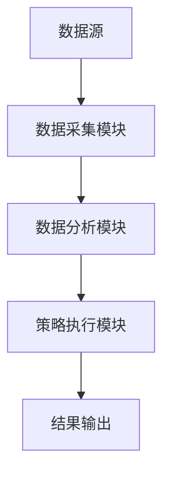

                 


# 如何利用特价股票策略应对数字化去全球化风险

## 关键词：数字化去全球化、特价股票、投资策略、风险管理、算法交易、金融建模、系统架构

## 摘要：随着全球化进程的逆转和数字化转型的加速，金融市场面临着前所未有的挑战。本文探讨了如何利用特价股票策略来应对数字化去全球化带来的风险。通过分析特价股票的特性、数学建模、算法设计和系统架构，本文为投资者提供了有效的投资策略和风险控制方法，帮助他们在复杂多变的市场环境中实现稳健收益。

---

## 第一部分：数字化去全球化与金融市场的挑战

### 第1章：数字化去全球化概述

#### 1.1 数字化去全球化的背景与趋势

数字化和全球化的深度融合推动了世界经济的快速发展，但近年来，去全球化趋势逐渐抬头，尤其是在贸易、供应链和金融市场等方面。数字化技术的应用使得信息传播更快，但也加剧了市场的波动性和不确定性。特别是在金融领域，数字化工具的应用使得投资者能够更快速地进行交易和决策，但也可能导致市场过度波动。

#### 1.2 数字化去全球化对金融市场的挑战

- **市场波动性增加**：数字化工具的应用使得市场参与者能够快速响应市场变化，可能导致市场波动加剧。
- **跨国投资风险**：去全球化可能导致国际贸易摩擦增加，影响跨国公司的业绩，进而影响股票价格。
- **供应链中断的经济影响**：数字化依赖的增强使得供应链中断的风险上升，可能对企业的生产和利润造成重大影响。

---

### 第2章：特价股票策略的核心概念

#### 2.1 特价股票的定义与特点

- **定义**：特价股票是指在特定市场环境下，价格被低估的股票。这些股票通常具有较高的潜在回报，但可能面临较高的风险。
- **特点**：
  - 价格被低估
  - 市场流动性较低
  - 具有较高的波动性
  - 可能存在信息不对称

#### 2.2 特价股票策略的应用场景

- **市场下跌时的防御策略**：在市场整体下跌时，特价股票可能提供较高的安全边际。
- **利用市场波动获利**：通过识别短期市场波动，投资者可以在特价股票中获利。
- **长期投资与短期交易结合**：投资者可以根据市场环境灵活调整投资策略。

---

## 第二部分：特价股票策略的数学模型与算法

### 第3章：特价股票策略的数学模型

#### 3.1 时间序列分析

时间序列分析是一种常用的金融数据分析方法，用于预测股票价格的变化趋势。以下是一个简单的ARIMA模型示例：

$$ ARIMA(p, d, q) $$

其中，p为自回归阶数，d为差分阶数，q为移动平均阶数。

#### 3.2 机器学习算法在股票预测中的应用

- **神经网络模型**：利用深度学习模型（如LSTM）进行时间序列预测。
  $$ LSTM(t) = \sigma(W_{h t} h_{t-1} + W_{xt} x_t + b_h) $$
- **支持向量机**：用于分类和回归分析。
- **集成学习方法**：通过组合多个模型的结果来提高预测准确性。

---

## 第三部分：系统架构与设计

### 第4章：特价股票策略系统的架构设计

#### 4.1 系统功能设计

- **数据采集模块**：实时采集市场数据，包括股票价格、交易量等。
- **数据分析模块**：对数据进行清洗、转换和分析，识别潜在的投资机会。
- **策略执行模块**：根据分析结果，执行买入或卖出指令。

#### 4.2 系统架构图（Mermaid）



---

## 第四部分：项目实战与案例分析

### 第5章：特价股票策略的实战应用

#### 5.1 项目环境安装

- 安装Python和相关库：
  ```bash
  pip install numpy pandas matplotlib scikit-learn
  ```

#### 5.2 核心代码实现

- 数据预处理代码：
  ```python
  import pandas as pd
  data = pd.read_csv('stock_data.csv')
  data = data.dropna()
  ```

- 算法实现代码：
  ```python
  from sklearn.linear_model import LinearRegression
  model = LinearRegression()
  model.fit(X_train, y_train)
  ```

---

## 第五部分：最佳实践与注意事项

### 第6章：最佳实践与风险控制

#### 6.1 投资策略的注意事项

- **风险控制**：设置止损点，避免过度杠杆。
- **资金管理**：合理分配资金，避免过度集中。

#### 6.2 数字化去全球化背景下的投资策略

- **全球化与本地化的平衡**：关注跨国公司和本地企业的双重机会。
- **数字化工具的应用**：利用大数据和人工智能进行市场分析。

---

## 第六部分：总结与展望

### 第7章：总结与未来展望

#### 7.1 本书的总结

- 核心观点回顾：通过特价股票策略应对数字化去全球化风险。
- 重要策略总结：结合数学建模和系统架构设计，实现稳健投资。

#### 7.2 未来研究方向

- 新技术的应用：如区块链、量子计算在金融分析中的应用。
- 全球化与数字化的进一步融合：探索新的投资策略和风险管理方法。

---

## 结语

通过本文的详细分析和策略指导，投资者可以更好地理解如何利用特价股票策略应对数字化去全球化风险。未来，随着技术的进步和市场的变化，特价股票策略将不断创新和优化，为投资者提供更多机会。

