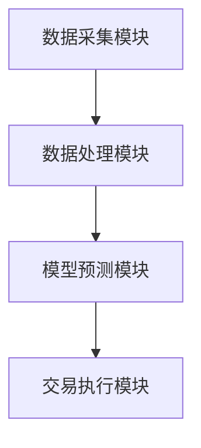

                 


```markdown
# 如何利用特价股票策略应对货币政策变化

## 文章关键词：
货币政策变化、特价股票策略、股票价格预测、量化分析、数学模型、系统架构设计、项目实战

## 摘要：
本文将详细探讨如何利用特价股票策略应对货币政策变化。通过分析货币政策变化对股市的影响，介绍特价股票策略的核心概念，并结合量化分析和数学模型，提供一种基于算法的解决方案。通过系统架构设计和项目实战，展示如何在实际中应用这些策略，帮助投资者在货币政策变化中做出明智决策。

---

## 第一部分: 背景与核心概念

### 第1章: 货币政策变化对股市的影响
#### 1.1 货币政策的基本概念
- **货币政策的定义与目标**：货币政策是由中央银行制定的，旨在通过调整货币供应量和利率等工具来实现经济增长、就业和价格稳定的目标。
- **货币政策工具及其影响**：包括利率调整、货币供应量变化、汇率干预等，这些工具直接影响市场资金流动性，进而影响股市。
- **货币政策变化对股市的传导机制**：利率下降通常会降低融资成本，刺激投资，反之则可能抑制市场流动性。

#### 1.2 特价股票策略的背景
- **特价股票的定义与特征**：指价格远低于其内在价值的股票，通常出现在市场低迷或公司短期困境时期。
- **特价股票策略的适用场景**：在市场波动较大或经济下行周期中，特价股票策略可以帮助投资者在低价位捕获被低估的股票。
- **特价股票策略与货币政策变化的关系**：货币政策变化会影响市场流动性，从而影响股票价格，特价股票策略可以在这种变化中捕捉机会。

#### 1.3 货币政策变化与特价股票策略的核心联系
- **货币政策变化对股票价格的影响**：通过影响市场流动性、企业融资成本和投资者情绪，进而影响股票价格。
- **特价股票策略在应对货币政策变化中的作用**：通过捕捉因货币政策变化导致的超跌股票，投资者可以在市场波动中获利。
- **货币政策变化对特价股票策略的影响**：货币政策变化可能加剧市场波动，为特价股票策略提供更多的机会。

---

## 第二部分: 核心概念与联系

### 第2章: 货币政策变化对股市的量化分析
#### 2.1 货币政策变化的量化指标
- **利率的变化**：通过分析基准利率的变化，预测货币政策对市场的潜在影响。
- **货币供应量的变化**：M2增速等指标可以反映市场流动性变化。
- **汇率的变化**：汇率波动会影响出口型企业盈利能力，进而影响股价。

#### 2.2 特价股票策略的量化分析
- **特价股票的量化指标**：市盈率（P/E）、市净率（P/B）、股息率等指标可以帮助识别被低估的股票。
- **量化策略的数学模型**：通过回归分析等方法，建立货币政策变化与股票价格的关系模型。

---

## 第三部分: 算法原理讲解

### 第3章: 货币政策变化对股票价格的预测模型
#### 3.1 线性回归模型
- **线性回归模型的定义**：通过建立自变量（货币政策指标）和因变量（股票价格）之间的线性关系，预测股票价格。
- **数学公式**：$$y = \beta_0 + \beta_1x + \epsilon$$
  - 其中，$y$为股票价格，$x$为货币政策变量，$\beta_0$和$\beta_1$为回归系数，$\epsilon$为误差项。

#### 3.2 货币政策变化对股票价格的预测流程
- **数据收集与预处理**：收集历史货币政策数据和股票价格数据，进行数据清洗和标准化。
- **模型训练与优化**：通过最小二乘法等方法训练模型，调整回归系数。
- **模型验证与评估**：使用测试数据验证模型准确性，评估模型的拟合优度。

---

## 第四部分: 数学模型与公式

### 第4章: 特价股票策略的数学模型
#### 4.1 线性回归模型
- **公式**：$$y = \beta_0 + \beta_1x + \epsilon$$
- **解释**：通过分析货币政策变量$x$的变化，预测股票价格$y$的变化。

#### 4.2 特价股票策略的优化模型
- **公式**：$$\text{收益} = \sum_{i=1}^{n} (p_i - \text{成本}) \times q_i$$
  - 其中，$p_i$为股票价格，$\text{成本}$为买入价格，$q_i$为数量。

---

## 第五部分: 系统分析与架构设计

### 第5章: 系统架构设计
#### 5.1 问题场景介绍
- **目标**：构建一个能够实时监测货币政策变化并触发特价股票交易的系统。
- **关键需求**：实时数据采集、模型预测、自动交易。

#### 5.2 系统功能设计
- **数据采集模块**：收集货币政策数据和股票数据。
- **模型预测模块**：基于量化模型预测股票价格。
- **交易执行模块**：根据预测结果执行交易。

#### 5.3 系统架构图


#### 5.4 接口设计
- **API接口**：提供实时数据接口和交易接口。

#### 5.5 交互设计
- **用户界面**：展示预测结果和交易状态。

---

## 第六部分: 项目实战

### 第6章: 项目实战
#### 6.1 环境安装
- **工具**：Python、Pandas、NumPy、Scikit-learn、Matplotlib。

#### 6.2 核心代码实现
```python
import pandas as pd
import numpy as np
from sklearn.linear_model import LinearRegression

# 数据加载
data = pd.read_csv('policy_stock.csv')

# 模型训练
model = LinearRegression()
model.fit(data[['policy_indicator']], data['price'])

# 预测
predicted_price = model.predict(data[['policy_indicator']])
```

#### 6.3 案例分析
- **案例**：假设某次货币政策变化导致市场下跌，特价股票策略成功捕捉到一只被低估的股票，投资者在低位买入，市场回升后卖出，实现收益。

#### 6.4 项目小结
- **总结**：通过量化分析和系统架构设计，投资者可以有效应对货币政策变化，利用特价股票策略实现收益。

---

## 第七部分: 总结与展望

### 第7章: 总结与展望
#### 7.1 最佳实践
- **持续学习**：关注货币政策变化，及时调整策略。
- **风险控制**：设置止损点，避免重大损失。

#### 7.2 小结
- **核心观点**：通过量化分析和系统设计，投资者可以在货币政策变化中利用特价股票策略实现收益。

#### 7.3 注意事项
- **市场风险**：货币政策变化可能带来市场波动，需谨慎操作。
- **模型局限性**：量化模型可能存在预测误差，需结合其他分析方法。

#### 7.4 拓展阅读
- 推荐阅读《量化交易实战》、《货币政策与金融市场》等书籍。

---

## 结语
通过本文的分析与实战，读者可以掌握如何利用特价股票策略应对货币政策变化，为投资决策提供有力支持。
```

