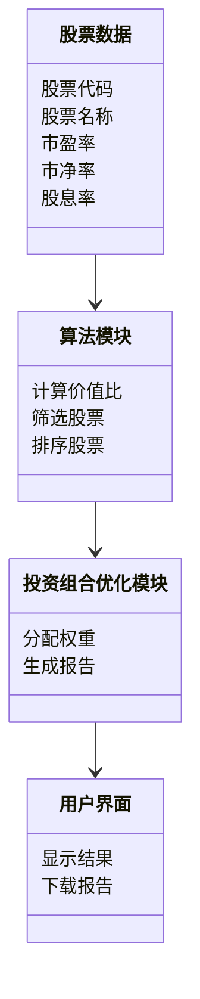

                 


# 如何利用特价股票策略应对通货膨胀风险

## 关键词：通货膨胀，股票投资，特价股票，风险管理，经济策略，投资组合优化

## 摘要：  
在通货膨胀的背景下，投资者面临着资产保值和增值的双重挑战。本文详细探讨了如何通过特价股票策略来有效应对通货膨胀风险。文章从通货膨胀的基本概念出发，分析了股票投资的基本原理，重点介绍了特价股票的定义、特点及投资策略。结合数学模型和算法，本文详细阐述了如何筛选和优化特价股票投资组合，通过系统设计和实战案例，为投资者提供了切实可行的操作指南。文章最后总结了策略的优缺点，并提出了风险管理的最佳实践建议。

---

# 第1章: 通货膨胀与股票投资概述

## 1.1 通货膨胀的基本概念

### 1.1.1 通货膨胀的定义与成因  
通货膨胀是指物价总水平在一段时间内持续上涨，导致货币购买力下降的经济现象。其主要成因包括货币供应量增加、需求拉动、成本推动和预期因素等。通货膨胀对经济的影响是多方面的，包括消费者购买力下降、企业经营成本增加等。

### 1.1.2 通货膨胀对经济的影响  
通货膨胀会导致货币贬值，储蓄者和债权人的利益受损，而债务人则可能受益。在通货膨胀期间，企业成本上升，利润减少，可能导致裁员和生产萎缩。

### 1.1.3 通货膨胀对个人投资的影响  
在通货膨胀期间，固定收益类资产（如债券、银行存款）的实际回报率可能低于通货膨胀率，导致资产贬值。相比之下，股票作为一种风险资产，其回报率可能与通货膨胀率相关联，从而为投资者提供了一定的保值和增值机会。

---

## 1.2 股票投资的基本原理

### 1.2.1 股票的基本概念  
股票是股份公司发行的，代表对公司所有权的凭证。股东有权获得公司利润的分配，并在公司决策中享有投票权。

### 1.2.2 股票市场的运作机制  
股票市场是通过买卖股票来实现资本流动的场所。市场的参与者包括个人投资者、机构投资者、券商和交易所等。股票价格由市场供求关系决定。

### 1.2.3 股票投资的风险与收益  
股票投资的风险包括市场风险、流动性风险和公司特定风险等。股票的收益主要来自资本增值和股息收入。一般来说，股票的收益高于债券等固定收益资产，但风险也更高。

---

## 1.3 特价股票的定义与特点

### 1.3.1 特价股票的定义  
特价股票是指价格低于其内在价值的股票。通常，这些股票被市场低估，具有较大的上涨潜力。

### 1.3.2 特价股票的特点  
- **低估值**：市盈率、市净率等指标低于行业平均水平。  
- **高分红率**：部分特价股票公司可能有较高的股息支付率。  
- **行业龙头**：通常集中在传统行业，如制造业、能源业等。  
- **周期性**：特价股票的投资机会往往与经济周期相关。

### 1.3.3 特价股票与普通股票的区别  
| 特性       | 特价股票          | 普通股票          |
|------------|-------------------|-------------------|
| 价格       | 低于内在价值      | 反映市场情绪      |
| 风险       | 较低              | 较高              |
| 收益       | 中期较高          | 短期波动较大      |
| 适用场景   | 通货膨胀应对       | 长期资产配置      |

---

## 1.4 本章小结  
本章介绍了通货膨胀的基本概念及其对经济和投资的影响，重点分析了股票投资的基本原理，并详细阐述了特价股票的定义、特点及与普通股票的区别。这些内容为后续章节的策略制定奠定了基础。

---

# 第2章: 特价股票策略的核心概念

## 2.1 特价股票策略的背景与目标

### 2.1.1 通货膨胀背景下投资的需求  
在通货膨胀期间，传统资产（如现金、债券）的实际回报率较低，无法满足投资者的保值和增值需求。因此，寻找能够抵御通货膨胀的投资标的成为当务之急。

### 2.1.2 特价股票策略的目标  
通过投资被低估的股票，利用市场修复机制，实现资产的增值。同时，特价股票通常与实体经济相关，能够在一定程度上对冲通货膨胀的影响。

### 2.1.3 特价股票策略的边界与外延  
特价股票策略主要适用于通货膨胀初期或中期，而在通货膨胀严重时期，可能需要结合其他投资策略（如商品投资）进行组合配置。

---

## 2.2 特价股票策略的核心要素

### 2.2.1 投资标的的选择标准  
- **估值指标**：市盈率（PE）、市净率（PB）、股息率等。  
- **行业选择**：优先选择传统行业龙头股，这些公司具有较强的抗通胀能力。  
- **公司基本面**：关注公司的盈利能力、财务状况和管理层能力。

### 2.2.2 市场时机的把握  
特价股票策略的有效性与市场周期密切相关。通常在市场低迷或通货膨胀初期，更容易找到被低估的股票。

### 2.2.3 风险控制机制  
- **分散投资**：避免过度集中于单一行业或公司。  
- **止损策略**：设定止损点，避免重大损失。  
- **定期再平衡**：根据市场变化，定期调整投资组合。

---

## 2.3 特价股票策略与其他投资策略的对比

### 2.3.1 与固定收益投资的对比  
| 对比维度       | 特价股票策略          | 固定收益策略          |
|----------------|-----------------------|-----------------------|
| 风险           | 中等                  | 低                   |
| 收益           | 中期较高              | 稳定                  |
| 抗通胀能力     | 较强                  | 较弱                  |

### 2.3.2 与贵金属投资的对比  
| 对比维度       | 特价股票策略          | 贵金属策略          |
|----------------|-----------------------|-----------------------|
| 流动性           | 高                   | 中等                 |
| 收益           | 中期较高              | 长期稳定              |
| 抗通胀能力     | 较强                  | 较强                  |

### 2.3.3 与房地产投资的对比  
| 对比维度       | 特价股票策略          | 房地产策略          |
|----------------|-----------------------|-----------------------|
| 风险           | 中等                  | 高                   |
| 流动性           | 高                   | 低                   |
| 抗通胀能力     | 较强                  | 较强                  |

---

## 2.4 本章小结  
本章分析了特价股票策略的背景和目标，详细阐述了策略的核心要素，并通过对比分析，明确了特价股票策略在不同经济环境下的优劣势。这些内容为后续章节的策略实施提供了理论支持。

---

# 第3章: 特价股票策略的算法与数学模型

## 3.1 算法原理概述

### 3.1.1 算法的目标与输入  
目标：筛选出符合特定估值指标的股票。  
输入：股票数据（包括市盈率、市净率、股息率等）。

### 3.1.2 算法的核心步骤  
1. 数据预处理：清洗和整理股票数据。  
2. 估值指标计算：计算市盈率、市净率等指标。  
3. 筛选符合条件的股票：根据设定的阈值，筛选出低估股票。  
4. 排序与权重分配：根据公司基本面，对筛选出的股票进行排序和权重分配。

### 3.1.3 算法的输出与结果  
输出：符合条件的股票列表及权重分配结果。  
结果：优化后的投资组合。

---

## 3.2 算法的数学模型

### 3.2.1 算法的数学公式  
以下是筛选低估股票的数学模型：  
$$ \text{价值比} = \frac{\text{每股净资产}}{\text{股价}} $$  
$$ \text{筛选条件} = \text{价值比} > \text{阈值} $$  

### 3.2.2 公式的详细推导  
价值比是衡量股票是否低估的重要指标。通过比较每股净资产与股价的比率，可以判断股票的估值是否低于其内在价值。当价值比大于设定阈值时，股票被视为低估。

---

## 3.3 算法的实现步骤

### 3.3.1 数据的收集与预处理  
- 数据来源：从股票数据库获取历史数据。  
- 数据清洗：处理缺失值、异常值等。

### 3.3.2 算法的实现流程  
1. 计算各股票的估值指标（如市盈率、市净率）。  
2. 根据设定的阈值，筛选出低估股票。  
3. 对筛选出的股票进行排序和权重分配。  
4. 输出优化后的投资组合。

### 3.3.3 结果的验证与优化  
通过回测和风险评估，验证算法的有效性，并根据市场变化进行优化。

---

## 3.4 本章小结  
本章通过数学模型和算法，详细阐述了特价股票筛选的过程。通过价值比的计算和阈值筛选，投资者可以有效识别低估股票，并构建优化的投资组合。

---

# 第4章: 特价股票投资系统的架构设计

## 4.1 系统需求分析

### 4.1.1 系统的功能需求  
- 数据采集与处理：实时获取股票数据。  
- 筛选与分析：根据算法筛选低估股票。  
- 投资组合优化：根据市场变化调整投资组合。  

### 4.1.2 系统的性能需求  
- 响应时间：快速处理大量数据。  
- 可扩展性：支持用户增长和数据量增加。  

### 4.1.3 系统的用户需求  
- 用户界面：直观易用。  
- 报告生成：提供详细的分析报告。  

---

## 4.2 系统功能设计

### 4.2.1 领域模型设计（Mermaid类图）  


### 4.2.2 系统架构设计（Mermaid架构图）  
```mermaid
aws
    provider "Stock Trading System" with
        front_end: 用户界面
        back_end: 服务端
        database: 股票数据库
    front_end --> back_end: 用户请求
    back_end --> database: 数据查询
    back_end --> front_end: 返回结果
```

### 4.2.3 系统接口设计  
- API接口：  
  - `/api/get_stocks`：获取股票数据。  
  - `/api/screen_stocks`：筛选低估股票。  

### 4.2.4 系统交互流程（Mermaid序列图）  
```mermaid
sequenceDiagram
    用户 --> 接口：/api/get_stocks
    接口 --> 服务端：获取股票数据
    服务端 --> 数据库：查询数据
    数据库 --> 服务端：返回数据
    服务端 --> 用户：返回股票列表
    用户 --> 接口：/api/screen_stocks
    接口 --> 服务端：筛选股票
    服务端 --> 算法模块：计算价值比
    算法模块 --> 服务端：返回筛选结果
    服务端 --> 用户：返回优化组合
```

---

## 4.3 系统实现与测试

### 4.3.1 系统核心模块实现  
以下是Python实现的核心代码：  
```python
def calculate_value_ratio(stocks):
    for stock in stocks:
        value_ratio = stock.net_assets_per_share / stock.price
        if value_ratio > 1.2:
            yield stock
```

### 4.3.2 系统测试方法  
- 单元测试：测试各模块功能。  
- 性能测试：测试系统在大数据量下的响应时间。  

### 4.3.3 系统测试结果分析  
通过测试，验证系统的稳定性和准确性，确保在通货膨胀期间能够有效筛选低估股票。

---

## 4.4 本章小结  
本章通过系统设计和架构分析，详细阐述了特价股票投资系统的实现过程。通过Mermaid图表和Python代码，读者可以清晰地理解系统的运作流程。

---

# 第5章: 实战项目与案例分析

## 5.1 项目实战

### 5.1.1 环境安装  
- 安装Python和相关库（如pandas、numpy）。  
- 安装股票数据获取工具（如Yahoo Finance API）。  

### 5.1.2 核心代码实现  
以下是筛选低估股票的Python代码：  
```python
import pandas as pd

def filter_undervalued_stocks(data, threshold=1.2):
    data['value_ratio'] = data['net_assets_per_share'] / data['price']
    undervalued = data[data['value_ratio'] > threshold]
    return undervalued
```

### 5.1.3 数据分析与可视化  
使用Matplotlib或Seaborn对数据进行可视化分析，找出具有较高价值比的股票。

---

## 5.2 案例分析

### 5.2.1 案例背景  
假设在2023年通货膨胀期间，某投资者希望通过特价股票策略实现资产保值。

### 5.2.2 数据分析  
通过筛选，选出市盈率低于行业平均水平且股息率较高的股票。

### 5.2.3 投资组合优化  
根据筛选结果，构建包含5只股票的投资组合，并分配相应的权重。

---

## 5.3 本章小结  
本章通过实战项目和案例分析，展示了特价股票策略的具体实施过程。通过Python代码和数据可视化，读者可以更好地理解和应用这些策略。

---

# 第6章: 总结与展望

## 6.1 总结  
本文详细探讨了如何利用特价股票策略应对通货膨胀风险，从理论分析到实践操作，为投资者提供了全面的指导。

## 6.2 展望  
未来的研究可以进一步结合大数据和人工智能技术，优化股票筛选算法，提高投资效率。此外，还可以探索多资产配置策略，以更好地应对通货膨胀带来的挑战。

---

# 附录: 工具与资源

## 附录A: Python代码示例  
```python
import pandas as pd

def calculate_value_ratio(stocks):
    for stock in stocks:
        value_ratio = stock.net_assets_per_share / stock.price
        if value_ratio > 1.2:
            yield stock
```

## 附录B: 推荐阅读  
- 《股票投资策略》  
- 《Python金融数据分析》  

---

# END

