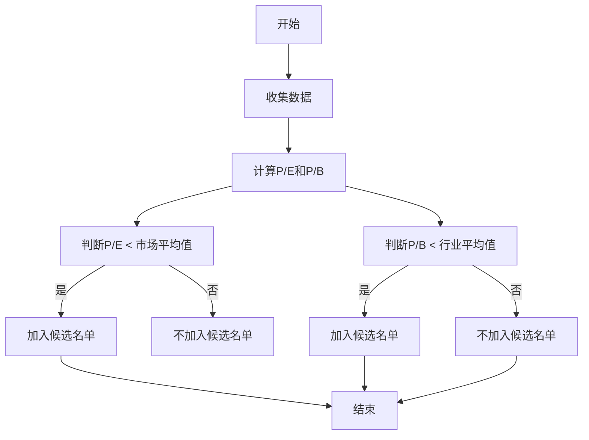
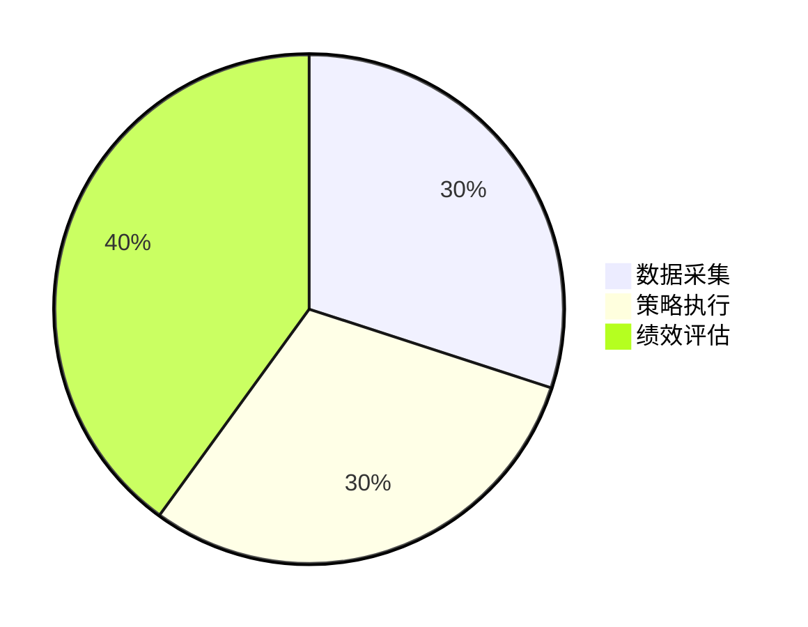

                 


```markdown
# 如何利用特价股票策略构建全天候投资组合

## 第一部分：特价股票策略与投资组合背景

### 第1章：特价股票与投资组合背景

#### 1.1 特价股票的定义与特点
- **1.1.1 特价股票的定义**
  - 特价股票是指价格低于其内在价值的股票，通常具有较高的潜在回报。
  - 这类股票可能因为市场波动或公司特定情况而被低估。
  
- **1.1.2 特价股票的市场定位**
  - 通常出现在熊市或行业低谷期。
  - 特价股票可能来自基本面良好的公司，只是暂时被市场忽视。

- **1.1.3 特价股票的优势与劣势**
  - **优势**：潜在的高回报，风险调整后的收益较高。
  - **劣势**：波动性较大，可能存在较高的下行风险。

#### 1.2 投资组合的基本概念
- **1.2.1 投资组合的定义**
  - 一种将资金分配到不同资产（如股票、债券、现金等）的方式，以分散风险并优化收益。
  
- **1.2.2 投资组合的目标与分类**
  - **目标**：实现资产增值，分散投资风险，匹配投资期限和流动性需求。
  - **分类**：根据资产类型（股票、债券、房地产等）、风险等级、投资策略（主动型、被动型）等进行分类。

- **1.2.3 为什么需要构建全天候投资组合**
  - **全天候**：指无论市场环境如何变化，投资组合都能保持稳定或增长。
  - **多样化**：通过分散投资不同资产和行业，降低特定风险。
  - **风险管理**：通过科学的资产配置，平衡风险与收益。

---

## 第二部分：特价股票策略的核心概念与联系

### 第2章：特价股票策略的核心原理

#### 2.1 策略制定的关键要素
- **2.1.1 策略目标的设定**
  - **目标**：寻找被低估的股票，长期持有，等待市场重新评估。
  - **关键指标**：市盈率（P/E）、市净率（P/B）、股息率等。

- **2.1.2 策略实施的步骤**
  - 数据收集与筛选：收集目标公司的财务数据，筛选出符合特定估值指标的股票。
  - 风险评估：分析公司的财务健康状况、行业前景、管理团队等。
  - 组合构建：根据风险承受能力和收益目标，将筛选出的股票组合在一起。

- **2.1.3 策略效果的评估**
  - 通过回测（backtesting）验证策略的有效性。
  - 定期评估组合的表现，根据市场变化进行调整。

#### 2.2 技术分析与基本面分析的对比
- **2.2.1 技术分析的核心指标**
  - 移动平均线（MA）、相对强弱指数（RSI）、MACD、布林带等。
  - **优势**：能够捕捉市场趋势的变化，适合短期交易。
  - **劣势**：依赖于假设市场参与者的行为模式，可能无法反映公司基本面。

- **2.2.2 基本面分析的关键因素**
  - 收益能力（净利润率、ROE）、成长能力（收入增长率、净利润增长率）、财务健康状况（资产负债率、流动比率）。
  - **优势**：能够反映公司的内在价值，适合长期投资。
  - **劣势**：需要较多的财务数据和分析能力，周期较长。

- **2.2.3 两者结合的优势**
  - **优势**：结合技术分析和基本面分析，可以更全面地评估股票的投资价值。
  - **应用**：在技术分析显示买入信号时，结合基本面分析确认股票的内在价值。

---

### 第3章：特价股票策略的数学模型

#### 3.1 筛选算法的数学模型
- **3.1.1 特价股票筛选的数学公式**
  - 市盈率（P/E）= 股价 / 每股收益（EPS）
  - 市净率（P/B）= 股价 / 每股净资产（BPS）
  - **筛选条件**：P/E < 市场平均值，P/B < 行业平均值。

- **3.1.2 筛选过程的流程图**



#### 3.2 组合优化的数学模型
- **3.2.1 风险收益比的计算公式**
  - 风险收益比 = 预期收益 / 标准差
  - 预期收益可以用历史平均收益或预期未来收益估算。
  - 标准差衡量收益的波动性，反映风险。

- **3.2.2 组合优化的数学推导**
  - 使用现代投资组合理论（MPT）进行优化。
  - 目标是最小化组合的风险（如夏普比率）或最大化预期收益。

---

## 第三部分：系统分析与架构设计

### 第4章：投资组合管理系统架构

#### 4.1 系统功能设计
- **4.1.1 数据采集模块**
  - 数据源：股票市场数据（如Yahoo Finance、Google Finance）。
  - 数据类型：股价、财务报表、市场指数等。
  
- **4.1.2 策略执行模块**
  - 执行筛选算法，生成候选名单。
  - 根据筛选结果生成投资组合建议。

- **4.1.3 绩效评估模块**
  - 计算组合的历史收益率、波动率、夏普比率等指标。
  - 对比组合表现与市场指数表现。

#### 4.2 系统架构设计
- **4.2.1 分层架构图**



- **4.2.2 模块交互流程图**


---

## 第四部分：项目实战与案例分析

### 第5章：项目实战

#### 5.1 环境安装与配置
- 安装Python、Pandas、NumPy、Matplotlib、Scipy等库。
- 安装数据采集工具如yfinance。

#### 5.2 核心实现
- **5.2.1 数据采集**
  ```python
  import pandas as pd
  import yfinance as yf

  # 下载数据
  data = yf.download(tickers='AAPL', period='5y')
  ```

- **5.2.2 策略执行**
  ```python
  def screen_stocks(data):
      # 计算P/E和P/B
      pe = data['Adj Close'] / data['EPS']
      pb = data['Adj Close'] / data['Book Value']
      # 筛选条件
      candidates = data[(pe < pe.mean()) & (pb < pb.mean())]
      return candidates
  ```

- **5.2.3 绩效评估**
  ```python
  def calculate_sharpe_ratio(returns, risk_free_rate):
      excess_returns = returns - risk_free_rate
      sharpe_ratio = excess_returns.mean() / excess_returns.std()
      return sharpe_ratio
  ```

#### 5.3 案例分析
- 选择特定时间段的数据，应用上述算法，生成候选名单。
- 构建投资组合，计算其夏普比率和波动率。
- 对比组合表现与市场指数表现。

---

## 第五部分：总结与扩展

### 第6章：总结与最佳实践

#### 6.1 最佳实践
- **定期审查和调整组合**：根据市场变化和个人投资目标进行调整。
- **风险管理**：设置止损点，避免重大损失。
- **分散投资**：不要将所有资金投入到单一股票或行业。

#### 6.2 小结
- 特价股票策略是一种有效的投资方法，但需要结合市场环境和公司基本面进行综合判断。
- 构建全天候投资组合需要科学的资产配置和持续的市场监控。

#### 6.3 注意事项
- **市场风险**：市场波动可能会影响策略的有效性。
- **数据质量**：确保数据来源可靠，避免因数据错误导致决策失误。
- **法律合规**：遵守相关法律法规，避免非法交易。

#### 6.4 拓展阅读
- 阅读更多关于投资组合理论（MPT）和有效前沿（EFFICIENT FRONTIER）的文献。
- 学习机器学习在投资组合管理中的应用。

---

## 附录：常用工具与资源

- 数据源：Yahoo Finance、Google Finance、Morningstar。
- 工具库：Pandas、NumPy、Matplotlib、Scipy、yfinance。
- 书籍推荐：《投资学》（作者：Harry M. Markowitz），《投资组合管理：方法与见解》。

---

## 结语

通过系统地学习和实践，投资者可以利用特价股票策略构建一个稳健且收益丰厚的投资组合。关键在于结合技术分析和基本面分析，科学地进行资产配置和风险管理。投资需要耐心和持续学习，希望本文能为读者提供有价值的指导。
```

