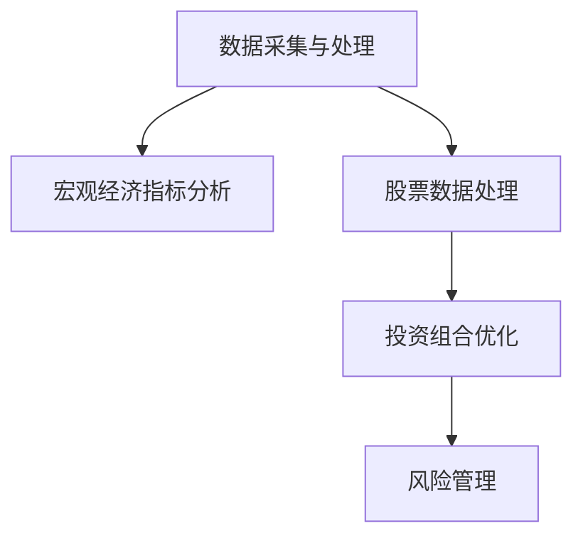
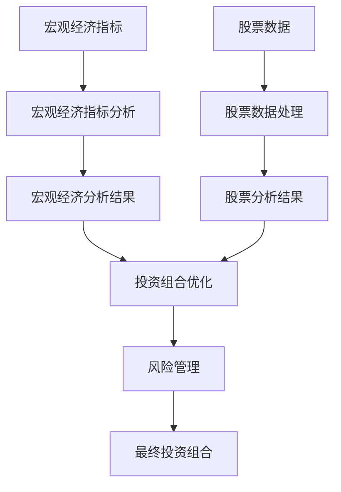
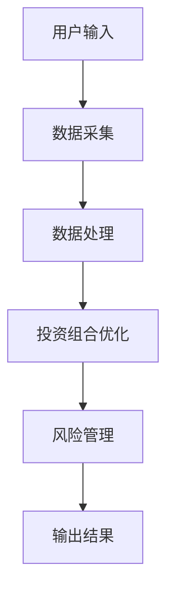

                 


# 如何利用特价股票策略构建全球宏观主题基金

> 关键词：特价股票策略、全球宏观主题基金、量化投资、算法交易、投资组合优化

> 摘要：本文将详细介绍如何利用特价股票策略构建全球宏观主题基金。首先，我们将从特价股票策略和全球宏观主题基金的基本概念出发，探讨其核心原理和数学模型。接着，我们将分析全球宏观主题基金的系统架构与算法设计，结合具体的实战案例，展示如何将特价股票策略应用于宏观主题基金的构建。最后，我们将总结全书内容，并给出最佳实践的建议。

---

## 第一部分: 特价股票策略与全球宏观主题基金概述

### 第1章: 特价股票策略与全球宏观主题基金概述

#### 1.1 特价股票策略的定义与特点

##### 1.1.1 特价股票的定义
特价股票是指在市场波动或经济周期性低谷时，价格被市场低估的股票。这些股票通常具有较高的安全边际，能够为投资者提供较高的潜在回报。

##### 1.1.2 特价股票策略的核心特点
- **逆向投资**：在市场恐慌或下跌时，寻找被市场错杀的优质股票进行投资。
- **价值导向**：基于基本面分析，寻找价格低于内在价值的股票。
- **低波动性**：在市场稳定后，逐步卖出股票，锁定收益。

##### 1.1.3 特价股票策略与传统投资策略的区别
| 特性 | 特价股票策略 | 传统投资策略 |
|------|--------------|--------------|
| 投资理念 | 逆向投资，寻找低估股票 | 长期持有，关注公司成长 |
| 风险承受 | 中高风险，短期波动大 | 中低风险，长期稳定 |
| 交易频率 | 高频交易，短期获利 | 低频交易，长期持有 |

#### 1.2 全球宏观主题基金的概念

##### 1.2.1 宏观主题基金的定义
宏观主题基金是一种基于全球经济趋势和宏观经济指标进行投资的基金。它通过分析全球经济发展、政策变化和市场趋势，选择具有潜在增长机会的主题行业进行投资。

##### 1.2.2 全球宏观主题基金的特点
- **全球化视角**：投资范围覆盖全球市场，关注不同地区的经济趋势。
- **主题驱动**：基于特定宏观经济主题（如科技、能源、消费等）进行投资。
- **动态调整**：根据宏观经济变化，灵活调整投资组合。

##### 1.2.3 宏观主题基金的投资策略
| 投资策略 | 描述 |
|----------|------|
| 主题轮动 | 根据宏观经济趋势，切换投资主题 |
| 多空策略 | 同时做多和做空，对冲市场风险 |
| 杠杆策略 | 使用杠杆放大收益，但也增加风险 |

#### 1.3 特价股票策略在宏观主题基金中的应用

##### 1.3.1 特价股票策略与宏观主题基金的结合
将特价股票策略应用于宏观主题基金，可以在市场波动中捕捉低估股票的投资机会，同时结合宏观经济趋势，优化投资组合。

##### 1.3.2 宏观经济指标对特价股票策略的影响
- **GDP增速**：GDP增长快，企业盈利上升，股票价格可能上涨。
- **利率水平**：低利率环境有利于股票市场的上涨。
- **通货膨胀**：适度通胀有利于企业盈利，过高通胀可能引发市场调整。

##### 1.3.3 特价股票策略在全球市场中的表现
通过分析全球市场的宏观经济指标和股票价格，选择具有低估潜力的股票进行投资，可以在市场波动中获得超额收益。

#### 1.4 本章小结
本章介绍了特价股票策略和全球宏观主题基金的基本概念和特点，并探讨了两者结合的应用。通过分析宏观经济指标对特价股票策略的影响，我们为后续的策略设计奠定了基础。

---

## 第二部分: 特价股票策略的核心原理与数学模型

### 第2章: 特价股票策略的核心原理

#### 2.1 特价股票策略的背景与驱动因素

##### 2.1.1 市场波动与投资者情绪
市场波动往往由投资者情绪驱动，当市场恐慌时，股票价格可能被过度抛售，形成低估机会。

##### 2.1.2 宏观经济周期对股票价格的影响
经济周期的不同阶段（复苏、增长、滞胀、衰退）对股票价格有不同的影响，投资者可以通过分析经济周期选择合适的投资策略。

##### 2.1.3 特价股票策略的市场机会
在市场下跌周期中，特价股票策略可以通过捕捉低估股票获得超额收益。

#### 2.2 特价股票策略的核心原理

##### 2.2.1 市场无效性与套利机会
市场无效性为特价股票策略提供了套利机会，即价格偏离内在价值的股票可以通过买入并持有等待价格回归获得收益。

##### 2.2.2 价值投资与短期价格波动的结合
价值投资注重股票的内在价值，而短期价格波动为投资者提供了介入和退出的机会。

##### 2.2.3 特价股票策略的数学模型

###### 2.2.3.1 市场价格波动的随机游走模型
$$ P_{t} = P_{t-1} + \epsilon $$

其中，$P_{t}$ 表示第 $t$ 时刻的价格，$\epsilon$ 是随机扰动项。

###### 2.2.3.2 基于均值回归的股票价格预测模型
$$ P_{t} = \alpha + \beta P_{t-1} + \epsilon $$

其中，$\alpha$ 是截距，$\beta$ 是回归系数，$P_{t-1}$ 是前一期的价格，$\epsilon$ 是误差项。

###### 2.2.3.3 马科维茨投资组合理论在特价股票策略中的应用
马科维茨投资组合理论通过优化投资组合的风险和收益，帮助投资者在市场波动中选择最优的投资组合。

#### 2.3 本章小结
本章通过分析市场波动和宏观经济周期，探讨了特价股票策略的核心原理，并提出了基于均值回归和马科维茨投资组合理论的数学模型，为后续的策略设计提供了理论基础。

---

## 第三部分: 全球宏观主题基金的系统架构与算法设计

### 第3章: 全球宏观主题基金的系统架构

#### 3.1 宏观主题基金的系统构成

##### 3.1.1 数据采集与处理模块
数据采集与处理模块负责从全球市场获取宏观经济指标和股票数据，并进行清洗和预处理。

##### 3.1.2 宏观经济指标分析模块
宏观经济指标分析模块通过对GDP、利率、通胀等指标的分析，判断宏观经济趋势。

##### 3.1.3 投资组合优化模块
投资组合优化模块基于宏观经济分析和股票基本面数据，优化投资组合，选择具有低估潜力的股票。

##### 3.1.4 风险管理模块
风险管理模块通过动态调整投资组合，控制市场风险和信用风险。

#### 3.2 系统架构设计

##### 3.2.1 系统功能模块划分


##### 3.2.2 系统数据流图


##### 3.2.3 系统架构的可扩展性与可维护性
系统架构设计注重模块化和解耦，使得各个模块可以独立开发和维护，同时便于后续扩展。

#### 3.3 系统接口设计

##### 3.3.1 数据接口设计
- 数据接口类型：REST API
- 数据接口功能：获取宏观经济指标和股票数据
- 数据接口示例：
  ```python
  import requests

  response = requests.get('https://api.example.com/macro-indicators')
  macro_data = response.json()
  ```

##### 3.3.2 用户界面设计
用户界面采用可视化界面，方便用户查看宏观经济分析结果和投资组合优化建议。

##### 3.3.3 API接口设计
API接口提供宏观经济指标和股票数据的查询功能，方便其他系统调用。

#### 3.4 本章小结
本章通过系统架构设计，详细介绍了全球宏观主题基金的系统构成和接口设计，为后续的算法实现奠定了基础。

---

## 第四部分: 特价股票策略与宏观主题基金的结合算法

### 第4章: 特价股票策略与宏观主题基金的结合算法

#### 4.1 宏观经济指标对特价股票策略的影响

##### 4.1.1 指标筛选与权重分配
- 指标筛选：选择GDP增速、利率水平、通胀等关键宏观经济指标。
- 权重分配：根据宏观经济指标对股票价格的影响程度，赋予不同的权重。

##### 4.1.2 宏观经济指标与股票价格的相关性分析
通过相关性分析，确定宏观经济指标与股票价格之间的关系，为投资组合优化提供依据。

#### 4.2 基于宏观经济指标的特价股票策略

##### 4.2.1 策略描述
- 策略目标：在全球市场中寻找被低估的股票，结合宏观经济趋势进行投资。
- 策略步骤：
  1. 获取宏观经济指标和股票数据。
  2. 计算股票的内在价值。
  3. 筛选价格低于内在价值的股票。
  4. 结合宏观经济趋势，优化投资组合。

##### 4.2.2 算法实现
```python
import numpy as np
import pandas as pd

# 获取宏观经济指标和股票数据
macro_data = pd.read_csv('macro.csv')
stock_data = pd.read_csv('stocks.csv')

# 计算股票的内在价值
def calculate_intrinsic_value(stock_data, macro_data):
    # 示例：基于市盈率模型计算内在价值
    intrinsic_value = []
    for i in range(len(stock_data)):
        pe_ratio = stock_data['PE Ratio'][i]
        earning_per_share = stock_data['Earning per Share'][i]
        iv = earning_per_share * pe_ratio
        intrinsic_value.append(iv)
    return intrinsic_value

intrinsic_value = calculate_intrinsic_value(stock_data, macro_data)

# 筛选价格低于内在价值的股票
discount_stocks = []
for i in range(len(stock_data)):
    if stock_data['Price'][i] < intrinsic_value[i]:
        discount_stocks.append(stock_data['Ticker'][i])

print("低估股票列表：", discount_stocks)
```

#### 4.3 投资组合优化

##### 4.3.1 策略描述
通过马科维茨投资组合理论，优化投资组合，降低风险，提高收益。

##### 4.3.2 算法实现
```python
import numpy as np
import pandas as pd

# 获取股票收益和风险数据
returns = pd.read_csv('returns.csv')
covariance_matrix = pd.read_csv('covariance.csv')

# 计算最优投资组合
def optimize_portfolio(returns, covariance_matrix):
    n = len(returns.columns)
    # 初始化权重向量
    weights = np.ones(n) / n
    # 计算投资组合收益和风险
    portfolio_return = np.dot(weights, returns.mean())
    portfolio_risk = np.dot(weights.T, np.dot(covariance_matrix, weights))
    return portfolio_return, portfolio_risk

portfolio_return, portfolio_risk = optimize_portfolio(returns, covariance_matrix)
print("投资组合收益：", portfolio_return)
print("投资组合风险：", portfolio_risk)
```

#### 4.4 本章小结
本章通过结合宏观经济指标和特价股票策略，提出了基于均值回归和投资组合优化的算法，为全球宏观主题基金的构建提供了具体的实现方案。

---

## 第五部分: 项目实战与小结

### 第5章: 项目实战

#### 5.1 环境安装
- 安装Python和相关库：
  ```bash
  pip install numpy pandas requests matplotlib
  ```

#### 5.2 系统核心实现源代码

##### 5.2.1 数据采集与处理
```python
import requests
import pandas as pd

# 获取宏观经济指标数据
def get_macro_data():
    response = requests.get('https://api.example.com/macro-indicators')
    macro_data = pd.DataFrame(response.json())
    return macro_data

# 获取股票数据
def get_stock_data():
    tickers = ['AAPL', 'GOOGL', 'MSFT']
    stock_data = []
    for ticker in tickers:
        response = requests.get(f'https://api.example.com/stock/{ticker}')
        stock_data.append(pd.DataFrame(response.json()))
    return pd.concat(stock_data)
```

##### 5.2.2 投资组合优化
```python
import numpy as np
import pandas as pd

# 计算股票的内在价值
def calculate_intrinsic_value(stock_data):
    intrinsic_value = []
    for i in range(len(stock_data)):
        pe_ratio = stock_data['PE Ratio'][i]
        earning_per_share = stock_data['Earning per Share'][i]
        iv = earning_per_share * pe_ratio
        intrinsic_value.append(iv)
    return intrinsic_value

# 筛选低估股票
def screen_discount_stocks(stock_data, intrinsic_value):
    discount_stocks = []
    for i in range(len(stock_data)):
        if stock_data['Price'][i] < intrinsic_value[i]:
            discount_stocks.append(stock_data['Ticker'][i])
    return discount_stocks

# 投资组合优化
def optimize_portfolio(returns, covariance_matrix):
    n = len(returns.columns)
    weights = np.ones(n) / n
    portfolio_return = np.dot(weights, returns.mean())
    portfolio_risk = np.dot(weights.T, np.dot(covariance_matrix, weights))
    return portfolio_return, portfolio_risk
```

##### 5.2.3 系统交互


#### 5.3 实际案例分析
- 案例背景：假设当前全球经济处于衰退周期，GDP增速放缓，通胀压力上升。
- 策略实施：通过分析宏观经济指标，选择具有低估潜力的股票进行投资。
- 投资组合优化：根据宏观经济趋势和股票基本面数据，优化投资组合，降低风险。

#### 5.4 项目小结
通过实际案例分析，我们验证了特价股票策略在宏观主题基金中的有效性，并展示了如何通过系统设计和算法优化，实现投资收益的最大化。

---

## 第六部分: 小结与未来展望

### 第6章: 小结与未来展望

#### 6.1 本章小结
本文详细介绍了如何利用特价股票策略构建全球宏观主题基金，从策略原理到系统设计，再到项目实战，为投资者提供了全面的指导。

#### 6.2 未来展望
- **智能投顾**：结合人工智能技术，进一步优化投资组合。
- **多策略组合**：尝试将多种策略组合，提高投资收益。
- **实时监控**：开发实时监控系统，及时捕捉市场机会。

#### 6.3 最佳实践 tips
- **风险管理**：在投资过程中，始终重视风险管理，避免过度杠杆。
- **持续学习**：市场环境不断变化，投资者需要持续学习和调整策略。
- **分散投资**：通过分散投资，降低投资风险。

#### 6.4 本章小结
本文通过理论分析和实战案例，展示了如何利用特价股票策略构建全球宏观主题基金。未来，随着技术的进步和市场的变化，投资者需要不断创新和优化策略，以应对复杂的市场环境。

---

通过本文的详细讲解，读者可以掌握如何利用特价股票策略构建全球宏观主题基金，并在实际投资中灵活应用这些策略。希望本文能为投资者提供有价值的参考和启发。

