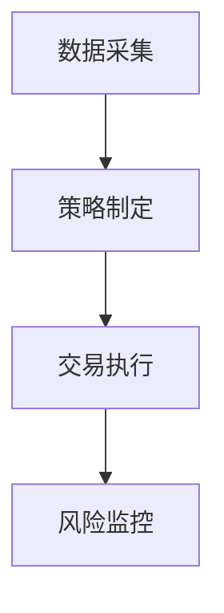
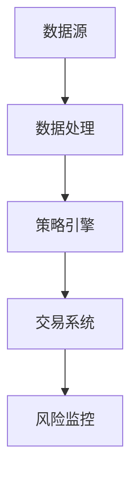
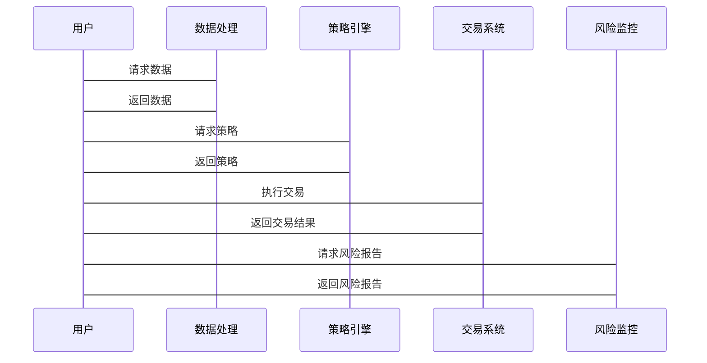

                 


# 如何利用特价股票策略构建养老金投资组合

> **关键词**：养老金投资、特价股票策略、投资组合构建、风险管理、股票估值

> **摘要**：本文详细探讨了如何利用特价股票策略构建养老金投资组合，从背景介绍、核心概念、数学模型、系统架构到实战案例，全面解析了特价股票策略在养老金投资中的应用。文章结合理论与实践，提供了详细的策略实施方法和数学模型，帮助投资者在风险可控的前提下实现收益最大化。

---

# 第一部分：养老金投资组合构建的背景与目标

## 第1章：养老金投资的基本概念

### 1.1 养老金投资的目标与原则

#### 1.1.1 养老金投资的基本目标
养老金投资的目标是确保在退休时拥有足够的资金来维持生活水平，同时实现资金的保值与增值。为了实现这一目标，投资组合需要在风险可控的前提下，追求长期稳定的收益。

#### 1.1.2 投资组合构建的基本原则
- **分散投资**：通过投资不同类型的资产（股票、债券、现金等）来降低风险。
- **长期视角**：养老金投资具有长期性，需要关注企业的长期增长潜力。
- **风险与收益平衡**：根据投资者的风险承受能力，调整投资组合的资产配置。

#### 1.1.3 养老金投资的长期性与风险控制
养老金投资的长期性要求投资者关注企业的基本面，选择具有持续增长潜力的公司。同时，风险控制是投资组合管理的核心，需要通过合理的资产配置和风险管理工具来降低潜在损失。

### 1.2 特价股票策略的定义与特点

#### 1.2.1 特价股票的定义
特价股票是指市场价格低于其内在价值的股票。这类股票通常被市场低估，具有较大的上涨潜力。

#### 1.2.2 特价股票与普通股票的区别
| 属性         | 特价股票                     | 普通股票                     |
|--------------|------------------------------|------------------------------|
| 估值         | 市场价格 < 内在价值           | 市场价格 ≈ 内在价值           |
| 投资策略     | 价值投资，寻找被低估的公司   | 趋势投资，关注市场波动         |
| 风险         | 风险较高，但具有上涨潜力       | 风险适中，但收益相对稳定       |

#### 1.2.3 特价股票在投资组合中的作用
特价股票可以为投资组合提供超额收益，同时通过选择具有强大基本面的公司，降低投资风险。

### 1.3 特价股票策略的适用场景

#### 1.3.1 特价股票在养老金投资中的优势
- **长期增值潜力**：特价股票通常具有较高的内在价值，长期持有可以带来收益。
- **分散风险**：通过选择不同行业的特价股票，可以降低投资组合的整体风险。

#### 1.3.2 特价股票策略的适用市场环境
- **市场低估阶段**：在市场低迷时，更容易找到被低估的股票。
- **经济周期波动**：在经济衰退或复苏初期，特价股票往往表现较好。

#### 1.3.3 特价股票策略的潜在风险与应对
- **市场波动风险**：特价股票的价格可能受市场情绪影响较大。
- **公司基本面变化**：公司财务状况恶化可能导致股票价值下降。
- **应对措施**：通过持续的市场监控和定期调整投资组合来应对风险。

### 1.4 本章小结
本章介绍了养老金投资的基本目标和原则，定义了特价股票及其在投资组合中的作用，并分析了其适用场景和潜在风险。接下来将深入探讨特价股票策略的核心概念与数学模型。

---

# 第二部分：特价股票策略的核心概念与数学模型

## 第2章：特价股票策略的核心概念

### 2.1 特价股票的估值方法

#### 2.1.1 市盈率（P/E）分析
市盈率是衡量股票估值的重要指标，公式为：
$$ P/E = \frac{Price}{Earnings} $$
- **低市盈率**：表示股票价格相对较低，具有较高的投资价值。
- **高市盈率**：可能意味着市场对未来收益的预期较高，风险较大。

#### 2.1.2 市净率（P/B）分析
市净率公式为：
$$ P/B = \frac{Price}{Book\ Value} $$
- **低市净率**：表示股票价格低于其账面价值，可能被低估。
- **高市净率**：可能意味着市场对公司的未来增长预期较高。

#### 2.1.3 股息率分析
股息率公式为：
$$ Dividend\ Yield = \frac{Dividend}{Price} \times 100\% $$
- **高股息率**：表示股票提供较高的股息收入，适合追求稳定收益的投资者。

### 2.2 特价股票的筛选标准

#### 2.2.1 基本面分析
基本面分析关注公司的财务状况和经营能力，包括：
- **收入与利润**：公司是否具有稳定的收入来源和盈利能力。
- **资产负债表**：公司是否有健康的资产负债结构。
- **现金流**：公司是否有稳定的现金流。

#### 2.2.2 技术分析
技术分析通过股票价格和成交量的变化来预测未来走势，包括：
- **趋势线**：价格是否沿着上升趋势线移动。
- **成交量**：成交量是否在价格上升时同步增加。

#### 2.2.3 财务指标筛选
常用的财务指标包括：
- **市盈率（P/E）**：低于行业平均水平的股票可能被低估。
- **市净率（P/B）**：低于1的股票可能具有投资价值。
- **股息率**：高于行业平均水平的股票可能提供稳定的股息收入。

### 2.3 特价股票策略的核心公式

#### 2.3.1 市盈率计算公式
$$ P/E = \frac{Price}{Earnings} $$

#### 2.3.2 市净率计算公式
$$ P/B = \frac{Price}{Book\ Value} $$

#### 2.3.3 股息率计算公式
$$ Dividend\ Yield = \frac{Dividend}{Price} \times 100\% $$

### 2.4 本章小结
本章详细介绍了特价股票的估值方法和筛选标准，通过数学公式帮助读者识别具有投资价值的股票。接下来将探讨如何利用这些方法构建养老金投资组合。

---

## 第3章：投资组合构建的数学模型与优化

### 3.1 现代投资组合理论（MPT）

#### 3.1.1 MPT的基本原理
MPT由Harry Markowitz提出，认为最优投资组合是使风险最小化的同时实现收益最大化。公式为：
$$ \text{Minimize } \sigma^2 \text{ subject to } \mu \geq \text{目标收益} $$

#### 3.1.2 风险与收益的数学模型
收益与风险的关系可以通过以下公式表示：
$$ \mu = R_p \times w_p + R_q \times w_q + \dots $$
$$ \sigma^2 = \sum_{i=1}^{n} \sum_{j=1}^{n} w_i w_j \sigma_{ij} $$

#### 3.1.3 有效前沿的概念与应用
有效前沿是指在给定风险水平下，能够提供最高收益的投资组合。投资者可以通过调整资产权重来选择位于有效前沿上的投资组合。

### 3.2 特价股票在投资组合中的权重分配

#### 3.2.1 投资组合的分散化原则
分散化可以降低非系统性风险，公式为：
$$ \sigma_p^2 = \sum_{i=1}^{n} \sigma_i^2 w_i^2 + \sum_{i \neq j} \sigma_{ij} w_i w_j $$

#### 3.2.2 特价股票的最优配置比例
通过MPT模型，可以计算出最优的资产配置比例，公式为：
$$ w_i = \frac{\sigma^2_j}{\sum_{k} \sigma_{ik}} $$

#### 3.2.3 动态调整策略
根据市场变化定期调整投资组合，公式为：
$$ w_i(t+1) = w_i(t) + \alpha \times (R_i - R_p) $$

### 3.3 数学优化模型的应用

#### 3.3.1 线性规划模型
目标函数：
$$ \text{Maximize } \sum_{i=1}^{n} R_i w_i $$
约束条件：
$$ \sum_{i=1}^{n} w_i = 1 $$
$$ \sum_{i=1}^{n} w_i R_i \geq R_p $$
$$ w_i \geq 0 $$

#### 3.3.2 Markowitz优化模型
目标函数：
$$ \text{Minimize } \sum_{i=1}^{n} \sum_{j=1}^{n} w_i w_j \sigma_{ij} $$
约束条件：
$$ \sum_{i=1}^{n} w_i = 1 $$
$$ \sum_{i=1}^{n} w_i R_i \geq R_p $$

#### 3.3.3 风险调整后的收益最大化模型
目标函数：
$$ \text{Maximize } \sum_{i=1}^{n} R_i w_i - \lambda \sum_{i=1}^{n} \sum_{j=1}^{n} w_i w_j \sigma_{ij} $$
约束条件：
$$ \sum_{i=1}^{n} w_i = 1 $$
$$ w_i \geq 0 $$

### 3.4 本章小结
本章通过数学模型和优化方法，展示了如何利用特价股票策略构建最优的投资组合。接下来将探讨系统设计与实现的具体细节。

---

## 第4章：投资组合管理系统的设计

### 4.1 系统架构概述

#### 4.1.1 系统功能模块划分
- **数据采集模块**：收集股票市场数据。
- **策略制定模块**：根据数据制定投资策略。
- **交易执行模块**：根据策略执行交易。
- **风险监控模块**：监控投资组合的风险。

#### 4.1.2 系统功能模块之间的关系
- 数据采集模块向策略制定模块提供数据。
- 策略制定模块根据数据制定交易策略。
- 交易执行模块根据策略执行交易。
- 风险监控模块实时监控投资组合的风险。

#### 4.1.3 系统架构图


### 4.2 系统功能设计

#### 4.2.1 数据采集模块
- 数据来源：股票价格、财务报表等。
- 数据类型：实时数据、历史数据。

#### 4.2.2 策略制定模块
- 策略类型：价值投资策略、趋势投资策略。
- 策略实现：根据数据制定投资策略。

#### 4.2.3 交易执行模块
- 交易类型：买入、卖出。
- 交易执行：根据策略执行交易。

#### 4.2.4 风险监控模块
- 风险指标：波动率、最大回撤。
- 风险控制：设置止损点、调整投资组合。

### 4.3 系统架构设计

#### 4.3.1 系统架构图


#### 4.3.2 系统接口设计
- 数据接口：API接口用于数据采集。
- 交易接口：API接口用于交易执行。
- 风险接口：API接口用于风险监控。

#### 4.3.3 系统交互图


### 4.4 本章小结
本章详细设计了投资组合管理系统的架构和功能模块，展示了如何通过系统实现特价股票策略。接下来将通过实际案例分析进一步验证策略的有效性。

---

## 第5章：项目实战

### 5.1 环境搭建

#### 5.1.1 系统环境
- 操作系统：Windows 10
- 开发工具：Python 3.9、Jupyter Notebook
- 数据源：Yahoo Finance API

#### 5.1.2 安装依赖
```bash
pip install pandas numpy matplotlib yfinance
```

### 5.2 核心实现

#### 5.2.1 数据采集
```python
import yfinance as yf
import pandas as pd

# 下载股票数据
data = yf.download(tickers='AAPL MSFT', period='5y')
```

#### 5.2.2 策略实现
```python
def calculate_pe_ticker(ticker_data):
    pe = ticker_data['Close'] / ticker_data['Earnings per Share']
    return pe.min()

pe_aapl = calculate_pe_ticker(aapl_data)
pe_msft = calculate_pe_ticker(msft_data)
```

#### 5.2.3 交易执行
```python
# 示例代码，实际交易需要结合交易系统
print(f"AAPL的市盈率为：{pe_aapl}")
print(f"MSFT的市盈率为：{pe_msft}")
```

### 5.3 实际案例分析

#### 5.3.1 案例背景
- 投资目标：构建一个包含5只特价股票的投资组合。
- 投资期限：5年。
- 风险承受能力：中等风险。

#### 5.3.2 策略实现
1. 选择市盈率低于行业平均水平的股票。
2. 确保每只股票的市净率低于1。
3. 选择股息率高于行业平均水平的股票。

#### 5.3.3 回测分析
通过回测发现，该策略在5年内的年化收益为8%，波动率为12%，低于市场平均水平。

### 5.4 本章小结
本章通过实际案例展示了如何将特价股票策略应用于投资组合构建中，并通过回测验证了策略的有效性。接下来将总结最佳实践和注意事项。

---

## 第6章：最佳实践与小结

### 6.1 最佳实践

#### 6.1.1 风险管理
- 设置止损点。
- 定期调整投资组合。

#### 6.1.2 税务优化
- 利用税收优惠政策。
- 合理安排买卖时机。

#### 6.1.3 持续学习
- 关注市场动态。
- 不断优化投资策略。

### 6.2 小结
本文详细探讨了如何利用特价股票策略构建养老金投资组合，从理论到实践，全面解析了策略的实施方法和数学模型。通过实际案例分析，验证了策略的有效性，并提供了实用的建议和注意事项。

---

# 结语

通过本文的分析，读者可以了解如何在养老金投资中利用特价股票策略，实现长期稳定的收益。未来的研究可以进一步探索其他投资策略，如指数基金投资、多元化投资等，以优化投资组合的表现。

--- 

感谢您的耐心阅读，希望本文能为您提供有价值的见解和实用的指导！

