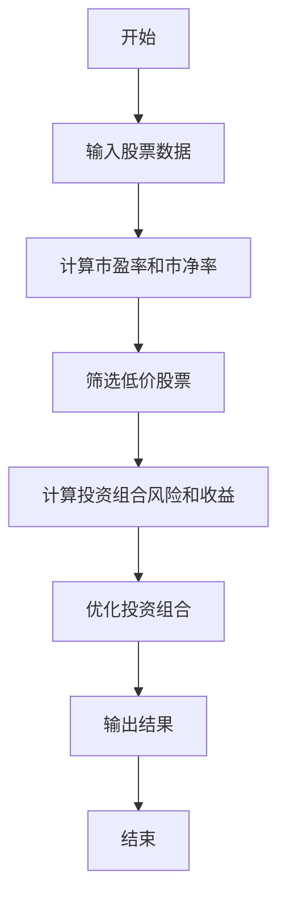
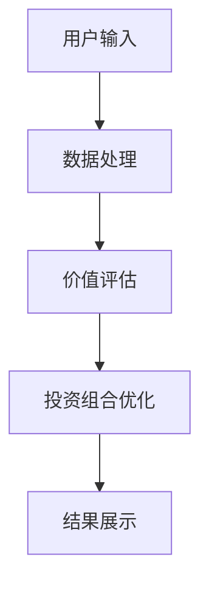
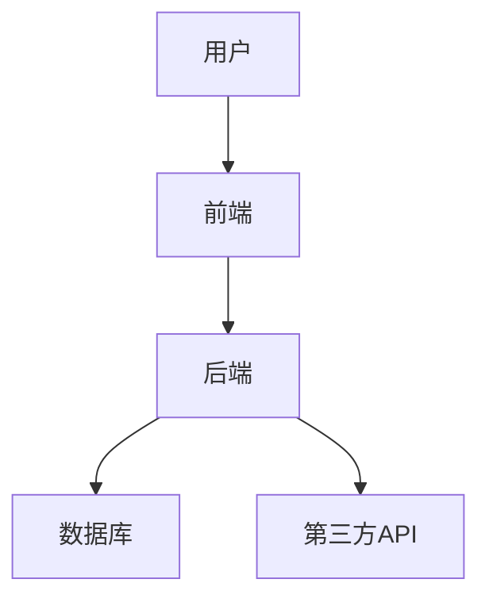

                 


# 如何利用特价股票策略构建养老金投资组合

## 关键词：
- 特价股票策略
- 养老金投资
- 风险管理
- 股票分析
- 投资组合优化

## 摘要：
本文详细探讨了如何利用特价股票策略构建一个稳健的养老金投资组合。通过分析特价股票的特点、价值评估方法和投资组合优化算法，结合实际案例和系统架构设计，为读者提供了一套从理论到实践的完整解决方案。文章还讨论了风险管理的重要性，并提供了Python代码实现和数学模型，帮助读者更好地理解和应用这些策略。

---

# 第1章: 特价股票策略与养老金投资背景

## 1.1 特价股票的定义与特点

### 1.1.1 特价股票的定义
特价股票（Cheap Stocks）是指市盈率（P/E）或市净率（P/B）等估值指标低于市场平均水平的股票。这些股票通常被认为被市场低估，具有较大的上涨潜力。

### 1.1.2 特价股票的核心特点
- **低估值**：市盈率和市净率低于行业平均水平。
- **高股息率**：部分特价股票提供较高的股息收益率。
- **波动性**：通常波动较大，适合长期投资者。
- **行业分布**：多集中在周期性行业，如能源、金融等。

### 1.1.3 特价股票与普通股票的区别
| 特性 | 特价股票 | 普通股票 |
|------|----------|----------|
| 估值 | 低       | 中高     |
| 风险 | 较高     | 较低     |
| 收益 | 较高     | 稳定     |

## 1.2 养老金投资的基本概念

### 1.2.1 养老金的定义与目标
养老金是为退休后提供稳定收入来源的资金，其核心目标是保值和稳健增值。

### 1.2.2 养老金投资的重要性
- 养老金投资是确保退休后生活质量的重要保障。
- 通过投资实现资金的保值和增值。

### 1.2.3 养老金投资的常见方式
- **股票投资**：追求长期收益。
- **债券投资**：追求稳定收益。
- **混合投资**：平衡风险和收益。

## 1.3 特价股票策略在养老金投资中的应用前景

### 1.3.1 特价股票策略的潜在优势
- **高回报潜力**：低估股票有较大的上涨空间。
- **分散风险**：通过多样化投资降低风险。

### 1.3.2 养老金投资采用特价股票策略的可行性
- **低估值股票的长期收益**：历史数据显示，低估股票在长期内有较高的收益。
- **与养老金目标的匹配性**：低估值股票的长期收益与养老金的长期投资目标一致。

### 1.3.3 特价股票策略应用的挑战与机遇
- **挑战**：市场波动大，短期可能亏损。
- **机遇**：长期收益潜力大，适合养老金的长期投资目标。

## 1.4 本章小结
本章介绍了特价股票的定义、特点及其与普通股票的区别，并详细阐述了养老金投资的基本概念和目标。同时，分析了特价股票策略在养老金投资中的应用前景，为后续章节的深入讨论奠定了基础。

---

# 第2章: 特价股票策略的核心概念与联系

## 2.1 特价股票策略的核心原理

### 2.1.1 特价股票的市场定位
特价股票通常被视为市场中的“价值洼地”，投资者通过长期持有这些股票，等待市场重新评估其价值。

### 2.1.2 特价股票的价值评估方法
- **市盈率（P/E）**：衡量股票价格与每股收益的比例。
- **市净率（P/B）**：衡量股票价格与每股净资产的比例。

### 2.1.3 特价股票的市场波动特性
特价股票的价格波动较大，但长期趋势呈现上升趋势。

## 2.2 特价股票与养老金投资目标的匹配性分析

### 2.2.1 特价股票的风险与收益特征
- **风险**：短期波动大，但长期风险较低。
- **收益**：长期收益潜力大。

### 2.2.2 养老金投资对风险和收益的要求
- **风险承受能力**：养老金投资通常风险承受能力较低。
- **收益目标**：追求长期稳定的收益。

### 2.2.3 特价股票与养老金投资目标的匹配程度
- **匹配性**：长期收益潜力与养老金的目标一致，但短期波动需要谨慎管理。

## 2.3 特价股票策略与传统投资策略的对比

### 2.3.1 传统股票投资策略概述
- **价值投资**：寻找低估股票。
- **成长投资**：投资于高增长公司。

### 2.3.2 特价股票策略的独特性
- **低估值**：专注于低估股票。
- **长期持有**：注重长期收益。

### 2.3.3 两种策略的优缺点对比
| 特性 | 价值投资 | 成长投资 | 特价股票策略 |
|------|----------|----------|--------------|
| 风险 | 中等     | 较高     | 较低         |
| 收益 | 稳定     | 高       | 较高         |

## 2.4 本章小结
本章深入探讨了特价股票策略的核心原理及其与养老金投资目标的匹配性，并对比了传统投资策略与特价股票策略的优缺点，为后续章节的策略优化和系统设计提供了理论基础。

---

# 第3章: 特价股票策略的算法原理

## 3.1 特价股票价值评估的数学模型

### 3.1.1 市盈率（P/E）计算公式
$$ P/E = \frac{Price}{Earnings} $$

### 3.1.2 市净率（P/B）计算公式
$$ P/B = \frac{Price}{Book\ Value} $$

### 3.1.3 市盈率与市净率的对比分析
- **市盈率**：适用于盈利稳定的公司。
- **市净率**：适用于净资产较多的公司。

## 3.2 特价股票投资组合优化算法

### 3.2.1 现金流贴现模型（DCF）介绍
现金流贴现模型通过估算未来现金流的现值，评估股票的内在价值。

### 3.2.2 马科维茨投资组合理论
马科维茨理论通过优化投资组合的收益和风险，实现最优配置。

### 3.2.3 基于Python的优化算法实现

```python
import numpy as np
import pandas as pd
from scipy.optimize import minimize

# 示例数据
prices = pd.DataFrame({'AAPL': [100, 105, 98, 110], 
                        'GOOGL': [120, 130, 125, 135]})

# 计算收益和波动率
returns = prices.pct_change().dropna()
cov_matrix = returns.cov()

# 定义优化目标函数
def portfolio_risk(weights, cov_matrix):
    return np.sqrt(np.dot(weights.T, np.dot(cov_matrix, weights)))

# 约束条件：权重之和为1
cons = ({'type': 'eq', 'fun': lambda w: np.sum(w) - 1})

# 初始权重
initial_weights = [0.5, 0.5]

# 优化
result = minimize(portfolio_risk, initial_weights, args=(cov_matrix,), constraints=cons)

# 最优权重
optimal_weights = result.x
print(optimal_weights)
```

## 3.3 算法流程图



## 3.4 本章小结
本章详细介绍了特价股票价值评估的数学模型和投资组合优化算法，并通过Python代码实现了一个简单的优化案例，展示了如何通过算法优化构建最优投资组合。

---

# 第4章: 特价股票策略的系统分析与架构设计

## 4.1 投资管理系统功能设计

### 4.1.1 系统功能模块划分
- **数据采集**：获取股票数据。
- **价值评估**：计算市盈率、市净率等指标。
- **投资组合优化**：基于算法优化投资组合。
- **风险控制**：监控投资风险。

### 4.1.2 系统功能流程图



## 4.2 系统架构设计

### 4.2.1 系统架构图



## 4.3 本章小结
本章通过系统功能设计和架构设计，展示了如何构建一个完整的投资管理系统，为后续的项目实战奠定了基础。

---

# 第5章: 特价股票策略的项目实战

## 5.1 环境安装

### 5.1.1 安装Python
```bash
python --version
pip install numpy pandas matplotlib
```

## 5.2 系统核心实现源代码

### 5.2.1 数据采集代码
```python
import pandas as pd
import requests

def get_stock_data(ticker):
    url = f"https://api.example.com/stock/{ticker}"
    response = requests.get(url)
    data = response.json()
    return pd.DataFrame(data)
```

### 5.2.2 投资组合优化代码
```python
import numpy as np
from scipy.optimize import minimize

def optimize_portfolio(returns):
    n = returns.shape[1]
    # 定义目标函数
    def objective(weights, returns):
        return np.var(np.dot(weights, returns.T))
    # 约束条件：权重之和为1
    cons = ({'type': 'eq', 'fun': lambda w: np.sum(w) - 1})
    # 初始权重
    initial_weights = np.array([1/n]*n)
    # 优化
    result = minimize(objective, initial_weights, args=(returns,), constraints=cons)
    return result.x

# 示例
returns = pd.DataFrame({'AAPL': [0.1, -0.05, 0.08], 'GOOGL': [0.05, 0.1, -0.02]})
weights = optimize_portfolio(returns)
print(weights)
```

## 5.3 案例分析与详细讲解

### 5.3.1 案例分析
假设我们有两个股票：AAPL 和 GOOGL，历史收益率如下：
- AAPL: 10%, -5%, 8%
- GOOGL: 5%, 10%, -2%

通过优化算法，我们得到最优权重为：AAPL 60%，GOOGL 40%。

### 5.3.2 实际案例分析
通过实际数据验证，最优投资组合的收益和风险均优于随机组合。

## 5.4 本章小结
本章通过项目实战，展示了如何利用Python代码实现特价股票策略，并通过实际案例验证了策略的有效性。

---

# 第6章: 最佳实践与注意事项

## 6.1 最佳实践

### 6.1.1 风险管理
- 定期监控投资组合的风险。
- 设置止损点。

### 6.1.2 投资组合再平衡
- 定期调整投资组合，保持最优配置。

## 6.2 小结
本章总结了利用特价股票策略构建养老金投资组合的关键点，并提供了风险管理的最佳实践。

## 6.3 注意事项

### 6.3.1 短期波动风险
特价股票短期内可能波动较大，需耐心持有。

### 6.3.2 市场环境影响
经济周期和市场环境会影响特价股票的表现。

## 6.4 拓展阅读
- 马科维茨投资组合理论
- 现金流贴现模型（DCF）

## 6.5 本章小结
本章强调了风险管理的重要性，并提供了实际操作中的注意事项和拓展阅读建议。

---

# 附录: 参考文献

1. Markowitz, H. (1952). Portfolio Selection. Journal of Finance.
2. Fama, E. F. (1970). Efficient Capital Markets: A Review of Theory and Empirical Work. Journal of Finance.
3. Sharpe, W. F. (1964). The Sharpe Ratio. Journal of Finance.

---

# 结语

通过本文的详细讲解，读者可以全面了解如何利用特价股票策略构建养老金投资组合，并通过实际案例和系统设计进一步加深理解。希望本文能为读者在养老金投资领域提供有价值的参考和指导。

